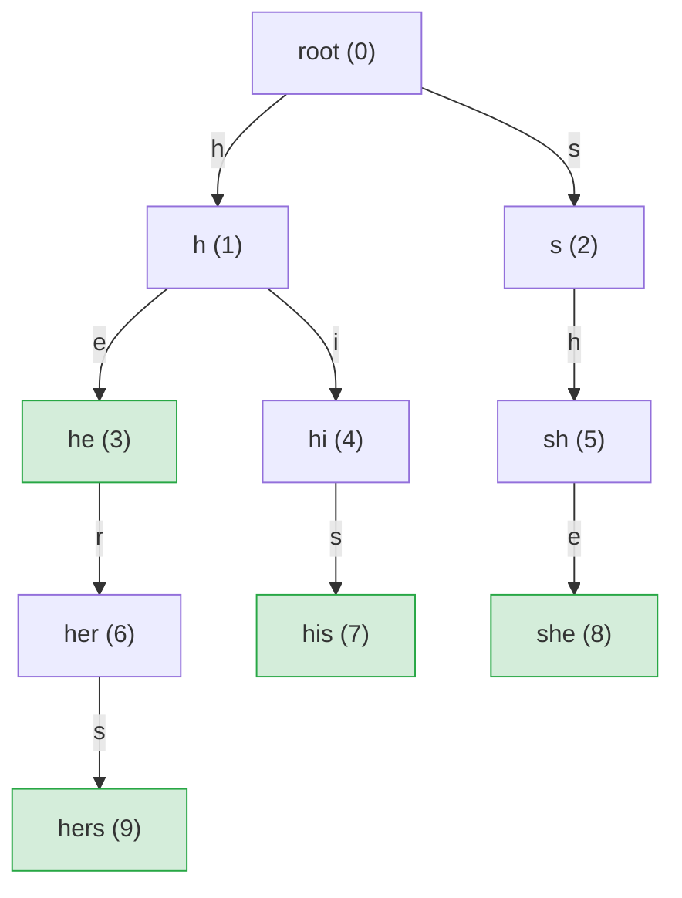
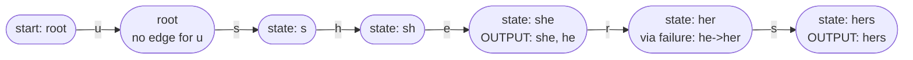

# Aho-Corasick (Multi-Pattern Search)

## What It Is

**Aho-Corasick** is a string-matching algorithm that finds **all occurrences of
many patterns** in a single pass through the text. It combines a **trie**
(prefix tree) with **failure links** (like KMP) to avoid backtracking.

## The Problem

You have a set of patterns and one long text. You want all matches.

Example:

- Patterns: `he`, `she`, `his`, `hers`
- Text: `ushers`
- Matches: `she` at 1, `he` at 2, `hers` at 2

Running KMP once per pattern costs O(n * k) total. Aho-Corasick builds one
automaton and scans the text once in O(n + z).

## Core Idea

1. **Build a trie** of all patterns.
2. Add **failure links** so that on a mismatch we jump to the longest suffix
   that is still a prefix of some pattern.
3. **Scan the text once** following trie edges and failure links.
4. Every time we land on a state, collect all patterns that end there.

---

## Trie Structure for `["he", "she", "his", "hers"]`

Each node is labelled with the string it represents. Numbers in parentheses are
state indices assigned during BFS insertion.



Green nodes are **accepting states** (a complete pattern ends there).

---

## Failure Links

A failure link at state `s` points to the state representing the longest
**proper suffix** of `label(s)` that also exists in the trie.

```
State    Label    Failure link points to
------   -----    ----------------------
root     ""       (none)
h        "h"      root
s        "s"      root
he       "he"     root          ("e" is not in trie alone)
hi       "hi"     root
sh       "sh"     h             ("h" is in the trie)
her      "her"    root
his      "his"    root
she      "she"    he            ("he" is in the trie -- suffix of "she")
hers     "hers"   root
```

The failure link `she -> he` is the key insight: after matching `she`, we
already know the last two characters are `he`, so we can report `he` as well
without re-reading those characters.

---

## Automaton State Transitions (Simplified for `"ushers"`)

The flowchart below traces the automaton walk over the text `ushers`.
Each box shows the current automaton state after consuming that character.



Notes on the walk:
- `u`: root has no edge for `u`, stay at root.
- `s`: root has edge `s`, move to state `s`.
- `h`: state `s` has edge `h`, move to state `sh`.
- `e`: state `sh` has edge `e`, move to state `she`. Output: `she`. The failure
  link of `she` points to `he`, which is also an accepting state, so we also
  output `he`.
- `r`: state `she` has no edge `r`. Follow failure link to `he`. State `he` has
  edge `r`, move to state `her`.
- `s`: state `her` has edge `s`, move to state `hers`. Output: `hers`.

---

## Step-by-Step Matching Walkthrough for `"ushers"`

```
Patterns: he, she, his, hers
Text:     u  s  h  e  r  s
Index:    0  1  2  3  4  5

Step 0 | char='u' | state: root -> root   | no match
       |          | root has no 'u' edge; remain at root

Step 1 | char='s' | state: root -> s      | no match
       |          | root has 's' edge -> state "s"

Step 2 | char='h' | state: s -> sh        | no match
       |          | state "s" has 'h' edge -> state "sh"

Step 3 | char='e' | state: sh -> she      | OUTPUT: "she" at [1,4)
       |          | state "sh" has 'e' edge -> state "she"
       |          | "she" is accepting
       |          | failure("she") = "he" which is also accepting
       |          |   => OUTPUT: "he" at [2,4)

Step 4 | char='r' | state: she -> her     | no match
       |          | state "she" has no 'r' edge
       |          | follow failure to "he"
       |          | state "he" has 'r' edge -> state "her"

Step 5 | char='s' | state: her -> hers    | OUTPUT: "hers" at [2,6)
       |          | state "her" has 's' edge -> state "hers"
       |          | "hers" is accepting

Final matches (start, end, pattern):
  (1, 4, "she")
  (2, 4, "he")
  (2, 6, "hers")
```

---

## Step-by-Step Algorithm

### 1. Build the trie

Insert each pattern character by character. Each node stores:
- `children[0..255]`: next state for each byte value, or -1 if absent.
- `output`: indices of all patterns whose full text ends at this node.

### 2. Build failure links (BFS)

Process nodes in breadth-first order (shallowest first). For a node reached by
edge `c` from parent `p`:

```
1. Start at failure(p).
2. Walk the failure chain until you find a node that has an edge for c.
3. The failure link of the child is that edge's destination.
4. If the failure state is accepting, merge its output into the child's output.
```

Because BFS guarantees all ancestors are processed first, every failure target
is already complete.

### 3. Scan the text

```
state = root
for each character c in text:
    while state != root and state has no edge for c:
        state = failure(state)
    if state has edge for c:
        state = state.children[c]
    report all patterns in state.output
```

---

## Complexity

Let:

- `m` = total length of all patterns
- `n` = text length
- `z` = number of matches
- `sigma` = alphabet size (256 bytes here)

| Phase  | Time           | Space          |
|--------|----------------|----------------|
| Build  | O(m * sigma)   | O(m * sigma)   |
| Search | O(n + z)       | O(1) working   |

The build is dominated by allocating 256-element child arrays per trie node.
The search is O(n + z) because the failure chain traversal is amortised: each
step along a failure link strictly reduces the current match depth, and that
depth can increase by at most 1 per character.

---

## Example Usage

```mbt check
///|
test "aho corasick example" {
  let patterns : Array[String] = ["he", "she", "his", "hers"]
  let matches = @aho_corasick.find_all_matches(patterns[:], "ushers")
  inspect(matches.length(), content="3")
  let found_she = matches.filter(m => m.2 == "she").length() > 0
  let found_he = matches.filter(m => m.2 == "he").length() > 0
  let found_hers = matches.filter(m => m.2 == "hers").length() > 0
  inspect(found_she && found_he && found_hers, content="true")
  inspect(@aho_corasick.count_all_matches(patterns[:], "ushers"), content="3")
}
```

```mbt check
///|
test "aho corasick overlapping" {
  let patterns : Array[String] = ["aba"]
  let matches = @aho_corasick.find_all_matches(patterns[:], "ababa")
  inspect(matches.length(), content="2")
}
```

```mbt check
///|
test "aho corasick prefix patterns" {
  let patterns : Array[String] = ["a", "ab", "abc"]
  let matches = @aho_corasick.find_all_matches(patterns[:], "abc")
  inspect(matches.length(), content="3")
}
```

---

## API

```
find_all_matches(patterns, text) -> Array[(start, end, pattern)]
    Build the automaton from patterns and return every match in text.
    end is exclusive (standard half-open interval).

count_all_matches(patterns, text) -> Int
    Build the automaton from patterns and count total matches.
```

---

## Common Applications

- **Keyword filtering** (spam or profanity detection)
- **DNA motif search** (many probes over a long genome)
- **Log scanning** (many error signatures scanned in one pass)
- **Search engines** (dictionary lookup over large texts)

---

## Pitfalls

- This implementation indexes strings by **byte value** (0-255). It works
  correctly for ASCII and raw byte data. For full Unicode, a different alphabet
  strategy is needed.
- Output lists may contain **multiple patterns** at one position.
- **Overlapping matches** are reported and correct by design.
- The child arrays are 256 integers per node, so memory usage is
  O(m * 256 * 4) bytes. For very large pattern sets consider a sparse
  child representation.

---

## When to Use It

Use Aho-Corasick when:

- You have many patterns (more than a handful).
- You need all occurrences, including overlapping ones.
- You want a single pass over the text.

If you only have one pattern, KMP is simpler and has lower constant factors.

## Aho-Corasick vs Alternatives

| Algorithm    | Preprocess   | Search    | Notes                           |
|--------------|--------------|-----------|---------------------------------|
| Naive multi  | O(1)         | O(n*k*m)  | k patterns, each naive          |
| KMP (x k)    | O(sum m)     | O(n*k)    | one pass per pattern            |
| Rabin-Karp   | O(sum m)     | O(n) avg  | hashing, false positives exist  |
| **Aho-Corasick** | O(sum m) | O(n+z)    | optimal for many patterns       |
