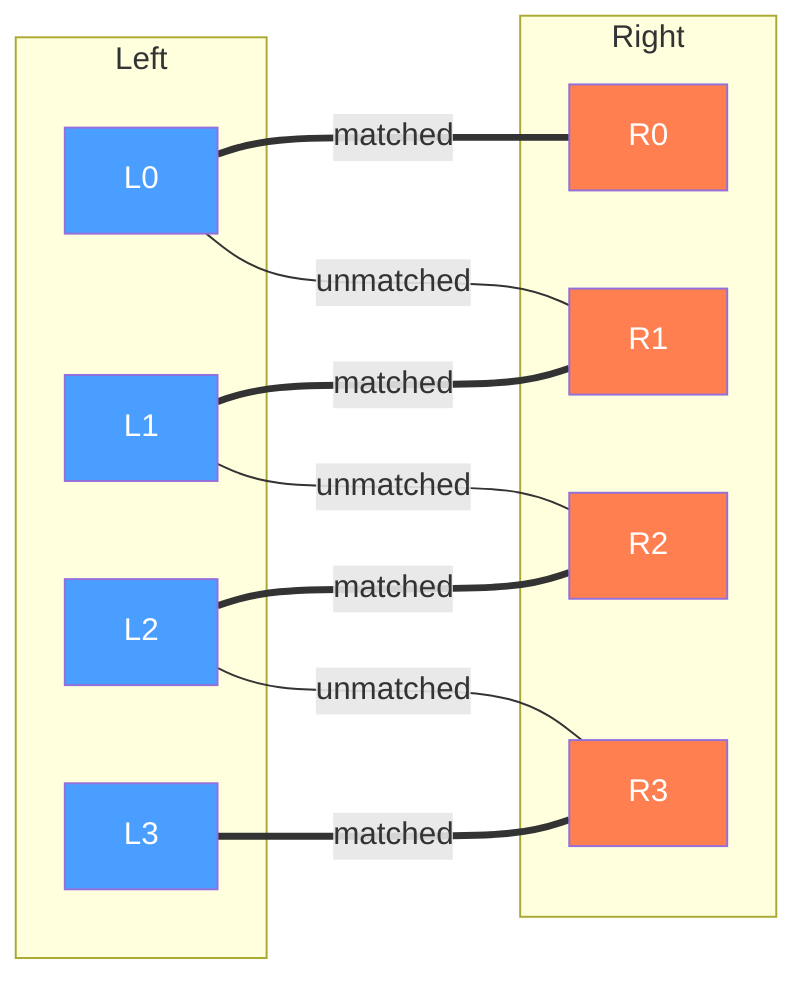
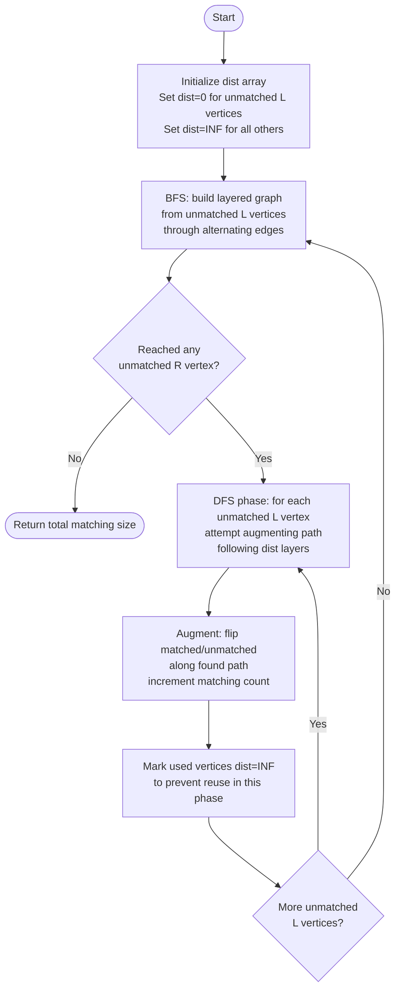

# Bipartite Matching (Maximum Matching)

A **bipartite graph** has two disjoint vertex sets: **left** and **right**.
Edges only go between the sets. A **matching** is a set of edges where no
vertex appears more than once.

This package computes a **maximum matching**: the largest possible number of
non-conflicting pairs.

## Problem statement

Given:

- `n_left` left vertices labeled `0..n_left-1`
- `n_right` right vertices labeled `0..n_right-1`
- a list of edges `(u, v)` with `u` on the left and `v` on the right

Find a maximum-size set of pairs `(u, v)` where no left or right vertex is
used twice.

## Bipartite graph structure

The diagram below shows a bipartite graph with four left vertices (L0-L3) and
four right vertices (R0-R3). Bold edges (marked with `===`) are in the maximum
matching; thin edges (marked with `---`) are unmatched.



Result: maximum matching of size 4 (a perfect matching).

## The key idea: augmenting paths

An **augmenting path** is a path that alternates:

- unmatched edge
- matched edge
- unmatched edge
- ...

and starts at an unmatched left vertex and ends at an unmatched right vertex.
Flipping the matched/unmatched status of every edge on that path increases the
matching size by 1.

If no augmenting path exists, the matching is maximum.

### Augmenting path discovery (step by step)

Consider a 3x3 bipartite graph. We discover the maximum matching incrementally.
Edges shown as `(=)` are currently matched, `(-)` are unmatched:

```
STEP 0 - Initial state: matching = {}
  L0  L1  L2        R0  R1  R2
  |   |   |
  | (-)   (-)        available
  | connects to: L0->R0, L0->R1, L1->R0, L1->R2, L2->R1, L2->R2

STEP 1 - Augment from L0: find free path L0 -> R0
  L0 -(-)-> R0       matching = {(L0,R0)}
  L1  L2             R1  R2  (free)

  After: match_left=[R0, -, -]   match_right=[L0, -, -]

STEP 2 - Augment from L1: try L1 -> R0 (taken by L0)
  DFS: can L0 find another match? L0 -> R1 (free) YES
  Augment: L1 -> R0, L0 rerouted to R1    matching = {(L0,R1),(L1,R0)}

  Path used: L1 -(-)-> R0 -(=)-> L0 -(-)-> R1
             ^ unmatched      ^ matched      ^ unmatched

  After: match_left=[R1, R0, -]  match_right=[L1, L0, -]

STEP 3 - Augment from L2: L2 -> R1 (taken), L2 -> R2 (free)
  Augment: L2 -> R2                         matching = {(L0,R1),(L1,R0),(L2,R2)}

  After: match_left=[R1, R0, R2] match_right=[L1, L0, L2]

RESULT: matching size = 3 (perfect matching)
```

## Algorithms

Two algorithms are provided:

- **Hungarian::new(Kuhn's)**: O(V * E) - Simple DFS-based augmentation, suitable for small graphs.
- **Hopcroft-Karp**: O(E * sqrt(V)) - Faster for large graphs; uses BFS to discover shortest augmenting paths, then DFS to apply them all in one phase.

## Hopcroft-Karp BFS + DFS phases

The flowchart below describes one complete iteration (phase) of the
Hopcroft-Karp algorithm.



Key insight: by processing **all** shortest augmenting paths in each phase, the
number of phases is bounded by O(sqrt(V)), yielding the O(E * sqrt(V)) total
complexity.

## König's theorem and minimum vertex cover

A **vertex cover** is a set of vertices such that every edge has at least one
endpoint in the set.

König's theorem states: in any bipartite graph,

> maximum matching size = minimum vertex cover size

The `min_vertex_cover` method (available on `HopcroftKarp`) exploits this by
building an alternating forest from unmatched left vertices after computing the
maximum matching.

## Public API

```
// Build a bipartite graph
let graph = BipartiteGraph::new(n_left, n_right)
graph.add_edge(u, v)

// Choose algorithm and compute
let matcher = graph.hungarian()      // or graph.hopcroft_karp()
let size = matcher.max_matching()    // returns matching size
let pairs = matcher.get_matching()   // returns Array[(Int, Int)]

// Minimum vertex cover (HopcroftKarp only; runs max_matching internally)
let (left_cover, right_cover) = matcher.min_vertex_cover()
```

## Examples

### Example 1: small matching

```mbt check
///|
test "small matching" {
  let graph = @bipartite_matching.BipartiteGraph::new(2, 2)
  graph.add_edge(0, 0)
  graph.add_edge(0, 1)
  graph.add_edge(1, 1)
  let matcher = graph.hungarian()
  inspect(matcher.max_matching(), content="2")
}
```

### Example 2: more left vertices than right

```mbt check
///|
test "unbalanced sets" {
  let graph = @bipartite_matching.BipartiteGraph::new(4, 2)
  graph.add_edge(0, 0)
  graph.add_edge(1, 0)
  graph.add_edge(2, 1)
  graph.add_edge(3, 1)
  let matcher = graph.hopcroft_karp()
  inspect(matcher.max_matching(), content="2")
}
```

Only two right vertices exist, so the maximum matching size is 2.

### Example 3: assignment style

Workers on the left, jobs on the right. An edge means a worker can do a job.

```mbt check
///|
test "assignment example" {
  let graph = @bipartite_matching.BipartiteGraph::new(3, 3)
  graph.add_edge(0, 0)
  graph.add_edge(0, 2)
  graph.add_edge(1, 0)
  graph.add_edge(1, 1)
  graph.add_edge(2, 1)
  let matcher = graph.hungarian()
  inspect(matcher.max_matching(), content="3")
}
```

### Example 4: minimum vertex cover via König's theorem

```mbt check
///|
test "min vertex cover" {
  let graph = @bipartite_matching.BipartiteGraph::new(3, 3)
  graph.add_edge(0, 0)
  graph.add_edge(0, 1)
  graph.add_edge(1, 1)
  graph.add_edge(2, 2)
  let matcher = graph.hopcroft_karp()
  let matching_size = matcher.max_matching()
  let (left_cover, right_cover) = matcher.min_vertex_cover()
  // König's theorem: cover size equals matching size
  inspect(
    left_cover.length() + right_cover.length() == matching_size,
    content="true",
  )
}
```

## Practical notes and pitfalls

- Edges must point from left to right; `(u, v)` is invalid if `u` or `v` is out
  of range.
- Duplicate edges are allowed but may slow down DFS.
- The order of pairs in the result depends on DFS order; sort if you need a
  stable presentation.
- Call `max_matching()` before `get_matching()` to ensure the internal state is
  populated.
- `min_vertex_cover()` calls `max_matching()` internally, so it is safe to call
  it directly.

## Complexity

| Algorithm     | Time           | Space    |
|---------------|----------------|----------|
| Hungarian     | O(V * E)       | O(V + E) |
| Hopcroft-Karp | O(E * sqrt(V)) | O(V + E) |

`V = n_left + n_right` and `E = number of edges`.

## When to use it

Use bipartite matching when you need:

- Assignments (workers to jobs, students to courses)
- Pairing tasks without conflicts
- Maximum compatibility matches
- Minimum vertex cover (via König's theorem, available on HopcroftKarp)

If the graph is very large, Hopcroft-Karp is faster, but the core idea is the
same.
