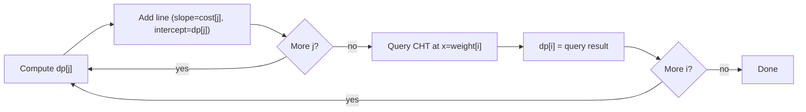
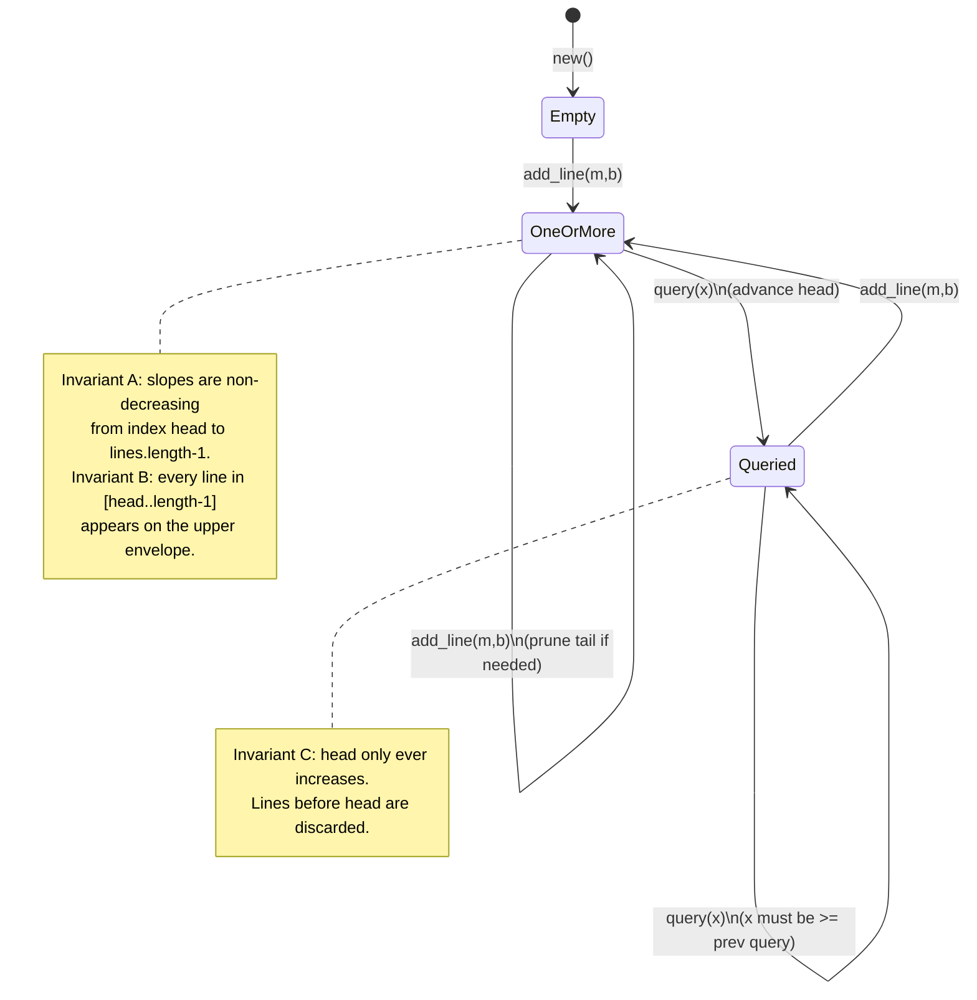

# Convex Hull Trick (Monotone)

## Overview

The **Convex Hull Trick** is a technique for optimizing dynamic programming
problems involving linear functions. This variant handles lines with monotone
slopes and monotone queries in O(1) amortized time.

| Property | Value |
|----------|-------|
| Time per `add_line` | O(1) amortized |
| Time per `query` | O(1) amortized |
| Total time for n lines, q queries | O(n + q) |
| Space | O(n) |
| Slope order required | Non-decreasing |
| Query order required | Non-decreasing |

## The Core Problem

Given a dynamic set of lines y = m*x + b, answer:

> What is the **maximum** y-value at a given x across all lines?

Checking every line naively costs O(n) per query. The Convex Hull Trick brings
this to O(1) amortized when slopes and queries arrive in order.

## Upper Envelope Visualization

The upper envelope is the curve formed by taking the maximum over all lines at
every x. Only lines that appear on this envelope ever produce the optimal answer.

```
Lines inserted:
  L1: y =  x + 0   (slope 1, intercept  0)
  L2: y = 2x + 1   (slope 2, intercept  1)
  L3: y = 3x - 1   (slope 3, intercept -1)

y
|                            /  L3
|                           /
|                    ------/    L2 (upper between x=0.5 and x=2)
|                   /     /
|             -----/     /
|            /     \    /
|           /       \  /
|  L1------/         \/        L3 meets L2 at x=2
| /        L2 meets   \
|/         L1 at x=-1  \
+-----+----+----+--------+---> x
     -1  0.5    2

Upper envelope (the bold path):
  x < -1   : L1 is best   (y = x)
  -1 to 2  : L2 is best   (y = 2x+1)
  x > 2    : L3 is best   (y = 3x-1)
```

Lines that are **never** on the upper envelope (e.g. a line entirely below the
envelope formed by its neighbours) are pruned immediately when added. This is
the key pruning step that gives O(1) amortized insertion.

## Lower Envelope (Minimum Queries)

The lower envelope is the mirror image — the curve formed by taking the minimum
over all lines. To compute minima, either:
- Negate slopes and intercepts: insert `(-m, -b)` and negate the query result.
- Use a Li Chao tree with minimum semantics (see the `lichao` package).

```
Lower envelope for the same three lines:

y
|\ L1
| \
|  \ L1 falls below L2 at x=-1
|   \
|    \                  /  L3 starts beating L2 at x=2
|     \   L2-----------/
|      \  /
|       \/
+-----+--+--+-----------> x
     -1     2

Lower envelope:
  x < -1   : L1 is best   (y = x,     smallest for negative x)
  -1 to 2  : L2 is best   (y = 2x+1,  smallest in this range)
  x > 2    : L3 is best   (y = 3x-1,  but L3 grows fastest — minimum
                                        would typically be a low-slope line)
```

## Why Monotone Slopes Enable O(1) Insertion

With slopes m1 <= m2 <= m3, the x-coordinate where each pair of consecutive
lines crosses is non-decreasing:

```
Intersection of L1 and L2: x12 = (b2 - b1) / (m1 - m2)
Intersection of L2 and L3: x23 = (b3 - b2) / (m2 - m3)

Monotone slopes guarantee: x12 <= x23

Consequence: breakpoints on the upper envelope appear left to right
in exactly the same order as lines were inserted.

     /  L3 (steepest)
    /  /  L2 (medium)
   /  /  /
  /  /  /  L1 (gentlest)
 /  /  /
/__/__/_______ x
   ^  ^
  x12 x23   <- always left to right when slopes increase
```

This monotone breakpoint order means the deque never needs random access. A
new line either extends the back or removes dominated lines from the back.

## Why Monotone Queries Enable O(1) Query

If queries arrive at x1 <= x2 <= x3 <= ..., the optimal line for each query
can only be at the same position or further right in the deque:

```
Query sequence:

x=0   -> Line L2 is best
           ^ head stays here

x=2   -> Line L2 and L3 are equal, advance head to L3
                 ^ head moves right

x=5   -> Line L3 is still best, head stays
                 ^ no movement needed

The head pointer travels at most n steps total across all q queries.
=> O(n + q) total work => O(1) amortized per query.
```

## Deque Maintenance Diagram

The structure stores lines in an array used as a one-sided deque. `head` tracks
the front; pruning happens at the tail on insertion.

```
State after adding L1=(1,0), L2=(2,1), L3=(3,-1):

Index:   0        1        2
       +--------+--------+--------+
lines: | L1(1,0)| L2(2,1)|L3(3,-1)|
       +--------+--------+--------+
         ^
         head=0  (current best for small x)

After query(x=3) advances head past L1 and L2:

Index:   0        1        2
       +--------+--------+--------+
lines: | L1(1,0)| L2(2,1)|L3(3,-1)|
       +--------+--------+--------+
                          ^
                          head=2  (L3 is now current best)
```

## Is_bad Pruning Rule

When adding a new line L3, the previous tail L2 is removed if it can never be
the unique maximum. The condition (derived by comparing intersection x-coords):

```
l2 is bad (never uniquely best) when:
  intersection(l1, l2).x  >=  intersection(l2, l3).x

Cross-multiplied (no division, no floating point):
  (l2.b - l1.b) * (l2.m - l3.m) >= (l3.b - l2.b) * (l1.m - l2.m)

Geometric picture:
        l2
       /
      /  l1 and l3 cross here
     /  /     <- l2 is already below by the time it would become best
    /  / l3
   /  /
  /  /
 /  /
/__/______ x
    ^ l2 never appears on upper envelope => prune it
```

## Li Chao Tree Variant

When slopes or query x values are **not** monotone, use a Li Chao segment tree
instead. A Li Chao tree covers a fixed x-range `[lo, hi]` and handles arbitrary
insert and query order at O(log(hi - lo)) per operation.

```
Li Chao Tree structure for range [0, 8]:

                    [0..8]   <- root stores dominant line for entire range
                   /       \
               [0..4]     [5..8]
              /     \    /     \
           [0..2] [3..4][5..6] [7..8]
           /   \
        [0..1] [2..2]

Insert algorithm at each node [l, r]:
  mid = (l + r) / 2
  winner = line with higher value at mid  <- stored in this node
  loser  = the other line
  Loser can only win on ONE side (left if it beats winner at l, else right).
  Recurse loser into that child only.

Query at x:
  Walk root -> leaf path for x, take max of all stored lines along path.
  O(log range) nodes visited.
```

Comparison at a glance:

```
+-----------------------+------------------+---------------------+
| Feature               | Monotone CHT     | Li Chao Tree        |
+-----------------------+------------------+---------------------+
| Insert order          | slopes sorted    | any order           |
| Query order           | x sorted         | any order           |
| Insert time           | O(1) amortized   | O(log range)        |
| Query time            | O(1) amortized   | O(log range)        |
| Preprocessing needed  | sort by slope    | fix x range upfront |
| Online queries        | yes (if sorted)  | yes                 |
| Implementation        | simple deque     | segment tree        |
+-----------------------+------------------+---------------------+
```

Choose **Monotone CHT** when slopes are inserted in order and queries arrive in
order (common in DP optimizations where both index sequences are monotone).

Choose **Li Chao tree** (`lichao` package) when either order is arbitrary.

## Algorithm Walkthrough

```
Insert: (m=1, b=0), (m=2, b=1), (m=3, b=-1)
Query:  x = 0, 1, 2, 3  (non-decreasing)

--- Add L1=(1,0) ---
  Deque: [ L1 ]   head=0

--- Add L2=(2,1) ---
  Need >= 2 lines behind head to prune: only 1, skip pruning.
  Deque: [ L1, L2 ]   head=0

--- Add L3=(3,-1) ---
  Check is_bad(L1, L2, L3):
    (b2-b1)*(m2-m3) >= (b3-b2)*(m1-m2)
    (1-0)*(2-3)     >= (-1-1)*(1-2)
    (1)*(-1)        >= (-2)*(-1)
    -1              >= 2   -> FALSE, L2 is not bad
  Deque: [ L1, L2, L3 ]   head=0

--- Query x=0 ---
  head=0: L1.value(0)=0, L2.value(0)=1  -> L2 >= L1, advance head
  head=1: L2.value(0)=1, L3.value(0)=-1 -> L3 < L2, stop
  Return L2.value(0) = 1

--- Query x=1 ---
  head=1: L2.value(1)=3, L3.value(1)=2  -> L3 < L2, stop
  Return L2.value(1) = 3

--- Query x=2 ---
  head=1: L2.value(2)=5, L3.value(2)=5  -> L3 >= L2, advance head
  head=2: only one line left, stop
  Return L3.value(2) = 5

--- Query x=3 ---
  head=2: only one line left, stop
  Return L3.value(3) = 8
```

## Quick Start

```mbt check
///|
test "convex hull trick quick start" {
  let cht = @convex_hull_trick.ConvexHullTrick()
  cht.add_line(1L, 0L) // y = x
  cht.add_line(2L, 1L) // y = 2x + 1
  cht.add_line(3L, -1L) // y = 3x - 1
  inspect(cht.query(0L), content="1")
  inspect(cht.query(1L), content="3")
  inspect(cht.query(2L), content="5")
  inspect(cht.query(3L), content="8")
}
```

## DP Optimization Example

A classic DP pattern that the Convex Hull Trick accelerates:

```
dp[i] = min over j < i of { dp[j] + cost[j] * weight[i] }

Rewrite the inner term as a linear function of weight[i]:
  f_j(x) = cost[j] * x + dp[j]   where x = weight[i]

Each state j defines a line with:
  slope     = cost[j]
  intercept = dp[j]

If cost[] is non-decreasing (and weight[] is non-decreasing), both
monotonicity conditions are met and Monotone CHT applies.

Complexity improvement:
  Naive DP     : O(n^2)
  Monotone CHT : O(n)    <- each line added/removed at most once
```

The mermaid diagram below shows the DP recurrence flow:



## Structural Invariants

The following mermaid diagram describes the invariants maintained by the
internal deque at all times:



## Query Visualization

```
Lines:  L1: y=x,  L2: y=2x+1,  L3: y=3x-1
Deque after all insertions: [ L1, L2, L3 ]

Query progression (head shown with ^):

  x=0:  [ L1, L2, L3 ]   head advances from 0 to 1 (L2 beats L1 at x=0)
              ^
        answer = L2(0) = 1

  x=1:  [ L1, L2, L3 ]   head stays at 1 (L2 still beats L3 at x=1)
              ^
        answer = L2(1) = 3

  x=2:  [ L1, L2, L3 ]   head advances from 1 to 2 (L3 ties L2 at x=2)
                    ^
        answer = L3(2) = 5

  x=3:  [ L1, L2, L3 ]   head stays at 2
                    ^
        answer = L3(3) = 8

Total head movements: 2  (across 4 queries with 3 lines -> O(n+q) total)
```

## Complexity Analysis

| Operation | Amortized | Worst Case Single Call |
|-----------|-----------|------------------------|
| `add_line` | O(1) | O(n) if all previous lines get pruned |
| `query` | O(1) | O(n) if head must skip many lines |
| n lines + q queries | O(n + q) total | — |

The amortized bounds hold because:
- Each line enters the deque exactly once (`add_line`).
- Each line is pruned from the tail at most once (`add_line` pruning loop).
- The `head` pointer advances monotonically, visiting each line at most once.

## Implementation Notes

- **No division in is_bad**: The pruning condition is expressed as a
  cross-multiplication to stay in integer arithmetic and avoid floating-point
  errors.
- **Overflow caution**: `is_bad` multiplies two differences of `Int64` values.
  If slopes and intercepts can reach 2^31, the products can overflow `Int64`.
  Keep slopes and intercepts within roughly 2^30 to be safe.
- **Lines with equal slope**: Adding two lines with the same slope m is safe —
  the lower one will immediately be pruned as dominated.
- **Single-element deque**: `query` returns the only stored line's value
  immediately when the deque has exactly one live entry.
