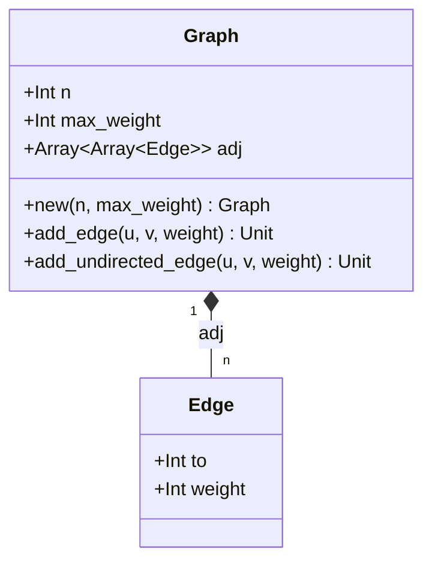
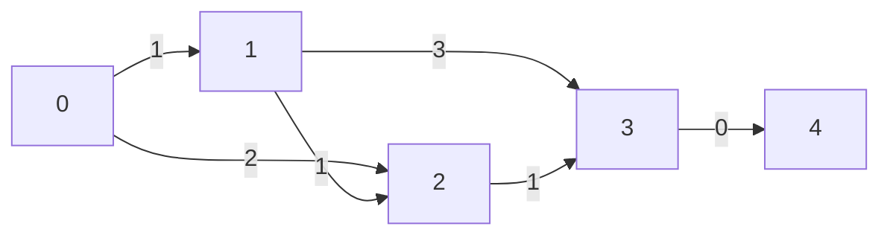
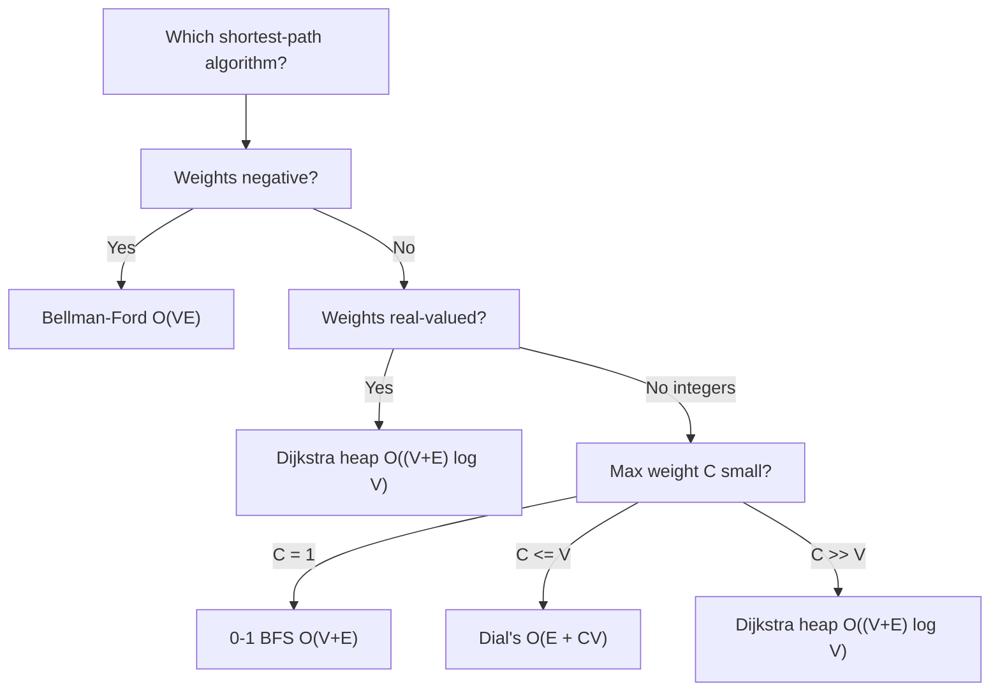

# Dial's Shortest Path Algorithm

## Overview

**Dial's Algorithm** is a specialized shortest path algorithm for graphs with
**small non-negative integer edge weights**. It replaces Dijkstra's priority
queue with a flat array of distance buckets, achieving O(E + C*V) time where C
is the maximum edge weight.

- **Time**: O(E + C*V)
- **Space**: O(E + C*V)
- **Key Feature**: Faster than Dijkstra when C is small relative to V

## The Key Insight

```
Dijkstra's algorithm: O((V + E) log V) with priority queue
  - Priority queue is expensive for small weight range

Dial's insight: If edge weights are in {0, 1, 2, ..., C}:
  - Maximum shortest path <= C * (V - 1)
  - Use C*V + 1 buckets instead of priority queue
  - bucket[d] = list of vertices with tentative distance exactly d
  - Scan buckets in order to process vertices by distance

No priority queue overhead -> O(E + C*V) total time!
```

## Graph Representation

Vertices are numbered `0` to `n - 1`. A `Graph` holds a declared maximum edge
weight `C` (field `max_weight`) and an adjacency list. The algorithm allocates
`C * (n - 1) + 1` buckets on every call, so `C` should be the tightest correct
upper bound for the edges you add.



## Bucket Structure

The core data structure is a flat array of buckets. Bucket `d` holds the
indices of all vertices whose current best-known distance is `d`. The algorithm
scans the array from index 0 upward, draining each bucket before advancing.

```
Buckets array (max_weight C=3, n=5 vertices, max_dist = 3*(5-1) = 12):

index: 0    1    2    3    4    5    6    7    8    9   10   11   12
      +----+----+----+----+----+----+----+----+----+----+----+----+----+
      | [0]|    | [1]|    | [2]|    |    | [3]| [4]|    |    |    |    |
      +----+----+----+----+----+----+----+----+----+----+----+----+----+
         ^         ^         ^              ^    ^
         |         |         |              |    |
       src=0    v1 d=2    v2 d=4         v3 d=7 v4 d=8

Scan direction: --->
```

## Algorithm Walkthrough

The worked example below uses the graph from the `"dial shortest path example"`
test: 5 nodes, maximum weight C=3, edges 0->1(1), 0->2(2), 1->2(1), 1->3(3),
2->3(1), 3->4(0).

### Graph



### Step-by-step bucket evolution

```
Initialize:
  dist    = [0, INF, INF, INF, INF]
  bucket[0] = [0]   (all others empty)

d=0  pop vertex 0  (dist[0]=0, matches d)
  edge 0->1 (w=1): nd=1 < INF  =>  dist[1]=1,  push 1 into bucket[1]
  edge 0->2 (w=2): nd=2 < INF  =>  dist[2]=2,  push 2 into bucket[2]
  dist    = [0, 1, 2, INF, INF]

  bucket[0]: []
  bucket[1]: [1]
  bucket[2]: [2]

d=1  pop vertex 1  (dist[1]=1, matches d)
  edge 1->2 (w=1): nd=2, dist[2]=2, no improvement
  edge 1->3 (w=3): nd=4 < INF  =>  dist[3]=4,  push 3 into bucket[4]
  dist    = [0, 1, 2, 4, INF]

  bucket[2]: [2]
  bucket[4]: [3]

d=2  pop vertex 2  (dist[2]=2, matches d)
  edge 2->3 (w=1): nd=3 < 4    =>  dist[3]=3,  push 3 into bucket[3]
  dist    = [0, 1, 2, 3, INF]

  bucket[3]: [3]
  bucket[4]: [3]   <-- stale duplicate; will be skipped

d=3  pop vertex 3  (dist[3]=3, matches d)
  edge 3->4 (w=0): nd=3 < INF  =>  dist[4]=3,  push 4 into bucket[3]
  pop vertex 4  (dist[4]=3, matches d)
  no outgoing edges
  dist    = [0, 1, 2, 3, 3]

d=4  pop vertex 3  (dist[3]=3, does NOT match d=4)  -- SKIP (stale)

Final: dist = [0, 1, 2, 3, 3]
```

### Stale-entry handling

A vertex may appear in multiple buckets because its tentative distance is
improved after it was first inserted. The algorithm uses a simple guard:

```
if dist[u] != d { continue }   // skip stale duplicate
```

This is called "lazy deletion" and keeps the implementation free of an explicit
visited array or decrease-key operation.

## Algorithm Pseudocode

```
dial_shortest_paths(graph, source):
  max_dist = max_weight * (n - 1)
  buckets  = array of max_dist+1 empty lists
  dist     = array of n, initialized to INF

  dist[source] = 0
  buckets[0].add(source)

  for d = 0 to max_dist:
    while buckets[d] is not empty:
      u = buckets[d].remove_next()

      if dist[u] != d:          // stale entry
        continue

      for each edge (u -> v, weight w):
        nd = d + w
        if nd < dist[v]:
          dist[v] = nd
          buckets[nd].add(v)

  return dist
```

## Example Usage

```mbt check
///|
test "dial shortest path example" {
  let g = @dial_shortest_path.Graph::new(5, 3)
  g.add_edge(0, 1, 1)
  g.add_edge(0, 2, 2)
  g.add_edge(1, 2, 1)
  g.add_edge(1, 3, 3)
  g.add_edge(2, 3, 1)
  g.add_edge(3, 4, 0)
  let dist = @dial_shortest_path.dial_shortest_paths(g, 0)
  inspect(dist, content="[0, 1, 2, 3, 3]")
}
```

```mbt check
///|
test "dial shortest path undirected" {
  let g = @dial_shortest_path.Graph::new(4, 2)
  g.add_undirected_edge(0, 1, 1)
  g.add_undirected_edge(1, 2, 1)
  g.add_undirected_edge(2, 3, 2)
  let dist = @dial_shortest_path.dial_shortest_paths(g, 0)
  inspect(dist, content="[0, 1, 2, 4]")
}
```

## When to Use Dial's Algorithm

```
Use Dial's when:
  - Edge weights are non-negative integers
  - Maximum weight C is small (C = O(V) or less)
  - You want O(E + CV) instead of O((V+E) log V)

Do not use when:
  - Edge weights are large (C >> V)
  - Edge weights are real numbers
  - Edge weights can be negative
```

## Complexity Comparison

| Algorithm            | Time              | Space   | Best For                    |
|----------------------|-------------------|---------|-----------------------------|
| Dial's               | O(E + C*V)        | O(C*V)  | Small integer weights       |
| Dijkstra (binary heap)| O((V+E) log V)   | O(V)    | General non-negative        |
| Dijkstra (Fibonacci) | O(E + V log V)    | O(V)    | Dense graphs                |
| 0-1 BFS              | O(V + E)          | O(V)    | Weights in {0, 1} only      |

## Dial's vs 0-1 BFS

```
0-1 BFS: Weights must be exactly 0 or 1
  Uses deque: push_front for 0, push_back for 1
  Time: O(V + E)

Dial's: Weights can be 0, 1, 2, ..., C
  Uses C*V + 1 buckets
  Time: O(E + C*V)

When C = 1, Dial's degenerates to BFS!
When C is a small constant, Dial's is O(V + E).
```



## Optimization: Circular Buckets

The implementation above allocates `C*(n-1)+1` buckets. A standard optimization
reduces this to only `C+1` buckets with circular (modular) indexing:

```
bucket_index = distance mod (C + 1)

Works because:
  - When processing distance d, the next relaxations land in d+1 .. d+C.
  - These map to d+1 mod (C+1) .. d+C mod (C+1), which are all distinct
    from d mod (C+1).
  - Once bucket[d mod (C+1)] is drained, it is free to reuse.

Space: O(V + C) instead of O(C*V)
```

This optimization trades a larger constant in time for a dramatically smaller
memory footprint and is the version preferred in competitive programming.

## Common Applications

### Road Networks with Discretized Weights

```
Edge weight = travel time = ceil(distance / speed)
Discretize to small integers -> apply Dial's.
```

### Grid Navigation with Terrain Costs

```
Plain cell: cost 1
Swamp cell: cost 3
Road cell:  cost 0

Grid edges carry weights in {0, 1, 3}.
Dial's with C=3 gives near-linear performance.
```

### Game Pathfinding

```
Different terrain types carry small integer movement costs.
If the cost range is bounded by a constant, Dial's is faster
than Dijkstra in practice.
```

## Implementation Notes

- **Lazy deletion**: a vertex may appear in multiple buckets as its tentative
  distance improves. The guard `if dist[u] != d { continue }` skips stale
  entries without a separate visited array.
- **Zero max-weight**: when `max_weight == 0` all edges are free; `max_dist` is
  clamped to 0 so only one bucket is allocated.
- **Unreachable vertices**: their `dist` entry stays at `DIAL_INF`
  (1,000,000,000). Check with `dist[v] == @dial_shortest_path.DIAL_INF` ... but
  note the constant is not exported; compare against a large sentinel of your
  own or check `dist[v] > expected_max`.
