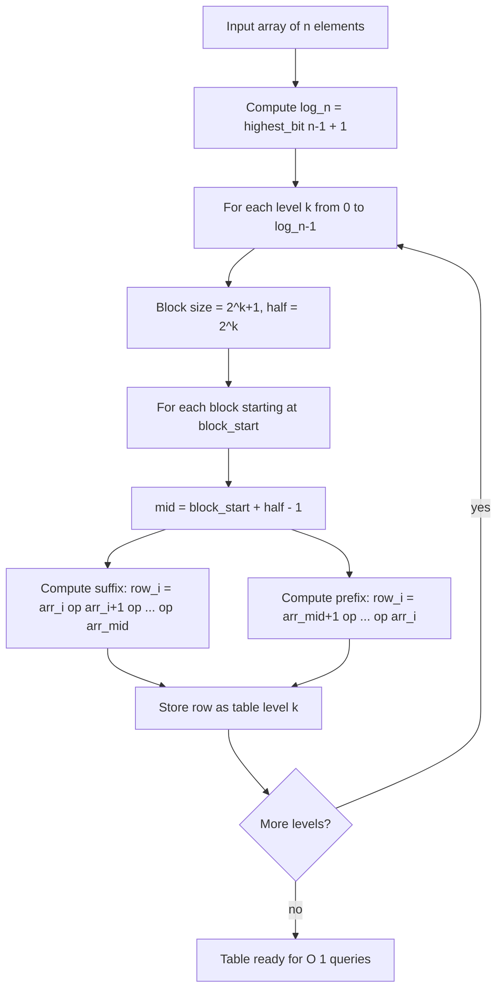
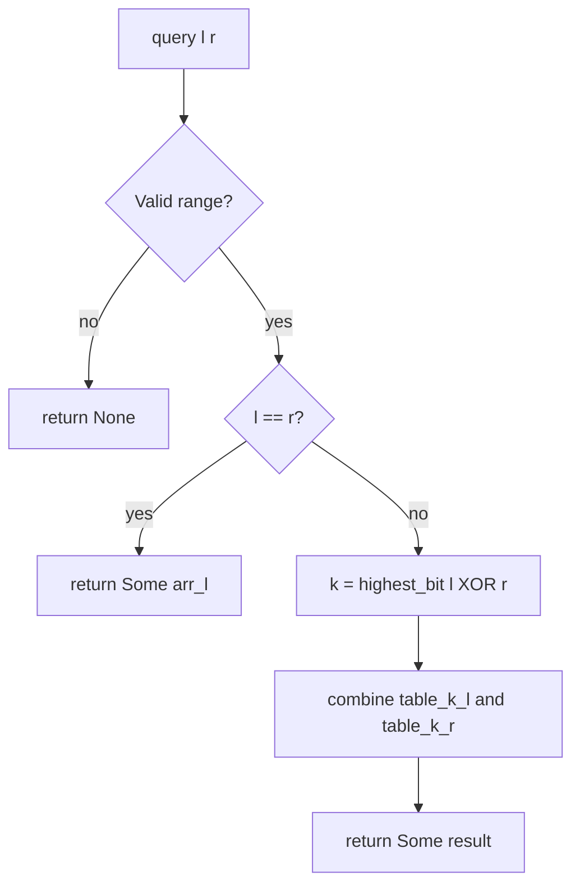

# Disjoint Sparse Table

A **Disjoint Sparse Table** answers range queries in **O(1)** after **O(n log n)**
preprocessing. Unlike a regular sparse table it supports **any associative
operation**, including non-idempotent ones such as sum and product. This package
provides three concrete instantiations: sum, XOR, and modular product.

---

## 1. The problem with regular sparse tables

A regular sparse table precomputes answers for ranges of length exactly `2^k`
and answers queries by picking two overlapping blocks:

```
Array:   1  2  3  4  5
         |____A____|          A = [1..4], length 4
               |____B____|    B = [2..5], length 4

min(A, B) = correct, because min is idempotent: min(x, x) = x
sum(A, B) = WRONG -- elements 2 and 3 are counted twice
```

For sum or product this double-counting gives the wrong answer.

**Disjoint Sparse Table** solves this by ensuring that, for any query `[l, r]`,
the two precomputed pieces never overlap.

---

## 2. Core idea: disjoint prefix/suffix tables

At every level `k`, the array is divided into **blocks of size `2^(k+1)`**.
Within each block the midpoint is at offset `2^k - 1` (0-indexed within the block).
For each element, we precompute:

- **suffix value**: the aggregate from that element rightward to the midpoint.
- **prefix value**: the aggregate from the midpoint leftward to that element
  (for elements in the right half of the block).

Because any query `[l, r]` that crosses a midpoint uses the suffix at `l` and
the prefix at `r`, the two pieces are always **disjoint**.

---

## 3. Structure diagram

Array of eight elements `[a, b, c, d, e, f, g, h]` (indices 0..7):

```
Level k=0  (block size 2, mids at index 0 and 2 and 4 and 6)
  Block [0,1]:  mid=0   Block [2,3]:  mid=2   Block [4,5]:  mid=4   Block [6,7]:  mid=6

  suffix  S[0]=a  S[1]=? (unused; index > mid)
  prefix  P[1]=b  P[0]=? (unused; index <= mid)

  index:   0       1  |   2       3  |   4       5  |   6       7
  suffix:  a       -      c       -      e       -      g       -
  prefix:  -       b      -       d      -       f      -       h

Level k=1  (block size 4, mids at index 1 and 5)
  Block [0,3]:  mid=1               Block [4,7]:  mid=5

  index:   0       1  |   2       3      4       5  |   6       7
  suffix:  a+b     b      -       -      e+f     f      -       -
  prefix:  -       -      c     c+d      -       -      g     g+h

Level k=2  (block size 8, mid at index 3)
  Block [0,7]:  mid=3

  index:   0       1       2       3  |   4       5       6       7
  suffix:  a+b+c+d a+b+c   a+b   a+b... b+c+d... c+d   d   -     -
  prefix:  -       -       -       -      e    e+f  e+f+g  e+f+g+h
```

More concretely, for `arr = [1, 2, 3, 4, 5, 6, 7, 8]` with sum:

```
Level k=1  (block size 4)
  Block [0,3]  mid=1:
    index:  0    1  |  2    3
    suffix: 3    2     -    -       (suffix[0]=1+2=3, suffix[1]=2)
    prefix: -    -     3    7       (prefix[2]=3, prefix[3]=3+4=7)

  Block [4,7]  mid=5:
    index:  4    5  |  6    7
    suffix: 11   6     -    -       (suffix[4]=5+6=11, suffix[5]=6)
    prefix: -    -     7   15       (prefix[6]=7, prefix[7]=7+8=15)

Level k=2  (block size 8)
  Block [0,7]  mid=3:
    index:  0    1    2    3  |  4    5    6    7
    suffix: 10   9    7    4     -    -    -    -
    prefix: -    -    -    -     5   11   18   26
```

---

## 4. Query decomposition

To answer `query(l, r)`:

1. If `l == r`, return `arr[l]` directly.
2. Find the **level** `k = highest_bit(l XOR r)`. This is the position of the
   highest bit where `l` and `r` differ, which is exactly the level at which `l`
   and `r` fall into **different halves** of the same block.
3. The answer is `table[k][l] (op) table[k][r]`, combining the suffix at `l`
   with the prefix at `r`.

```
Query sum(2, 5)  for arr = [1, 2, 3, 4, 5, 6, 7, 8]:

  l = 2  (binary: 010)
  r = 5  (binary: 101)
  l XOR r = 111  (binary)
  highest_bit(111) = 2  => use level k=2

  table[2][l=2] = suffix at index 2 for level 2
                = arr[2] + arr[3]          = 3 + 4 = 7

  table[2][r=5] = prefix at index 5 for level 2
                = arr[4] + arr[5]          = 5 + 6 = 11

  Answer = 7 + 11 = 18    (actual: 3+4+5+6 = 18)  correct
```

The diagram below shows which half of the table each index falls into at
level k=2 and how the two disjoint pieces cover the query:

```
  index:   0    1    2    3  |  4    5    6    7
                        l=2  ^  r=5
                        [suffix] [prefix]
                        <---->   <---->
                           disjoint!
```

---

## 5. Algorithm walkthrough

Array `[3, 1, 4, 1, 5, 9, 2, 6]`, operation = sum.

```
Build level k=0  (block size 2):
  Block [0,1]  mid=0:  suffix[0]=3       prefix[1]=1
  Block [2,3]  mid=2:  suffix[2]=4       prefix[3]=1
  Block [4,5]  mid=4:  suffix[4]=5       prefix[5]=9
  Block [6,7]  mid=6:  suffix[6]=2       prefix[7]=6

Build level k=1  (block size 4):
  Block [0,3]  mid=1:
    suffix[1]=1, suffix[0]=3+1=4
    prefix[2]=4, prefix[3]=4+1=5
  Block [4,7]  mid=5:
    suffix[5]=9, suffix[4]=5+9=14
    prefix[6]=2, prefix[7]=2+6=8

Build level k=2  (block size 8):
  Block [0,7]  mid=3:
    suffix[3]=1, suffix[2]=4+1=5, suffix[1]=1+5=6, suffix[0]=3+6=9
    prefix[4]=5, prefix[5]=5+9=14, prefix[6]=14+2=16, prefix[7]=16+6=22

Query sum(2, 5):
  k = highest_bit(2 XOR 5) = highest_bit(7) = 2
  answer = table[2][2] + table[2][5] = 5 + 14 = 19
  check:  4 + 1 + 5 + 9 = 19  correct
```

---

## 6. Mermaid: table build flow



---

## 7. Mermaid: query flow



---

## 8. How `highest_bit` selects the right level

```
l and r are in different halves at level k  iff  bit k is the highest differing bit.

l = 2 = 0 1 0
r = 5 = 1 0 1
XOR   = 1 1 1   highest set bit is bit 2  =>  k = 2

At level k=2, blocks have size 2^3 = 8.
The unique block [0,7] has mid=3.
l=2 falls in the left half [0,3] and r=5 falls in the right half [4,7].
So table[2][2] is a suffix and table[2][5] is a prefix, and they are disjoint.
```

---

## 9. Example usage

```mbt check
///|
test "disjoint sparse sum example" {
  let arr : Array[Int64] = [1L, 2L, 3L, 4L, 5L, 6L, 7L, 8L]
  let dst = @disjoint_sparse.DisjointSparseSum(arr)
  inspect(dst.query(0, 3), content="Some(10)")
  inspect(dst.query(2, 5), content="Some(18)")
}
```

---

## 10. Public API summary

| Name | Kind | Description |
|---|---|---|
| `DisjointSparseSum` | struct | Disjoint sparse table for range sum queries on `Int64` arrays |
| `DisjointSparseSum::new` | function | Build the table from an array in O(n log n) |
| `DisjointSparseSum::query` | method | Answer sum query `[l, r]` in O(1); returns `None` for invalid ranges |

---

## 11. Complexity

| Operation | Time | Space |
|---|---|---|
| Build | O(n log n) | O(n log n) |
| Query | O(1) | - |
| Update | not supported | - |

---

## 12. Sparse Table vs Disjoint Sparse Table

| Feature | Sparse Table | Disjoint Sparse Table |
|---|---|---|
| Build | O(n log n) | O(n log n) |
| Query | O(1) | O(1) |
| Space | O(n log n) | O(n log n) |
| Supported operations | idempotent only (min, max, gcd) | any associative (sum, product, XOR, ...) |

Choose **Sparse Table** when your operation is idempotent (min, max, gcd, bitwise AND/OR).
Choose **Disjoint Sparse Table** when your operation is associative but not idempotent (sum, product, matrix multiply, ...).

---

## 13. Why "disjoint"?

The two precomputed pieces that answer any query `[l, r]` are always disjoint:

```
query [l, r]  at level k with mid m:

  suffix piece: [l .. m]     (l is in the left half of the block)
  prefix piece: [m+1 .. r]   (r is in the right half of the block)

  These ranges share no index: m < m+1.
```

No element is counted twice, so the operation need not be idempotent.

---

## 14. Common applications

- **Range sum queries** -- faster than a segment tree when the array is static.
- **Range product queries** -- any associative product with or without a modulus.
- **Range XOR queries** -- XOR is associative and non-idempotent.
- **Matrix chain queries** -- matrix multiplication is associative; DST gives O(1) range products.
- **Competitive programming** -- when queries vastly outnumber updates and the operation is not idempotent.

---

## 15. Implementation notes

- Arrays are 0-indexed; all bit operations are clean.
- `table[k][i]` stores the suffix aggregate when `i` is in the left half of its
  block at level `k`, and the prefix aggregate when `i` is in the right half.
- When `l == r` the table is not consulted; `arr[l]` is returned directly.
- The `highest_bit` helper computes `floor(log2(x))` in O(log x) steps; for
  large `n` a lookup table or the `clz` (count-leading-zeros) intrinsic is faster.
- Prefix and suffix data share the same `row` array: left-half indices hold
  suffix values, right-half indices hold prefix values. No overlap occurs because
  each index belongs to exactly one half at each level.
