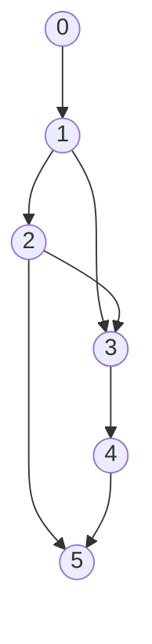
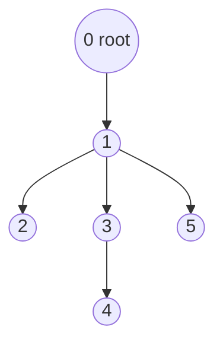

# Dominator Tree (Lengauer-Tarjan)

## Overview

A vertex **u dominates v** if every path from the start node to v must pass
through u. The **immediate dominator** (idom) of v is the closest strict
dominator: the unique vertex that dominates v and is dominated by every other
dominator of v.

The **dominator tree** connects each node to its immediate dominator. It is a
tree rooted at the start node where u is an ancestor of v if and only if u
dominates v.

This package implements the **Lengauer-Tarjan algorithm**.

- **Time**: O((V + E) * alpha(V)) -- nearly linear (alpha is the inverse Ackermann function)
- **Space**: O(V + E)
- **Key Feature**: Foundation for compiler optimizations (SSA, loop detection, dead code elimination)

## The Key Insight

```
Problem: For each vertex v, find its "gateway" from the start node.

Naive: For each v, remove each candidate and check reachability -> O(V^2 * E)

Lengauer-Tarjan insight:
  Use DFS tree structure + semi-dominators!

Semi-dominator sdom[v]:
  The minimum DFS number reachable from v via:
    - Zero or more tree edges (going down in DFS tree)
    - Followed by at most ONE non-tree edge (cross/back edge going up)

Key theorem:
  idom[v] is either sdom[v] or idom[sdom[v]]

  This means we can compute idom in nearly linear time
  by processing in reverse DFS order with union-find!
```

## Visual: Control Flow Graph and DFS Tree

Given this control flow graph (CFG):



A DFS from node 0 discovers vertices in order and builds a **DFS spanning tree**
(tree edges shown solid, non-tree edges shown dashed):

```
DFS Tree (discovery order in brackets):

  0 [dfn=1]
  |
  1 [dfn=2]
 / \
2   3        <-- tree edges (solid in DFS)
[3] [4]
|    \
5    4       <-- 2->3 and 2->5 are non-tree (cross/forward) edges
[6]  [5]
```

Non-tree edges from the same CFG (edges not in DFS tree):
- 2 -> 3  (forward edge: dfn[2]=3 < dfn[3]=4)
- 2 -> 5  (forward edge: dfn[2]=3 < dfn[5]=6)

## Visual: Dominator Tree

The dominator tree for the CFG above:



Reading the dominator tree:
- `idom[1] = 0` -- only one path to 1, through 0
- `idom[2] = 1` -- path must go through 1
- `idom[3] = 1` -- both paths (1->2->3 and 1->3) pass through 1
- `idom[4] = 3` -- only path to 4 goes through 3
- `idom[5] = 1` -- paths via 2->5 and 4->5 both require 1

## Lengauer-Tarjan Algorithm: ASCII Walkthrough

The algorithm processes a small graph step by step to show how semi-dominators
and immediate dominators are computed.

**Input graph** (diamond with shortcut):

```
  0
  |
  1
 / \
2   |
 \ /
  3

Edges: 0->1, 1->2, 2->3, 1->3
```

**Phase 1 -- DFS Numbering:**

```
  Vertex:  0    1    2    3
  dfn:     1    2    3    4
  parent:  -    1    2    3   (parent in DFS tree, by dfn)

  DFS tree edges: 1->2, 2->3, 3->4
  Non-tree edge:  1->3  (dfn[1]=2 < dfn[3]=4, so it goes "up")
```

**Phase 2 -- Compute Semi-dominators (reverse DFS order):**

```
  Initialize: sdom[i] = i for all i

  i=4 (vertex 3):
    pred = {dfn[2]=3, dfn[1]=2}
    From dfn=3: 3 < 4 (tree ancestor), sdom[4] = min(4, 3) = 3
    From dfn=2: 2 < 4 (tree ancestor), sdom[4] = min(3, 2) = 2
    -> sdom[4] = 2  (vertex 1 is semi-dominator of vertex 3)
    bucket[2].add(4)

  i=3 (vertex 2):
    pred = {dfn[1]=2}
    From dfn=2: 2 < 3, sdom[3] = min(3, 2) = 2
    -> sdom[3] = 2
    bucket[2].add(3)

  i=2 (vertex 1):
    Process bucket[2] = {4, 3}
      w=4: u = eval(4) = 4, sdom[4]=2 == sdom[4]=2, so idom[4] = sdom[4] = 2
      w=3: u = eval(3) = 3, sdom[3]=2 == sdom[3]=2, so idom[3] = sdom[3] = 2
    pred = {dfn[0]=1}
    From dfn=1: 1 < 2, sdom[2] = min(2, 1) = 1
    bucket[1].add(2)
    link(parent[2]=1, 2)

  i=1 (vertex 0):
    Process bucket[1] = {2}
      w=2: u = eval(2) = 2, sdom[2]=1 == sdom[2]=1, so idom[2] = sdom[2] = 1
    (root, no predecessor processing)
```

**Phase 3 -- Finalize idom:**

```
  i=2: idom[2]=1 == sdom[2]=1, no change
  i=3: idom[3]=2 != sdom[3]=2? No (both 2), no change
  i=4: idom[4]=2 != sdom[4]=2? No (both 2), no change

  Final idom (by dfn index): [_, 1, 1, 2, 2]
                               0  1  2  3  4

  Convert back to vertex IDs:
    dfn=1 -> vertex 0: idom = vertex 0 (root)
    dfn=2 -> vertex 1: idom = vertex(dfn=1) = vertex 0
    dfn=3 -> vertex 2: idom = vertex(dfn=2) = vertex 1
    dfn=4 -> vertex 3: idom = vertex(dfn=2) = vertex 1

  Result: idom = [0, 0, 1, 1]
```

**Result dominator tree:**

```
    0
    |
    1
   / \
  2   3
```

## Example Usage

```mbt check
///|
test "dominator tree example" {
  let edges : Array[(Int, Int)] = [
    (0, 1),
    (1, 2),
    (2, 3),
    (1, 3),
    (3, 4),
    (4, 5),
    (2, 5),
  ]
  let dom = @dominator_tree.build_dominator_tree(6, edges[:], 0).unwrap()
  inspect(dom.idom[3], content="1")
  inspect(dom.dominates(1, 5), content="true")
}
```

```mbt check
///|
test "dominator diamond" {
  // Diamond: 0 -> 1,2 -> 3
  let edges : Array[(Int, Int)] = [(0, 1), (0, 2), (1, 3), (2, 3)]
  let dom = @dominator_tree.build_dominator_tree(4, edges[:], 0).unwrap()
  inspect(dom.idom[3], content="0")
  // 3's idom is 0, not 1 or 2 (both paths converge)
}
```

```mbt check
///|
test "dominator invalid root" {
  let edges : Array[(Int, Int)] = [(0, 1)]
  inspect(@dominator_tree.build_dominator_tree(2, edges[:], -1), content="None")
}
```

## Algorithm Walkthrough

```
Graph: 0->1->2->3, 1->3 (diamond shortcut)

DFS from 0:
  Order: [0, 1, 2, 3]
  dfn: [0, 1, 2, 3]
  parent: [-1, 0, 1, 2]

Process in reverse order:

v=3:
  Predecessors: 2, 1
  From 2: dfn[2]=2 < dfn[3]=3 (tree edge)
          sdom[3] = min(INF, 2) = 2
  From 1: dfn[1]=1 < dfn[3]=3 (non-tree edge)
          sdom[3] = min(2, 1) = 1
  Add 3 to bucket[1]

v=2:
  Predecessors: 1
  From 1: dfn[1]=1 < dfn[2]=2 (tree edge)
          sdom[2] = 1
  Add 2 to bucket[1]

v=1:
  Process bucket[1] = {3, 2}
  For w=3: u = eval(3) in subtree of 1
           idom[3] = 1 (since sdom[eval(3)] >= sdom[3])
  For w=2: u = eval(2)
           idom[2] = 1

v=0:
  Process bucket[0] = {1}
  idom[1] = 0

Final idom: [-1, 0, 1, 1]
  idom[0] = -1 (root)
  idom[1] = 0
  idom[2] = 1
  idom[3] = 1
```

## Why Semi-Dominators Work

```
Theorem: sdom[v] is the minimum dfn of any vertex u where:
  - There's a path u -> v using only vertices with dfn > dfn[v]
  - (except u itself)

This means:
  - sdom[v] is on the "boundary" of v's dominators
  - idom[v] is between sdom[v] and the root

Key lemma:
  For any v, idom[v] is an ancestor of sdom[v] in DFS tree.

  Either:
    - idom[v] = sdom[v], or
    - idom[v] = idom[w] for some w between sdom[v] and v
      where sdom[w] is minimized

The union-find tracks this efficiently!
```

## Union-Find Role

```
The union-find forest mirrors the DFS tree as it is built.

Initially: each vertex is its own root.

After link(parent[i], i):
  vertex i is "activated" -- future eval() queries can traverse through it.

eval(v): returns the vertex u on the path from v to its set root
         such that sdom[u] is minimized.

  Before any links:  eval(v) = v   (no path to explore)
  After link(p, v):  eval(v) = min-sdom vertex between v and p's root

Path compression in compress() keeps eval() amortized O(alpha(n)).
```

## Common Applications

### 1. Compiler Optimization
```
Build dominator tree for control flow graph.
Used in SSA construction, dead code elimination.
```

### 2. Dominance Frontier
```
Frontier[v] = nodes just outside v's dominance.
Key for placing phi nodes in SSA.
```

### 3. Program Analysis
```
Determine what code must execute before other code.
Control dependencies in programs.
```

### 4. Loop Detection
```
Natural loops have single entry point (dominator).
Back edges target loop headers that dominate tail.
```

## Complexity Analysis

| Phase | Time | Notes |
|-------|------|-------|
| DFS numbering | O(V + E) | Standard DFS |
| Compute sdom | O(E * alpha(V)) | Union-find with path compression |
| Build buckets | O(V) | One pass |
| Finalize idom | O(V) | One pass |
| **Total** | **O((V+E) * alpha(V))** | Nearly linear |

## Dominator Tree Properties

```
Property 1: Tree structure
  Each vertex (except root) has exactly one idom.
  Edges idom[v] -> v form a tree.

Property 2: Transitivity
  If a dominates b and b dominates c,
  then a dominates c.

Property 3: Ancestors in dominator tree
  v dominates w iff v is ancestor of w in dominator tree.

Property 4: Unique entry
  Every path from root to v passes through all
  ancestors of v in dominator tree.
```

## Dominance Frontier

```
Definition: DF[v] = {w : v dominates pred of w but not w}

Intuition: Nodes "just outside" v's dominance region.

Computation (after dominator tree):
  For each node v:
    For each CFG successor w of v:
      runner = v
      repeat until runner == idom[w]:
        DF[runner].add(w)
        runner = idom[runner]

Used for: SSA phi node placement
```

## Implementation Notes

- Handle unreachable vertices (no dominator)
- Root has no immediate dominator (idom = -1 or self)
- Union-find requires careful implementation
- Path compression essential for efficiency
- Can extend to post-dominators (reverse edges)

## Dominator vs Reachability

| Property | Dominator | Reachability |
|----------|-----------|--------------|
| Direction | All paths must pass | Any path exists |
| Uniqueness | Unique idom | Many predecessors |
| Structure | Tree | DAG |
| Query | O(log n) with LCA | O(1) with preprocessing |
