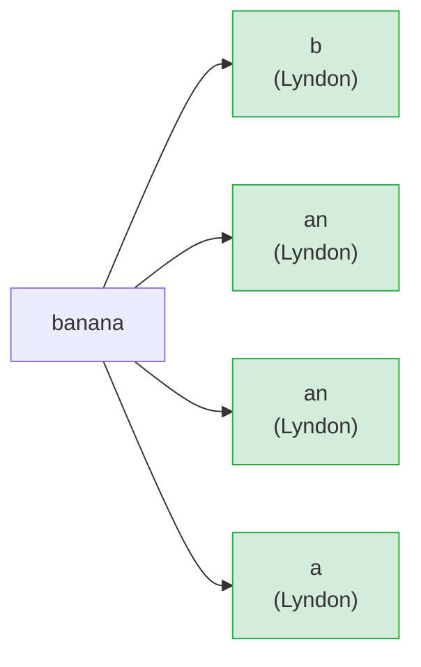

# Duval's Lyndon Factorization

## Overview

**Duval's algorithm** decomposes any string into a unique sequence of **Lyndon
words** in non-increasing lexicographic order. A Lyndon word is a string that
is strictly smaller than all of its non-trivial rotations.

- **Time**: O(n)
- **Space**: O(n) for the output array
- **Output**: Unique factorization into Lyndon words (Chen-Fox-Lyndon theorem)

---

## What Is a Lyndon Word?

A string `w` is a **Lyndon word** if and only if it is strictly lexicographically
smaller than every one of its non-trivial rotations (cyclic shifts).

```
Lyndon word: strictly smallest among ALL its rotations

  "a"   rotations: ["a"]            smallest = "a"   Lyndon
  "ab"  rotations: ["ab","ba"]      smallest = "ab"  Lyndon
  "abc" rotations: ["abc","bca","cab"] smallest="abc" Lyndon
  "aab" rotations: ["aab","aba","baa"] smallest="aab" Lyndon

  "ba"  rotations: ["ba","ab"]      smallest = "ab"  NOT Lyndon
  "aa"  rotations: ["aa","aa"]      equal, not strict NOT Lyndon
  "aba" rotations: ["aba","baa","aab"] smallest="aab" NOT Lyndon
```

### Rotations as a Wheel

```
Take "abac" - rotate by cutting at each position:

  Position 0: a b a c   <-- this is the smallest rotation
  Position 1: b a c a
  Position 2: a c a b
  Position 3: c a b a

"abac" is its own minimum rotation, so it IS a Lyndon word.

Take "abab" - rotate by cutting at each position:

  Position 0: a b a b   <-- ties with position 2
  Position 1: b a b a
  Position 2: a b a b   <-- same as position 0
  Position 3: b a b a

"abab" is NOT strictly smaller than all rotations, so it is NOT Lyndon.
It factors as "ab" + "ab".
```

**Key property**: Lyndon words are **primitive** -- they cannot be expressed as
a shorter string repeated more than once.

---

## The Unique Factorization

The **Chen-Fox-Lyndon theorem** guarantees that every string has a unique
decomposition:

```
w = L1 * L2 * ... * Lk   where each Li is Lyndon and L1 >= L2 >= ... >= Lk
```

```
Factorization examples (Lyndon words separated by |):

  "banana"     ->  b | an | an | a
                   b >= an >= an >= a  (lexicographic non-increase)

  "ababab"     ->  ab | ab | ab
                   ab = ab = ab

  "abcabcab"   ->  abc | abc | ab
                   abc >= abc >= ab

  "abcd"       ->  abcd
                   (the whole string is already Lyndon)

  "dcba"       ->  d | c | b | a
                   (strictly decreasing characters)

  "cabca"      ->  c | abc | a
```

### Lyndon Factorization Diagram

```
String:   c  a  b  c  a
Index:    0  1  2  3  4

Factors:
  [0,0]   c          <-- "c" is Lyndon (single char)
  [1,3]   a b c      <-- "abc" is Lyndon (abc < bca < cab)
  [4,4]   a          <-- "a" is Lyndon (single char)

Result: ["c", "abc", "a"]

Non-increasing check:
  "c" >= "abc"  (c > a, so yes)
  "abc" >= "a"  (abc > a, so yes)
  OK
```

---

## Duval's Algorithm

### Three-Pointer Technique

The algorithm maintains three indices into the string:

```
  i  -- start of the current candidate Lyndon block
  j  -- scanning position (the leading edge)
  k  -- comparison position inside the current period
         (always satisfies i <= k < j)

Invariant: s[i..j) is a power of its Lyndon root,
           and that root compares >= s[k..] so far.
```

### Transition Rules

```
Compare s[j] with s[k]:

  s[j] > s[k]  -->  extend: we found a new, larger character,
                    so the current block can grow.
                    Move j forward, reset k to i.

                    j += 1,  k = i

  s[j] = s[k]  -->  match: still inside the repeating pattern.
                    Both pointers advance together.

                    j += 1,  k += 1

  s[j] < s[k]  -->  break: the current run of the Lyndon word ends.
                    The period length is (j - k).
                    Emit copies of s[i .. i+period) while i <= k.
                    Restart with i = j.
```

### State-Machine View

```
                 s[j] = s[k]
                  +------+
                  |      |
       start      v      |
  i,j,k=0 --> [SCAN] ----+
                  |
          s[j] > s[k] -------> reset k to i, j++
                  |
          s[j] < s[k]    or    j == n
                  |
                  v
             [EMIT]  -- emit copies of length (j-k) from position i
                  |
                  v
             advance i to j, loop
```

---

## Step-by-Step Trace: "banana"

```
String:  b  a  n  a  n  a
Index:   0  1  2  3  4  5
```

```
Step  i  j  k   s[j]  s[k]  action
----  -  -  --  ----  ----  -------------------------------------------
  1   0  1   0   a     b    a < b  ->  break, period = j-k = 1
                             emit s[0..1) = "b",  i = 1
  2   1  2   1   n     a    n > a  ->  extend,  j = 3,  k = 1
  3   1  3   1   a     a    a = a  ->  match,   j = 4,  k = 2
  4   1  4   2   n     n    n = n  ->  match,   j = 5,  k = 3
  5   1  5   3   a     a    a = a  ->  match,   j = 6,  k = 4
  6   1  6   4   end         j=n  ->  break, period = j-k = 6-4 = 2
                             emit s[1..3) = "an",  i = 3
                             emit s[3..5) = "an",  i = 5
  7   5  6   5   end         j=n  ->  period = 6-5 = 1
                             emit s[5..6) = "a",   i = 6
  done: i = 6 = n

Result: ["b", "an", "an", "a"]
```

### Period Derivation Diagram

```
After the inner scan, the indices satisfy:
   i         k    j
   |         |    |
   v         v    v
   . . . . . . . .
   [-- period --]
       = j - k

The block s[i..j) is exactly  (j-k)  copies of the Lyndon root.
The loop emits them one at a time:
   emit s[i .. i+period),  i += period
   emit s[i .. i+period),  i += period
   ...  until  i > k
```

---

## Step-by-Step Trace: "ababab"

```
String:  a  b  a  b  a  b
Index:   0  1  2  3  4  5
```

```
Step  i  j  k   s[j]  s[k]  action
----  -  -  --  ----  ----  -------------------------------------------
  1   0  1   0   b     a    b > a  ->  extend,  j = 2,  k = 0
  2   0  2   0   a     a    a = a  ->  match,   j = 3,  k = 1
  3   0  3   1   b     b    b = b  ->  match,   j = 4,  k = 2
  4   0  4   2   a     a    a = a  ->  match,   j = 5,  k = 3
  5   0  5   3   b     b    b = b  ->  match,   j = 6,  k = 4
  6   0  6   4   end         j=n  ->  break, period = 6-4 = 2
                             emit s[0..2) = "ab",  i = 2
                             emit s[2..4) = "ab",  i = 4
                             emit s[4..6) = "ab",  i = 6
  done: i = 6 = n

Result: ["ab", "ab", "ab"]
```

---

## Why the Period Is `j - k`

```
At the end of the inner scan (either s[j] < s[k], or j == n):

  i          k     j
  |          |     |
  |<-- period -->| |
        p = j - k

s[i .. i+p)  is the Lyndon root (the smallest rotation in the block).
s[i .. j)    is exactly  (j - i) / p  complete copies of that root,
plus possibly a partial copy from i to k.

The outer loop emits:
  s[i   .. i+p)   first copy
  s[i+p .. i+2p)  second copy
  ...
  stopping when  i > k  (no more complete copies remain).
```

### Concrete Example: "abcabcab"

```
String:  a  b  c  a  b  c  a  b
Index:   0  1  2  3  4  5  6  7

After full scan:  i=0,  j=8,  k=5
  period = j - k = 8 - 5 = 3
  Lyndon root: s[0..3) = "abc"

Emit loop (i <= k means i <= 5):
  i=0: emit "abc", i=3
  i=3: emit "abc", i=6    (6 > 5, stop)

  But j=8 and i=6, so: emit s[6..8) = "ab" as a separate factor.

Result: ["abc", "abc", "ab"]
```

---

## Mermaid Diagram: Algorithm Flow

```mermaid
flowchart TD
    A([Start]) --> B[i = 0]
    B --> C{i >= n?}
    C -- yes --> Z([Return factors])
    C -- no --> D["j = i + 1, k = i"]
    D --> E{j < n AND s[k] <= s[j]?}
    E -- no --> F["period = j - k"]
    F --> G["Emit copies of s[i..i+period)\nwhile i <= k"]
    G --> H[i = next_i after emit loop]
    H --> C
    E -- yes --> I{s[k] < s[j]?}
    I -- yes --> J["j += 1, k = i\n(extend: new max char)"]
    J --> E
    I -- no --> K["j += 1, k += 1\n(match: advance both)"]
    K --> E
```

---

## Mermaid Diagram: Lyndon Word Factorization Tree



---

## API

| Function | Signature | Description |
|---|---|---|
| `duval_factorization` | `(String) -> Array[String]` | Compute the Lyndon factorization of a string |

---

## Example Usage

```mbt check
///|
test "duval banana" {
  let factors = @duval_lyndon.duval_factorization("banana")
  inspect(factors, content="[\"b\", \"an\", \"an\", \"a\"]")
}
```

```mbt check
///|
test "duval ababab" {
  let factors = @duval_lyndon.duval_factorization("ababab")
  inspect(factors, content="[\"ab\", \"ab\", \"ab\"]")
}
```

## More Examples

```mbt check
///|
test "duval single char" {
  let factors = @duval_lyndon.duval_factorization("aaaa")
  inspect(factors, content="[\"a\", \"a\", \"a\", \"a\"]")
}
```

```mbt check
///|
test "duval already lyndon" {
  let factors = @duval_lyndon.duval_factorization("abcd")
  inspect(factors, content="[\"abcd\"]")
}
```

```mbt check
///|
test "duval repeating with tail" {
  let factors = @duval_lyndon.duval_factorization("abcabcab")
  inspect(factors, content="[\"abc\", \"abc\", \"ab\"]")
}
```

```mbt check
///|
test "duval decreasing" {
  let factors = @duval_lyndon.duval_factorization("dcba")
  inspect(factors, content="[\"d\", \"c\", \"b\", \"a\"]")
}
```

```mbt check
///|
test "duval mixed tail" {
  let factors = @duval_lyndon.duval_factorization("cabca")
  inspect(factors, content="[\"c\", \"abc\", \"a\"]")
}
```

```mbt check
///|
test "duval empty" {
  let factors = @duval_lyndon.duval_factorization("")
  inspect(factors, content="[]")
}
```

---

## Edge Cases

```
Input          Result                   Note
-----------    ---------------------    ----------------------------
""             []                       empty string
"a"            ["a"]                    single character
"aaaa"         ["a","a","a","a"]        all equal: each char alone
"abcd"         ["abcd"]                 already a Lyndon word
"dcba"         ["d","c","b","a"]        strictly decreasing
"abcabcab"     ["abc","abc","ab"]       period with incomplete tail
```

---

## Common Applications

### 1. Minimum Rotation

```
Run duval_factorization on s + s, then scan the first n factor
starts to find the position giving the lexicographically smallest
rotation of length n.

Example: s = "baca"  (n = 4)
  s+s = "bacabaca"
  factorization = ["b","ac","ab","ac","a"]
  Factor starts inside the first n = 4 characters: positions 0, 1, 3
  Rotations starting there:
    pos 0: "baca"
    pos 1: "acab"
    pos 3: "abac"
  Minimum rotation = "abac" (starts at index 3)
```

### 2. String Periodicity

```
If the factorization consists of the same Lyndon word repeated k times,
then the string has period equal to the length of that word.

Example: "ababab" -> ["ab","ab","ab"]
  period = len("ab") = 2
```

### 3. Suffix Array Construction

```
The Lyndon factorization has a close relationship to the suffix array.
The suffix array can be computed from the Lyndon factorization, and the
Lyndon array (which Lyndon word each suffix starts within) can be derived
from the suffix array in linear time.
```

### 4. Bijective BWT and Necklace Enumeration

```
Lyndon words are the "prime" elements in the free monoid over an alphabet.
They appear in bijective Burrows-Wheeler transforms and in algorithms that
enumerate lexicographically distinct necklaces (equivalence classes of
rotations).
```

---

## Properties of Lyndon Factorization

```
1. Uniqueness
   Every string has exactly one factorization L1 * L2 * ... * Lk
   into Lyndon words with L1 >= L2 >= ... >= Lk.

2. Concatenation closure
   If u and v are Lyndon words with u < v, then uv is also a Lyndon word.

3. Counting Lyndon words
   The number of Lyndon words of length n over an alphabet of size k is:
     (1/n) * sum over divisors d of n of  mu(n/d) * k^d
   where mu is the Mobius function.

4. Connection to suffix arrays
   The Lyndon factorization of a string and its suffix array are related:
   the suffix array encodes a total order on suffixes whose structure
   mirrors the Lyndon decomposition.
```

---

## Algorithm Comparison

| Method | Time | Space | Output |
|--------|------|-------|--------|
| **Duval** | O(n) | O(n) | Full Lyndon factorization |
| Booth | O(n) | O(n) | Minimum rotation only |
| Suffix Array | O(n log n) | O(n) | General suffix queries |

Choose **Duval** when you need the complete Lyndon factorization or want to
build applications on top of it (minimum rotation, periodicity, BWT, etc.).

---

## Implementation Notes

- The algorithm is **online**: it processes characters strictly left to right
  and never moves the scan pointer `j` backwards.
- Each character is examined **at most twice** in the inner comparison loop,
  giving the O(n) time bound.
- **Three pointers**: `i` (block start), `j` (scan front), `k` (period probe).
- When `s[j] > s[k]`: extend the candidate block and reset the probe.
- When `s[j] = s[k]`: advance both `j` and `k` (still within the same period).
- When `s[j] < s[k]` or `j == n`: emit complete copies of the Lyndon root.
- The `slice_string` helper builds each factor in a `StringBuilder` to avoid
  repeated string concatenation.
- Comparisons use MoonBit code units, which give standard lexicographic order
  for ASCII strings.
