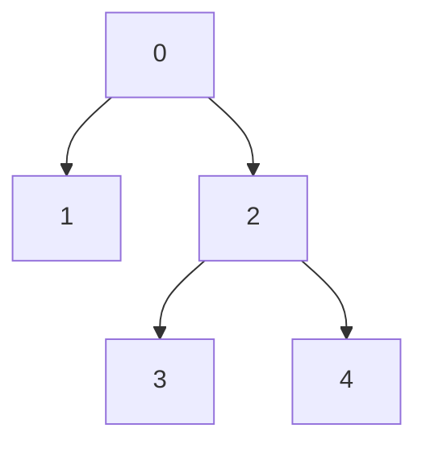
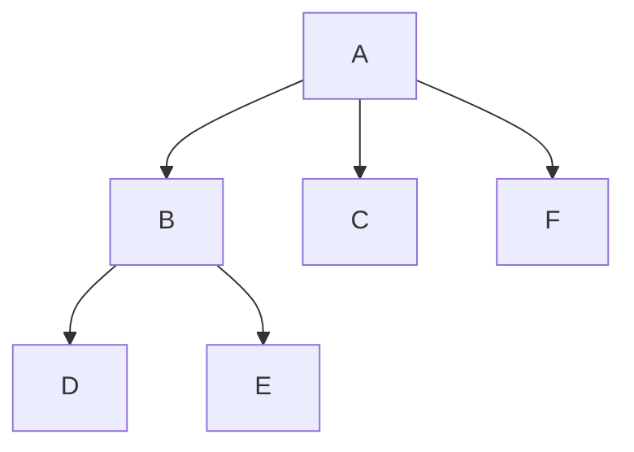

# Euler Tour

## Overview

The **Euler Tour** technique linearizes a tree into an array, enabling subtree
queries to be answered as range queries. It records entry and exit times for
each node during a DFS traversal.

- **Build**: O(n)
- **Space**: O(n)

## The Tree Used in All Examples

Throughout this document the following six-node tree is used:

```
         1          (root)
       / | \
      2  3  4
     / \
    5   6
```

As a Mermaid diagram:


## The Key Insight

DFS visits nodes in a specific order. By recording when we enter and exit each
node, subtrees become contiguous ranges in the preorder array.

```
DFS trace (enter / exit events):

  1 enter
    2 enter
      5 enter
      5 exit
      6 enter
      6 exit
    2 exit
    3 enter
    3 exit
    4 enter
    4 exit
  1 exit

Preorder tour (entry events only):

  pos:   0   1   2   3   4   5
  node:  1   2   5   6   3   4
         ^---subtree of 2---^
```

The subtree of node 2 is the contiguous slice at positions 1..3 (inclusive).

## Entry and Exit Times

```
       tin   tout
  1:    0      6      (covers the whole tree)
  2:    1      4      (covers 2, 5, 6)
  5:    2      3
  6:    3      4
  3:    4      5
  4:    5      6

Rule: subtree of u = all nodes v with tin[v] in [tin[u], tout[u])
      tout is exclusive.

Subtree of 2: tin in [1, 4)  ->  nodes 2 (tin=1), 5 (tin=2), 6 (tin=3)  ✓
```

## Flattening a Tree for Range Queries

The following diagram shows how node values are mapped to a flat array using
entry times, turning a subtree sum into a prefix-sum range query.

```
Tree (root = 0, zero-indexed):

        0           val = 5
       / \
      1   2         val = 1, 4
     / \
    3   4           val = 2, 3

DFS assigns entry positions:

  node:   0    1    2    3    4
  entry:  0    1    4    2    3
  exit:   5    4    5    3    4

Flatten: flat[entry[u]] = val[u]

  pos:    0    1    2    3    4
  flat:   5    1    2    3    4
               ^----^         <- subtree of 1

Subtree sum of node 1:
  range [entry[1], exit[1]) = [1, 4)
  flat[1..4) = [1, 2, 3]
  sum = 6
```

Visual alignment:

```
         0
        / \
       1   2
      / \
     3   4

 flat array after entry-time mapping:

  pos | 0  | 1  | 2  | 3  | 4  |
 node | 0  | 1  | 3  | 4  | 2  |
  val | 5  | 1  | 2  | 3  | 4  |
             [--- subtree 1 ---)
```

## Algorithm Walkthrough

```
timer = 0

Visit 1:  tin[1] = 0,  timer = 1
  Visit 2:  tin[2] = 1,  timer = 2
    Visit 5:  tin[5] = 2,  timer = 3
    tout[5] = 3
    Visit 6:  tin[6] = 3,  timer = 4
    tout[6] = 4
  tout[2] = 4
  Visit 3:  tin[3] = 4,  timer = 5
  tout[3] = 5
  Visit 4:  tin[4] = 5,  timer = 6
  tout[4] = 6
tout[1] = 6

Final table:
  Node:  1   2   3   4   5   6
  tin:   0   1   4   5   2   3
  tout:  6   4   5   6   3   4
```

## Two Types of Euler Tours

```
Type 1 – Entry/Exit times only
  Array size: n  (each node appears once)
  tin[u], tout[u] are integer time-stamps
  Used for: subtree queries, ancestor checks

Type 2 – Full walk with re-visits
  Array size: 2n - 1  (each node appears 2..3 times)
  tour[i] = node visited at step i
  Used for: LCA via RMQ
```

### Type 2 Example (for LCA)

Tree for this example (zero-indexed):



```
Full Euler walk (node, depth):

  step:   0     1     2     3     4     5     6     7     8
  node:   0(0), 1(1), 0(0), 2(1), 3(2), 2(1), 4(2), 2(1), 0(0)

First occurrence:
  first[0] = 0,  first[1] = 1,  first[2] = 3
  first[3] = 4,  first[4] = 6

LCA::new(3, 4): look at steps first[3]..first[4] = 4..6
  depths:  2, 1, 2   ->   minimum depth = 1 at step 5  ->  node 2

LCA::new(1, 3): look at steps first[1]..first[3] = 1..4
  depths:  1, 0, 1, 2  ->  minimum depth = 0 at step 2  ->  node 0
```

## Example Usage

```mbt check
///|
test "euler tour subtree basics" {
  let edges : Array[(Int, Int)] = [(0, 1), (1, 2), (1, 3)]
  let tour = @euler_tour.build_euler_tour(4, edges, 0)
  inspect(tour.subtree_size(1), content="3")
  inspect(tour.is_ancestor(1, 3), content="true")
}
```

```mbt check
///|
test "euler tour subtree nodes" {
  let edges : Array[(Int, Int)] = [(0, 1), (1, 2), (1, 3)]
  let tour = @euler_tour.build_euler_tour(4, edges, 0)
  let nodes = tour.subtree_nodes(1)
  nodes.sort_by((a, b) => a - b)
  inspect(nodes, content="[1, 2, 3]")
}
```

```mbt check
///|
test "euler tour arrays" {
  let edges : Array[(Int, Int)] = [(0, 1), (0, 2), (1, 3), (1, 4)]
  let (tin, tout, order) = @euler_tour.euler_tour(5, edges, 0)
  inspect(order.length(), content="5")
  inspect(tin[0] < tout[0], content="true")
}
```

```mbt check
///|
test "euler tour subtree sum" {
  let edges : Array[(Int, Int)] = [(0, 1), (0, 2), (1, 3), (1, 4)]
  let info = @euler_tour.build_euler_tour(5, edges, 0)
  let values : Array[Int] = [5, 1, 4, 2, 3]
  let flat = Array::make(5, 0)
  for i in 0..<5 {
    flat[info.entry[i]] = values[i]
  }
  let start = info.entry[1]
  let end = info.exit[1]
  let total = flat[start:end].fold(init=0, (acc, v) => acc + v)
  inspect(total, content="6")
}
```

## Common Applications

### 1. Subtree Queries
```
Goal: Sum / min / max of values in a subtree.

Steps:
  1. Build Euler tour to get tin / tout.
  2. Write val[u] into flat[tin[u]] for every node u.
  3. Build a segment tree or Fenwick tree over flat[].
  4. Answer: query range [tin[u], tout[u] - 1].

Time: O(log n) per query after O(n) preprocessing.
```

### 2. Subtree Updates
```
Goal: Add delta to every node in a subtree.

Steps:
  1. Flatten tree via Euler tour.
  2. Issue a range update on [tin[u], tout[u] - 1].
  3. Use a lazy segment tree for O(log n) range updates.
```

### 3. LCA via RMQ
```
Record depths in the full Euler tour (Type 2).

LCA::new(u, v) = node with minimum depth between
            first[u] and first[v] in the walk.

Pair with a sparse table for O(1) LCA queries after O(n log n) build.
```

### 4. Path Queries
```
Combine with LCA:
  path(u, v) = path(u, lca) + path(lca, v)

For heavier workloads, use Heavy-Light Decomposition.
```

## Visual: Subtree as Range

```
Tree:                  Flattened array (indexed by tin):

      A                pos:  0   1   2   3   4   5
     /|\               node: A   B   D   E   C   F
    B C F
   / \
  D   E

  tin:  A=0, B=1, C=4, D=2, E=3, F=5
  tout: A=6, B=4, C=5, D=3, E=4, F=6

  Subtree of B occupies positions [1, 4) = [B, D, E]
  (range is [tin[B], tout[B]) = [1, 4))
```

Mermaid view of the same tree:



## Checking Ancestor Relationship

```
u is an ancestor of v iff:
  tin[u] <= tin[v]  AND  tout[v] <= tout[u]

This is O(1) after preprocessing.

Example (original six-node tree, 1-indexed):
  Is 1 an ancestor of 5?
    tin[1]=0  <= tin[5]=2  ✓
    tout[5]=3 <= tout[1]=6 ✓
    Answer: yes.

  Is 3 an ancestor of 5?
    tin[3]=4  <= tin[5]=2  ✗
    Answer: no.
```

## Complexity Analysis

| Operation                         | Time       |
|-----------------------------------|------------|
| Build Euler tour                  | O(n)       |
| Check if u is ancestor of v       | O(1)       |
| Get subtree range                 | O(1)       |
| Subtree query (with segment tree) | O(log n)   |
| Build LCA structure               | O(n log n) |
| LCA query                         | O(1)       |

## Euler Tour vs Other Tree Techniques

| Technique       | Preprocess   | Query      | Best For              |
|-----------------|--------------|------------|-----------------------|
| **Euler Tour**  | O(n)         | O(log n)   | Subtree queries       |
| Heavy-Light     | O(n)         | O(log^2 n) | Path queries/updates  |
| Centroid        | O(n log n)   | O(log n)   | Distance queries      |
| LCA::new(sparse)    | O(n log n)   | O(1)       | Ancestor queries      |

**Choose Euler Tour when**: you need efficient subtree operations.

## Common Pitfalls

- **Not a tree**: Euler tour assumes a tree (connected, n-1 edges).
- **Wrong root**: entry/exit times depend on the chosen root.
- **Off-by-one**: subtree range is `[entry[u], exit[u])` (exit is exclusive).
- **Mixing tour types**: LCA needs the full re-visit tour; subtree queries
  only need entry/exit times.

## Implementation Notes

- This implementation uses recursive DFS for clarity.
- For very deep trees (stack overflow risk), convert to an iterative
  stack-based DFS.
- For the Type 2 (LCA) tour, each node is appended to the walk both on
  entry and on return from each child, giving a walk of length `2n - 1`.
- `tin[u]` is always strictly less than `tout[u]` for any node `u`.
- Children of `u` have `tin` values strictly inside `(tin[u], tout[u])`.
- Subtree size equals `tout[u] - tin[u]` (Type 1 tour).
- For the Type 2 tour, subtree size equals `(tout[u] - tin[u] + 1) / 2`.
