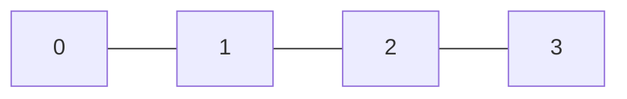
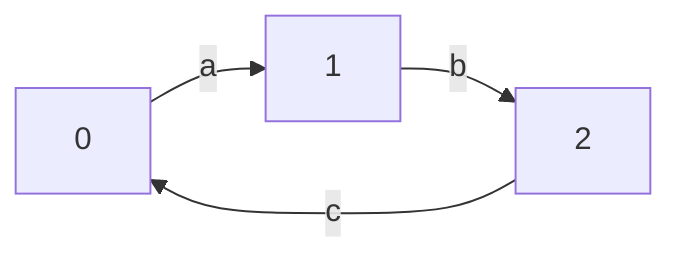
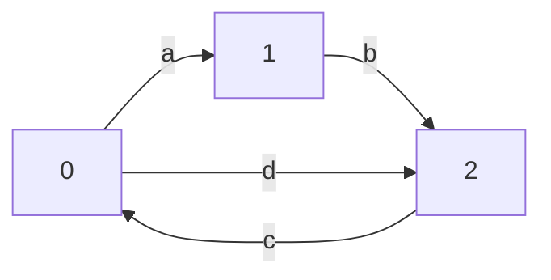
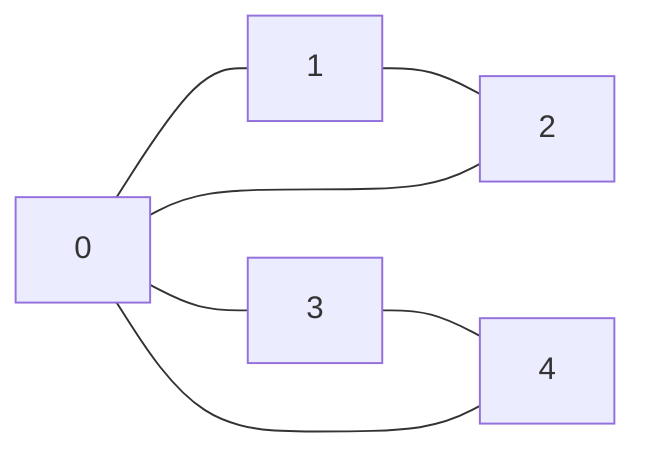
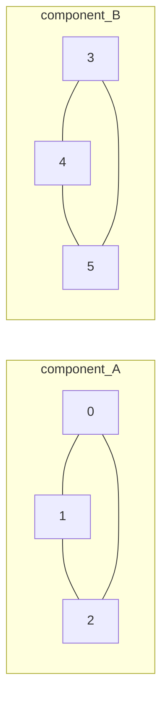

# Eulerian Path and Circuit

## Overview

An **Eulerian path** visits every edge exactly once. An **Eulerian circuit**
is an Eulerian path that returns to the starting vertex. This package uses
**Hierholzer's algorithm** for both directed and undirected graphs.

- **Time**: O(V + E)
- **Space**: O(V + E)
- **Key Feature**: Classic graph traversal problem

## The Key Insight

```
Problem: Traverse every edge exactly once

When does a solution exist?
  Count vertex degrees!

Undirected graph:
  - Path: exactly 0 or 2 odd-degree vertices
  - Circuit: all vertices have even degree

Directed graph:
  - Path: at most one (out-in=1), at most one (in-out=1)
  - Circuit: all vertices have in-degree = out-degree

Hierholzer's algorithm:
  Start from valid vertex, follow edges until stuck.
  When stuck at a vertex, that vertex has no unused edges.
  Backtrack and splice in sub-paths from vertices with remaining edges.

  Key: Build path from the END by reversing the traversal.
```

## Graph Examples

### Undirected Eulerian Circuit

All vertices have even degree, so a circuit exists. Every vertex can be
reached from every other vertex (the graph is connected).


Degrees: vertex 0 = 4, vertex 1 = 2, vertex 2 = 2, vertex 3 = 2, vertex 4 = 2.
All even. Circuit: 0 - 1 - 2 - 0 - 3 - 4 - 0.

### Undirected Eulerian Path (not a circuit)

Exactly two vertices have odd degree. Those two vertices are the start and end.



Degrees: vertex 0 = 1 (odd), vertex 1 = 2, vertex 2 = 2, vertex 3 = 1 (odd).
Two odd-degree vertices. Path: 0 - 1 - 2 - 3.

### Directed Eulerian Circuit

Every vertex has equal in-degree and out-degree. The underlying undirected
graph is connected.



In-degree = out-degree = 1 for all vertices. Circuit: 0 -> 1 -> 2 -> 0.

### Directed Eulerian Path (not a circuit)

Exactly one vertex has out - in = 1 (the start), exactly one has in - out = 1
(the end), and all others are balanced.



Vertex 0: out = 2, in = 1 (start). Vertex 2: out = 1, in = 2 (end).
Vertex 1: out = 1, in = 1 (balanced). Path: 0 -> 1 -> 2 -> 0 -> 2.

## Visual: Hierholzer's Algorithm

### Undirected Example Trace

Graph::new(two triangles sharing vertex 0):



Step-by-step Hierholzer trace:

```
Initial state:
  stack: [0]    path: []

Step 1: vertex 0 has unused edge to 1
  stack: [0, 1]    path: []

Step 2: vertex 1 has unused edge to 2
  stack: [0, 1, 2]    path: []

Step 3: vertex 2 has unused edge to 0
  stack: [0, 1, 2, 0]    path: []

Step 4: vertex 0 has unused edge to 3
  stack: [0, 1, 2, 0, 3]    path: []

Step 5: vertex 3 has unused edge to 4
  stack: [0, 1, 2, 0, 3, 4]    path: []

Step 6: vertex 4 has unused edge to 0
  stack: [0, 1, 2, 0, 3, 4, 0]    path: []

Step 7: vertex 0 has NO unused edges -> pop to path
  stack: [0, 1, 2, 0, 3, 4]    path: [0]

Step 8: vertex 4 has NO unused edges -> pop to path
  stack: [0, 1, 2, 0, 3]    path: [0, 4]

Step 9: vertex 3 has NO unused edges -> pop to path
  stack: [0, 1, 2, 0]    path: [0, 4, 3]

Step 10: vertex 0 has NO unused edges -> pop to path
  stack: [0, 1, 2]    path: [0, 4, 3, 0]

Step 11: vertex 2 has NO unused edges -> pop to path
  stack: [0, 1]    path: [0, 4, 3, 0, 2]

Step 12: vertex 1 has NO unused edges -> pop to path
  stack: [0]    path: [0, 4, 3, 0, 2, 1]

Step 13: vertex 0 has NO unused edges -> pop to path
  stack: []    path: [0, 4, 3, 0, 2, 1, 0]

Reverse path: [0, 1, 2, 0, 3, 4, 0]
```

Result: 0 - 1 - 2 - 0 - 3 - 4 - 0 (circuit, 6 edges used).

### Directed Example Trace

Edges: 0->1, 1->2, 2->0, 0->2 (the path example from the usage section).

```
Initial state:
  stack: [0]    path: []    next_index: [0, 0, 0]

Step 1: adj[0][0] = 1, advance cursor
  stack: [0, 1]    next_index: [1, 0, 0]

Step 2: adj[1][0] = 2, advance cursor
  stack: [0, 1, 2]    next_index: [1, 1, 0]

Step 3: adj[2][0] = 0, advance cursor
  stack: [0, 1, 2, 0]    next_index: [1, 1, 1]

Step 4: adj[0][1] = 2, advance cursor
  stack: [0, 1, 2, 0, 2]    next_index: [2, 1, 1]

Step 5: adj[2] exhausted -> pop 2 to path
  stack: [0, 1, 2, 0]    path: [2]    next_index: [2, 1, 1]

Step 6: adj[0] exhausted -> pop 0 to path
  stack: [0, 1, 2]    path: [2, 0]

Step 7: adj[2] exhausted -> pop 2 to path
  stack: [0, 1]    path: [2, 0, 2]

Step 8: adj[1] exhausted -> pop 1 to path
  stack: [0]    path: [2, 0, 2, 1]

Step 9: adj[0] exhausted -> pop 0 to path
  stack: []    path: [2, 0, 2, 1, 0]

Reverse: [0, 1, 2, 0, 2]
```

Result: 0 -> 1 -> 2 -> 0 -> 2 (path, 4 edges used).

## The Algorithm

```
hierholzer(graph, start):
  path = []
  stack = [start]

  repeat until stack is empty:
    v = stack.top()

    if v has unused edges:
      // Continue walking
      u = next unused neighbor of v
      mark edge (v, u) as used
      stack.push(u)
    else:
      // Stuck - finalize this vertex
      path.append(stack.pop())

  return reverse(path)
```

## Existence Conditions

```
DIRECTED GRAPH:

Eulerian circuit:
  forall v: in(v) = out(v)
  All non-isolated vertices connected

Eulerian path (not circuit):
  Exactly one v with out(v) = in(v) + 1 (start)
  Exactly one v with in(v) = out(v) + 1 (end)
  All others: in(v) = out(v)

UNDIRECTED GRAPH:

Eulerian circuit:
  All vertices have even degree
  All non-isolated vertices connected

Eulerian path (not circuit):
  Exactly 2 vertices have odd degree (start and end)
  All others have even degree
```

## Connectivity Requirement

```
Degree conditions are not enough.
All vertices with nonzero degree must lie in one connected component
of the underlying undirected graph.

Example (undirected):
  Triangle {0,1,2} and triangle {3,4,5} are separate.
  Each vertex has even degree, but no single Eulerian circuit
  can cover edges from both components.
```

Connectivity failure is illustrated below. Both triangles satisfy the degree
condition independently, yet no single walk can cross from one to the other:



## Example Usage

```mbt check
///|
test "directed eulerian path" {
  let edges : Array[(Int, Int)] = [(0, 1), (1, 2), (2, 0), (0, 2)]
  let path = @eulerian_path.eulerian_path_directed(3, edges).unwrap()
  inspect(path.length(), content="5")
}
```

```mbt check
///|
test "undirected eulerian circuit" {
  let edges : Array[(Int, Int)] = [(0, 1), (1, 2), (2, 0)]
  let path = @eulerian_path.eulerian_path_undirected(3, edges).unwrap()
  inspect(path.length(), content="4")
}
```

```mbt check
///|
test "directed no eulerian" {
  // Unbalanced degrees - no Eulerian path
  let edges : Array[(Int, Int)] = [(0, 1), (0, 2)]
  let path = @eulerian_path.eulerian_path_directed(3, edges)
  inspect(path is None, content="true")
}
```

```mbt check
///|
test "directed circuit endpoints" {
  let edges : Array[(Int, Int)] = [(0, 1), (1, 2), (2, 0)]
  let path = @eulerian_path.eulerian_path_directed(3, edges).unwrap()
  inspect(path.length(), content="4")
  inspect(path[0] == path[path.length() - 1], content="true")
}
```

```mbt check
///|
test "undirected path endpoints" {
  let edges : Array[(Int, Int)] = [(0, 1), (1, 2), (2, 3)]
  let path = @eulerian_path.eulerian_path_undirected(4, edges).unwrap()
  let start = path[0]
  let end = path[path.length() - 1]
  let ok = (start == 0 && end == 3) || (start == 3 && end == 0)
  inspect(ok, content="true")
}
```

## Algorithm Walkthrough

```
Directed graph:
  Edges: 0->1, 1->2, 2->0, 0->2

  Degrees:
    0: out=2, in=1 (start candidate)
    1: out=1, in=1
    2: out=1, in=2 (end candidate)

  Start from 0 (out > in):

  Stack: [0]
    0 has edges to 1 and 2
    Take 0->1, mark used
    Stack: [0, 1]

  Stack: [0, 1]
    1 has edge to 2
    Take 1->2, mark used
    Stack: [0, 1, 2]

  Stack: [0, 1, 2]
    2 has edge to 0
    Take 2->0, mark used
    Stack: [0, 1, 2, 0]

  Stack: [0, 1, 2, 0]
    0 has edge to 2
    Take 0->2, mark used
    Stack: [0, 1, 2, 0, 2]

  Stack: [0, 1, 2, 0, 2]
    2 has no unused edges
    Pop 2, add to path: [2]
    Stack: [0, 1, 2, 0]

  Stack: [0, 1, 2, 0]
    0 has no unused edges
    Pop 0, add to path: [2, 0]
    Stack: [0, 1, 2]

  Continue popping (all exhausted):
    Path: [2, 0, 2, 1, 0]

  Reverse: [0, 1, 2, 0, 2]

  Verify: 0->1, 1->2, 2->0, 0->2 (all 4 edges used exactly once)
```

## Why Hierholzer Works

```
Key ideas:

1) The stack is always a valid trail.
   We only push along unused edges, so no edge appears twice.

2) When a vertex has no unused edges, it is "finished".
   We can safely append it to the path because no future step
   can leave it via a new edge.

3) Every edge is used exactly once.
   Each edge is consumed the first time we traverse it, and never again.
   The algorithm ends only when all edges are consumed.

4) The final path is the reverse of the finishing order.
   This is why we pop vertices into the answer and reverse at the end.
```

## Edge Cases

```
No edges:
  Path is empty [] (this implementation returns Some([])).

Disconnected graph with edges:
  No Eulerian path because a single walk cannot cover all edges.

Isolated vertices:
  They are ignored as long as all edges lie in one component.
```

## Common Pitfalls

- **Using degree rules alone**: connectivity still matters.
- **Mixing directed/undirected rules**: check in/out separately for directed graphs.
- **Forgetting reverse**: Hierholzer builds the path in reverse order.
- **Multiple edges**: allowed, but you must treat each edge instance separately.

## Common Applications

### 1. Seven Bridges of Konigsberg
```
The original Eulerian problem!
Can you cross all bridges exactly once?
Answer: Only if <= 2 odd-degree vertices.
```

### 2. DNA Sequencing
```
De Bruijn graphs for genome assembly.
Reads are edges, Eulerian path reconstructs genome.
```

### 3. Circuit Design
```
PCB routing where each connection used once.
Chinese Postman problem (related).
```

### 4. Puzzle Games
```
Draw figure without lifting pen.
Trace every edge exactly once.
```

## Complexity Analysis

| Operation | Time | Notes |
|-----------|------|-------|
| Check existence | O(V + E) | Count degrees |
| Find start vertex | O(V) | Check odd degree |
| Hierholzer traversal | O(E) | Each edge once |
| **Total** | **O(V + E)** | Linear |

## Eulerian vs Hamiltonian

| Property | Eulerian | Hamiltonian |
|----------|----------|-------------|
| Visit | Every edge once | Every vertex once |
| Complexity | O(V + E) polynomial | NP-complete |
| Existence test | Degree condition | No simple test |
| Algorithm | Hierholzer | Backtracking |

## Undirected Graph Handling

```
For undirected graphs:
  Each undirected edge becomes two directed edges.
  But we must mark BOTH when using one!

Implementation:
  Store edges as pairs with indices.
  When using edge i, also mark its reverse twin.
  This ensures each undirected edge used once.
```

## Finding Start Vertex

```
Directed:
  - Circuit: any vertex with edges
  - Path: vertex with out > in, or any if none

Undirected:
  - Circuit: any vertex with edges
  - Path: one of the two odd-degree vertices
```

## Implementation Notes

- Track edge indices for marking (not vertex pairs)
- Handle disconnected graphs: check connectivity first
- For undirected: use edge pairing for mark-twin
- Empty graph returns empty path
- Single vertex with no edges: path = [v]
