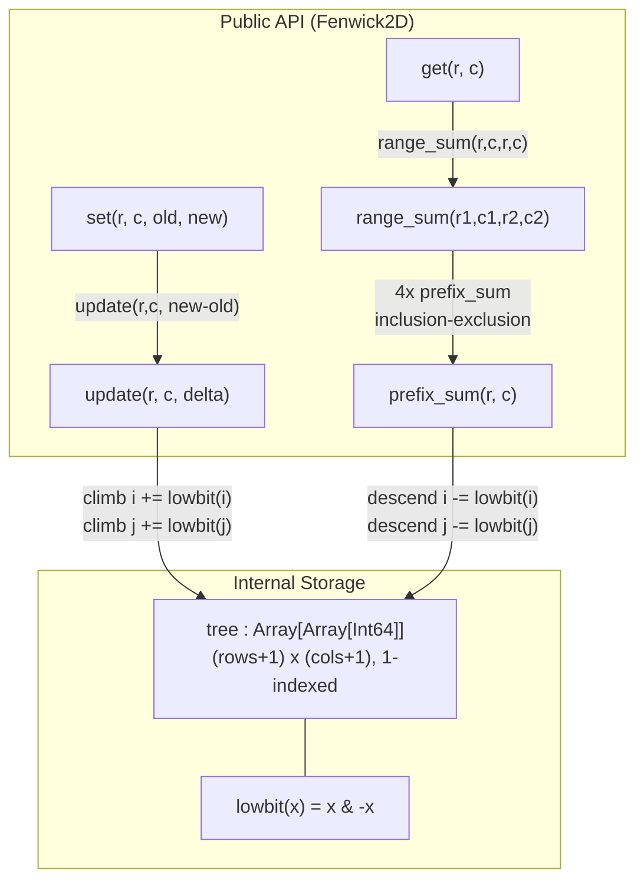
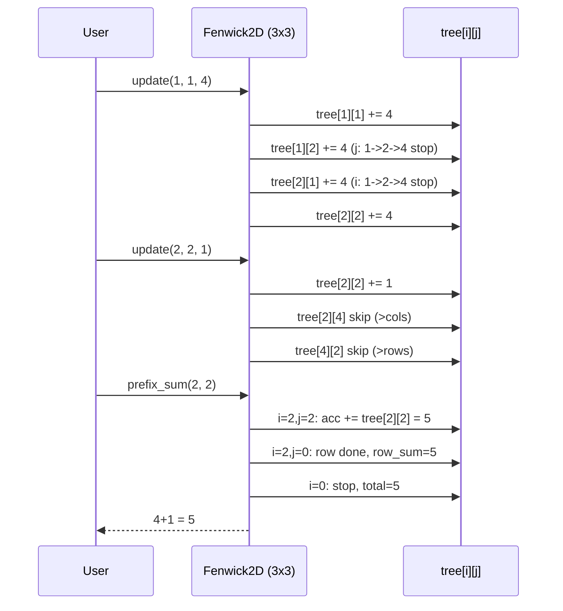

# 2D Fenwick Tree (Binary Indexed Tree)

## Overview

A **2D Fenwick Tree** (also called 2D Binary Indexed Tree or 2D BIT) extends
the 1D Fenwick Tree to a two-dimensional grid. It supports:

- **Point update**: add a value at cell `(r, c)` in **O(log n x log m)**
- **Prefix query**: sum of rectangle `[(1,1)..(r,c)]` in **O(log n x log m)**
- **Rectangle query**: sum of `[(r1,c1)..(r2,c2)]` in **O(log n x log m)**
- **Space**: O(n x m)

The key idea: apply the 1D Fenwick logic independently in the row dimension
and in the column dimension. Each tree cell `tree[i][j]` aggregates a
sub-rectangle whose size in each axis is determined by `lowbit`.

## Indexing Convention

This package uses **1-indexed** coordinates throughout the public API.
Cell `(1,1)` is the top-left corner.

```
Column →   1    2    3    4
Row ↓
  1       (1,1)(1,2)(1,3)(1,4)
  2       (2,1)(2,2)(2,3)(2,4)
  3       (3,1)(3,2)(3,3)(3,4)
  4       (4,1)(4,2)(4,3)(4,4)

update(r, c, delta)   -- add delta at (r, c)
prefix_sum(r, c)      -- sum of rows 1..r, cols 1..c
range_sum(r1,c1,r2,c2)-- sum of rectangle [r1..r2][c1..c2]
```

If your data is 0-indexed, add 1 to every row and column coordinate before
calling any method.

## The Lowbit Primitive

The single operation underlying every Fenwick Tree is `lowbit`:

```
lowbit(x) = x & (-x)   -- isolate the rightmost set bit

  x = 6 = 0110
 -x     = 1010   (two's complement)
  x & -x = 0010  (result = 2)

x    binary    lowbit    meaning
1    0001       1        covers 1 element
2    0010       2        covers 2 elements
3    0011       1        covers 1 element
4    0100       4        covers 4 elements
5    0101       1        covers 1 element
6    0110       2        covers 2 elements
7    0111       1        covers 1 element
8    1000       8        covers 8 elements
```

## Tree Cell Coverage

Each cell `tree[i][j]` is responsible for a sub-rectangle determined by
`lowbit(i)` in the row axis and `lowbit(j)` in the column axis:

```
tree[i][j] = sum of arr[x][y]
  where x in (i - lowbit(i), i]      (row range)
    and y in (j - lowbit(j), j]      (column range)
```

For a 4x4 grid (1-indexed), the row coverage for each index is:

```
Row index:    1       2       3       4
lowbit:       1       2       1       4
Covers rows: [1]    [1..2]   [3]   [1..4]
```

The same pattern applies to columns independently. So `tree[4][4]` stores
the sum of the entire 4x4 grid, while `tree[3][3]` stores only `arr[3][3]`.

## 2D Grid Illustration

Below is a 4x4 example showing which cells each `tree[i][j]` entry covers.
An asterisk marks the anchor (i, j); the shaded block shows its coverage:

```
          col 1       col 2       col 3       col 4
         lowbit=1    lowbit=2    lowbit=1    lowbit=4

row 1    [1,1]       [1,1..2]    [1,3]       [1,1..4]
(lb=1)   tree[1][1]  tree[1][2]  tree[1][3]  tree[1][4]

row 2    [1..2,1]    [1..2,1..2] [1..2,3]    [1..2,1..4]
(lb=2)   tree[2][1]  tree[2][2]  tree[2][3]  tree[2][4]

row 3    [3,1]       [3,1..2]    [3,3]       [3,1..4]
(lb=1)   tree[3][1]  tree[3][2]  tree[3][3]  tree[3][4]

row 4    [1..4,1]    [1..4,1..2] [1..4,3]    [1..4,1..4]
(lb=4)   tree[4][1]  tree[4][2]  tree[4][3]  tree[4][4]
```

The `tree[4][4]` entry is the sum of the entire grid.
The `tree[2][2]` entry covers the 2x2 top-left sub-rectangle.

## Update Propagation

When you call `update(r, c, delta)`, the algorithm climbs both the row and
column lowbit chains, touching every `tree[i][j]` that "covers" position
`(r, c)`:

```
Row traversal (upward via lowbit):
  i = r, r + lowbit(r), r + lowbit(r + lowbit(r)), ...

Column traversal (upward via lowbit) for each i:
  j = c, c + lowbit(c), c + lowbit(c + lowbit(c)), ...
```

Concrete example -- update `(2, 2)` on a 4x4 grid:

```
         col 1   col 2   col 3   col 4
           .     (j=2)     .     (j=4)
row 1      .       .       .       .
row 2    (i=2)   [2,2]*  [2,?]   [2,4]*   <-- i=2 row
row 3      .       .       .       .
row 4    (i=4)   [4,2]*  [4,?]   [4,4]*   <-- i=4 row

* = cells incremented by delta

j traversal: 2 -> 2 + lowbit(2) = 4 -> 4 + lowbit(4) = 8 (> 4, stop)
i traversal: 2 -> 2 + lowbit(2) = 4 -> 4 + lowbit(4) = 8 (> 4, stop)

Cells modified: tree[2][2], tree[2][4], tree[4][2], tree[4][4]
```

The number of cells touched is at most `log2(n) x log2(m)`.

## Prefix Sum Query

`prefix_sum(r, c)` descends both lowbit chains in the opposite direction
(subtracting instead of adding), collecting disjoint sub-rectangles that
together tile `[1..r][1..c]`:

```
Row traversal (downward via lowbit):
  i = r, r - lowbit(r), r - lowbit(r - lowbit(r)), ...  until i <= 0

Column traversal (downward via lowbit) for each i:
  j = c, c - lowbit(c), ...  until j <= 0
```

Example -- `prefix_sum(3, 3)` on a 4x4 grid:

```
i=3: lowbit(3)=1, so i next = 3-1 = 2
  j=3: lowbit(3)=1, covers [3,3],  j next = 3-1 = 2
  j=2: lowbit(2)=2, covers [3,1..2], j next = 2-2 = 0, stop
i=2: lowbit(2)=2, so i next = 2-2 = 0, stop
  j=3: covers [1..2,3],  j next = 2
  j=2: covers [1..2,1..2], j next = 0, stop

Sub-rectangles collected (disjoint, union = [1..3][1..3]):
  tree[3][3]  ->  [3][3]
  tree[3][2]  ->  [3][1..2]
  tree[2][3]  ->  [1..2][3]
  tree[2][2]  ->  [1..2][1..2]
```

## Rectangle Sum via Inclusion-Exclusion

`range_sum(r1, c1, r2, c2)` decomposes the rectangle into four prefix sums
using the inclusion-exclusion principle:

```
  col 1  c1-1   c1        c2
    |      |    |          |
    +------+----+----------+  -- row 1
    |      |    |          |
    |  A   | B  |    C     |  -- rows 1..r1-1
    |      |    |          |
    +------+----+----------+  -- row r1-1
    |      |    |          |
    |  D   | E  |  QUERY   |  -- rows r1..r2
    |      |    |          |
    +------+----+----------+  -- row r2

prefix(r2, c2)    = A + B + C + D + E + QUERY
prefix(r1-1, c2)  = A + B + C
prefix(r2, c1-1)  = A + D
prefix(r1-1, c1-1)= A

QUERY = prefix(r2,c2) - prefix(r1-1,c2) - prefix(r2,c1-1) + prefix(r1-1,c1-1)
```

Algebraically:

```
range_sum(r1, c1, r2, c2)
  = prefix(r2,  c2 )
  - prefix(r1-1,c2 )
  - prefix(r2,  c1-1)
  + prefix(r1-1,c1-1)
```

The four prefix queries run in O(log n x log m) each, so the total cost is
still O(log n x log m).

### Numeric Example

```
Grid (1-indexed, 3x3):

  col:  1  2  3
row 1:  1  2  3
row 2:  4  5  6
row 3:  7  8  9

Query rectangle [r1=2, c1=2] to [r2=3, c2=3]:
  Values: 5 + 6 + 8 + 9 = 28

  prefix(3,3) = 1+2+3+4+5+6+7+8+9 = 45
  prefix(1,3) = 1+2+3              =  6
  prefix(3,1) = 1+4+7              = 12
  prefix(1,1) = 1                  =  1

  range_sum = 45 - 6 - 12 + 1 = 28  (correct)
```

## Architecture Diagram



## Worked Example: Step-by-Step



## Example Usage

```mbt check
///|
test "fenwick2d example" {
  let fw = @fenwick2d.Fenwick2D::new(3, 3)
  fw.update(1, 1, 5)
  fw.update(2, 3, 2)
  inspect(fw.range_sum(1, 1, 3, 3), content="7")
}
```

```mbt check
///|
test "fenwick2d prefix and single cell" {
  let fw = @fenwick2d.Fenwick2D::new(3, 3)
  fw.update(1, 1, 4)
  fw.update(1, 2, 1)
  fw.update(2, 1, 2)
  inspect(fw.prefix_sum(2, 2), content="7") // 4+1+2
  inspect(fw.get(1, 2), content="1")
}
```

## API Reference

| Method | Description | Complexity |
|---|---|---|
| `Fenwick2D::new(rows, cols)` | Create an `rows x cols` tree, all zeros | O(n*m) |
| `update(r, c, delta)` | Add `delta` to cell `(r, c)` | O(log n * log m) |
| `prefix_sum(r, c)` | Sum of `[1..r][1..c]` | O(log n * log m) |
| `range_sum(r1,c1,r2,c2)` | Sum of `[r1..r2][c1..c2]` | O(log n * log m) |
| `get(r, c)` | Value at single cell `(r, c)` | O(log n * log m) |
| `set(r, c, old_val, new_val)` | Replace value at `(r, c)` | O(log n * log m) |
| `get_rows()` | Number of rows | O(1) |
| `get_cols()` | Number of columns | O(1) |

## Complexity Summary

| Operation | Time | Space |
|---|---|---|
| Construction | O(n*m) | O(n*m) |
| Point update | O(log n * log m) | O(1) |
| Prefix sum | O(log n * log m) | O(1) |
| Rectangle sum | O(log n * log m) | O(1) |
| Single-cell get | O(log n * log m) | O(1) |

## 2D Fenwick vs 2D Segment Tree

| Feature | 2D Fenwick | 2D Segment Tree |
|---|---|---|
| Point update | O(log^2 n) | O(log^2 n) |
| Rectangle query | O(log^2 n) | O(log^2 n) |
| Space | O(nm) | O(4nm) or more |
| Implementation | ~30 lines | ~100+ lines |
| Supported ops | Sum, XOR, ... | Any associative op |
| Range updates | Needs difference trick | Built-in with lazy |

Choose the 2D Fenwick Tree when you need sum queries with minimal code and
a small constant factor. Choose the 2D Segment Tree when you need lazy range
updates or non-invertible operations such as min/max.

## Extension: Range Update, Point Query

To support adding a constant to every cell in a rectangle and querying
individual cells efficiently, store differences rather than values:

```
Range add delta to [r1,c1]..[r2,c2]:
  update(r1,    c1,    +delta)
  update(r1,    c2+1,  -delta)
  update(r2+1,  c1,    -delta)
  update(r2+1,  c2+1,  +delta)

Point query at (r, c):
  result = prefix_sum(r, c)
```

This is the 2D generalisation of the 1D difference-array trick. It is
implemented in this package as the private `Fenwick2DRange` struct.

## Common Pitfalls

- **Off-by-one**: All public methods use 1-based coordinates. Passing 0
  returns 0 gracefully; passing values above `rows` or `cols` is clamped.
- **Large grids**: Memory is O(n x m). For sparse data with large coordinate
  ranges, apply coordinate compression before construction.
- **Negative updates**: Fully supported. The internal type is `Int64` to
  avoid overflow on large grids.
- **Empty rectangle**: `range_sum` returns 0 when `r1 > r2` or `c1 > c2`.
- **`set` requires the old value**: `set(r, c, old_val, new_val)` computes
  the delta internally; pass the value previously stored at `(r, c)`.

## Implementation Notes

- Arrays are sized `(rows+1) x (cols+1)` so that index 0 is unused; this
  lets the lowbit traversal terminate naturally when an index reaches 0.
- `lowbit(x) = x & (-x)` works correctly for all positive integers in two's
  complement arithmetic.
- The inner column loop runs fully for each step of the outer row loop,
  giving at most `ceil(log2(rows)) x ceil(log2(cols))` iterations.
- Can be generalised to arbitrary dimensions by nesting additional loops, at
  the cost of O(log^d n) per operation in `d` dimensions.
