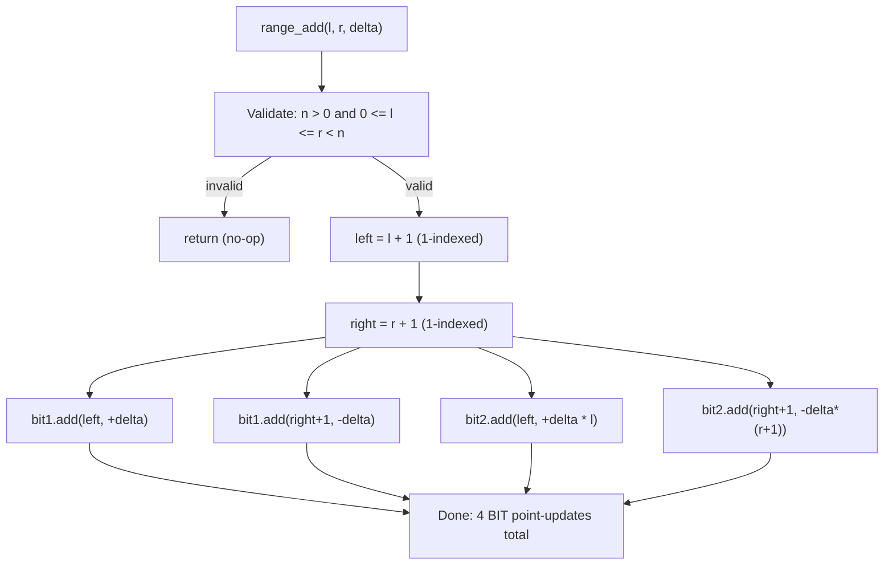
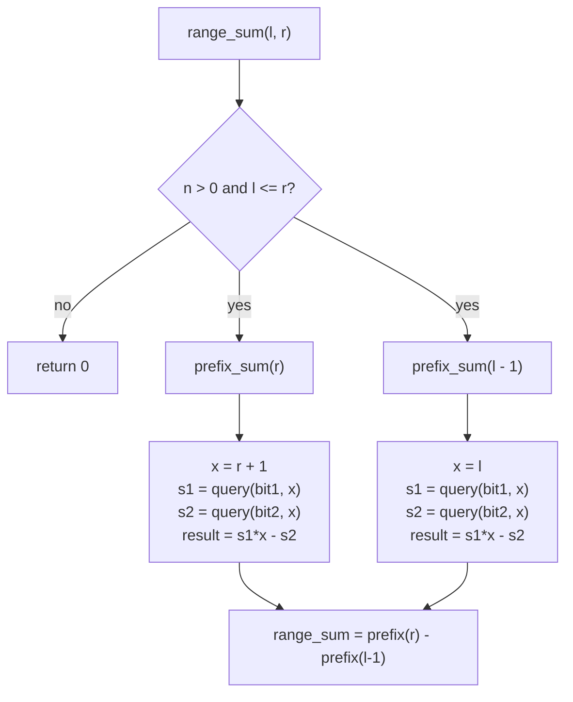
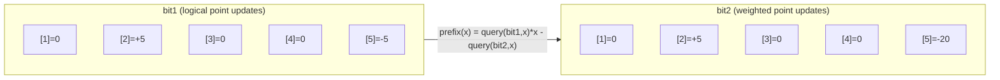

# Fenwick Range Add + Range Sum

## Overview

This package supports **range add** and **range sum** on a 0-indexed array
using two Fenwick trees (Binary Indexed Trees). While a standard Fenwick tree
supports only point updates and prefix queries, this variant uses a clever
algebraic transformation to achieve both range updates and range queries in
O(log n) time.

- **Time**: O(log n) per update and per query
- **Space**: O(n)
- **Key Feature**: Both range updates AND range queries at full BIT speed

## Indexing Convention

```
External API: 0-based indices
  range_add(l, r, v)  adds v to positions l..r inclusive
  range_sum(l, r)     returns sum of positions l..r inclusive

Internal BIT storage: 1-based indices (positions 1..n)
  0-indexed position i  <-->  1-indexed BIT position i+1
```

## The Two-BIT Structure

The structure holds two BIT arrays of the same size `n`:

```
FenwickRangeAddRangeSum
+--------+--------------+
| n      | logical size |
+--------+--------------+
| bit1[] | coefficient  |  stores b(k)       for 1-indexed k
|        | BIT array    |
+--------+--------------+
| bit2[] | constant     |  stores b(k)*(k-1) for 1-indexed k
|        | BIT array    |
+--------+--------------+
```

Each `bit1[i]` node covers a range of length `lowbit(i) = i & (-i)`, exactly
as in a standard Fenwick tree. The same tree shape is replicated in `bit2`.

### ASCII Art: BIT Node Coverage (n = 8)

```
 Index:   1    2    3    4    5    6    7    8
 lowbit:  1    2    1    4    1    2    1    8
          |    |    |    |    |    |    |    |
          [1]  [1,2][3] [1,4][5] [5,6][7] [1,8]
          Covers the ranges above for BOTH bit1 and bit2
```

A query at position `x` traverses down: `x -> x - lowbit(x) -> ...`  
An update at position `x` climbs up: `x -> x + lowbit(x) -> ...`

## The Mathematical Insight

### Why Two BITs?

Define the difference array `b(k)` such that `arr[i] = sum_{k=1}^{i} b(k)`.
Expanding a prefix sum:

```
prefix(i) = sum_{j=1}^{i} arr[j]
           = sum_{j=1}^{i} sum_{k=1}^{j} b(k)
           = sum_{k=1}^{i} b(k) * (i - k + 1)
           = (i+1) * sum_{k=1}^{i} b(k)  -  sum_{k=1}^{i} b(k)*(k-1)
```

This splits into two independent BIT queries:

```
prefix(i) = (i+1) * query(bit1, i)  -  query(bit2, i)

where:
  bit1 accumulates  b(k)
  bit2 accumulates  b(k) * (k - 1)
```

### Encoding a Range Add

To add `delta` to 0-indexed `[l, r]` (1-indexed: `[l+1, r+1]`):

```
bit1.add(l+1,   +delta)            bit2.add(l+1,   +delta * l)
bit1.add(r+2,   -delta)            bit2.add(r+2,   -delta * (r+1))
```

Four point-updates in total -- two per BIT -- each costing O(log n).

## Visual Walkthrough

```
Array of size 5, initially all zeros.
Operation: range_add(1, 3, 5)
  l=1, r=3, delta=5  -->  1-indexed left=2, right=4

  bit1 updates:
    add(2, +5)        -- "start contributing 5 from position 2"
    add(5, -5)        -- "stop contributing 5 after position 4"

  bit2 updates:
    add(2, +5*1=5)    -- constant term at left  (delta * l = 5*1)
    add(5, -5*4=-20)  -- constant term at right (delta*(r+1) = 5*4)

Query prefix_sum(idx=2)  [0-indexed, x = idx+1 = 3]:
  s1 = query(bit1, 3) = 5          (only the add(2,+5) is within [1..3])
  s2 = query(bit2, 3) = 5          (only the add(2,+5) is within [1..3])
  prefix(2) = s1*3 - s2 = 15 - 5 = 10   (positions 1 and 2 got +5 each)

Query prefix_sum(idx=4)  [0-indexed, x = idx+1 = 5]:
  s1 = query(bit1, 5) = 5 + (-5) = 0
  s2 = query(bit2, 5) = 5 + (-20) = -15
  prefix(4) = 0*5 - (-15) = 15    (positions 1,2,3 got +5 each: 3*5=15)

range_sum(1, 3) = prefix_sum(3) - prefix_sum(0)
               = 15 - 0 = 15   (correct: 3 positions * 5 = 15)
```

## Mermaid Diagram: Update Flow for range_add(l, r, delta)



## Mermaid Diagram: Query Flow for range_sum(l, r)



## Mermaid Diagram: Data Structure State After range_add(1, 3, 5) on size-5 array



## Quick Start

```mbt check
///|
test "fenwick range add range sum example" {
  let st = @fenwick_range_add_range_sum.FenwickRangeAddRangeSum::from_array([
    1L, 2L, 3L, 4L, 5L,
  ])
  st.range_add(1, 3, 2L)
  inspect(st.range_sum(0, 4), content="21")
  inspect(st.range_sum(1, 3), content="15")
}
```

## More Examples

```mbt check
///|
test "fenwick range add point query" {
  let st = @fenwick_range_add_range_sum.FenwickRangeAddRangeSum::new(4)
  st.range_add(0, 3, 5L)
  inspect(st.range_sum(2, 2), content="5")
}
```

```mbt check
///|
test "fenwick multiple range adds" {
  let st = @fenwick_range_add_range_sum.FenwickRangeAddRangeSum::new(5)
  st.range_add(0, 2, 10L) // [10, 10, 10, 0, 0]
  st.range_add(2, 4, 5L) // [10, 10, 15, 5, 5]
  inspect(st.range_sum(0, 4), content="45")
  inspect(st.range_sum(1, 3), content="30")
}
```

## Common Applications

### 1. Range Updates + Range Queries

The classic use case: both update and query targets are ranges. A standard
Fenwick tree supports only point update + range query; this variant extends
both ends to ranges with no increase in asymptotic cost.

### 2. Difference Array Operations

Many problems can be modeled by marking "start" and "end" of intervals.
This structure handles that efficiently while also supporting range sums, so
you do not need a separate scan at the end.

### 3. Online Range Increment

Process range increments online (not known in advance) and answer range sum
queries at arbitrary points during the sequence.

## Complexity Analysis

| Operation           | Time       |
|---------------------|------------|
| `range_add(l, r, v)` | O(log n)  |
| `range_sum(l, r)`    | O(log n)  |
| Build from array    | O(n log n) |
| Space               | O(n)       |

## Comparison with Other Approaches

| Structure                  | Point Update | Range Update | Range Query  |
|----------------------------|--------------|--------------|--------------|
| Plain array                | O(1)         | O(n)         | O(n)         |
| Standard Fenwick           | O(log n)     | O(n log n)   | O(log n)     |
| **Fenwick Range Add**      | O(log n)     | O(log n)     | O(log n)     |
| Segment Tree with Lazy     | O(log n)     | O(log n)     | O(log n)     |

Choose this structure when you need both range updates and range queries with
simpler, more cache-friendly code than a lazy segment tree.

## The Mathematical Formula (Summary)

```
For 0-indexed position i (1-indexed x = i+1):

  prefix(i) = sum(bit1, x) * x  -  sum(bit2, x)

For range_add(l, r, delta) (1-indexed left = l+1, right = r+1):

  bit1: point-add +delta  at left
        point-add -delta  at right+1
  bit2: point-add +delta*l     at left
        point-add -delta*(r+1) at right+1

For range_sum(l, r):
  = prefix(r) - prefix(l - 1)
```

## Common Pitfalls

- **Wrong indexing**: The API is 0-based; BIT internals are 1-based. Never
  pass a raw BIT index to a public method.
- **Forgetting `r+1`**: The range-add stop marker lives at `right+1` in
  1-indexed space, which is `r+2` in 0-indexed space. Missing it leaves the
  BIT in a permanently corrupted state.
- **Off-by-one in the prefix formula**: The formula uses `x = idx + 1` as the
  multiplier; using `idx` directly gives wrong results.
- **Empty or inverted range**: If `l > r`, `range_add` and `range_sum` both
  return immediately. Callers do not need to guard against this.

## Implementation Notes

- Both BIT arrays are allocated with size `n + 2` to safely accommodate the
  sentinel write at `right + 1` when `r = n - 1`.
- `from_array` builds the structure in O(n log n) by issuing n individual
  point-add operations; no special O(n) initialization is needed because the
  two-BIT formula is self-consistent with single-element updates.
- Negative values of `n` passed to `new` are silently clamped to zero,
  producing an empty but valid structure.
