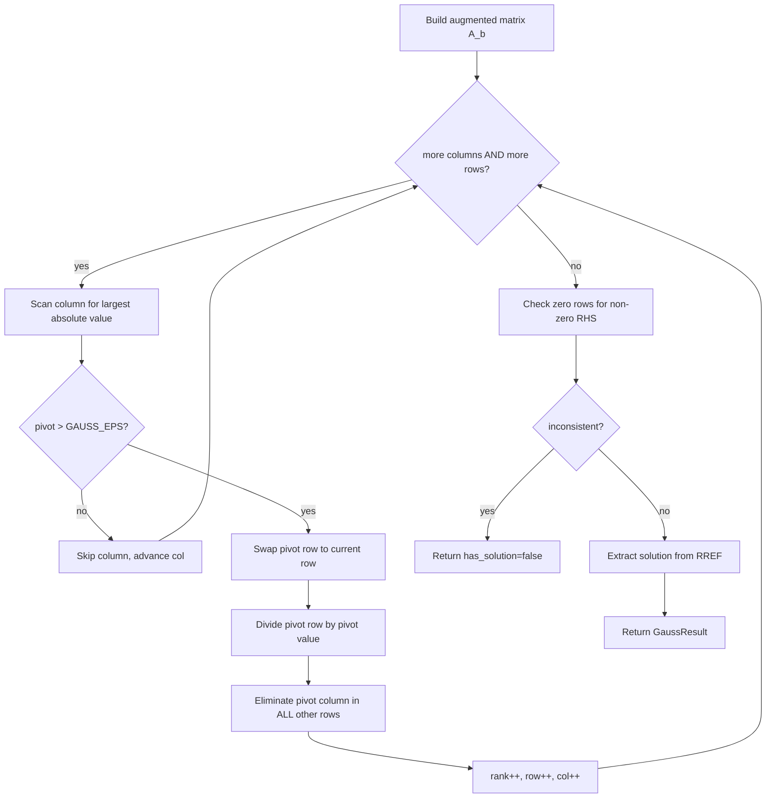

# Gaussian Elimination

## 1. What is this package?

This package solves systems of linear equations **Ax = b** using Gaussian
elimination (with Gauss-Jordan back-substitution). It also provides two
specialised variants for modular and GF(2) arithmetic.

- **Time**: O(n^3) for an n x n system
- **Space**: O(n^2) for the augmented matrix

Public surface: one function, `gauss_solve`, and one result struct,
`GaussResult`. The internal variants (`gauss_mod`, `gauss_xor`) are kept
package-private and are exercised by the package tests.

## 2. The problem

A linear system written in matrix form:

```
Ax = b

[ a00  a01  a02 ] [ x0 ]   [ b0 ]
[ a10  a11  a12 ] [ x1 ] = [ b1 ]
[ a20  a21  a22 ] [ x2 ]   [ b2 ]
```

Gaussian elimination finds `x` (or decides no solution exists).

Concrete example:

```
2x + y - z =  8
-3x - y + 2z = -11
-2x + y + 2z = -3

[ 2   1  -1 | 8  ]
[ -3  -1  2 | -11]
[ -2  1   2 | -3 ]
```

Solution: x = 2, y = 3, z = -1.

## 3. Three outcomes

```
Unique solution      Infinite solutions    No solution
(rank == n)          (rank < n)            (inconsistent)

[ 1  0 | 2 ]        [ 1  2 | 3 ]          [ 1  2 | 3 ]
[ 0  1 | 1 ]        [ 0  0 | 0 ]          [ 0  0 | 1 ]
                           ^                      ^
                      free variable           0 = 1  impossible
```

The result struct carries all three signals:

```
has_solution          true unless a zero row has non-zero RHS
has_unique_solution   true when has_solution && rank == number of unknowns
rank                  number of independent pivot rows found
solution              one particular solution (free variables set to 0)
```

## 4. Row reduction, step by step

The algorithm works on the augmented matrix [A|b]. Each column gets a pivot:

```
Initial augmented matrix:

     x    y    z    | b
  +----+----+----+-----+
0 |  2 |  1 | -1 |   8 |
1 | -3 | -1 |  2 | -11 |
2 | -2 |  1 |  2 |  -3 |
  +----+----+----+-----+

--- Step 1: pivot column 0 ---

Partial pivoting: scan rows 0..2 for largest |a[i][0]|.
  |2| = 2,  |-3| = 3*,  |-2| = 2  -> pivot row is 1, swap with row 0.

     x    y    z    | b
  +----+----+----+-----+
0 | -3 | -1 |  2 | -11 |  <- swapped
1 |  2 |  1 | -1 |   8 |
2 | -2 |  1 |  2 |  -3 |
  +----+----+----+-----+

Normalize row 0 (divide by -3):

0 |  1 | 1/3 | -2/3 | 11/3 |

Eliminate column 0 in rows 1 and 2:
  row1 -= 2 * row0
  row2 -= -2 * row0

     x    y      z    |    b
  +----+------+------+--------+
0 |  1 | 1/3  | -2/3 |  11/3  |
1 |  0 | 1/3  |  1/3 |   2/3  |
2 |  0 | 5/3  |  2/3 |  13/3  |
  +----+------+------+--------+

--- Step 2: pivot column 1 ---

Scan rows 1..2 for largest |a[i][1]|.
  |1/3|,  |5/3|*  -> pivot row is 2, swap with row 1.

Normalize row 1 (new row, divide by 5/3):
  row1 -> [0, 1, 2/5, 13/5]

Eliminate column 1 in rows 0 and 2:
  row0 -= (1/3) * row1
  row2 -= (5/3) * row1  (now all zero in col 1)

     x    y    z    |    b
  +----+----+------+--------+
0 |  1 |  0 | -2/3 |    9/5 |  (approx)
1 |  0 |  1 |  2/5 |  13/5  |
2 |  0 |  0 |  -1  |    -1  |
  +----+----+------+--------+

--- Step 3: pivot column 2 ---

Only row 2 remains. Normalize (divide by -1):
  row2 -> [0, 0, 1, 1]

Eliminate column 2 in rows 0 and 1.

     x    y    z  | b
  +----+----+----+----+
0 |  1 |  0 |  0 |  2 |   x = 2
1 |  0 |  1 |  0 |  3 |   y = 3
2 |  0 |  0 |  1 | -1 |   z = -1
  +----+----+----+----+
```

This is **reduced row echelon form** (RREF). The solution is read directly from
the augmented column: no separate back-substitution pass is needed.

## 5. Partial pivoting

At each column `k` the algorithm scans rows `k..n` for the entry with the
largest absolute value and swaps it to position `k`.

```
Why? Avoid division by a very small number.

Bad (no pivoting):          Good (partial pivoting):

[ 0.0001  1 | 1 ]          [ 1      0.0001 | 0.0001 ]  <- large pivot first
[ 1       1 | 2 ]          [ 0.0001 1      | 1      ]

Dividing by 0.0001 amplifies
floating-point error by 10000x.
```

Swapping the largest-magnitude row to the top before each elimination step
limits error amplification to at most 1.

## 6. Algorithm overview



## 7. Gauss-Jordan vs plain Gaussian elimination

```
Plain Gaussian (upper triangular):   Gauss-Jordan (RREF):

[ 1  *  * | * ]                      [ 1  0  0 | * ]
[ 0  1  * | * ]  --back-substitute-> [ 0  1  0 | * ]
[ 0  0  1 | * ]                      [ 0  0  1 | * ]

Plain: forward pass only, then back-substitute from the bottom.
Gauss-Jordan: eliminate ABOVE and BELOW each pivot in one pass.
              Solution can be read directly; no separate back step.
```

This implementation uses the Gauss-Jordan approach: the inner loop eliminates
both above and below the current pivot row, producing RREF immediately.

## 8. Loop invariants

The implementation carries explicit `proof_invariant` / `proof_reasoning`
annotations on every loop, following the project's proof-carrying style.

Key invariants for the forward elimination loop:

```
(row, col) loop:
  - rows [0..row) are already in RREF for columns [0..col)
  - rank == row  (pivots found equals rows processed)

Pivot scan inner loop:
  - best_row in [row, i)  (valid candidate already examined)
  - best_val == |aug[best_row][col]|  (column maximum so far)

Row normalisation loop:
  - aug[row][col] == 1 when the loop ends
  - only executes when pivot > GAUSS_EPS

Column elimination loop:
  - aug[row][col] == 1 throughout (pivot row untouched)
  - all rows in [0..i) have col eliminated
```

## 9. Modular variant (GF(p))

`gauss_mod(a, b, p)` solves `Ax = b` in the finite field GF(p) where `p` is
prime. Scaling uses modular inverse via Fermat's little theorem:

```
a^(-1) mod p  =  a^(p-2) mod p       (requires p prime)
```

The same Gauss-Jordan structure applies; all arithmetic is done modulo `p`.

Use case: competitive programming problems with answers modulo a prime.

## 10. XOR variant (GF(2))

`gauss_xor(a, b)` solves `Ax = b` over GF(2), where addition is XOR and
multiplication is AND.

```
Typical use: "Lights Out" puzzles, XOR basis problems.

Row operation in GF(2):
  row_i ^= row_pivot    (instead of row_i -= factor * row_pivot)
```

Every entry is 0 or 1. No division is needed because the only non-zero
value is 1 (already the multiplicative identity).

## 11. API

```
gauss_solve(a : Array[Array[Double]], b : Array[Double]) -> GaussResult
```

`a` is the coefficient matrix (n rows, m columns). `b` is the right-hand side
(length n). The function returns a `GaussResult`:

```
struct GaussResult {
  solution            : Array[Double]   // one particular solution
  rank                : Int             // number of independent pivots
  has_solution        : Bool            // false when system is inconsistent
  has_unique_solution : Bool            // true when rank == m and has_solution
}
```

Free variables (underdetermined systems) are left at 0 in `solution`.

## 12. Example usage

```mbt check
///|
test "gauss unique solution" {
  let a = [[2.0, 1.0], [1.0, -1.0]]
  let b = [5.0, 1.0]
  let res = @gauss.gauss_solve(a, b)
  inspect(res.has_unique_solution, content="true")
  let ok = (res.solution[0] - 2.0).abs() < 0.000001 &&
    (res.solution[1] - 1.0).abs() < 0.000001
  inspect(ok, content="true")
}
```

```mbt check
///|
test "gauss no solution" {
  let a = [[1.0, 1.0], [1.0, 1.0]]
  let b = [1.0, 2.0]
  let res = @gauss.gauss_solve(a, b)
  inspect(res.has_solution, content="false")
}
```

```mbt check
///|
test "gauss infinite solutions" {
  let a = [[1.0, 1.0], [2.0, 2.0]]
  let b = [1.0, 2.0]
  let res = @gauss.gauss_solve(a, b)
  inspect(res.has_solution, content="true")
  inspect(res.has_unique_solution, content="false")
}
```

## 13. Complexity

| Operation | Time | Space |
|-----------|------|-------|
| Solve n x m system | O(n^2 * m) | O(n * m) |
| Square n x n system | O(n^3) | O(n^2) |
| Rank computation | implicit in solve | same |

## 14. Gauss vs other solvers

| Method | Time | Best for |
|--------|------|----------|
| Gaussian (this) | O(n^3) | General dense systems |
| LU decomposition | O(n^3) | Multiple right-hand sides (factorise once) |
| Cholesky | O(n^3 / 3) | Symmetric positive-definite |
| Conjugate gradient | O(n^2 * iters) | Large sparse systems |

Choose Gaussian elimination when you need a straightforward general-purpose
dense solver with no special structure requirements.

## 15. Special cases handled

- **Empty system** (n = 0): returns rank 0, `has_solution = true`.
- **Mismatched dimensions**: `b.length() != a.length()` returns `has_solution = false`.
- **Ragged rows**: any row with length != m returns `has_solution = false`.
- **Singular matrix**: rank < m, `has_unique_solution = false`.
- **Overdetermined consistent**: more equations than unknowns but no contradiction.

## 16. Numerical stability notes

- Partial pivoting limits error growth to O(2^n) in the worst case (rare).
- The epsilon threshold `GAUSS_EPS = 1e-9` treats pivots smaller than this as
  zero. For ill-conditioned systems, consider scaling inputs or using a larger
  epsilon.
- For exact arithmetic (integers, rationals), use `gauss_mod` with a suitable
  prime modulus instead.

## 17. Common pitfalls

- **b length mismatch**: b must have the same length as a.
- **Floating-point comparison**: use `has_solution` and `has_unique_solution`
  flags rather than checking entries directly.
- **Free variables**: `solution` sets them to 0; all values `x0 + t * null_vec`
  are also valid for any scalar `t`.
- **Large condition numbers**: nearly-dependent rows can still return
  `has_unique_solution = true` while the computed solution carries large error.
