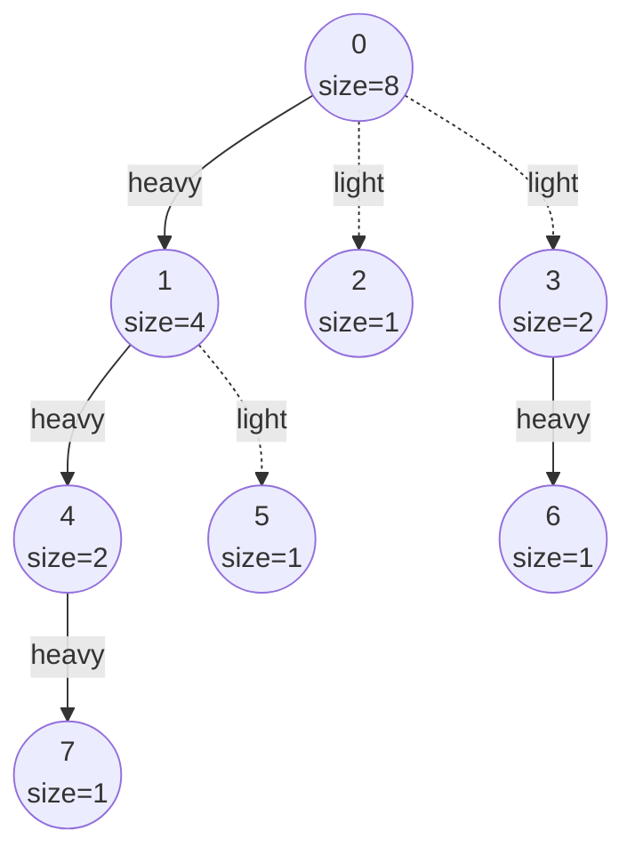
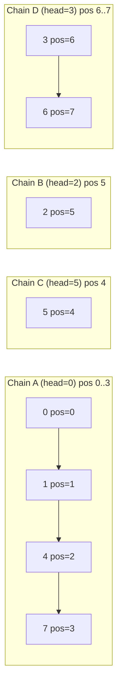
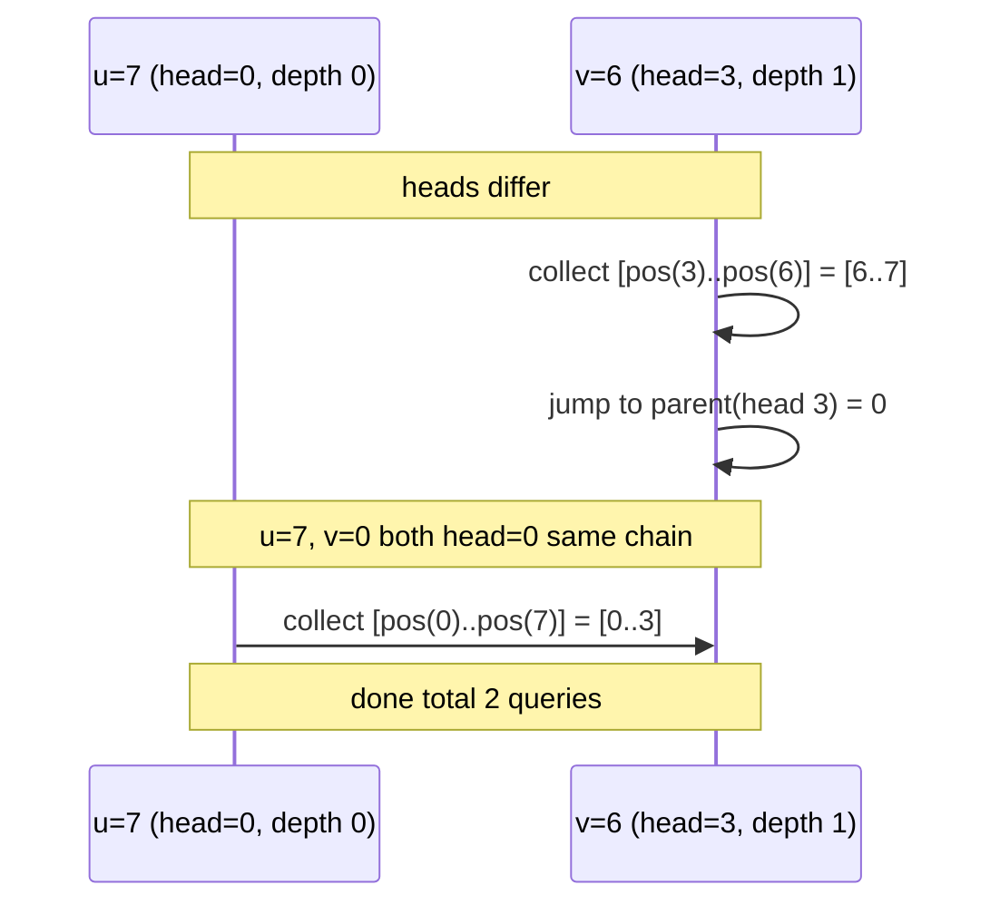
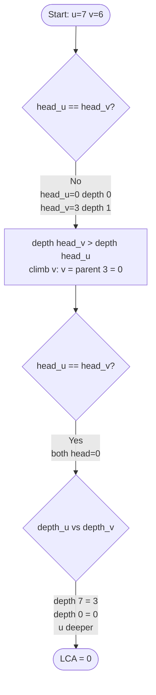

# Heavy-Light Decomposition (HLD)

## What HLD Solves

**Heavy-Light Decomposition** turns tree path queries into a small number of
contiguous ranges. Once you map each node to a position, path queries become a
handful of segment-tree queries.

Typical tasks:

- Sum / min / max on the path between `u` and `v`
- Update all values on a path
- Query a whole subtree in one contiguous range

HLD works on **static trees** (topology does not change).

## Big Picture

HLD labels each node with:

- `heavy_child[u]`: the child with the largest subtree
- `chain_head[u]`: top node of u's heavy chain
- `position[u]`: a linear index for segment tree use

**Key property**: heavy edges form chains, and each chain is contiguous in the
`position` order.

That means **any path** breaks into **O(log n) chain segments**.

## The Heavy/Light Idea (Why It Is O(log n))

A light edge always jumps into a subtree of **at most half** the size.
Therefore, on any root-to-leaf path, you can only cross about `log2(n)` light
edges before the subtree size drops to 1.

```
Start at subtree size n
Light edge -> size <= n/2
Light edge -> size <= n/4
Light edge -> size <= n/8
...
After k light edges: size <= n / 2^k
```

So there are at most O(log n) light edges, and thus only O(log n) chain jumps.

### Quick picture

```
Every time you cross a light edge, subtree size at least halves.
So you can only do that about log2(n) times before reaching size 1.
```

## Step 1: Compute Subtree Sizes and Heavy Children

We do a DFS to get sizes and pick the heaviest child at each node.

Example tree (8 nodes):

```
      0
     /|\
    1 2 3
   /|   |
  4 5   6
 /
7
```

Subtree sizes and heavy child:

```
Node:  0  1  2  3  4  5  6  7
Size:  8  4  1  2  2  1  1  1
Heavy: 1  4  -  6  7  -  -  -
```

Heaviest edges: `0-1`, `1-4`, `4-7`, and `3-6`.

### Mermaid tree with heavy/light annotations



Solid arrows are heavy edges; dashed arrows are light edges.

## Step 2: Build Chains and Positions

We run a second DFS, always visiting the heavy child first.
This makes each heavy path **contiguous** in the linear order.

Chains (head -> nodes):

```
Chain A (head=0): 0 -> 1 -> 4 -> 7
Chain B (head=2): 2
Chain C (head=5): 5
Chain D (head=3): 3 -> 6
```

Positions (used by a segment tree):

```
Node:     0  1  4  7  5  2  3  6
Position: 0  1  2  3  4  5  6  7
```

Notice each chain is a continuous slice:

```
pos: |  0  |  1  |  2  |  3  |  4  |  5  |  6  |  7  |
     [ Chain A (head=0)       ] [ C ] [ B ] [ Chain D  ]
       0      1      4      7    5     2     3      6
```

### Mermaid view of chains and positions



### Why heavy-first DFS matters

Visiting the heavy child first ensures that the entire heavy chain is placed
contiguously in the linear order. This is what lets a chain be a single range.

## Step 3: Decompose a Path into Ranges

To query `u -> v`, you repeatedly climb the deeper chain head.
Each climb produces one **contiguous** range in the segment tree.

### Path decomposition: `u=7` to `v=6`

```
Tree (chains annotated):

              [Chain A]
          0 (pos 0, head=0)
         /|\
        1  2  3          2 = [Chain B], 3 = [Chain D]
       /|   |
      4  5   6           5 = [Chain C], 6 in [Chain D]
     /
    7
    ^
    start u=7 (pos 3, head=0)          end v=6 (pos 7, head=3)

Step 1: heads differ (head[7]=0, head[6]=3).
        depth(head 0)=0 < depth(head 3)=1 -> climb v side.
        Collect range [pos(3)..pos(6)] = [6..7].
        Move v to parent(head 3) = parent(3) = 0.

Step 2: heads equal (head[7]=0, head[0]=0).
        Collect final range [pos(0)..pos(7)] = [0..3].

Total: 2 segment tree queries.
```

### ASCII art of the two ranges on the position array

```
Segment-tree position array (8 slots):

 pos: [  0  |  1  |  2  |  3  |  4  |  5  |  6  |  7  ]
 node:   0     1     4     7     5     2     3     6

Range 1 (Chain D tail):              [===========]
                                      pos 6  pos 7

Range 2 (Chain A, full):  [===================]
                            pos 0            pos 3
```

### Mermaid diagram of the climbing steps



## Subtree Queries Are One Range

Because the heavy-first DFS assigns positions in a subtree contiguously:

```
subtree(u) == [position[u], position[u] + subtree_size[u] - 1]
```

So subtree sums or subtree updates are just one range in the segment tree.

### Subtree example

```
subtree(1) contains nodes {1, 4, 5, 7}

 pos: [  0  |  1  |  2  |  3  |  4  |  5  |  6  |  7  ]
 node:   0     1     4     7     5     2     3     6

subtree(1) = [pos(1) .. pos(1)+size(1)-1] = [1..4]

             [===================]
              pos 1    (4 nodes)  pos 4
              ^nodes: 1, 4, 7, 5^
```

## Edge vs Vertex Values

HLD can handle both, but the mapping differs:

### Vertex values

Store value at `position[u]` directly.

### Edge values

Store the edge `(parent[u], u)` at `position[u]` (the deeper endpoint).
When querying a path:

- compute LCA
- **exclude** `position[lca]` if you only want edge values

```
Vertex mode:   query [pos(lca) .. pos(u)]  (includes LCA vertex)
Edge mode:     query [pos(lca)+1 .. pos(u)]  (excludes LCA vertex)
```

## LCA via HLD

```
repeat until head[u] == head[v]:
  if depth[head[u]] < depth[head[v]]: v = parent[head[v]]
  else: u = parent[head[u]]
return (deeper of u,v)
```

This finds the LCA in O(log n) chain jumps.

### Example

```
LCA(7, 6):
  head[7]=0, head[6]=3 -> climb 6 to parent(head 3) = 0
  now same head, LCA = 0
```

### Mermaid LCA walkthrough



## Example Usage (Conceptual)

```mbt nocheck
///|
// Build a tree
let hld = HLD::new(n)
for (u, v) in edges {
  hld.add_edge(u, v)
}

// Decompose
hld.build(0)

// Build a segment tree on values ordered by position[]
for u in 0..<n {
  segtree.set(hld.get_position(u), value[u])
}

// Path query u-v
let ans = loop (u, v, 0) {
  (a, b, ans) => {
    let head_a = hld.get_chain_head(a)
    let head_b = hld.get_chain_head(b)
    if head_a == head_b {
      break ans + segtree.query(min(pos[a], pos[b])..max(pos[a], pos[b]))
    }
    if depth[head_a] < depth[head_b] {
      continue (a, parent[head_b], ans + segtree.query(pos[head_b]..pos[b]))
    } else {
      continue (parent[head_a], b, ans + segtree.query(pos[head_a]..pos[a]))
    }
  }
}
```

### Micro example with explicit ranges

```
pos:  [0,1,5,6,2,4,7,3]  (from earlier example)
head: [0,0,2,3,0,5,3,0]

query path 7 -> 6:
  range [6..7] + range [0..3]
```

## Concrete Range Decomposition Example (Hardcoded)

```
Given the earlier tree:
head = [0,0,2,3,0,5,3,0]
pos  = [0,1,5,6,2,4,7,3]

Path 7 -> 6 produces ranges:
- [6..7]  (chain head 3 to node 6)
- [0..3]  (chain head 0 to node 7)
```

## Common Pitfalls

- **Wrong heavy child**: pick the child with the largest subtree.
- **Edge values**: store on the deeper endpoint and exclude LCA.
- **Disconnected graph**: HLD is for a tree; handle components separately.
- **Root choice**: any root works, but arrays depend on the root.
- **Indices**: be consistent with 0-based indexing in arrays.

### Beginner trap

If you store edge values at `position[u]`, remember to exclude the LCA
position when querying edge-paths.

## Complexity

| Step | Time | Space |
|------|------|-------|
| Compute sizes + heavy child | O(n) | O(n) |
| Decompose and assign positions | O(n) | O(n) |
| Path query | O(log^2 n) | O(1) extra |
| Subtree query | O(log n) | O(1) extra |

## HLD vs Other Techniques

| Method | Path Query | Subtree Query | Notes |
|--------|------------|---------------|-------|
| HLD | O(log^2 n) | O(log n) | supports updates + queries |
| Euler Tour | O(n) | O(log n) | good for subtree only |
| Binary Lifting | O(log n) | - | LCA only |
| Link-Cut Tree | O(log n) | - | dynamic trees |

## Implementation Notes (This Package)

- `HLD::new(n)` allocates arrays for `n` nodes
- `HLD::add_edge(u, v)` adds an undirected edge (call before `build`)
- `HLD::build(root)` runs both DFS passes
- `HLD::lca(u, v)` uses chain heads to find the LCA in O(log n)
- `HLD::path_length(u, v)` returns the number of edges on the path
- `HLD::count_chains(u, v)` counts chain segments (for complexity analysis)
- `HLD::get_position(u)` returns the segment-tree index for node `u`
- `HLD::get_chain_head(u)` returns the topmost node on `u`'s heavy chain

This package provides the decomposition and helper queries. You provide the
segment tree (or Fenwick) on top of `position[]` to answer your own queries.

## Runnable Examples

```mbt nocheck
///|
test "lca on a small tree" {
  //       0
  //      / \
  //     1   2
  //    / \
  //   3   4
  let hld = HLD::new(5)
  hld.add_edge(0, 1)
  hld.add_edge(0, 2)
  hld.add_edge(1, 3)
  hld.add_edge(1, 4)
  hld.build(0)
  inspect(hld.lca(3, 4), content="1")
  inspect(hld.lca(3, 2), content="0")
  inspect(hld.lca(0, 4), content="0")
}
```

```mbt nocheck
///|
test "path length on a linear chain" {
  // 0 - 1 - 2 - 3 - 4
  let hld = HLD::new(5)
  hld.add_edge(0, 1)
  hld.add_edge(1, 2)
  hld.add_edge(2, 3)
  hld.add_edge(3, 4)
  hld.build(0)
  inspect(hld.path_length(0, 4), content="4")
  inspect(hld.path_length(1, 3), content="2")
  inspect(hld.path_length(2, 2), content="0")
}
```

```mbt nocheck
///|
test "linear tree is one chain" {
  let hld = HLD::new(8)
  for i in 0..<7 {
    hld.add_edge(i, i + 1)
  }
  hld.build(0)
  // A linear tree is a single heavy chain: all nodes share head 0
  inspect(hld.count_chains(0, 7), content="1")
  inspect(hld.get_chain_head(7), content="0")
}
```

```mbt nocheck
///|
test "positions and chain heads on a star" {
  // Star: 0 is center, 1-4 are leaves
  let hld = HLD::new(5)
  hld.add_edge(0, 1)
  hld.add_edge(0, 2)
  hld.add_edge(0, 3)
  hld.add_edge(0, 4)
  hld.build(0)
  // Each leaf forms its own chain (only one child can be heavy)
  let p0 = hld.get_position(0)
  inspect(p0 >= 0 && p0 < 5, content="true")
  inspect(hld.path_length(1, 4), content="2")
  inspect(hld.lca(1, 4), content="0")
}
```
