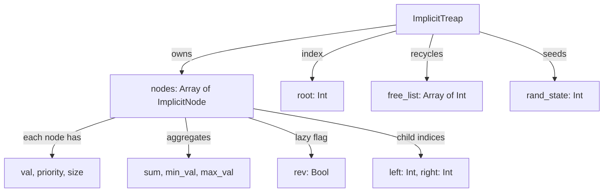
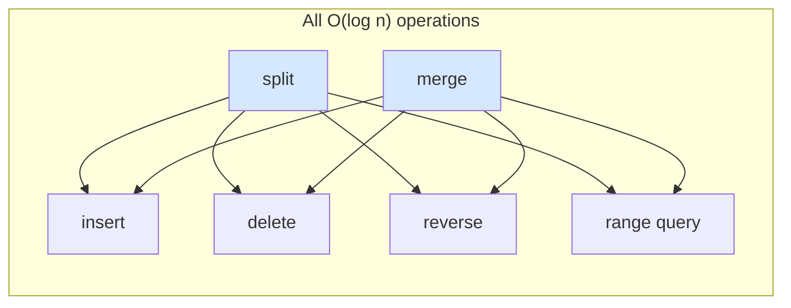
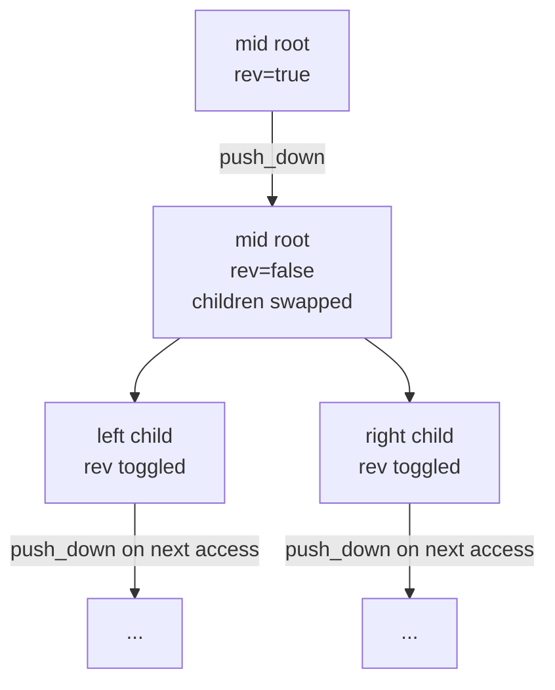
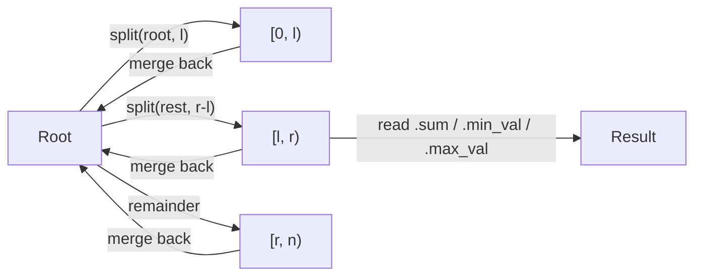

# Implicit Treap::new(Sequence Treap)

## What This Data Structure Solves

An **implicit treap** stores a sequence (like an array), but supports
**insert/delete/reverse/query by range** in **O(log n)** expected time.

Think of it as:

- **A binary search tree** whose key is the *position* (index)
- **A heap** ordered by a random priority

So you get both:

- the **order** of an array (in-order traversal)
- the **balance** of a randomized BST

## Architecture Overview





## Mental Model

### 1) Two Properties at Once

```
BST by position (in-order traversal):
  left subtree  ->  node  ->  right subtree

Heap by priority:
  parent.priority > child.priority
```

Because priorities are random, the height is **O(log n)** on average.

### 2) Implicit Keys (No Stored Indices)

Positions are computed from subtree sizes.

```
position(node) = size(left subtree) + positions skipped above
```

Example (in-order sequence [A, B, C]):

```
      [B]
     /   \
   [A]   [C]

size(left of B) = 1
=> B is at position 1
```

This is why insert/delete at any position are fast: you do not store or update
explicit indices.

## Core Operations: Split and Merge

Everything builds on **split** and **merge**.

### Split: `split(root, k)` -> `[0..k)`, `[k..n)`

Split by position, not by value.

Example sequence: `[10, 20, 30, 40, 50]`, split at `k = 2`

```
Before (in-order): [10, 20, 30, 40, 50]

After:
Left  = [10, 20]
Right = [30, 40, 50]
```

#### Step-by-step tree diagram for `split([10,20,30,40,50], k=2)`

The tree before the split (priorities shown as numbers, highest = closest to root):

```
          30(p=9)
         /       \
      20(p=6)   40(p=7)
      /               \
   10(p=3)           50(p=4)
```

Split at k=2.  At node 30: left_size = 2, k <= left_size, so 30 goes RIGHT.
Recurse: split(20's subtree, 2).  At node 20: left_size = 1, k=2 > left_size,
so 20 goes LEFT. Recurse: split(right of 20, 2-1-1=0).
right of 20 is null -> returns (-1, -1).  20.right = -1.

Result:

```
   LEFT             RIGHT

  20(p=6)          30(p=9)
  /                /       \
10(p=3)         null       40(p=7)
                                \
                               50(p=4)

In-order: [10,20]   In-order: [30,40,50]
```

What happens at each node:

```
Let left_size = size(left child)

if k <= left_size:
  - split the left child
  - node goes to RIGHT part
else:
  - split the right child with k - left_size - 1
  - node goes to LEFT part
```

### Merge: `merge(left, right)` -> combined

Precondition: all positions in `left` come before all positions in `right`.

Decision rule:

```
if left.priority > right.priority:
  left becomes root
  left.right = merge(left.right, right)
else:
  right becomes root
  right.left = merge(left, right.left)
```

This preserves heap order and keeps the tree balanced in expectation.

#### Step-by-step tree diagram for `merge([A,B], [C,D,E])`

```
LEFT              RIGHT

B(p=6)            C(p=9)
/                 /     \
A(p=3)          null    D(p=7)
                             \
                             E(p=4)
```

Step 1: compare priorities. C(9) > B(6), so C becomes root.
        C.left = merge(LEFT, C.left=null).

Step 2: merge([A,B], null).  null -> return B.
        C.left = B.

```
         C(p=9)
        /      \
     B(p=6)   D(p=7)
     /              \
  A(p=3)           E(p=4)

In-order: [A, B, C, D, E]   Heap property: C > B,D; D > E; B > A.
```

## Building Operations From Split/Merge

### Insert at Position

Insert `X` at position `k`:

```
1) (A, B) = split(root, k)
2) merge(A, X)
3) merge(result, B)
```

Diagram (insert C at position 2 into [A, B, D, E]):

```
[A,B,D,E] -> split(2) -> [A,B] + [D,E]
merge([A,B], C) -> [A,B,C]
merge([A,B,C], [D,E]) -> [A,B,C,D,E]
```

ASCII view before and after:

```
BEFORE                     AFTER

    D(p=7)                     C(p=8)
   /      \                   /      \
B(p=5)   E(p=3)           B(p=5)   D(p=7)
/                          /             \
A(p=2)                  A(p=2)          E(p=3)

[A, B, D, E]               [A, B, C, D, E]
```

### Delete at Position

Delete position `k`:

```
1) (A, B) = split(root, k)
2) (mid, C) = split(B, 1)
3) discard mid
4) root = merge(A, C)
```

### Range Reverse (Lazy Propagation)

Reverse `[l, r)` without touching every node:

```
1) (A, B) = split(root, l)
2) (mid, C) = split(B, r - l)
3) toggle mid.rev flag
4) root = merge(A, merge(mid, C))
```

When a node with `rev = true` is visited, swap its children and flip the flag
on each child. This makes reverse cost **O(log n)**.

## Lazy Reversal: Visual Example

Sequence: `[1, 2, 3, 4, 5]`
Reverse `[1, 4)` (elements 2, 3, 4)

```
Split:
A = [1]
mid = [2, 3, 4]    <- set rev=true on root of this subtree
C = [5]

Toggle mid.rev (no nodes physically moved yet)

Merge back:
[1] + mid(rev=true) + [5]
```

Later, when the subtree is traversed (e.g., for `to_array`), `push_down`
propagates the flag:

```
push_down(mid root):
  swap children
  toggle rev on both children
  clear own rev flag

Result after propagation: subtree represents [4, 3, 2]

Final sequence: [1, 4, 3, 2, 5]
```

You never move all nodes. The reversal is a flag.

### Lazy flag propagation diagram



## Range Queries via Split

Range sum on `[l, r)`:

```
1) (A, B) = split(root, l)
2) (mid, C) = split(B, r - l)
3) answer = mid.sum
4) root = merge(A, merge(mid, C))
```

Same pattern for `min` and `max`.

### Range query pattern diagram



## Aggregates Stored Per Node

Each node stores:

- `size` for implicit positions
- `sum`, `min_val`, `max_val` for range queries

Update rule:

```
size  = size(left) + size(right) + 1
sum   = sum(left) + sum(right) + val
min   = min(min(left), val, min(right))
max   = max(max(left), val, max(right))
```

Always call `update(node)` after structural changes.

## Node Memory Layout

```
+----------+----------+------+-----+---------+---------+-----+------+-------+
|   val    | priority | size | sum | min_val | max_val | rev | left | right |
| (Int64)  |  (Int)   |(Int) |(I64)|  (I64)  |  (I64)  |(Bool)|(Int)| (Int) |
+----------+----------+------+-----+---------+---------+-----+------+-------+
                                                                    |       |
                                                              index into nodes array
                                                              (-1 = no child)
```

Nodes are stored in a flat array; `left` and `right` are integer indices, not
pointers.  Deleted nodes are recycled via `free_list`.

## Worked Example (Insert + Reverse + Sum)

Start with `[10, 20, 30, 40]`

1) Insert `25` at position `2`:

```
[10, 20, 30, 40] -> [10, 20, 25, 30, 40]
```

2) Reverse range `[1, 4)`:

```
[10, 20, 25, 30, 40]
  reverse indices 1..3
=> [10, 30, 25, 20, 40]
```

3) Range sum `[0, 3)`:

```
10 + 30 + 25 = 65
```

## Example Usage

```mbt check
///|
test "implicit treap demo" {
  let treap = @implicit_treap.ImplicitTreap::new()
  treap.push_back(10L)
  treap.push_back(20L)
  treap.push_back(30L)
  treap.push_back(40L)

  // Insert 25 at index 2
  treap.insert(2, 25L)
  inspect(treap.to_array(), content="[10, 20, 25, 30, 40]")

  // Reverse [1, 4)
  treap.reverse(1, 4)
  inspect(treap.to_array(), content="[10, 30, 25, 20, 40]")

  // Range sum [0, 3)
  inspect(treap.range_sum(0, 3), content="65")
}
```

```mbt check
///|
test "implicit treap split merge pattern" {
  let treap = @implicit_treap.ImplicitTreap::from_array([1L, 2L, 3L, 4L, 5L])
  // Cut out [2, 3, 4] and move it to front:
  // [1, 2, 3, 4, 5] -> [2, 3, 4, 1, 5]
  let (a, b) = treap.split(treap.root, 1)
  let (mid, c) = treap.split(b, 3)
  treap.root = treap.merge(mid, treap.merge(a, c))
  inspect(treap.to_array(), content="[2, 3, 4, 1, 5]")
}
```

## Common Applications

### 1) Rope (Text Editing)

Split at cursor, insert/delete chunks, and merge back.
Large strings become fast to edit.

### 2) Dynamic Arrays with Reversal

Reverse any interval in O(log n) instead of O(n).

### 3) Sequence Cut and Paste

Cut `[l, r)` and reinsert elsewhere using two splits and one merge.

### 4) Range Aggregates

Maintain sum/min/max of any range under updates and reversals.

## Common Pitfalls

- **Forgetting push_down** before traversing children.
- **Forgetting update** after changing children.
- **Using invalid indices** (check `0 <= pos < size`).
- **Not handling empty ranges** (split results can be -1).
- **Assuming worst-case balance**: treap is *expected* O(log n), not worst-case.

## Complexity

| Operation | Expected Time |
|----------|----------------|
| Split / Merge | O(log n) |
| Insert / Delete | O(log n) |
| Reverse range | O(log n) |
| Range sum/min/max | O(log n) |
| Build by inserting | O(n log n) |

## When to Choose Implicit Treap

Use it when you need **array-like order** plus **fast inserts and range ops**.
If you only need static range sums, a Fenwick or segment tree is simpler.

## Implementation Notes (This Package)

- Node storage is index-based arrays (no pointers).
- Random priorities are generated by a simple LCG.
- `split` and `merge` are the only structural primitives.
- `reverse(l, r)` uses a lazy flag (`rev`).
- Range queries use the split/query/merge pattern.
