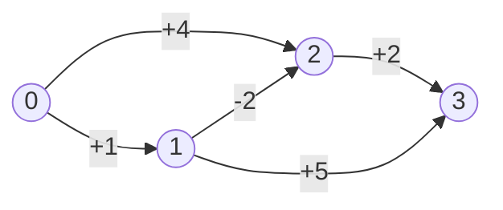
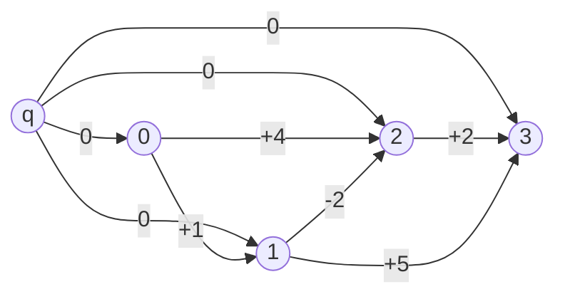
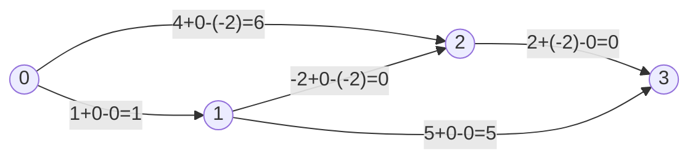

# Johnson's All-Pairs Shortest Paths (APSP)

## What Johnson's Algorithm Solves

Johnson's algorithm computes **shortest paths between all pairs** of vertices in
**sparse directed graphs** that may contain **negative edges** but **no negative
cycles**.

It combines:

- **Bellman-Ford** (one run from a super-source to compute potentials)
- **Dijkstra** (one run per vertex on the reweighted graph)

If your graph is dense, Floyd-Warshall is usually simpler. If it is sparse and
has negative edges, Johnson is the standard tool.

## Key Idea in One Sentence

Reweight every edge so all weights become non-negative **without changing which
paths are shortest**, then use the faster Dijkstra from every source.

---

## The Potential Trick (Why Reweighting Works)

Assign a potential value `h(v)` to every vertex and redefine each edge weight:

```
w'(u, v) = w(u, v) + h(u) - h(v)
```

For any path `P = v0 -> v1 -> ... -> vk`, the reweighted path cost is:

```
w'(P) = w(P) + h(v0) - h(vk)
```

The correction `h(v0) - h(vk)` is a **constant** for all paths from `v0` to
`vk`; it does not depend on which intermediate vertices the path visits. So
the shortest path order is **preserved**.

### Telescoping cancellation visualized

```
Path P: v0 --> v1 --> v2 --> v3

  edge v0->v1:  w01 + h(v0) - h(v1)
  edge v1->v2:  w12 + h(v1) - h(v2)   <- h(v1) cancels with previous h(v1)
  edge v2->v3:  w23 + h(v2) - h(v3)   <- h(v2) cancels with previous h(v2)
               -------------------------
  total:        w(P) + h(v0) - h(v3)

All internal h terms cancel (telescoping sum).
Only the endpoint potentials survive.
```

### How we pick h(v)

Add a **super-source** `q` with 0-weight edges to every vertex and run
Bellman-Ford from `q`:

```
h(v) = shortest_distance(q, v)
```

By the Bellman-Ford triangle inequality satisfied at convergence:

```
h(v) <= h(u) + w(u, v)
=>  w(u, v) + h(u) - h(v) >= 0
```

Every reweighted edge is guaranteed to be non-negative, so Dijkstra is valid
on the reweighted graph.

---

## Mermaid: Original Graph with a Negative Edge

The following graph has a negative edge `1 -> 2` that would break Dijkstra
on the original weights.



---

## Mermaid: Super-Source Added for Bellman-Ford

Johnson adds a virtual super-source `q` (index `n`) with zero-weight edges to
every existing vertex. Bellman-Ford is run once from `q`.



Bellman-Ford from `q` yields potentials (one valid assignment):

```
h[0] = 0   h[1] = 0   h[2] = -2   h[3] = 0
```

---

## Mermaid: Reweighted Graph::new(All Non-Negative)

After applying `w'(u,v) = w(u,v) + h[u] - h[v]`, every edge weight is >= 0.
Dijkstra can now run correctly from any source.



All reweighted edges are >= 0. Dijkstra is now valid from every source.

---

## Pipeline: Bellman-Ford then Dijkstra x V

```
INPUT: n vertices, directed edges with (possibly negative) weights
         |
         v
+--------+---------+
|  1. Add super-   |
|  source q with   |
|  0-weight edges  |
|  to all vertices |
+--------+---------+
         |
         v
+--------+---------+
|  2. Bellman-Ford |   one run, O(V*E)
|  from q          |
|  -> potentials   |
|     h[0..n-1]    |
|  If negative     |
|  cycle: return   |
|  None            |
+--------+---------+
         |
         v
+--------+---------+
|  3. Reweight     |   O(E)
|  each edge:      |
|  w'(u,v) =       |
|  w(u,v)+h[u]-h[v]|
|  All >= 0 now    |
+--------+---------+
         |
         v
+--------+---------+
|  4. Dijkstra     |   V runs, each O((E+V) log V)
|  from every      |
|  source s in     |
|  reweighted graph|
+--------+---------+
         |
         v
+--------+---------+
|  5. Recover      |   O(V^2)
|  original dists: |
|  dist[s][t] =    |
|  d'[t]-h[s]+h[t] |
+--------+---------+
         |
         v
OUTPUT: n x n distance matrix (None on negative cycle)
```

---

## Step-by-Step Worked Example

Graph:

```
0 -> 1 (1)
0 -> 2 (4)
1 -> 2 (-2)
2 -> 3 (2)
1 -> 3 (5)
```

### Step 1: Bellman-Ford from super-source q

```
q -> every vertex with weight 0

h starts as [0, 0, 0, 0]
After relaxations:
  relax 1->2 (-2):  h[2] = h[1] + (-2) = -2
  all other h values stay 0

h = [0, 0, -2, 0]
```

### Step 2: Reweight edges

```
0->1: 1  + 0    -  0   = 1
0->2: 4  + 0    - (-2) = 6
1->2: -2 + 0    - (-2) = 0
2->3: 2  + (-2) -  0   = 0
1->3: 5  + 0    -  0   = 5
```

### Step 3: Dijkstra from source 0

Reweighted graph has only non-negative edges.

```
Initial:  dist' = [0, INF, INF, INF]

Process 0 (dist'=0):
  0->1 (w'=1):  dist'[1] = 1
  0->2 (w'=6):  dist'[2] = 6

Process 1 (dist'=1):
  1->2 (w'=0):  dist'[2] = min(6, 1+0) = 1   <-- improved
  1->3 (w'=5):  dist'[3] = 1+5 = 6

Process 2 (dist'=1):
  2->3 (w'=0):  dist'[3] = min(6, 1+0) = 1   <-- improved

Process 3 (dist'=1):
  (no outgoing edges)

d' = [0, 1, 1, 1]
```

### Step 4: Recover original distances from source 0

```
dist[0][v] = d'[v] - h[0] + h[v]

dist[0][0] = 0 - 0 + 0   = 0
dist[0][1] = 1 - 0 + 0   = 1
dist[0][2] = 1 - 0 + (-2) = -1
dist[0][3] = 1 - 0 + 0   = 1
```

Result row for source 0: `[0, 1, -1, 1]`

The negative entry `dist[0][2] = -1` is the true shortest path cost
`0 -> 1 -> 2` with weights `1 + (-2) = -1` in the original graph.

---

## Example Usage

```mbt check
///|
test "johnson basic" {
  let edges : Array[(Int, Int, Int64)] = [
    (0, 1, 1L),
    (0, 2, 4L),
    (1, 2, -2L),
    (2, 3, 2L),
    (1, 3, 5L),
  ]
  let dist = @johnson_all_pairs.johnson_all_pairs(4, edges).unwrap()
  inspect(dist[0], content="[0, 1, -1, 1]")
}
```

```mbt check
///|
test "johnson unreachable" {
  let edges : Array[(Int, Int, Int64)] = [(0, 1, 2L), (1, 2, 3L)]
  let dist = @johnson_all_pairs.johnson_all_pairs(4, edges).unwrap()
  // Node 3 is unreachable from 0
  inspect(dist[0][3], content="4611686018427387903")
}
```

```mbt check
///|
test "johnson negative cycle" {
  let edges : Array[(Int, Int, Int64)] = [(0, 1, 1L), (1, 2, -2L), (2, 1, -2L)]
  inspect(@johnson_all_pairs.johnson_all_pairs(3, edges), content="None")
}
```

---

## Common Pitfalls

- **Negative cycles**: Johnson must return `None` if any are detected;
  shortest paths are undefined in graphs with negative cycles.
- **Overflow**: distances are stored as `Int64`; the code guards `dist + w`
  against overflow when `dist` is already near the sentinel `INF64`.
- **Unreachable nodes**: `INF64` (`4611686018427387903`) is kept in the output
  matrix to represent "no path exists."
- **Edge direction**: the algorithm is for directed graphs. For undirected
  graphs, add edges in both directions.
- **Distance recovery**: always apply `d'[t] - h[s] + h[t]`; omitting this
  step yields reweighted distances, not original distances.

---

## Complexity

| Phase | Time | Notes |
|-------|------|-------|
| Add super-source + Bellman-Ford | O(V * E) | One run from virtual source |
| Reweight all edges | O(E) | Single linear pass |
| Dijkstra from each vertex | O(V * (E + V log V)) | Binary-heap Dijkstra |
| Distance recovery | O(V^2) | One subtraction per entry |
| **Total** | **O(V * E + V^2 log V)** | Optimal on sparse graphs |

For sparse graphs (E = O(V)) the total is O(V^2 log V), beating
Floyd-Warshall's O(V^3).

---

## Johnson vs Floyd-Warshall

| Aspect | Johnson | Floyd-Warshall |
|--------|---------|----------------|
| Time | O(V*E + V^2 log V) | O(V^3) |
| Space | O(V + E) + output | O(V^2) |
| Handles negative edges | Yes | Yes |
| Best for | Sparse graphs | Dense graphs |
| Implementation complexity | Higher | Lower |

---

## Implementation Notes (This Package)

- Uses `@bellman_ford.BellmanFord` to compute potentials from the super-source.
- Uses a package-local binary min-heap (`MinHeap`) for Dijkstra; no external
  heap dependency.
- Distances are stored as `Int64`, with the sentinel `INF64 =
  4611686018427387903` for unreachable nodes (chosen so that `INF64 + INF64`
  does not overflow `Int64`).
- The public API returns `None` when a negative cycle exists.
- Out-of-range vertex indices in the edge list are silently ignored.

If you need path reconstruction, add a predecessor array inside `dijkstra` and
carry it through the recovery step alongside the distance array.
