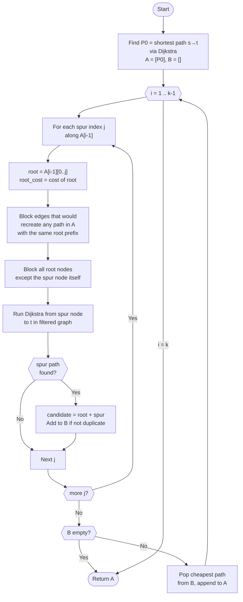
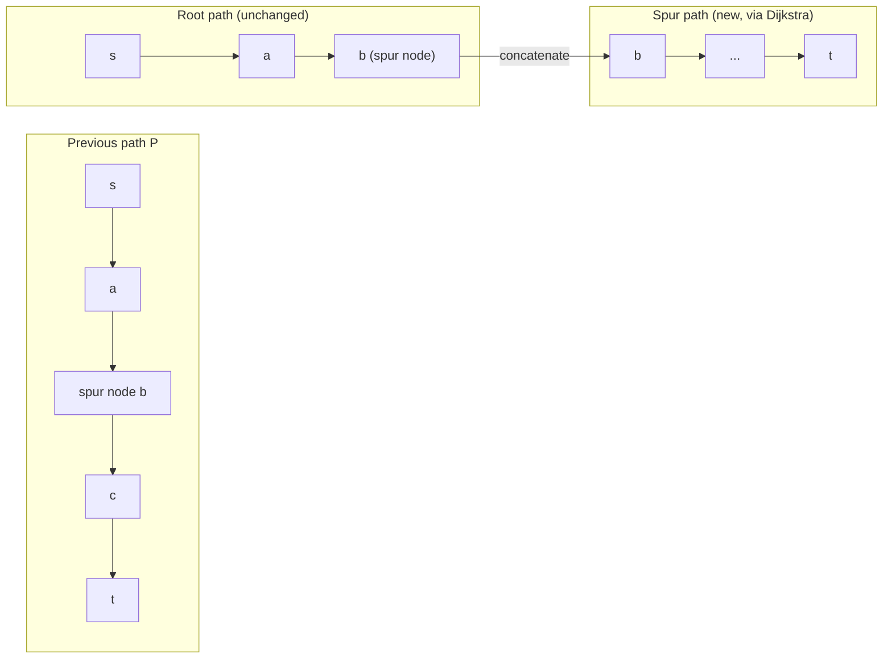
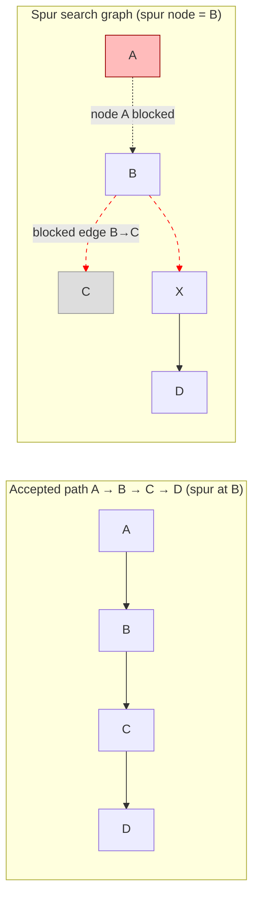
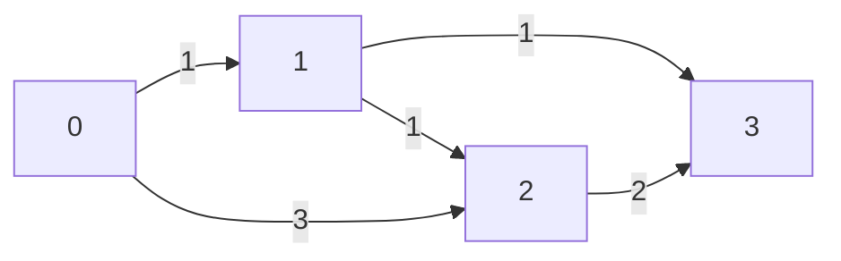
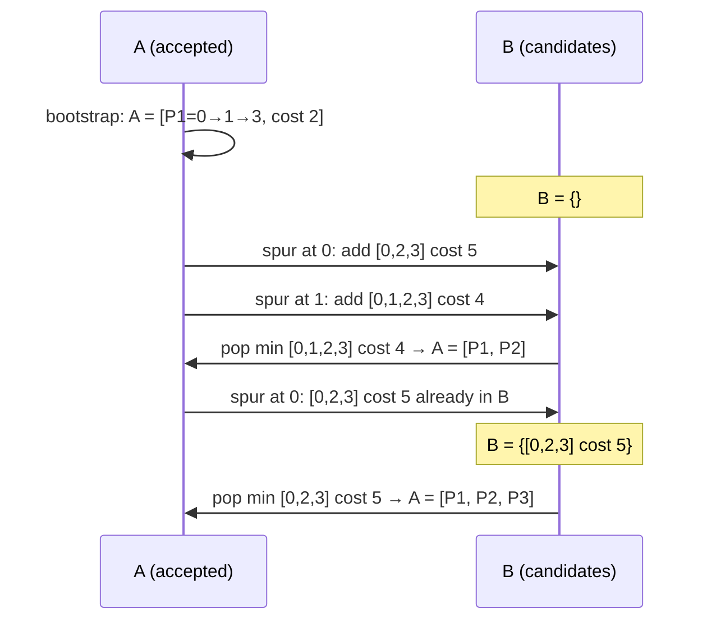

# Yen's K Shortest Paths (Loopless Paths)

## What Yen's Algorithm Solves

Yen's algorithm finds the **k shortest simple paths** from a source `s` to a
target `t` in a **directed weighted graph**. "Simple" means no repeated
vertices (loopless paths).

It is especially useful when you want **multiple alternative routes**, not just
one shortest path.

- **Works with**: non-negative edge weights
- **Guarantees**: paths are simple (no cycles)
- **Returns**: up to `k` paths, in increasing cost order

## Big Picture

The shortest path is easy: just run Dijkstra. The challenge is to find the next
shortest paths without enumerating all paths.

Yen's idea:

1) Take the previous shortest path
2) Break it at every node as a **spur point**
3) Force a different edge at that spur point
4) Collect all candidate deviations and pick the cheapest

Repeat until you have `k` paths or no candidates remain.

## Key Terms

```
A = shortest paths found so far (ordered)
B = candidate paths not chosen yet (min-heap)

root path: prefix from s to spur node
spur path: shortest path from spur node to t in a modified graph
spur node: the node where we deviate
```

## Overall Algorithm Flow



## Root + Spur Decomposition

Every candidate path is built by splitting a previously accepted path at a
"spur node" into a **root** (prefix kept unchanged) and a **spur**
(a fresh shortest sub-path from the spur node to `t`).



The spur node appears exactly once: it is the last node of the root and the
first node of the spur.  `combine_paths` handles this by omitting the last
element of the root before appending the spur.

## Why We Block Edges and Nodes

When we deviate at a spur node, we need two rules:

1. **Block edges** that would recreate a previously found path with the same
   root prefix.
2. **Block root nodes** (except the spur node) so the new path stays simple.



- The dashed red arrows show what is removed from the spur-search graph.
- Node A is blocked so the spur cannot loop back through the root prefix.
- Edge B→C is blocked so the candidate cannot simply recreate the original path.

## Worked Example (Step by Step)

Graph:

```
0 --1--> 1 --1--> 3
|        |
3        1
|        |
V        V
2 --2--> 3
```

Edges: (0,1,1), (1,3,1), (0,2,3), (2,3,2), (1,2,1)



### Step 1: First shortest path

```
P1 = 0 -> 1 -> 3  (cost 2)
A = [P1]
B = []
```

### Step 2: Generate candidates from P1

Spur at node 0:

```
root = [0]
block edge 0->1 (since P1 shares root)
spur path: 0 -> 2 -> 3 (cost 5)
candidate: [0,2,3] (cost 5)
```

Spur at node 1:

```
root = [0,1]
block edge 1->3
block node 0
spur path: 1 -> 2 -> 3 (cost 3)
candidate: [0,1,2,3] (cost 4)
```

Now:

```
B = {[0,1,2,3] cost 4, [0,2,3] cost 5}
Pick min => P2 = [0,1,2,3] (cost 4)
A = [P1, P2]
```

### Step 3: Generate candidates from P2

Spur at node 0:

```
root = [0]
block edge 0->1 (P1) and 0->1 (P2) still
spur path: 0 -> 2 -> 3 (cost 5)  (already in B)
```

Spur at node 1:

```
root = [0,1]
block 1->2 and 1->3
no spur path
```

Spur at node 2:

```
root = [0,1,2]
block 2->3
no spur path
```

Remaining B gives:

```
P3 = [0,2,3] (cost 5)
```

Result:

```
1) 0 -> 1 -> 3  (2)
2) 0 -> 1 -> 2 -> 3  (4)
3) 0 -> 2 -> 3  (5)
```

## Candidate Heap State Over Time



## Example Usage

```mbt check
///|
test "yen k shortest paths" {
  let edges : Array[(Int, Int, Int64)] = [
    (0, 1, 1L),
    (1, 3, 1L),
    (0, 2, 3L),
    (2, 3, 2L),
    (1, 2, 1L),
  ]
  let paths = @k_shortest_paths_yen.yen_k_shortest_paths(4, edges, 0, 3, 3)
  inspect(paths[0].cost, content="2")
  inspect(paths[1].cost, content="4")
  inspect(paths[2].cost, content="5")
}
```

```mbt check
///|
test "yen fewer than k" {
  let edges : Array[(Int, Int, Int64)] = [(0, 1, 1L), (1, 2, 1L)]
  let paths = @k_shortest_paths_yen.yen_k_shortest_paths(3, edges, 0, 2, 5)
  // Only one simple path exists: 0->1->2
  inspect(paths.length(), content="1")
  inspect(paths[0].nodes, content="[0, 1, 2]")
}
```

## Pseudocode (Readable)

```
A = [shortest path s->t]
B = empty min-heap

for i in 1..k-1:
  prev = A[i-1]
  for each spur index j in prev:
    root = prev[0..j]

    block all edges that would recreate a path in A with same root
    block all root nodes except spur node

    spur = shortest path from spur node to t in modified graph
    if spur exists:
      candidate = root + spur
      add to B if unique

  if B empty: stop
  A.append(B.pop_min())

return A
```

## Complexity

Let `n` be vertices, `m` edges:

```
- Each spur search uses Dijkstra: O(m + n log n)
- There are O(k * n) spur searches in the worst case

Total: O(k * n * (m + n log n))
```

## Common Pitfalls

- **Negative weights** are not allowed (Dijkstra would fail).
- **Duplicate paths**: you must de-duplicate candidates in B.
- **Unreachable target**: stop when no candidate remains.
- **Graph modification**: always restore blocked edges/nodes after each spur.
- **Simple path requirement**: block root nodes to avoid loops.

## When to Use Yen

- You need **multiple alternatives**, not just one shortest path
- Graph is **sparse** and **weights are non-negative**
- You need **simple paths** (no repeated vertices)

## Yen vs Other Algorithms

| Algorithm | Path Type | Typical Use |
|-----------|-----------|-------------|
| Yen | simple paths | alternative routing |
| Eppstein | may include cycles | very large k |
| Suurballe | disjoint paths | k=2 edge-disjoint |

## Implementation Notes (This Package)

- Uses `@dijkstra` for each spur path search
- Blocks edges by root-prefix matches in the already found paths
- Blocks root prefix nodes to enforce loopless results
- Returns fewer than `k` paths when the candidate set becomes empty
