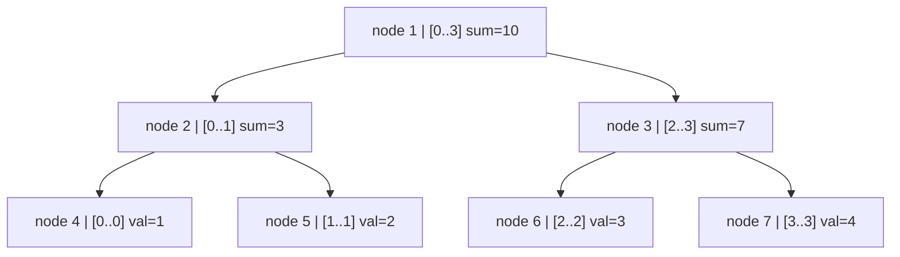
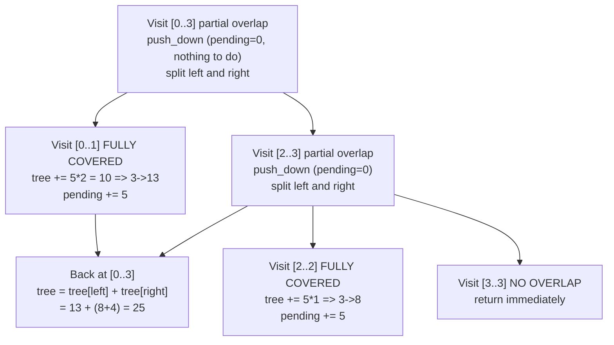

# Lazy Segment Tree (Range Update + Range Query)

A **lazy segment tree** extends a standard segment tree with *lazy propagation*
so that range updates run in **O(log n)** instead of O(n).  This package
provides three variants, all built on the same principle:

- `LazySegTreeSum` (public) -- range add + range sum
- `LazySegTreeSetSum` (private) -- range assign + range sum
- `LazySegTreeMin` (private) -- range add + range min

---

## 1. What problems does it solve?

| Problem | Naive cost | Lazy segtree cost |
|---|---|---|
| Add `x` to `a[l..r]` | O(n) | O(log n) |
| Query sum of `a[l..r]` | O(n) | O(log n) |
| Query min of `a[l..r]` | O(n) | O(log n) |
| Set `a[l..r]` to `x` | O(n) | O(log n) |

Use it whenever a plain segment tree or Fenwick tree falls short because you
need **range updates and range queries simultaneously**.

---

## 2. Tree structure

Each node stores the aggregate (sum, min, ...) of a contiguous sub-range of the
array.  The tree is stored in a flat array indexed 1-based, where node `k` has
children `2k` (left) and `2k+1` (right).

Array `[1, 2, 3, 4]`:



Internal storage (1-indexed, 4n slots):

```
 node:   1       2       3       4       5       6       7
 range: [0..3] [0..1] [2..3]  [0..0] [1..1] [2..2] [3..3]
 sum:    10      3       7       1       2       3       4
```

---

## 3. The lazy tag

Every node also has a `pending` slot that accumulates deferred updates.  The
invariant is:

> The true aggregate of node `k`'s range equals `tree[k]` plus the effect of
> all `pending` values that have not yet been pushed to children.

For a range-add tree the effect of `pending[k]` on node `k` covering `[L..R]`
is:

```
true_sum(k) = tree[k]     -- tree[k] already reflects pending[k]
```

That is, `tree[k]` is always up to date for the node itself; `pending[k]` is
what still needs to flow *down* to the children.

---

## 4. Push-down operation (the heart of lazy propagation)

Before descending from node `k` into its children, all accumulated work stored
in `pending[k]` must be applied to the two children.  This is the push-down
(also called "propagate" or "relax") step.

```
Before push_down at node k covering [L..R], mid = (L+R)/2:

    node k  [L..R]  tree=T  pending=P
    /                              \
  left [L..mid]                 right [mid+1..R]
  tree=TL  pending=PL           tree=TR  pending=PR

After push_down:

    node k  [L..R]  tree=T  pending=0
    /                              \
  left [L..mid]                 right [mid+1..R]
  tree = TL + P*(mid-L+1)       tree = TR + P*(R-mid)
  pending = PL + P              pending = PR + P
```

ASCII art of a push-down for range-add with `P = 5`, `[L..R] = [0..3]`:

```
BEFORE                           AFTER

  [0..3] T=10  pending=5           [0..3] T=10  pending=0
  /            \                   /            \
[0..1] T=3  [2..3] T=7          [0..1] T=13  [2..3] T=17
pending=0    pending=0          pending=5     pending=5

left  size = 2  =>  TL' = 3  + 5*2 = 13,   PL' = 0+5 = 5
right size = 2  =>  TR' = 7  + 5*2 = 17,   PR' = 0+5 = 5
```

The code (`push_down` in `lazy_segtree.mbt`):

```
if pending[node] != 0:
    left_len  = mid - start + 1
    right_len = end - mid
    tree[2*node]   += pending[node] * left_len
    tree[2*node+1] += pending[node] * right_len
    pending[2*node]   += pending[node]
    pending[2*node+1] += pending[node]
    pending[node] = 0
```

---

## 5. Range update walkthrough

Operation: `range_add(0, 2, +5)` on `[1, 2, 3, 4]` (sum tree).



Tree state after the update:

```
          [0..3] sum=25  pending=0
         /                        \
   [0..1] sum=13              [2..3] sum=12
   pending=5                  pending=0
   /       \                  /        \
[0] 1    [1] 2            [2] 8      [3] 4
(not yet  (not yet        pending=5  pending=0
 updated)  updated)
```

The children of `[0..1]` look stale, but `pending=5` on their parent means
"each child still needs +5".  A future query that descends through `[0..1]`
will trigger push-down and correct them on demand.

---

## 6. Range query walkthrough

Operation: `range_sum(1, 3)` on the tree above (after `range_add(0,2,+5)`).

```
Visit [0..3] sum=25  partial overlap with [1..3]
  push_down at [0..3]  (pending=0, nothing to do)
  Visit [0..1] sum=13  partial overlap with [1..3]
    push_down at [0..1]  (pending=5 -> pushed to children)
      [0] sum becomes 1+5*1=6,  pending[0] set to 5 (leaf: ignored)
      [1] sum becomes 2+5*1=7,  pending[1] set to 5 (leaf: ignored)
      pending[0..1] cleared to 0
    Visit [0..0]  no overlap with [1..3] -> return 0
    Visit [1..1]  fully covered -> return 7
  Visit [2..3] sum=12  partial overlap with [1..3]
    push_down at [2..3]  (pending=0, nothing to do)
    Visit [2..2]  fully covered -> return 8
    Visit [3..3]  fully covered -> return 4
  Total = 0 + 7 + 8 + 4 = 19
```

---

## 7. Indexing convention (important)

All public methods use **closed (inclusive) ranges `[l, r]`**:

```
range_add(l, r, val)   -- adds val to every element in [l, r]
range_sum(l, r)        -- returns sum of elements in [l, r]
point_query(i)         -- returns element at index i (= range_sum(i, i))
point_set(i, val)      -- sets element at index i to val
```

`l = 0` is the first element; `r = n-1` is the last.  Passing out-of-bounds
indices (l < 0, r >= n, l > r) is safe and returns `None` or is silently
ignored.

---

## 8. Lazy tag composition rules

Different update types require different composition strategies when two lazy
tags accumulate at the same node.

### Range add (this package)

```
New tag on top of existing:  pending' = pending + new_add
Effect on sum:               sum' = sum + new_add * size
Compose two adds:            (a, then b) -> a + b
```

### Range assign (conceptual -- LazySegTreeSetSum)

```
New tag overrides old:       pending' = new_value,  has_pending = true
Effect on sum:               sum' = new_value * size
Compose: any assign on top of any prior tag wins entirely.
```

### Range multiply + add (conceptual)

```
Transform:  x -> x*m + b
Compose:    (m1,b1) then (m2,b2)  ->  (m1*m2,  b1*m2 + b2)
```

---

## 9. Example usage

```mbt check
///|
test "lazy segtree example" {
  let arr : Array[Int64] = [1L, 2L, 3L, 4L]
  let st = @lazy_segtree.LazySegTreeSum(arr)

  // add 2 to indices 1..3
  st.range_add(1, 3, 2L)
  debug_inspect(st.range_sum(0, 3), content="Some(16)")
  debug_inspect(st.point_query(2), content="Some(5)")
}
```

```mbt check
///|
test "lazy segtree multiple updates" {
  let st = @lazy_segtree.LazySegTreeSum([5L, 1L, 4L, 2L, 3L])

  // add +3 to [0..2]
  st.range_add(0, 2, 3L)
  // add +1 to [2..4]
  st.range_add(2, 4, 1L)

  // array becomes [8, 4, 8, 3, 4]
  debug_inspect(st.range_sum(0, 4), content="Some(27)")
  debug_inspect(st.point_query(3), content="Some(3)")
}
```

---

## 10. Variants included in this package

### LazySegTreeSum (public)

Range add + range sum.  `pending[k]` is the accumulated addend not yet pushed
to children.  Composing two adds: `pending' = pending + new_add`.

```
tree[k]    = sum of range [L..R]  (already reflects pending[k] itself)
pending[k] = value still owed to each child
```

### LazySegTreeSetSum (private)

Range assign + range sum.  `pending[k]` is the value to assign; `has_pending[k]`
distinguishes "no pending assignment" from "assign zero".  A new assignment
always overwrites the old one.

```
tree[k]       = val * size  when has_pending[k] is true
pending[k]    = the assignment value
has_pending[k]= whether an unresolved assignment exists
```

### LazySegTreeMin (private)

Range add + range min.  Identical lazy-tag logic to `LazySegTreeSum`, but the
aggregation function is `min` instead of `+`.  Because min is idempotent, the
push-down does not need to multiply by size.

```
tree[k]    = minimum of range [L..R]
pending[k] = addend owed to every element in range
```

---

## 11. Complexity

| Operation | Time | Space |
|---|---|---|
| Build | O(n) | O(n) |
| `range_add` | O(log n) | O(1) extra |
| `range_sum` | O(log n) | O(1) extra |
| `point_query` | O(log n) | O(1) extra |
| `point_set` | O(log n) | O(1) extra |

The flat node array has size `4n` to accommodate all possible subtree nodes of
a 1-indexed binary tree over `n` leaves.

---

## 12. Common pitfalls

- **Inclusive ranges**: `[l, r]` is closed on both ends, not half-open.
- **Forgetting push-down**: never access children without first calling
  `push_down` on the parent, or children will read stale values.
- **Recomputing the parent**: after recursing into both children, always
  recompute `tree[node] = tree[2*node] + tree[2*node+1]` on the way up.
- **Overflow**: sums are `Int64`; for very large arrays or large addends,
  confirm the product `val * size` does not overflow.
- **Empty tree**: `range_sum`, `point_query` return `None`; `range_add`,
  `point_set` are silently no-ops.
- **push-down on leaves**: the code guards against this with the partial-overlap
  check -- leaves are only visited in the fully-covered or no-overlap case, so
  `push_down` is never called on them.

---

## 13. When to use a lazy segment tree

```
Need range queries only?               -> plain segment tree or Fenwick tree
Need range queries + point updates?    -> plain segment tree
Need range queries + range updates?    -> lazy segment tree   <-- here
Need range queries + range updates
  with complex tag composition?        -> lazy segment tree (extend push_down)
```

---

## 14. Visual summary of a full update + query cycle

```
Initial array: [1, 2, 3, 4]

         [0..3] sum=10  P=0
         /                  \
   [0..1] sum=3  P=0     [2..3] sum=7  P=0
   /       \              /        \
 [0] 1    [1] 2        [2] 3     [3] 4


range_add(0, 2, +5):
         [0..3] sum=25  P=0        <- recomputed
         /                  \
   [0..1] sum=13  P=5    [2..3] sum=12  P=0  <- [2..3] recomputed
   /       \              /        \
 [0] 1    [1] 2        [2] 8     [3] 4
 (stale)  (stale)      P=5       P=0


range_sum(1, 3) -> push_down at [0..1] first:
         [0..3] sum=25  P=0
         /                  \
   [0..1] sum=13  P=0    [2..3] sum=12  P=0
   /       \              /        \
 [0] 6    [1] 7        [2] 8     [3] 4
 P=0       P=0         P=0       P=0

Result = tree[1..1] + tree[2..2] + tree[3..3]
       = 7 + 8 + 4 = 19
```
