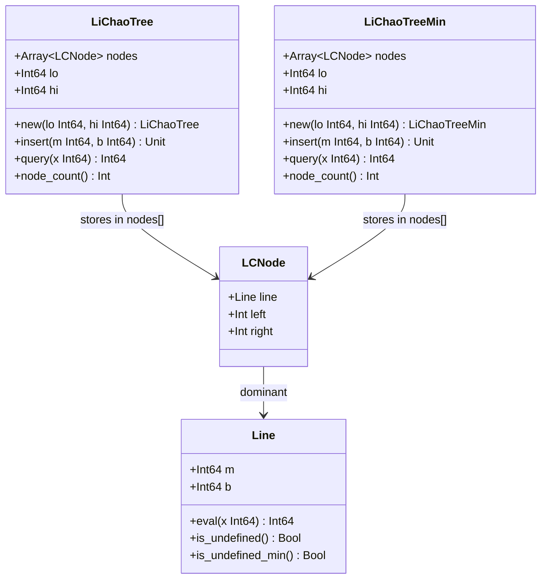
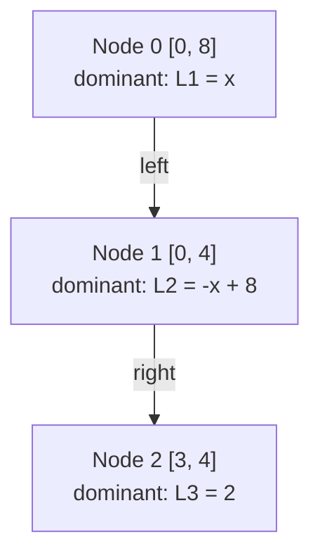

# Li Chao Tree (Line Container)

## What It Solves

A **Li Chao Tree** maintains a set of linear functions

```
y = m * x + b
```

and answers queries of the form:

```
What is the maximum (or minimum) y at x = k?
```

It supports **arbitrary insert order** and **arbitrary query order** in
**O(log C)** time per operation, where `C` is the x-coordinate range.

## Why Not Just Check All Lines?

With `n` lines and `q` queries the naive approach is O(n) per query, O(nq)
total. The Li Chao Tree reduces each query to O(log C) regardless of how many
lines have been inserted.

Example with three lines on `[0, 10]`:

```
Lines: y = 2x + 1,   y = -x + 5,   y = 0.5x + 2

Query x = 1 : values = 3,   4,   2.5  => max = 4
Query x = 4 : values = 9,   1,   4    => max = 9
Query x = 2 : values = 5,   3,   3    => max = 5
```

## Core Insight: Winner vs Loser at the Midpoint

For a segment-tree node that covers `[lo, hi]` with midpoint `mid`, compare a
new line against the node's current **dominant** line at `mid`:

- The line that is better at `mid` becomes the new dominant (the **winner**).
- The other line (the **loser**) might still beat the winner somewhere in
  `[lo, hi]`, but only on **one** of the two halves.

Why only one half?

```
Two lines can cross at most once (they are linear).

If the winner beats the loser at mid AND at lo, the loser can only possibly
beat the winner to the right of mid (i.e., in [mid+1, hi]).

If the loser beats the winner at lo, the loser can only possibly beat the
winner in [lo, mid].

It is impossible for the loser to beat the winner in both halves at once,
because the winner already dominates at the boundary between them.
```

This single-side recursion keeps insert at O(log C) instead of O(C).

## Visual: Two Lines Crossing Inside an Interval

```
  y
  |
8 |  B                           B = y = -x + 8  (negative slope)
7 |   \                          A = y =  x      (positive slope)
6 |    \
5 |     \     (cross at x=4)
4 |      X                       X marks the crossing point
3 |     / \
2 |    /   \
1 |   /     \
0 |--A-------B------- x
  0  1  2  3  4  5  6  7  8

  Interval [0, 8], mid = 4, A(4) = 4, B(4) = 4  =>  tie, keep current
  B(0) = 8 > A(0) = 0   =>  B is pushed to the LEFT child  [0, 4]
  In the right half  [5, 8]  A always wins.
```

## ASCII Art: Inserting Lines into the Tree

Below is a worked trace of inserting three lines into a tree over `[0, 8]`.

```
Lines inserted in order:
  L1: y =  x      (slope  1, intercept 0)
  L2: y = -x + 8  (slope -1, intercept 8)
  L3: y =  2      (slope  0, intercept 2, horizontal)

After inserting L1 (node 0 was empty, L1 becomes dominant):

  Node 0  [0, 8]  dominant = L1
  (no children yet)


After inserting L2, mid = 4:

  L1(4) = 4,  L2(4) = 4  => tie, keep L1 as dominant, L2 is the loser
  L2(0) = 8 > L1(0) = 0  => loser L2 wins at lo, push to LEFT [0, 4]

  Node 0  [0, 8]  dominant = L1
  |
  +-- left: Node 1  [0, 4]  dominant = L2


After inserting L3 (y = 2), mid = 4:

  Node 0 [0, 8]: L1(4)=4 vs L3(4)=2  => L1 wins, L3 is loser
  L3(0) = 2 > L1(0) = 0  => loser L3 wins at lo, push to LEFT [0, 4]

  Node 1 [0, 4]: L2(2)=6 vs L3(2)=2  => L2 wins, L3 is loser
  L3(0) = 2 < L2(0) = 8  => loser L3 wins at right endpoint, push RIGHT [3, 4]

  Node 0  [0, 8]  dominant = L1
  |
  +-- left: Node 1  [0, 4]  dominant = L2
            |
            +-- right: Node 2  [3, 4]  dominant = L3
```

## Dominant Line Segments (Upper Envelope)

The Li Chao Tree implicitly represents the upper envelope: at every x the
answer is whichever line happens to be dominant along the root-to-leaf path.

```
y
|
8 |  BBBB
7 |      BB
6 |        BB     AAAAAAAAAA
5 |          BB  A
4 |            XA
3 |          L3 AA
2 |  LL33333        AAAAAAAAA
1 |
0 +----+----+----+----+----+-- x
  0    2    4    6    8   10

Upper envelope (max at each x):
  x in [0, 4) : L2 = -x + 8  dominates
  x in [4, 8] : L1 =  x      dominates
  (L3 = 2 is never the maximum anywhere in [0, 8])
```

## Insert Algorithm (Pseudocode)

```
insert(line, node covering [lo, hi]):
  mid = (lo + hi) / 2

  if node has no dominant line:
    node.dominant = line
    return

  if line(mid) > node.dominant(mid):
    swap(line, node.dominant)     // line becomes loser, old dominant is loser

  if lo == hi: return             // leaf, loser cannot go further

  if loser(lo) > dominant(lo):   // loser beats dominant at left endpoint
    insert(loser, left child [lo, mid])
  else:                           // loser beats dominant somewhere in right half
    insert(loser, right child [mid+1, hi])
```

For minimum queries replace `>` with `<` throughout.

## Query Algorithm (Pseudocode)

```
query(x, node covering [lo, hi]):
  result = node.dominant(x)     // evaluate the stored dominant line

  if lo == hi: return result    // leaf

  mid = (lo + hi) / 2
  if x <= mid:
    return max(result, query(x, left child))
  else:
    return max(result, query(x, right child))
```

The true answer for x lives somewhere on the single root-to-leaf path that
contains x. The query visits exactly those nodes and takes the maximum.

## Detailed Query Walkthrough

Tree state after inserting L1 (`y = x`), L2 (`y = -x + 8`), L3 (`y = 2`)
over `[0, 8]` (same tree built in the insert trace above).

```
Node 0  [0, 8]   dominant = L1 (y =  x)
  left:
  Node 1  [0, 4]  dominant = L2 (y = -x + 8)
    right:
    Node 2  [3, 4]  dominant = L3 (y = 2)
```

**Query x = 1** (expected answer: L2(1) = 7):

```
Step 1  Node 0 [0,8]  L1(1) = 1   best-so-far = 1
        x=1 <= mid=4 -> go left

Step 2  Node 1 [0,4]  L2(1) = 7   best-so-far = max(1, 7) = 7
        x=1 <= mid=2 -> go left

Step 3  Node 1's left child does not exist -> contribute 0 (no line)

Answer = 7   (correct: max(L1(1), L2(1), L3(1)) = max(1, 7, 2) = 7)
```

**Query x = 6** (expected answer: L1(6) = 6):

```
Step 1  Node 0 [0,8]  L1(6) = 6   best-so-far = 6
        x=6 > mid=4 -> go right

Step 2  Node 0's right child does not exist -> contribute 0

Answer = 6   (correct: max(L1(6), L2(6), L3(6)) = max(6, 2, 2) = 6)
```

**Query x = 3** (expected answer: L2(3) = 5):

```
Step 1  Node 0 [0,8]  L1(3) = 3   best-so-far = 3
        x=3 <= mid=4 -> go left

Step 2  Node 1 [0,4]  L2(3) = 5   best-so-far = max(3, 5) = 5
        x=3 > mid=2 -> go right

Step 3  Node 2 [3,4]  L3(3) = 2   best-so-far = max(5, 2) = 5

Answer = 5   (correct: max(L1(3), L2(3), L3(3)) = max(3, 5, 2) = 5)
```

## Node Structure (Mermaid)



## Tree Shape After Insertions (Mermaid)

The following diagram shows the tree produced by the three-line example above
(L1 = `y = x`, L2 = `y = -x + 8`, L3 = `y = 2`, range `[0, 8]`).



Nodes are created lazily: a child is only allocated when a loser line is
pushed to that half. Queries that never visit a missing child treat its
contribution as negative infinity (or positive infinity for min queries).

## API Examples

### Maximum queries

```mbt check
///|
test "lichao max" {
  let lc = @lichao.LiChaoTree::new(0, 10)
  lc.insert(2, 1) // y = 2x + 1
  lc.insert(-1, 5) // y = -x + 5
  inspect(lc.query(3), content="7") // max(7, 2)
}
```

### Minimum queries

```mbt check
///|
test "lichao min" {
  let lc = @lichao.LiChaoTreeMin::new(0, 10)
  lc.insert(2, 1) // y = 2x + 1
  lc.insert(-1, 5) // y = -x + 5
  inspect(lc.query(3), content="2") // min(7, 2)
}
```

## Common Applications

### 1) Convex Hull Trick (Dynamic)

```
DP form: dp[i] = min_j ( a[j] * x[i] + b[j] )

For each j insert line (slope=a[j], intercept=b[j]).
To compute dp[i] query at x = x[i].

Li Chao handles arbitrary j and i order without sorting.
```

### 2) Shortest Path with Linear Edge Costs

```
Edge cost from u to v depends linearly on a state variable x_u.
Insert one line per source node, query at each destination's x value.
```

### 3) Lower / Upper Envelope of Lines

```
Maintain the minimum (or maximum) over all inserted lines at any x.
Each insert is O(log C), each query is O(log C).
```

## Handling Line Segments (Conceptual)

A line segment is a line restricted to `[L, R]`. To support segments, descend
the tree and only insert into nodes whose intervals overlap `[L, R]`:

```
insert_segment(line, [L, R], node [lo, hi]):
  if R < lo or hi < L: return   // no overlap
  if L <= lo and hi <= R:
    insert(line, node)          // fully covered, treat as a full line here
    return
  recurse both children
```

Each segment insertion touches O(log^2 C) nodes in the worst case.

## Complexity

| Operation       | Time          | Space                      |
|-----------------|---------------|----------------------------|
| Insert line     | O(log C)      | O(log C) new nodes created |
| Query at x      | O(log C)      | O(1) extra                 |
| Insert segment  | O(log^2 C)    | O(log^2 C) new nodes       |

C = hi - lo (the x-coordinate range).

## Common Pitfalls

- **Coordinate range**: `lo` and `hi` must cover every x you will ever query.
  A query outside the range will silently descend into wrong children.
- **Overflow**: line evaluation uses `Int64`; slopes and intercepts near
  `Int64` limits can still overflow when multiplied by large x values.
- **Tie-breaking**: ties at `mid` keep the current dominant; the new line
  becomes the loser and is pushed to a child. This is consistent and correct.
- **Min vs Max**: use `LiChaoTree` for maximum, `LiChaoTreeMin` for minimum.
  Mixing them up compiles but gives wrong answers.
- **Empty tree**: querying an empty tree returns a sentinel (near `Int64`
  min/max). Check for this if you need to detect "no lines inserted".

## Li Chao vs Convex Hull Trick

| Feature             | Li Chao Tree     | CHT (sorted slopes)      |
|---------------------|------------------|--------------------------|
| Insert order        | arbitrary        | sorted by slope          |
| Query order         | arbitrary        | often sorted             |
| Time per operation  | O(log C)         | O(log n) or amortized O(1)|
| Implementation      | simple recursion | deque / pointer walk     |
| Supports segments   | yes (O(log^2 C)) | no                       |

Li Chao is usually the right choice when operations arrive online and in
arbitrary order.

## Implementation Notes (This Package)

- `LiChaoTree` answers **maximum** queries.
- `LiChaoTreeMin` answers **minimum** queries.
- Nodes are stored in a flat `Array[LCNode]`; children are referenced by
  integer index (`-1` means absent).
- Nodes are created lazily on demand; an empty tree has exactly one node (the
  root) and creates at most O(log C) new nodes per inserted line.
- Sentinel values (`undefined_line` / `undefined_line_min`) mark nodes that
  have not yet received any line; they always lose at any comparison.
- The x-coordinate type is `Int64`; slopes and intercepts are also `Int64`.
