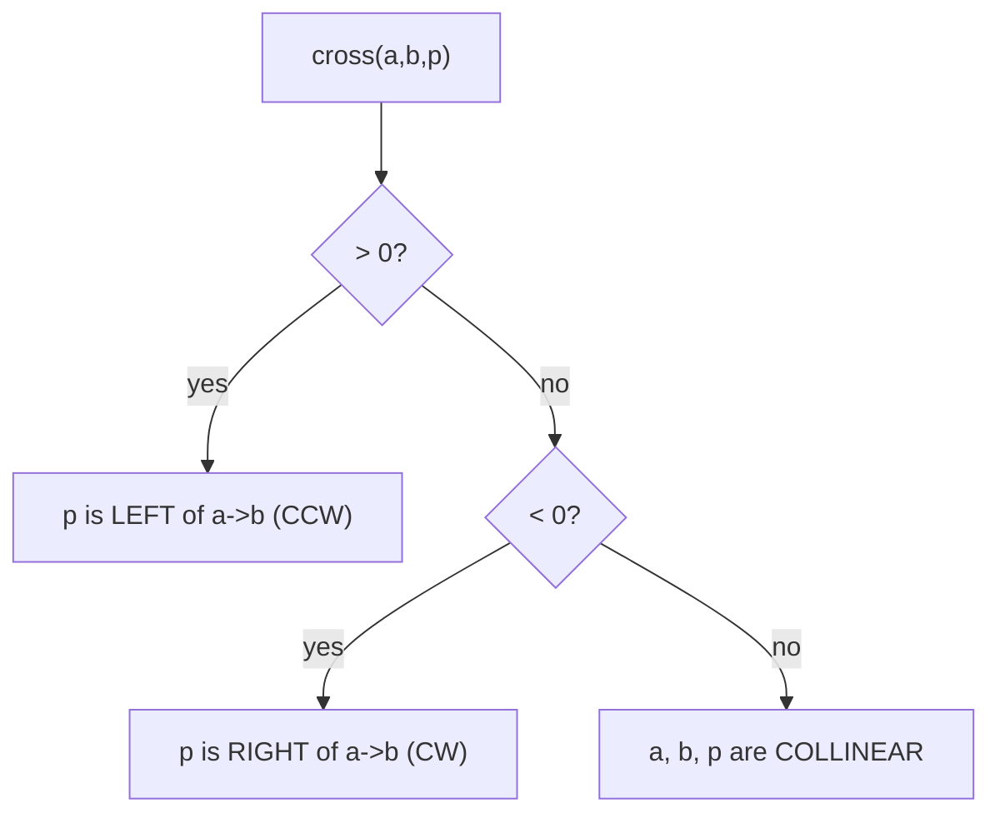
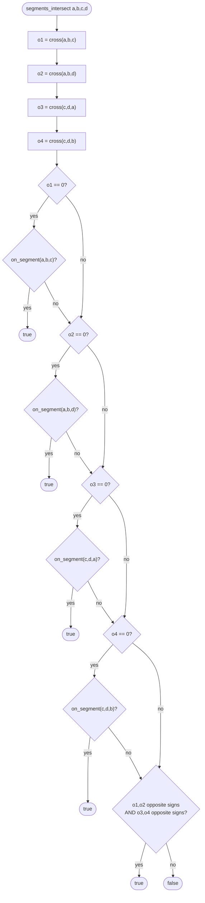
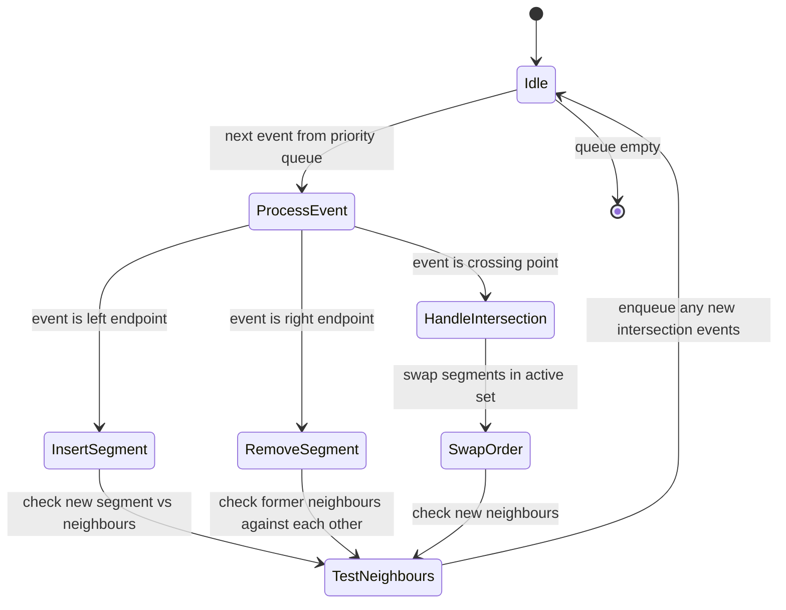

# Line Segment Intersection (Orientation Test)

Determine whether two **closed line segments** intersect. The implementation
handles every geometric case in **O(1)** time using integer arithmetic only,
so there are no floating-point precision issues.

---

## 1. What It Solves

Given four points `a`, `b`, `c`, `d`, decide whether segment `ab` and segment
`cd` share at least one point. The four possible outcomes are:

| Case | Description | Result |
|------|-------------|--------|
| Proper crossing | interiors cross | true |
| Endpoint touch | endpoint lies on other segment | true |
| Collinear overlap | same line, shared sub-segment | true |
| Collinear disjoint | same line, no shared point | false |

---

## 2. Core Building Block: the Orientation Test

Given three ordered points `a`, `b`, `c`, the **signed cross product** tells
you how `c` sits relative to the directed line `a -> b`:

```
cross(a, b, c) = (b.x - a.x) * (c.y - a.y)
               - (b.y - a.y) * (c.x - a.x)
```

| Sign | Meaning |
|------|---------|
| > 0 | c is to the **left** of a->b (counter-clockwise turn) |
| < 0 | c is to the **right** of a->b (clockwise turn) |
| = 0 | a, b, c are **collinear** |

### ASCII diagram

```
           c  (cross > 0, left / CCW)
          /
         /
a -------> b
         \
          \
           d  (cross < 0, right / CW)
```

### Mermaid: orientation decision tree



---

## 3. General Intersection Rule

Segments `ab` and `cd` cross in the general (non-collinear) case when:

1. `c` and `d` are on **opposite sides** of the line through `a` and `b`, AND
2. `a` and `b` are on **opposite sides** of the line through `c` and `d`.

In terms of cross products:

```
sign(cross(a,b,c)) != sign(cross(a,b,d))   [c and d straddle ab]
sign(cross(c,d,a)) != sign(cross(c,d,b))   [a and b straddle cd]
```

### Mermaid: full algorithm flow



---

## 4. Collinear Special Case

When any cross product is zero, the corresponding three points lie on the same
infinite line. You must then check whether the point falls **inside the finite
segment** using an axis-aligned bounding-box test:

```
on_segment(a, b, p):
    min(a.x, b.x) <= p.x <= max(a.x, b.x)
    min(a.y, b.y) <= p.y <= max(a.y, b.y)
```

The bounds are **inclusive** so that endpoints are considered part of the
segment.

---

## 5. Visual Cases

```
Case 1: Proper crossing

    c
    |
    |
  a-+---b        cross products have opposite signs in both pairs
    |
    |
    d

Case 2: Endpoint touch

    c
    |
  a-+---b        c lies exactly on ab; o1 == 0 and on_segment(a,b,c) is true
    (c == intersection point)

Case 3: Collinear overlap

  a------b
      c------d   both segments on the same line and ranges share points

Case 4: Collinear disjoint

  a--b     c--d  same line but bounding boxes do not meet -> false
```

---

## 6. Sweep Line Context

This primitive is the inner loop of the **Bentley-Ottmann sweep line
algorithm**, which finds all intersection points among `n` segments in
`O((n + k) log n)` time where `k` is the number of intersections.

The sweep line moves left to right. At each event point (segment endpoint or
intersection), the order of active segments in the sweep structure may change,
and neighbours are tested for intersection.

```
Sweep line moves right --->

  Segments registered     Active set
  in x-order:             (ordered by y at sweep x):

  x=0  insert ab          [ ab ]
  x=1  insert cd          [ cd, ab ]   test cd vs ab -> cross found
  x=2  intersection       swap cd,ab   test new neighbours
  x=3  remove ab          [ cd ]
  x=4  remove cd          [ ]
```

### Mermaid: sweep line state machine



---

## 7. Worked Example (Crossing Diagonals)

Segments:

```
a = (0,0),  b = (4,4)
c = (0,4),  d = (4,0)
```

Visual:

```
y
4  c-----------+
   |          /|
3  |        /  |
   |      X    |
2  |    /      |
   |  /        |
1  |/           |
0  a-----------d
   0    1   2   3   4  x
                (intersection at (2,2))
```

Cross products:

```
o1 = cross(a,b,c) = (4-0)*(4-0) - (4-0)*(0-0) = 16 - 0  = +16
o2 = cross(a,b,d) = (4-0)*(0-0) - (4-0)*(4-0) =  0 - 16 = -16
o3 = cross(c,d,a) = (4-0)*(0-4) - (0-4)*(0-0) = -16 - 0 = -16
o4 = cross(c,d,b) = (4-0)*(4-4) - (0-4)*(4-0) =  0 + 16 = +16
```

`o1` and `o2` have opposite signs, `o3` and `o4` have opposite signs:
**segments intersect**.

---

## 8. Worked Example (Collinear Overlap)

Segments:

```
a = (0,0),  b = (3,0)
c = (2,0),  d = (5,0)
```

Visual:

```
a-----b
   c-----d
   ^overlap
```

Cross products all equal zero because all four points are on the x-axis.

`on_segment(a,b,c)`: is `2` in `[0,3]`? Yes -> **true**.

---

## 9. Worked Example (Collinear Disjoint)

Segments:

```
a = (0,0),  b = (1,1)
c = (2,2),  d = (3,3)
```

Visual:

```
            c---d
a---b
    (gap between b and c)
```

All cross products are zero. But `on_segment(a,b,c)`: is `(2,2)` in the box
`[0,1]x[0,1]`? No. Likewise for `d`, `a`, `b` against the other segment.
General-case check also fails (signs are equal, not opposite): **false**.

---

## 10. Example Usage

```mbt check
///|
test "segment intersection crossing" {
  let a = @line_segment_intersection.Point::{ x: 0L, y: 0L }
  let b = @line_segment_intersection.Point::{ x: 4L, y: 4L }
  let c = @line_segment_intersection.Point::{ x: 0L, y: 4L }
  let d = @line_segment_intersection.Point::{ x: 4L, y: 0L }
  inspect(
    @line_segment_intersection.segments_intersect(a, b, c, d),
    content="true",
  )
}
```

```mbt check
///|
test "segment intersection touch" {
  let a = @line_segment_intersection.Point::{ x: 0L, y: 0L }
  let b = @line_segment_intersection.Point::{ x: 2L, y: 2L }
  let c = @line_segment_intersection.Point::{ x: 2L, y: 2L }
  let d = @line_segment_intersection.Point::{ x: 3L, y: 0L }
  inspect(
    @line_segment_intersection.segments_intersect(a, b, c, d),
    content="true",
  )
}
```

```mbt check
///|
test "segment intersection disjoint" {
  let a = @line_segment_intersection.Point::{ x: 0L, y: 0L }
  let b = @line_segment_intersection.Point::{ x: 1L, y: 1L }
  let c = @line_segment_intersection.Point::{ x: 2L, y: 2L }
  let d = @line_segment_intersection.Point::{ x: 3L, y: 3L }
  inspect(
    @line_segment_intersection.segments_intersect(a, b, c, d),
    content="false",
  )
}
```

---

## 11. Integer vs Floating Point

This implementation uses **Int64** throughout, which eliminates floating-point
rounding errors. The cross product multiplies two differences, each at most
the coordinate range. Using 64-bit integers is safe for coordinates up to
roughly 3 * 10^9.

If you must use floating-point coordinates, add an epsilon tolerance when
testing whether a cross product is zero:

```
|cross(a, b, c)| < epsilon   =>  treat as collinear
```

---

## 12. Common Pitfalls

- The bounding-box check in `on_segment` must use `<=`, not `<`, so that
  endpoints are included.
- Collinear segments require the separate `on_segment` path; the sign-flip
  test alone is not sufficient.
- Use `Int64` (not `Int32`) to avoid overflow when coordinates are large.

---

## 13. Complexity

| Operation | Time | Space |
|-----------|------|-------|
| `cross` | O(1) | O(1) |
| `on_segment` | O(1) | O(1) |
| `segments_intersect` | O(1) | O(1) |

---

## 14. Related Algorithms

- **Intersection point computation**: solve the parametric equations for `t`
  and `s` once `segments_intersect` returns `true`.
- **Bentley-Ottmann**: find all `k` intersections among `n` segments in
  `O((n + k) log n)`.
- **Polygon intersection tests**: reduce to repeated segment intersection
  queries.
- **Closest pair of points**: uses a related divide-and-conquer structure but
  operates on points rather than segments.
