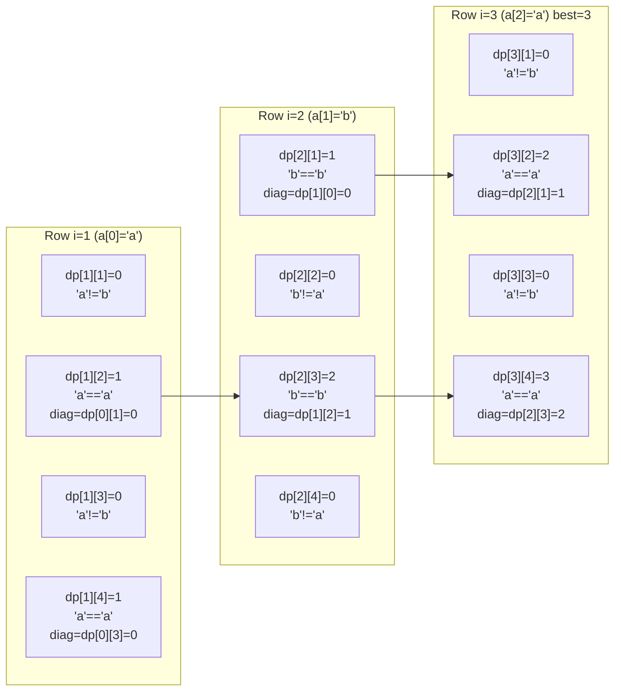
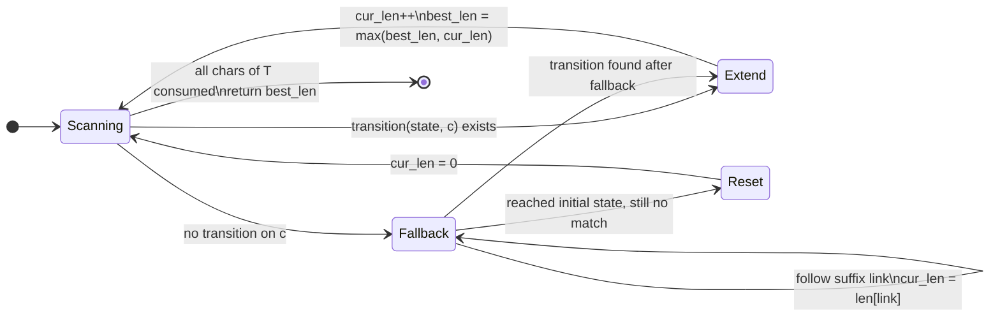

# Longest Common Substring (DP)

## 1. Problem statement (what we want)

Given two strings `a` and `b`, find the longest **contiguous** substring that
appears in **both** strings.

- If multiple substrings tie for the maximum length, this implementation keeps
  the first one it discovers while scanning rows left to right.
- If there is no common substring, the answer is the empty string with length 0.

This package returns both the substring itself and its length.

---

## 2. Substring vs subsequence (do not mix these up)

A **substring** is contiguous. A **subsequence** can skip characters.

Example:

```
String A:  a b c d e f
String B:  z b c d f

Common subsequence (can skip): "bcdf" (length 4)
Common substring  (contiguous): "bcd" (length 3)
```

The key rule for longest common substring is:

- Match: extend the diagonal (previous match).
- Mismatch: reset to 0 (contiguity is broken).

---

## 3. Two approaches at a glance

This package uses **dynamic programming** (O(n * m) time, O(m) space).
A more advanced alternative uses a **suffix automaton** (O(n + m) time, O(n)
space), described in section 14.

```
+---------------------+--------------------+---------------------+
| Approach            | Time               | Space               |
+---------------------+--------------------+---------------------+
| DP (this package)   | O(n * m)           | O(m)                |
| Suffix automaton    | O(n + m)           | O(n)                |
| Suffix array        | O(n log n + m)     | O(n)                |
+---------------------+--------------------+---------------------+
```

For moderate input sizes the DP is simpler and fast enough. For very large
inputs, see the `suffix_automaton` package.

---

## 4. Naive idea (why we do DP)

A brute-force approach tries every pair of start positions and extends while
characters match. That is often O(n * m * L) where L is the length of the match.
For long strings, this is too slow.

Dynamic programming reduces the work to O(n * m).

---

## 5. DP idea: longest common suffix ending here

Define:

```
dp[i][j] = length of the longest common suffix
           of a[0..i) and b[0..j)
           that ends exactly at a[i-1] and b[j-1]
```

Recurrence:

```
if a[i-1] == b[j-1]:
  dp[i][j] = dp[i-1][j-1] + 1
else:
  dp[i][j] = 0
```

The answer is the maximum value in the DP table.

Why this works:

- `dp[i-1][j-1]` is the best suffix ending one step diagonally up-left.
- If the current characters match, we can extend that suffix by 1.
- If they do not match, the common suffix ending here is forced to 0.

---

## 6. Mermaid: high-level data flow

```mermaid
flowchart TD
    A([Input: strings a, b]) --> B[Allocate two rows:\nprev_row, curr_row]
    B --> C{For each row i of a}
    C -->|i from 1 to n| D{For each col j of b}
    D -->|j from 1 to m| E{a\[i-1\] == b\[j-1\]?}
    E -->|yes| F[curr\[j\] = prev\[j-1\] + 1\nupdate best if larger]
    E -->|no| G[curr\[j\] = 0]
    F --> D
    G --> D
    D -->|j done| H[swap rows:\nprev = curr\ncurr = zeros]
    H --> C
    C -->|i done| I[Extract substring\nfrom a using best_end]
    I --> J([Return LCSResult])
```

---

## 7. Match grid: diagonals are the only places that grow

Think of a grid where rows are characters of `a`, columns are characters of `b`.
A match places an `X`, and only diagonals of `X` can grow into longer substrings.

```
a = "ababa"
b = "baba"

      b   a   b   a
    +---+---+---+---+
a |  . | X | . | X |
    +---+---+---+---+
b |  X | . | X | . |
    +---+---+---+---+
a |  . | X | . | X |
    +---+---+---+---+
b |  X | . | X | . |
    +---+---+---+---+
a |  . | X | . | X |
    +---+---+---+---+

A contiguous substring corresponds to a diagonal streak of Xs.
```

---

## 8. Concrete DP table example

Example strings:

```
a = "abab"
b = "baba"
```

DP table (rows = `a`, columns = `b`):

```
        ""  b  a  b  a
    ""   0  0  0  0  0
     a   0  0  1  0  1
     b   0  1  0  2  0
     a   0  0  2  0  3  <-- maximum = 3
     b   0  1  0  3  0
```

Maximum length is 3, ending at `a[3]`, so the substring is `"aba"`.

---

## 9. Mermaid: DP recurrence for "abab" vs "baba"

The diagram traces which diagonal values feed into each cell.



Cell `dp[3][4] = 3` is the maximum. The match ends at `a[2]` (1-based `i = 3`),
so the substring is `a[0..3) = "aba"`.

---

## 10. Walkthrough: "banana" vs "ananas"

We compute row by row. A few highlights:

- When `a[i-1]` and `b[j-1]` do not match, the cell is 0.
- When they match, the value is the diagonal + 1.

Selected steps:

```
Row for a[1] = 'a':
  b[0] = 'a' -> dp = 1
  b[1] = 'n' -> dp = 0
  b[2] = 'a' -> dp = 1

Row for a[2] = 'n':
  b[1] = 'n' -> dp = 2 (extends "a" to "an")
  b[3] = 'n' -> dp = 2

Row for a[5] = 'a':
  b[4] = 'a' -> dp = 5 ("anana")
```

The maximum value 5 gives substring "anana".

---

## 11. Space optimization (rolling rows)

The recurrence only depends on `dp[i-1][j-1]`, so we do not need the full table.
We keep two rows:

```
prev_row: dp for i-1
curr_row: dp for i
```

After finishing a row, we swap and clear `curr_row`.

This reduces space from O(n * m) to O(m).

```
Memory layout at any point during the scan
(n = |a|, m = |b|, only two rows kept):

 prev_row  [ 0 | dp[i-1][1] | dp[i-1][2] | ... | dp[i-1][m] ]
 curr_row  [ 0 | dp[i][1]   | dp[i][2]   | ... | dp[i][m]   ]
                                                      ^
                                               being written
```

---

## 12. Reconstructing the substring

While filling the table we track:

- `best_len`: maximum length seen so far
- `best_end`: the index in `a` where that maximum ends (1-based in the DP loop)

After the DP ends:

```
start = best_end - best_len
substring = a[start : best_end]
```

Example:

```
a = "banana"
best_len = 5
best_end = 6
substring = a[1:6] = "anana"
```

If `best_len` stays 0, the answer is the empty string.

---

## 13. MoonBit details (strings and indices)

MoonBit `String` is UTF-16. Indexing like `s[i]` accesses a code unit.
The DP uses those code units directly. If you need substring logic over full
Unicode grapheme clusters, you would need a different representation.

This implementation constructs the output substring with a `StringBuilder`
so the result is a fresh `String`.

---

## 14. Suffix automaton alternative

For very large strings the DP's O(n * m) time can be a bottleneck.
A **suffix automaton (SAM)** reduces this to O(n + m):

```
Build SAM from string S   (O(n) time and space)
Walk string T through SAM (O(m) time)
  - If transition exists: extend the current match length.
  - If not: follow suffix links to find the longest extendable suffix.
  - Track the maximum match length seen.
```

### ASCII art: SAM for S = "abcde", scanning T = "cde"

```
SAM states for S = "abcde" (simplified, each state = one character):

  s0 --a--> s1 --b--> s2 --c--> s3 --d--> s4 --e--> s5
   \                  ^
    \--b--> ...       (suffix links omitted for brevity)

Scanning T = "cde" through the SAM:
  Start:  state=s0, cur_len=0
  c='c':  s0 --c?--> follow suffix links -> reach s2, extend to s3, cur_len=1
  c='d':  s3 --d--> s4,  cur_len=2
  c='e':  s4 --e--> s5,  cur_len=3  -> best_len=3

Result: length 3, substring = "cde"
```

### Mermaid: SAM-based LCS traversal state machine



### Comparison: DP diagonal vs SAM suffix link

```
DP approach                         SAM approach
-----------------------------------+------------------------------------
"Reset to 0 on mismatch"           "Follow suffix links on mismatch"

Both capture the same idea:
  when the current match cannot be
  extended, fall back to the
  longest still-valid suffix.

DP: the prev_row[j-1] cell is that  SAM: suffix links encode the same
    fallback (diagonal predecessor). fallback structure implicitly.
```

---

## 15. Worked examples (runnable)

```mbt check
///|
test "lcs banana ananas" {
  let result = @longest_common_substring.longest_common_substring(
    "banana", "ananas",
  )
  inspect(result.substring, content="anana")
  inspect(result.length, content="5")
}
```

```mbt check
///|
test "lcs no common substring" {
  let result = @longest_common_substring.longest_common_substring("abc", "xyz")
  inspect(result.substring, content="")
  inspect(result.length, content="0")
}
```

```mbt check
///|
test "lcs identical strings" {
  let result = @longest_common_substring.longest_common_substring(
    "hello", "hello",
  )
  inspect(result.substring, content="hello")
  inspect(result.length, content="5")
}
```

```mbt check
///|
test "lcs inside a longer word" {
  let result = @longest_common_substring.longest_common_substring(
    "mississippi", "sipp",
  )
  inspect(result.substring, content="sipp")
  inspect(result.length, content="4")
}
```

```mbt check
///|
test "lcs short overlap" {
  let result = @longest_common_substring.longest_common_substring(
    "xyzab", "tabc",
  )
  inspect(result.substring, content="ab")
  inspect(result.length, content="2")
}
```

---

## 16. Common pitfalls

- Confusing substring with subsequence.
- Forgetting to reset to 0 on mismatches.
- Mixing index bases (`dp` is 1-based, strings are 0-based).
- Expecting a specific answer when there are multiple longest substrings.

---

## 17. Complexity and when to use this

```
Time:  O(n * m)
Space: O(m)
```

Use this DP when:

- You need the actual longest contiguous match (not just the length).
- Input sizes are moderate (O(n * m) is acceptable).
- You want a simple, self-contained implementation with no auxiliary structures.

For very large inputs, suffix automaton or suffix array methods run in
O(n + m) or O(n log n) but are more complex to implement (see the
`suffix_automaton` package in this repository).
