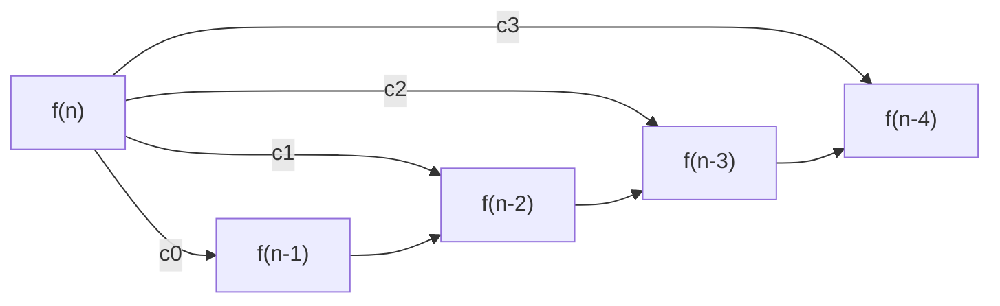
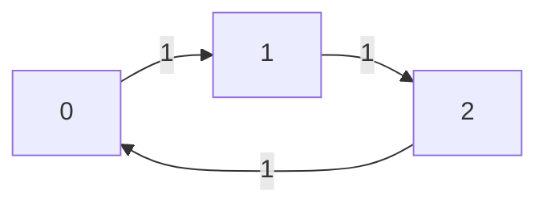
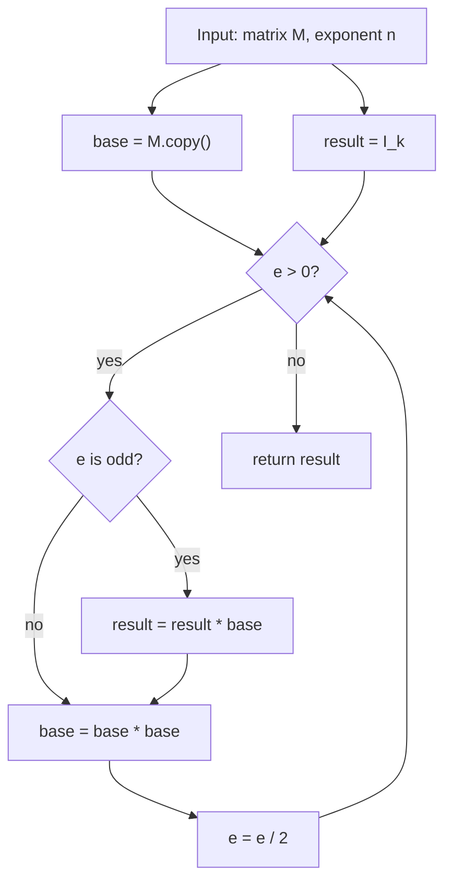
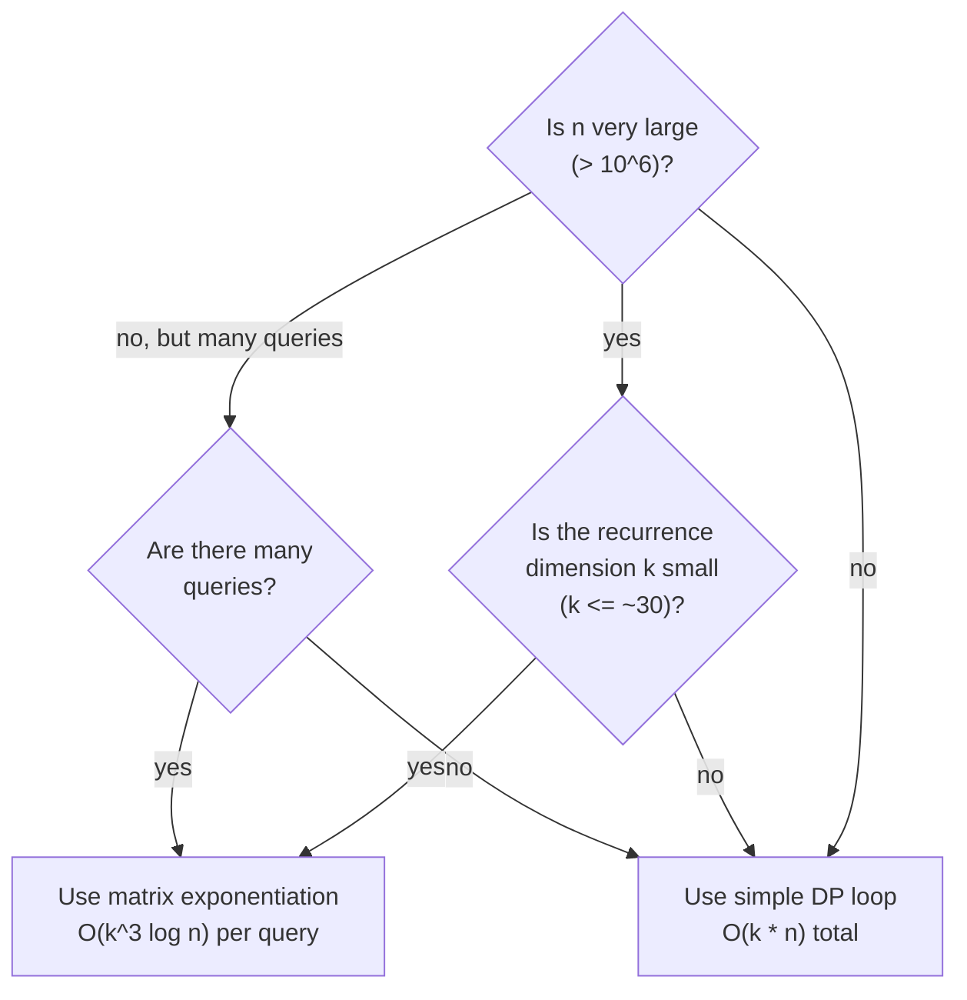

# Matrix Exponentiation (linear recurrences in O(k^3 log n))

## 1. What problem does this solve?

Matrix exponentiation computes **M^n** fast using binary exponentiation. This is
useful because many problems (Fibonacci, linear recurrences, path counting) can
be written as repeated matrix multiplication.

- Time: O(k^3 log n) for k x k matrices
- Space: O(k^2)

This package is a **teaching example** with rich loop invariants. It does not
export a public API, so code examples are marked `mbt nocheck` and mirror the
package tests.

## 2. Key idea: binary exponentiation for matrices

Scalar version:

```
a^13 = a^8 * a^4 * a^1  (13 = 1101 in binary)
```

Matrix version is identical:

```
M^13 = M^8 * M^4 * M^1
```

We build powers by squaring:

```
M^1, M^2, M^4, M^8, ...
```

Each step halves the exponent, so the loop runs in O(log n) steps.

## 3. The invariant that makes it correct

Inside the loop we maintain:

```
result * base^e = M^n
```

- If `e` is odd, multiply `result` by `base`.
- Then square `base` and halve `e`.

Because matrix multiplication is associative, the same reasoning as scalar
exponentiation applies.

Invariant diagram:

```
Before loop:  result = I,  base = M,  e = n
              I * M^n = M^n  [invariant holds]

Each step (e odd):
  result' = result * base
  base'   = base * base
  e'      = e / 2

  result' * base'^e' = (result * base) * (base^2)^(e/2)
                     = result * base * base^(e-1)    [e odd => e-1 = 2*(e/2)]
                     = result * base^e
                     = M^n  [invariant preserved]

Each step (e even):
  result' = result
  base'   = base * base
  e'      = e / 2

  result' * base'^e' = result * (base^2)^(e/2)
                     = result * base^e
                     = M^n  [invariant preserved]

After loop (e = 0):
  result * base^0 = result * I = result = M^n
```

## 4. Matrix multiplication (why O(k^3))

For two matrices A (k x k) and B (k x k):

```
C[i,j] = sum_{t=0..k-1} A[i,t] * B[t,j]
```

This is the classic triple loop and costs O(k^3).

Dot product for one cell:

```
Row i of A:    [ a0  a1  a2  a3 ]
                  |   |   |   |
                  *   *   *   *
                  |   |   |   |
Col j of B:    [ b0  b1  b2  b3 ]

C[i,j] = a0*b0 + a1*b1 + a2*b2 + a3*b3
```

## 5. Walkthrough: M^5 by hand

Take:

```
    [ 2  1 ]
M = [ 1  1 ]        n = 5  (101 in binary)
```

Process bits from least significant:

```
Step   e    e%2   result        base
----   ---  ----  ----------    ----------
init   5    -     I             M
  1    5    odd   I * M = M     M^2
  2    2    even  M             M^4
  3    1    odd   M * M^4 = M^5 M^8
  4    0    -     return M^5    -
```

Only 3 squarings and 2 multiplies for `n = 5`.

## 6. Fibonacci as a matrix

The Fibonacci recurrence:

```
F(n) = F(n-1) + F(n-2)
```

Matrix form:

```
[ F(n+1) ]   [ 1  1 ]^n   [ 1 ]
[ F(n)   ] = [ 1  0 ]   * [ 0 ]
```

So `F(n)` is the (0,1) entry of `M^n` where:

```
    [ 1  1 ]
M = [ 1  0 ]
```

Fibonacci matrix powers, step by step:

```
         [ 1  1 ]^0   [ 1  0 ]         F(0)=0  F(1)=1
         [ 1  0 ]   = [ 0  1 ]  (I)

         [ 1  1 ]^1   [ 1  1 ]         F(1)=1  F(2)=1
         [ 1  0 ]   = [ 1  0 ]

         [ 1  1 ]^2   [ 2  1 ]         F(2)=1  F(3)=2
         [ 1  0 ]   = [ 1  1 ]

         [ 1  1 ]^3   [ 3  2 ]         F(3)=2  F(4)=3
         [ 1  0 ]   = [ 2  1 ]

         [ 1  1 ]^9   [ 55  34 ]       F(9)=34  F(10)=55
         [ 1  0 ]   = [ 34  21 ]
```

Binary exponentiation trace for `fibonacci(10)`:

```
n = 10 = 1010b

e=10  even   result=I         base=M^1
e= 5  odd    result=M^2       base=M^2  -> base squared to M^4
e= 2  even   result=M^2       base=M^4  -> base squared to M^8
e= 1  odd    result=M^2*M^8   base=M^8  -> base squared to M^16
e= 0  stop   return M^10

result.get(0, 1) = 55 = F(10)
```

```mbt nocheck
///|
test "fibonacci example" {
  inspect(fibonacci(10L), content="55")
  inspect(fibonacci(20L), content="6765")
}
```

## 7. Generic linear recurrence

Any k-term recurrence:

```
f(n) = c0*f(n-1) + c1*f(n-2) + ... + c(k-1)*f(n-k)
```

can be written with a k x k companion matrix:

```
[ f(n)    ]   [ c0  c1  c2  ...  c(k-1) ]   [ f(n-1)   ]
[ f(n-1)  ] = [  1   0   0  ...    0    ] * [ f(n-2)   ]
[ f(n-2)  ]   [  0   1   0  ...    0    ]   [ f(n-3)   ]
[ ...     ]   [  ...                    ]   [ ...      ]
[ f(n-k+1)]   [  0   0   0  ...    0    ]   [ f(n-k)   ]
```

Raise this matrix to the power `n - k + 1` and multiply by the initial vector.

Mermaid diagram showing the companion matrix structure for `k = 4`:



```mbt nocheck
///|
test "solve_recurrence examples" {
  let coeffs : Array[Int64] = [1L, 1L]
  let initial : Array[Int64] = [0L, 1L]
  inspect(solve_recurrence(coeffs, initial, 10L), content="55")
}
```

## 8. Path counting in graphs

If `A` is an adjacency matrix of a graph, then:

```
(A^k)[i,j] = number of walks of length k from vertex i to vertex j
```

Example: cycle graph `0 -> 1 -> 2 -> 0`



Adjacency matrix:

```
    0  1  2
0 [ 0  1  0 ]
1 [ 0  0  1 ]
2 [ 1  0  0 ]
```

A^2 (walks of length 2):

```
    0  1  2
0 [ 0  0  1 ]   -> 0->1->2 is the only 2-step walk from 0
1 [ 1  0  0 ]
2 [ 0  1  0 ]
```

A^3 (walks of length 3):

```
    0  1  2
0 [ 1  0  0 ]   -> 0->1->2->0 is the only 3-step walk from 0 back to 0
1 [ 0  1  0 ]
2 [ 0  0  1 ]
```

(A^3 = I here because the cycle has period 3.)

```mbt nocheck
///|
test "count_paths example" {
  let adj : Array[Array[Int64]] = [[0L, 1L, 0L], [0L, 0L, 1L], [1L, 0L, 0L]]
  let paths2 = count_paths(adj, 2L)
  inspect(paths2.get(0, 2), content="1")
}
```

## 9. Modulo arithmetic

This implementation uses a fixed modulus:

```
MATRIX_MOD = 1_000_000_007
```

This prevents overflow and keeps values in range for large exponents. There is
also a `multiply_no_mod` path for pure integer math when you know values are
small.

Why 10^9 + 7?

```
Int64 max: ~9.2 * 10^18
Largest product before mod: (10^9 + 6)^2 ≈ 10^18 < 9.2 * 10^18

So a single a*b never overflows Int64 before we take the modulus.
```

## 10. Identity matrix

The identity matrix acts like 1 for multiplication:

```
    [ 1  0  0 ]               [ 1  0 ]
I = [ 0  1  0 ]    or  I_2 = [ 0  1 ]
    [ 0  0  1 ]

I * A = A * I = A
```

It is used to initialize `result` in exponentiation so that the loop
invariant `result * base^e = M^n` holds from the very first iteration.

```mbt nocheck
///|
test "identity example" {
  let a = Matrix::from_array([[1L, 2L], [3L, 4L]])
  let i = Matrix::identity(2)
  inspect(a.multiply_no_mod(i).equals(a), content="true")
}
```

## 11. Data flow diagram



## 12. Complexity summary

```
Matrix multiply:   O(k^3)
Matrix power:      O(k^3 log n)
Fibonacci:         O(log n)         [k = 2, so k^3 = 8, treated as constant]
Recurrence (k):    O(k^3 log n)
Path counting:     O(v^3 log k)     [v = number of vertices]
```

## 13. API overview (internal)

The main building blocks inside the package:

| Function / method               | Description                                        |
|---------------------------------|----------------------------------------------------|
| `Matrix::new(rows, cols)`       | Create a zero matrix                               |
| `Matrix::identity(n)`           | Create the n x n identity matrix                   |
| `Matrix::from_array(arr)`       | Construct a matrix from a 2-D array literal        |
| `Matrix::get(i, j)`             | Read element at row i, column j                    |
| `Matrix::set(i, j, v)`          | Write element at row i, column j                   |
| `Matrix::multiply(other)`       | Multiply with modular reduction (mod MATRIX_MOD)   |
| `Matrix::multiply_no_mod(other)`| Multiply with exact integer arithmetic             |
| `Matrix::power(exp)`            | Raise to non-negative power using binary exponent. |
| `Matrix::copy()`                | Deep copy                                          |
| `Matrix::equals(other)`         | Element-wise equality check                        |
| `fibonacci(n)`                  | nth Fibonacci number mod MATRIX_MOD in O(log n)    |
| `solve_recurrence(c, init, n)`  | Solve k-term linear recurrence in O(k^3 log n)     |
| `count_paths(adj, k)`           | Count walks of length k in a graph                 |

See the test cases in `lib/matrix_exp/matrix_exp.mbt` for exact usage.

## 14. Common pitfalls

- Exponentiating a non-square matrix (result is undefined; `power` returns `self` unchanged)
- Forgetting the identity matrix as the neutral element for exponentiation
- Mixing modulo and non-modulo arithmetic (use `multiply` for large exponents)
- Overflow when using `multiply_no_mod` on large values
- Off-by-one in `solve_recurrence`: exponent is `n - k + 1`, not `n`
- Passing `initial` values in the wrong order (must be `[f(0), f(1), ..., f(k-1)]`)

## 15. When to use matrix exponentiation

Use it when:

- `n` is huge (10^12, 10^18, ...)
- The recurrence has a small fixed dimension `k`
- You need many queries for large indices

For small `n`, a simple DP loop is often faster and simpler.

Decision guide:


