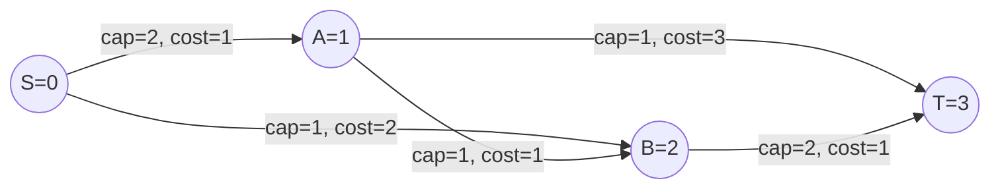
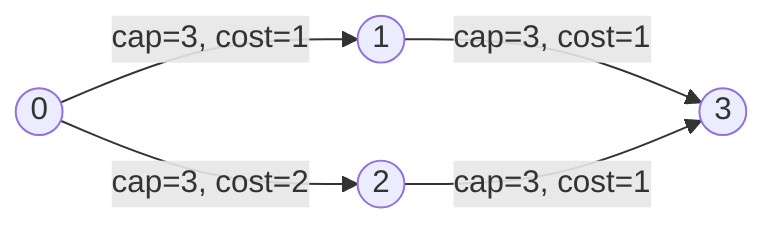
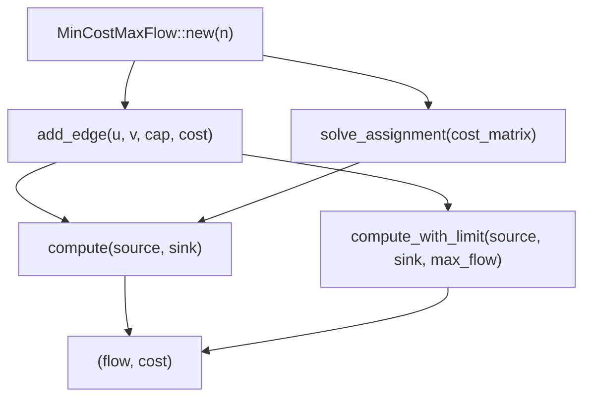
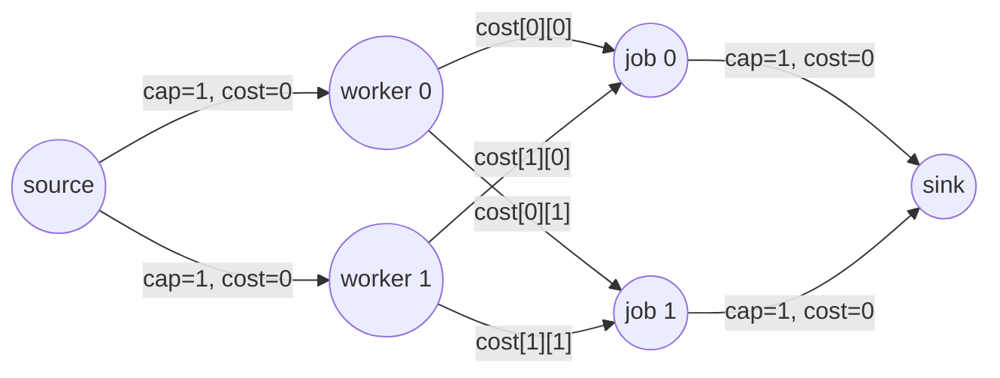

# Minimum Cost Maximum Flow (MCMF)

## 1. Problem statement

You have a directed graph with **capacity** and **cost** on every edge.
You want to send as much flow as possible from source `s` to sink `t` and
**minimize the total cost** of that maximum flow.

Flow conservation rules:

- `0 <= flow(e) <= capacity(e)` for every edge
- For every node except `s` and `t`: inflow = outflow

### Tiny mental model

Think of edges as **pipes with tolls**. Each pipe has a maximum water volume
(capacity) and a price per unit of water (cost). We push as much water as
possible from `s` to `t` while keeping the total toll bill as low as possible.

## 2. Flow network diagram

The network below has five nodes and five directed edges. Numbers are
`cap/cost` (capacity / cost per unit of flow).



Edge list:

```
S -> A  cap 2, cost 1
S -> B  cap 1, cost 2
A -> B  cap 1, cost 1
A -> T  cap 1, cost 3
B -> T  cap 2, cost 1
```

The algorithm finds max flow = 3, using paths in cost order (see section 5).

## 3. Why this is harder than max flow

In max flow, any augmenting path is fine. In MCMF, **the path must be cheapest
per unit of flow**, otherwise the total cost is not minimal.

The algorithm repeatedly finds a **minimum-cost augmenting path** in the
residual graph and pushes as much flow as possible along it.

## 4. Residual graph and negative costs

For each edge `u -> v` with capacity `c`, current flow `f`, and cost `w`:

```
Original:  u --(cap=c, cost=w)--> v

Residual:  u --(cap=c-f, cost=+w)--> v    (forward: still room)
           v --(cap=f,   cost=-w)--> u    (backward: cancel flow)
```

The backward edge lets you **undo** an expensive earlier routing decision.
Because backward edges have negative costs, the shortest-path algorithm must
handle negative weights. This package uses **SPFA** (Bellman-Ford with a queue)
which correctly handles negative edges.

### Residual graph after pushing 1 unit on S->A->B->T

```
Before augmentation:
  S --(2,+1)--> A    A --(1,+1)--> B    B --(2,+1)--> T
  S --(1,+2)--> B    A --(1,+3)--> T

After pushing 1 unit along S->A->B->T (cost = 1+1+1 = 3):
  S --(1,+1)--> A    (1 unit consumed)
  A --(0,+1)--> B    (saturated forward)
  B --(1,+1)--> T    (1 unit consumed)

  New backward edges added:
  A --(1,-1)--> S    (can undo S->A)
  B --(1,-1)--> A    (can undo A->B)
  T --(1,-1)--> B    (can undo B->T)
```

## 5. Algorithm: successive shortest augmenting paths

```
flow = 0, cost = 0
repeat:
  run SPFA on residual graph to find cheapest path s -> t
  if no path exists:
    break
  bottleneck = min residual capacity along that path
  push bottleneck units along the path
  flow += bottleneck
  cost += bottleneck * (cost of path)
return (flow, cost)
```

This greedy-by-cost strategy is correct: at every intermediate flow value the
running cost is minimal. Repeating until no path yields **min-cost max-flow**.

## 6. SPFA augmentation steps (ASCII walkthrough)

Network used in the walkthrough (same as section 2):

```
S --2/1--> A --1/1--> B --2/1--> T
|          |
1/2        1/3
|          |
+--> B     +--> T
```

Notation: `cap/cost` on each edge.

### Step 0: initial state, all flows = 0

```
Residual capacities:
  S->A: 2   S->B: 1
  A->B: 1   A->T: 1
  B->T: 2

SPFA distances from S (cost):
  S=0  A=INF  B=INF  T=INF
Queue: [S]
```

### Step 1: SPFA relaxes S->A (cost 1) and S->B (cost 2)

```
  S=0  A=1  B=2  T=INF
Queue: [A, B]

From A: relax A->B (1+1=2, ties with S->B direct, keep min 2)
         relax A->T (1+3=4)
  S=0  A=1  B=2  T=4
Queue: [B, T]

From B: relax B->T (2+1=3 < 4, update T)
  S=0  A=1  B=2  T=3
Queue: [T]   (T already updated)

Shortest path to T: S->A->B->T, cost 3, bottleneck min(2,1,2)=1
Augment 1 unit. total_flow=1, total_cost=3
```

### Step 2: residual graph after step 1

```
Forward residuals:          Backward residuals (negative cost):
  S->A: 1                   A->S: 1 (cost -1)
  S->B: 1                   B->A: 1 (cost -1)
  A->B: 0  (saturated)      B->T: 1 backward at cost -1
  A->T: 1
  B->T: 1

SPFA finds next cheapest path: S->A->T, cost 1+3=4, bottleneck 1
Augment 1 unit. total_flow=2, total_cost=7
```

### Step 3: residual graph after step 2

```
Forward residuals:
  S->A: 0  (saturated)
  S->B: 1
  A->T: 0  (saturated)
  B->T: 1

Backward residuals:
  A->S: 2 (cost -1)
  T->A: 1 (cost -3)
  T->B: 1 (cost -1)  (from step 1)

SPFA finds: S->B->T, cost 2+1=3, bottleneck 1
Augment 1 unit. total_flow=3, total_cost=10

No more paths. Result: flow=3, cost=10
```

## 7. Diamond network example

```
          cap=3, cost=1
    0 ─────────────────► 1
    │                    │
    │ cap=3, cost=2       │ cap=3, cost=1
    │                    │
    ▼                    ▼
    2 ─────────────────► 3
          cap=3, cost=1
```



- Path 0->1->3: cost = 1+1 = 2 per unit, 3 units => cost 6
- Path 0->2->3: cost = 2+1 = 3 per unit, 3 units => cost 9
- Total flow = 6, total cost = 15

## 8. Public API in this package



| Function | Description |
|---|---|
| `MinCostMaxFlow::new(n)` | Create graph with `n` vertices |
| `add_edge(u, v, cap, cost)` | Add directed edge with capacity and cost |
| `compute(source, sink)` | Min-cost max-flow; returns `(flow, cost)` |
| `compute_with_limit(source, sink, max_flow)` | Stop after `max_flow` units |
| `solve_assignment(cost_matrix)` | Solve n-by-n assignment problem |

## 9. Example: single edge

```mbt check
///|
test "mcmf simple edge" {
  let mcmf = @mcmf.MinCostMaxFlow::new(2)
  mcmf.add_edge(0, 1, 5L, 2L)
  let (flow, cost) = mcmf.compute(0, 1)
  inspect(flow, content="5")
  inspect(cost, content="10")
}
```

## 10. Example: diamond network

```
0 -> 1 (cap 3, cost 1)
0 -> 2 (cap 3, cost 2)
1 -> 3 (cap 3, cost 1)
2 -> 3 (cap 3, cost 1)
```

```
    0
   / \
 1/   \2
 /     \
1       2
 \     /
  \1  /1
    3
```

All 6 units can pass, but the top path is cheaper:

- 3 units through 0->1->3 at cost 2 per unit = 6
- 3 units through 0->2->3 at cost 3 per unit = 9
- Total cost = 15

```mbt check
///|
test "mcmf diamond" {
  let mcmf = @mcmf.MinCostMaxFlow::new(4)
  mcmf.add_edge(0, 1, 3L, 1L)
  mcmf.add_edge(0, 2, 3L, 2L)
  mcmf.add_edge(1, 3, 3L, 1L)
  mcmf.add_edge(2, 3, 3L, 1L)
  let (flow, cost) = mcmf.compute(0, 3)
  inspect(flow, content="6")
  inspect(cost, content="15")
}
```

## 11. Example: flow limit

If you only need `k` units of flow, use `compute_with_limit`:

```mbt check
///|
test "mcmf limited flow" {
  let mcmf = @mcmf.MinCostMaxFlow::new(2)
  mcmf.add_edge(0, 1, 10L, 1L)
  let (flow, cost) = mcmf.compute_with_limit(0, 1, 5L)
  inspect(flow, content="5")
  inspect(cost, content="5")
}
```

## 12. Assignment problem

`solve_assignment` reduces an n-by-n worker-task cost matrix to MCMF. The
bipartite flow network looks like this (for a 2-by-2 matrix):



```
Vertices: 0=source, 1..n=workers, n+1..2n=jobs, 2n+1=sink
All edges have capacity 1.
Worker->job edge carries cost[worker][job].
```

Example:

```
Cost matrix:
  [1, 3]
  [2, 2]

Optimal: worker 0 -> job 0 (cost 1)
         worker 1 -> job 1 (cost 2)
Total = 3

Alternative: worker 0 -> job 1 (3) + worker 1 -> job 0 (2) = 5  (worse)
```

```mbt check
///|
test "assignment example" {
  let cost : Array[Array[Int64]] = [[1L, 3L], [2L, 2L]]
  inspect(@mcmf.solve_assignment(cost), content="3")
}
```

## 13. Complexity

Let `V` = vertices, `E` = edges, `F` = maximum flow value:

```
SPFA per augmentation:  O(V * E)  worst case
Number of augmentations: O(F)      (at least 1 unit per path)
Total:                  O(V * E * F)
```

SPFA is usually much faster than worst case in practice. For graphs without
negative edges or with small cost values, Dijkstra with Johnson potentials
gives `O(F * (E + V log V))` and can be faster.

## 14. Common pitfalls

- Forgetting to add reverse edges (breaks residual graph correctness)
- Integer overflow in `total_cost += path_flow * dist[sink]` for large graphs
- Negative-cost cycles in the initial graph (SPFA will loop; MCMF requires no
  negative cycles in the original directed graph)
- Not resetting `dist`, `prev_v`, `prev_e` before each SPFA call
- Using Dijkstra without potentials when costs can be negative

## 15. Summary

MCMF finds the **cheapest way** to push the **maximum amount** of flow from a
source to a sink. This package implements the classic **successive shortest
augmenting path** approach with **SPFA**, and exposes a simple API for building
graphs, computing results, and solving assignment problems.
