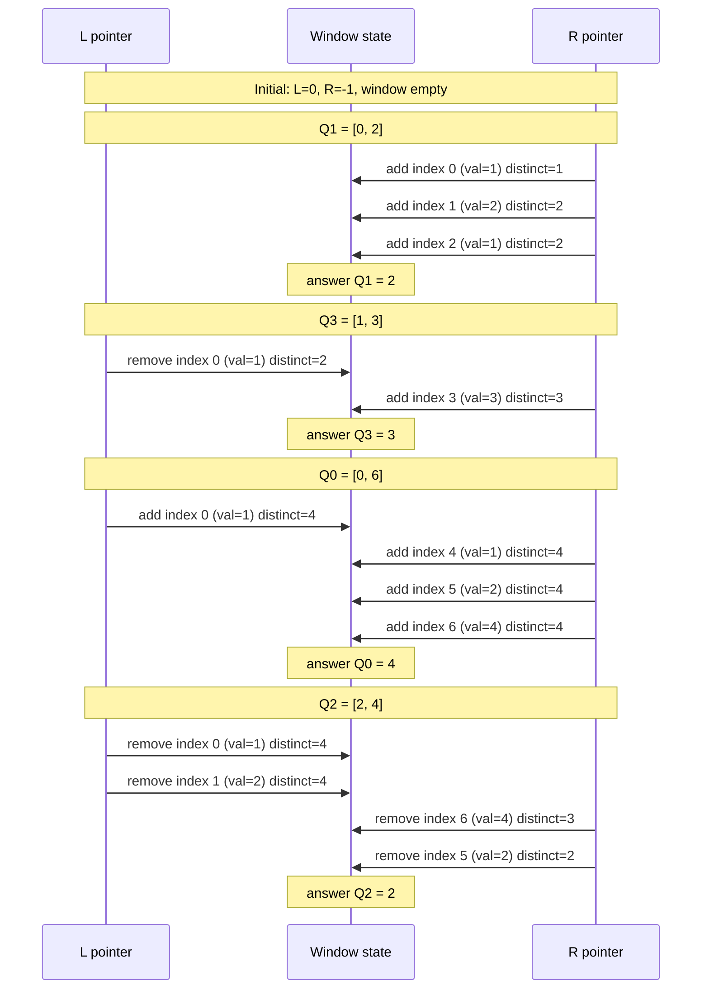
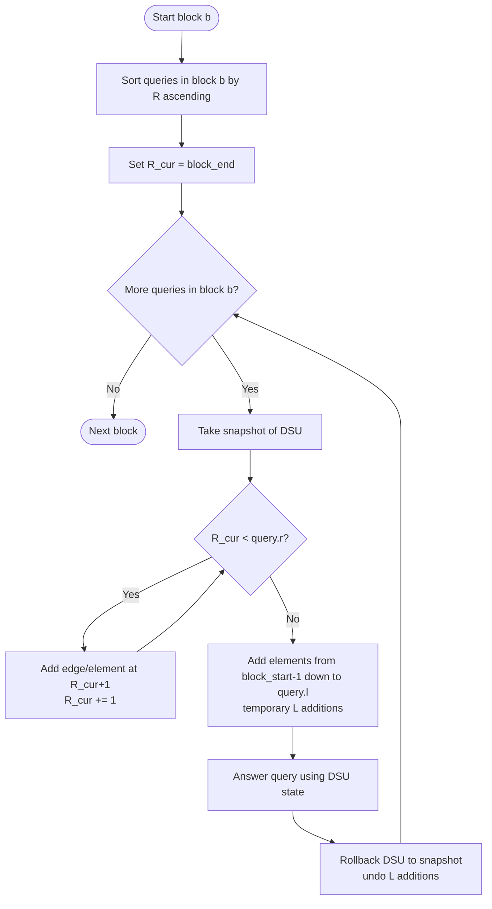

# Mo's Algorithm (Offline Range Queries)

Mo's algorithm answers many **range queries** on a static array by **reordering
the queries** so the sliding window moves very little. It is especially useful
when each add/remove update is O(1) or O(log n), but recomputing from scratch
would be too slow.

Think of it as: "I will answer your questions in the smartest order so I can
reuse almost all the work."

---

## 1. The core problem (what we are trying to speed up)

We have:

- An array `a[0..n-1]`
- Many queries of the form: **"What is the answer for subarray [l, r]?"**
- All queries are known in advance (**offline**).

Example problem: **count distinct values** in each range.

```
Array:  [1, 2, 1, 3, 1, 2, 4]
Index:   0  1  2  3  4  5  6

Queries:
  Q0: [0, 2] -> {1,2} -> 2
  Q1: [1, 4] -> {1,2,3} -> 3
  Q2: [2, 6] -> {1,2,3,4} -> 4
```

Naive approach:

- For each query, scan the range and compute the answer.
- Time: O(q * n) in the worst case.

Mo's algorithm:

- Reorder queries so the window [L, R] barely moves between them.
- Time: about O((n + q) * sqrt(n)).

---

## 2. Sliding window idea (the "add/remove" model)

Maintain a current window `[L, R]` and a data structure that can:

- `add(i)` when you extend the window to include `a[i]`
- `remove(i)` when you shrink the window past `a[i]`

For distinct counts:

```
count[x] = occurrences of value x in the window
distinct = number of x with count[x] > 0

add(i):
  x = a[i]
  if count[x] == 0: distinct += 1
  count[x] += 1

remove(i):
  x = a[i]
  count[x] -= 1
  if count[x] == 0: distinct -= 1
```

Each move of L or R costs O(1).

---

## 3. Why reordering helps

If you answer queries in random order, L and R jump around a lot.

Example (poor order):

```
Q0: [0, 6] -> L=0, R=6
Q1: [0, 2] -> R moves back by 4
Q2: [2, 6] -> L moves forward by 2, R moves forward by 4
```

Mo's algorithm sorts queries so nearby ranges are processed together, which
shrinks the total movement.

---

## 4. Block decomposition (the key trick)

Divide indices into blocks of size `B ~ sqrt(n)`.

Example with n=9, B=3:

```
Index:  0  1  2  3  4  5  6  7  8
Block:  0  0  0  1  1  1  2  2  2
```

Sort queries by:

1. block of left endpoint
2. right endpoint (ascending)

So queries in the same block are processed in order of `r`, which makes `R`
mostly move forward.

---

## 5. Full step-by-step example

Array:

```
a = [1, 2, 1, 3, 1, 2, 4]
index 0  1  2  3  4  5  6
```

Let block size B = 2 (sqrt(7) rounded).

Blocks:

```
index:  0  1  2  3  4  5  6
block:  0  0  1  1  2  2  3
```

Queries:

```
Q0: [0, 6]
Q1: [0, 2]
Q2: [2, 4]
Q3: [1, 3]
```

Sort by (block(L), R):

```
Q1: [0, 2]  block(L)=0, R=2
Q3: [1, 3]  block(L)=0, R=3
Q0: [0, 6]  block(L)=0, R=6
Q2: [2, 4]  block(L)=1, R=4
```

Now simulate pointer movement and distinct count:

```
Start window: empty, L=0, R=-1, distinct=0

Q1 [0,2]:
  add 0,1,2 -> values [1,2,1] -> distinct=2

Q3 [1,3]:
  remove 0  -> values [2,1]   -> distinct=2
  add 3     -> values [2,1,3] -> distinct=3

Q0 [0,6]:
  add 0,4,5,6 -> values [1,2,1,3,1,2,4] -> distinct=4

Q2 [2,4]:
  remove 0,1 -> values [1,3,1,2,4] -> distinct=4
  remove 5,6 -> values [1,3,1]     -> distinct=2
```

The answers are:

```
Q1 -> 2
Q3 -> 3
Q0 -> 4
Q2 -> 2
```

---

## 6. Diagram: pointer movement

```
Array:   [1, 2, 1, 3, 1, 2, 4]
Index:    0  1  2  3  4  5  6

Q1 [0,2]:  L-----R
Q3 [1,3]:    L-----R
Q0 [0,6]:  L-----------------R
Q2 [2,4]:       L-----R

Notice R mostly moves forward, with fewer large backtracks.
```



---

## 7. Simple pseudocode (MoonBit style)

This is conceptual (no public API in this package).

```mbt nocheck
///|
struct Query {
  l : Int
  r : Int
  idx : Int
}

///|
fn block_of(i : Int, block_size : Int) -> Int {
  i / block_size
}

///|
fn mo_order(qs : ArrayView[Query], block_size : Int) -> Array[Query] {
  let sorted = qs.to_array()
  sorted.sort_by((a, b) => {
    let ba = block_of(a.l, block_size)
    let bb = block_of(b.l, block_size)
    if ba != bb {
      ba - bb
    } else {
      a.r - b.r
    }
  })
  sorted
}

///|
fn process_queries(a : ArrayView[Int], qs : ArrayView[Query]) -> Array[Int] {
  let n = a.length()
  let block_size = n.to_float().sqrt().to_int().max(1)
  let ordered = mo_order(qs, block_size)

  let answers : Array[Int] = Array::make(qs.length(), 0)
  let freq : Map[Int, Int] = {}

  let add = (i : Int, distinct : Int) => {
    let x = a[i]
    let c = freq.get(x).unwrap_or(0)
    freq[x] = c + 1
    if c == 0 {
      distinct + 1
    } else {
      distinct
    }
  }

  let remove = (i : Int, distinct : Int) => {
    let x = a[i]
    let c = freq[x]
    freq[x] = c - 1
    if c - 1 == 0 {
      distinct - 1
    } else {
      distinct
    }
  }

  let _ = for q in ordered; l = 0, r = -1, distinct = 0 {
    let (l1, distinct1) = loop (l, distinct) {
      (l, distinct) => {
        if l <= q.l {
          break (l, distinct)
        }
        let next_l = l - 1
        continue (next_l, add(next_l, distinct))
      }
    }
    let (r1, distinct2) = loop (r, distinct1) {
      (r, distinct) => {
        if r >= q.r {
          break (r, distinct)
        }
        let next_r = r + 1
        continue (next_r, add(next_r, distinct))
      }
    }
    let (l2, distinct3) = loop (l1, distinct2) {
      (l, distinct) => {
        if l >= q.l {
          break (l, distinct)
        }
        continue (l + 1, remove(l, distinct))
      }
    }
    let (r2, distinct4) = loop (r1, distinct3) {
      (r, distinct) => {
        if r <= q.r {
          break (r, distinct)
        }
        continue (r - 1, remove(r, distinct))
      }
    }
    answers[q.idx] = distinct4
    continue l2, r2, distinct4
  }
  answers
}
```

---

## 8. More examples (what else can Mo handle?)

Mo's algorithm works when you can maintain the answer under add/remove.

### Example A: sum of squared frequencies

Let:

```
answer = sum over values x of (count[x] * count[x])
```

Update on add/remove:

```
add x:
  ans -= count[x]^2
  count[x]++
  ans += count[x]^2

remove x:
  ans -= count[x]^2
  count[x]--
  ans += count[x]^2
```

This gives you statistics like "how repetitive is the subarray?"

### Example B: number of pairs with equal values

If `count[x]` is how many times x appears:

```
pairs = sum over x of count[x] * (count[x] - 1) / 2
```

This is common in competitive programming problems with "count pairs in range".

---

## 9. Complexity (why the sqrt shows up)

Let `B = sqrt(n)`.

- There are about `n / B` blocks.
- Within each block, R mostly moves forward: about O(n) per block.
- Total R movement: O(n * n / B) = O(n * sqrt(n)).
- L moves at most O(q * B).

So total time:

```
O((n + q) * sqrt(n))
```

Sorting the queries costs O(q log q), which is usually smaller.

---

## 10. Mo's Algorithm with Rollback

Some problems cannot support a `remove` operation efficiently. For example,
queries on graphs asking "how many connected components are there in the
subgraph induced by edges in [l, r]?" If the data structure is a Union-Find
(DSU), you can union but not un-union in O(1).

**Mo's algorithm with rollback** (also called "Mo on trees" or "offline LCT")
solves this by restructuring how the window moves so that `remove` is never
needed. Instead, it uses a **rollback-capable DSU** that can undo unions.

### How rollback changes the algorithm

Standard Mo's algorithm expands and shrinks both L and R freely. With rollback:

- Queries within each block are processed in a special two-phase pattern.
- The **right endpoint R** only expands, never shrinks.
- The **left endpoint L** is handled by saving a snapshot of the DSU before
  each query and rolling back after.

This avoids ever calling `remove`, at the cost of redoing L-side work per query.

### Block structure for rollback

```
Array indices:  0  1  2  3  4  5  6  7  8
Blocks (B=3):   [---0---] [---1---] [---2---]

For block 0, queries with l in [0,2]:
  R expands monotonically from block boundary to n-1.
  L is set fresh for each query by adding from block boundary down to l,
  then rolled back after answering.

For block 1, queries with l in [3,5]:
  Same pattern: R only grows, L rolled back per query.
```

### State machine for one query in rollback mode

```
+----------------------------+
|  Snapshot DSU state        |   <-- save checkpoint before touching L
+----------------------------+
           |
           v
+----------------------------+
|  Add elements from R to    |   <-- R expansion (permanent, cumulative)
|  block_end+1 up to query.r |
+----------------------------+
           |
           v
+----------------------------+
|  Add elements from          |   <-- L contraction (temporary)
|  block_start-1 down to l  |
+----------------------------+
           |
           v
+----------------------------+
|  Answer the query          |   <-- read from DSU
+----------------------------+
           |
           v
+----------------------------+
|  Rollback DSU to snapshot  |   <-- undo L-side additions
+----------------------------+
```

### Mermaid diagram: rollback algorithm flow



### Complexity of rollback variant

```
Block size: B = sqrt(n)
Number of blocks: n / B = sqrt(n)

R movement:
  Within each block, R only moves forward from block_end to n-1.
  Per block: O(n) moves.
  Total: O(n * sqrt(n)).

L movement (temporary, rolled back):
  Each query adds at most B elements from L down to query.l.
  Total: O(q * B) = O(q * sqrt(n)).

Rollback cost:
  Each rollback undoes at most B operations.
  Total: O(q * B) = O(q * sqrt(n)).

Overall: O((n + q) * sqrt(n))
```

The complexity matches standard Mo's, but `remove` is never called. Only
`add` and a rollback-capable snapshot mechanism are required.

### What you need for rollback variant

| Requirement     | Standard Mo   | Mo with Rollback     |
|-----------------|---------------|----------------------|
| add(i)          | required      | required             |
| remove(i)       | required      | NOT needed           |
| rollback / undo | not needed    | required             |
| sorting order   | (block_L, R)  | (block_L, R)         |
| L movement      | free both way | only expands inward  |
| R movement      | free both way | only expands outward |

### ASCII art: comparison of standard vs rollback window movement

```
Standard Mo (queries Q0..Q3 across two blocks, B=3):

  Index:  0  1  2  3  4  5  6
          [--block0--][--block1--]

  Q1 l=0, r=4:   L===========R
  Q2 l=1, r=6:    L===============R   (R expands, L shifts right)
  Q3 l=3, r=2:          L====R        (R shrinks back -- requires remove!)

Mo with Rollback (same queries):

  Block 0 (l in [0,2]):

    R starts at block_end=2, expands only rightward:
    Q1 l=0, r=4:   [snapshot] L......R===========  [rollback L side]
    Q2 l=1, r=6:   [snapshot]  L.....R===============  [rollback L side]
    (R never moves left within a block pass)

  Block 1 (l in [3,5]):

    R resets to block_end=5, expands only rightward:
    Q3 l=3, r=6:   [snapshot]        L===========R  [rollback L side]
```

---

## 11. Practical tips

1. **Coordinate compression**: If values are large, compress them so `count`
   is a small array instead of a map.
2. **Odd-even block order**: Sort by R ascending in even blocks and descending
   in odd blocks to reduce backtracking.
3. **Block size tuning**: For very large q, try `B = max(1, n / sqrt(q))`.
4. **Offline requirement**: You must know all queries first.
5. **No updates**: Standard Mo does not support point updates; that is a
   different variant (Mo's with modifications).
6. **Rollback DSU**: When `remove` is impossible, use a union-by-rank DSU
   with no path compression and an explicit history stack for rollback.

---

## 12. When to use (and when not to)

Use Mo's algorithm when:

- Queries are offline and static.
- Your add/remove is O(1) or O(log n).
- The answer is hard to compute from scratch.

Use Mo's with rollback when:

- Queries are offline and static.
- Only `add` is efficient; `remove` is not possible.
- A snapshot/rollback mechanism exists (e.g., rollback DSU).

Avoid Mo's when:

- You need online answers.
- The array changes frequently (updates).
- Each add/remove is expensive.

---

## 13. Summary

Mo's algorithm is a powerful reordering technique:

- It turns expensive per-query recomputation into cheap incremental updates.
- It is simple once you define `add` and `remove`.
- It trades ordering freedom (offline queries) for speed.

Mo's with rollback extends this to structures where only `add` is reversible:

- It eliminates `remove` by using snapshots and rollback.
- It is the standard approach for offline graph connectivity queries.
- Same asymptotic complexity: O((n + q) * sqrt(n)).

If your problem fits the add/remove model, Mo's algorithm is often the
cleanest way to reach near-linear performance.
