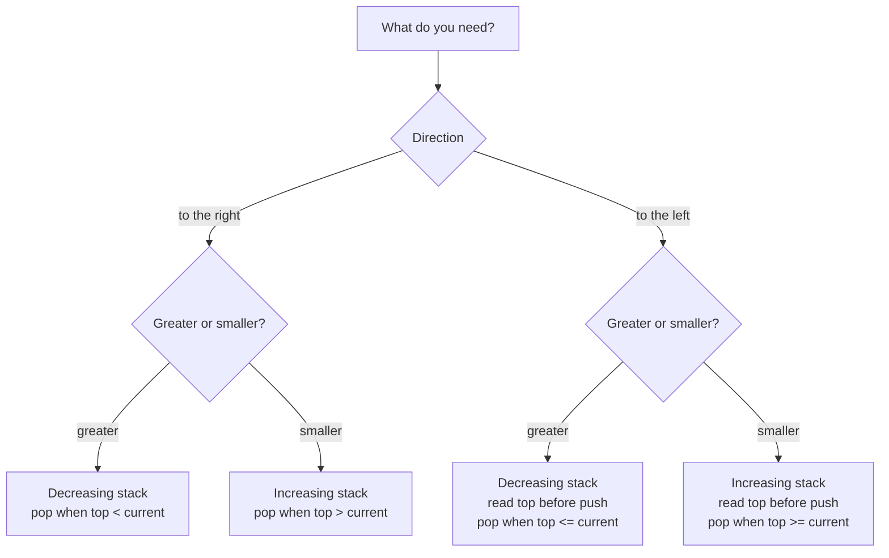
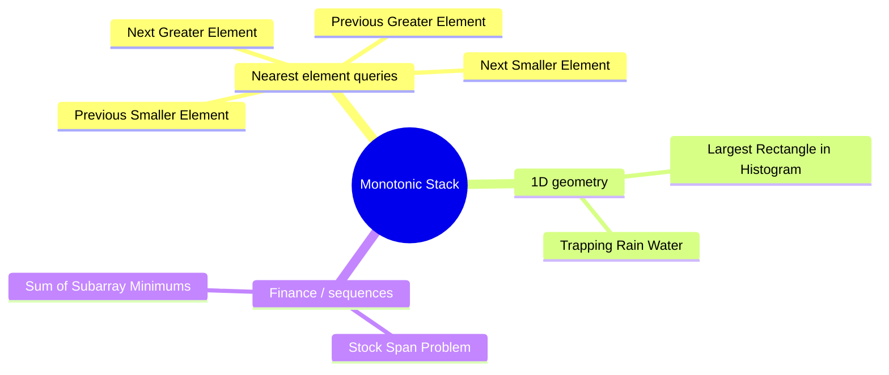

# Monotonic Stack

This package is a **tutorial** package (no exported functions). It explains
how to use a **monotonic stack** to solve "nearest greater/smaller" problems
in linear time, and demonstrates five classic applications with full
proof-carrying loop invariants.

A monotonic stack stores indices so the corresponding values are always in
sorted order:

- **Decreasing stack**: values strictly decrease from bottom to top.
  Useful for "next greater" and "previous greater" queries.
- **Increasing stack**: values strictly increase from bottom to top.
  Useful for "next smaller" and "previous smaller" queries.

---

## 1. The basic idea

Suppose we scan the array from left to right. When we see a new value we can
settle answers for some earlier indices, because the new value is the first
value to the right that is larger (or smaller).

The stack holds **indices that are still waiting for an answer**.

If we need "next greater to the right":

- Keep a **decreasing** stack of values.
- When we see a bigger value, it resolves all smaller ones on the top.

### Why store indices instead of values?

Storing the index lets you compute:

- the **distance** between two positions (for span and width problems),
- the **value** at any position via `arr[index]`.

---

## 2. State machine view

```
                    ┌─────────────────────────────────────┐
                    │                                     │
                    ▼                                     │
  ┌──────────────────────┐   a[i] breaks      ┌──────────┴──────────┐
  │  push i onto stack   │   monotonicity      │  pop top, record    │
  │  (invariant holds)   │ ◄───────────────── │  answer for top     │
  └──────────────────────┘                    └─────────────────────┘
           │                                          ▲
           │ advance i                                │
           ▼                                          │
  ┌──────────────────────┐   stack non-empty &        │
  │     next element     │ ──────────────────────────►┘
  │       a[i]           │   a[i] still breaks
  └──────────────────────┘   monotonicity
```

---

## 3. A small picture

Array: `[4, 5, 2, 10, 8]`

```
index:  0  1  2   3  4
value:  4  5  2  10  8

Stack grows to the right; top is at the right end.
```

Step-by-step for "next greater to the right":

```
i=0 (val 4):  stack []             push 0        stack [0]      vals [4]
i=1 (val 5):  5 > 4, pop 0        answer[0]=1   push 1         stack [1]      vals [5]
i=2 (val 2):  2 > 5? no           push 2                       stack [1,2]    vals [5,2]
i=3 (val 10): 10 > 2, pop 2       answer[2]=3
              10 > 5, pop 1       answer[1]=3   push 3         stack [3]      vals [10]
i=4 (val 8):  8 > 10? no          push 4                       stack [3,4]    vals [10,8]

Remaining indices 3 and 4 have no next greater -> answer = -1
```

Final answer (index of next greater): `[1, 3, 3, -1, -1]`.

---

## 4. Stack contents visualised

Below is a snapshot of the decreasing stack after each step for the array
`[4, 5, 2, 10, 8]`:

```
After i=0:  bottom [idx=0, val=4] top
After i=1:  bottom [idx=1, val=5] top
After i=2:  bottom [idx=1, val=5] [idx=2, val=2] top
After i=3:  bottom [idx=3, val=10] top
After i=4:  bottom [idx=3, val=10] [idx=4, val=8] top
            └────── always decreasing ──────────────┘
```

---

## 5. Example 1: next greater element (to the right)

```mbt check
///|
fn next_greater_right(a : ArrayView[Int]) -> Array[Int] {
  let n = a.length()
  let ans = Array::make(n, -1)
  let stack : Array[Int] = []
  for i in 0..<n {
    let ai = a[i]
    for pop_next = stack.length() > 0 && a[stack[stack.length() - 1]] < ai; pop_next; {
      let top = stack[stack.length() - 1]
      let _ = stack.pop()
      ans[top] = ai
      continue stack.length() > 0 && a[stack[stack.length() - 1]] < ai
    }
    stack.push(i)
  }
  ans
}

///|
test "next greater to the right" {
  let a : Array[Int] = [4, 5, 2, 10, 8]
  inspect(next_greater_right(a[:]), content="[5, 10, 10, -1, -1]")
}
```

---

## 6. Example 2: previous smaller element (to the left)

This time we want the **nearest smaller** on the left.
We keep an **increasing** stack and read the answer from the top before
pushing the current index.

```
Array: [3, 5, 2, 7, 6]

After i=0 (val 3):  stack [0]         ans[0]=-1  (nothing to left)
After i=1 (val 5):  stack [0,1]       ans[1]=3   (top has val 3 < 5)
After i=2 (val 2):  stack [2]         ans[2]=-1  (popped 0 and 1)
After i=3 (val 7):  stack [2,3]       ans[3]=2   (top has val 2 < 7)
After i=4 (val 6):  stack [2,4]       ans[4]=2   (popped 3, top val 2 < 6)
                    └── increasing ──┘
```

```mbt check
///|
fn prev_smaller_left(a : ArrayView[Int]) -> Array[Int] {
  let n = a.length()
  let ans = Array::make(n, -1)
  let stack : Array[Int] = []
  for i in 0..<n {
    let ai = a[i]
    for pop_next = stack.length() > 0 && a[stack[stack.length() - 1]] >= ai; pop_next; {
      let _ = stack.pop()
      continue stack.length() > 0 && a[stack[stack.length() - 1]] >= ai
    }
    if stack.length() > 0 {
      let top = stack[stack.length() - 1]
      ans[i] = a[top]
    }
    stack.push(i)
  }
  ans
}

///|
test "previous smaller to the left" {
  let a : Array[Int] = [3, 5, 2, 7, 6]
  inspect(prev_smaller_left(a[:]), content="[-1, 3, -1, 2, 2]")
}
```

---

## 7. Example 3: stock span

Stock span asks: for each day, how many consecutive days (including today)
have price `<=` today's price?

```
prices: [100, 80, 60, 70, 60, 75, 85]
span:   [  1,  1,  1,  2,  1,  4,  6]
```

The span equals the **distance to the previous strictly greater price**.

```
Timeline (prices):

day:   0    1    2    3    4    5    6
price: 100  80   60   70   60   75   85
       |    |    |    ←——→ |    ←——————→
       1    1    1     2   1       4    6
```

This is implemented using a decreasing stack of indices.  When
`prices[stack.top()] <= prices[i]`, those days are dominated by day `i` and
are popped; the remaining top (if any) is the previous greater day.

```mbt check
///|
fn stock_span(prices : ArrayView[Int]) -> Array[Int] {
  let n = prices.length()
  let span = Array::make(n, 0)
  let stack : Array[Int] = []
  for i in 0..<n {
    let p = prices[i]
    for pop_next = stack.length() > 0 && prices[stack[stack.length() - 1]] <= p; pop_next; {
      let _ = stack.pop()
      continue stack.length() > 0 && prices[stack[stack.length() - 1]] <= p
    }
    if stack.length() == 0 {
      span[i] = i + 1
    } else {
      let top = stack[stack.length() - 1]
      span[i] = i - top
    }
    stack.push(i)
  }
  span
}

///|
test "stock span" {
  let prices : Array[Int] = [100, 80, 60, 70, 60, 75, 85]
  inspect(stock_span(prices[:]), content="[1, 1, 1, 2, 1, 4, 6]")
}
```

---

## 8. Example 4: largest rectangle in a histogram

```
heights = [2, 1, 5, 6, 2, 3]

index:   0  1  2  3  4  5
height:  2  1  5  6  2  3

 6        ┌──┐
 5     ┌──┤  │
 4     │  │  │
 3     │  │  │     ┌──┐
 2  ┌──┤  │  │  ┌──┤  │
 1  │  ├──┤  │  │  │  │
    └──┴──┴──┴──┴──┴──┘
     0  1  2  3  4  5
```

For each bar `i`, find:
- `L` = index of nearest smaller to the left  (or -1)
- `R` = index of nearest smaller to the right (or n)

Then the widest rectangle at height `heights[i]` spans `[L+1, R-1]`:

```
area[i] = heights[i] * (R - L - 1)
```

The largest rectangle uses bars 2 and 3 (height 5, width 2):

```
 5  ┌─────────┐     ← height 5
    │ i=2,3   │
    │ width=2 │
    └─────────┘
  L=1 (val 1)  R=4 (val 2)
  area = 5 * (4 - 1 - 1) = 10
```

We compute `L` with a left-to-right increasing stack and `R` with a
right-to-left increasing stack.

---

## 9. Example 5: trapping rain water

```
heights = [0,1,0,2,1,0,1,3,2,1,2,1]

  3              ┌──┐
  2        ┌──┐  │  │     ┌──┐
  1     ┌──┤~~├──┤  ├──┬──┤  ├──┐
  0  ┌──┘  │~~│  │  │~~│  │  │  │
      0  1  2  3  4  5  6  7  8  9 10 11

  ~~ = trapped water (total = 6 units)
```

The algorithm uses a **decreasing** stack.  When bar `i` is taller than
the top, the top is a "bowl bottom".  The bar below the popped top is the
left wall; bar `i` is the right wall.  Water fills up to the shorter wall.

```
  right wall (bar i)
      │
      ▼           width = i - left - 1
  ┌───┐           height = min(heights[left], heights[i]) - heights[mid]
  │   │~~~┌───┐
  │   │~~~│   │  ← left wall (new stack top after pop)
  │   │mid│   │  ← popped bar (the "bowl bottom")
  └───┘   └───┘
 left     right
```

---

## 10. Variants cheat sheet

```
Goal                      Stack order   Scan direction   Pop condition
----------------------------------------------------------------------
Next greater to right     decreasing    left -> right    top < current
Next smaller to right     increasing    left -> right    top > current
Prev greater to left      decreasing    left -> right    top <= current (read top before push)
Prev smaller to left      increasing    left -> right    top >= current (read top before push)
```

### Mermaid: which stack to choose



### Tip for duplicates

- If equal values should count as "greater/smaller", use `<=` / `>=` when popping.
- If equal values should not count, use `<` / `>` when popping.

---

## 11. Why it is O(n)

Each index is pushed **once** and popped **at most once**.
So total push + pop operations are bounded by `2n`.

```
n = 5   [4, 5, 2, 10, 8]

push operations:  5   (one per element)
pop  operations: ≤5   (each element popped at most once)
total:           ≤10 = 2n
```

Even though the inner loop runs multiple times for some `i`, the total
across all iterations of the outer loop is still linear.

---

## 12. Application map



---

## 13. Practical tips

1. **Store indices, not values.** This lets you compute distances and ranges.
2. **Keep the invariant simple.** Decide whether the stack should be strictly
   increasing or decreasing, then never violate it.
3. **Choose your comparison carefully** (`<` vs `<=`) when duplicates exist.
4. **Use arrays as stacks.** `push`, `pop`, and reading the last element are
   the only operations needed.
5. **Two-pass vs one-pass.** For problems that need both left and right
   boundaries (histogram, rain water), you can either run two separate passes
   or handle both in a single left-to-right scan.

---

## 14. Summary

A monotonic stack is a small but powerful trick:

- It turns many "nearest greater/smaller" problems into linear scans.
- It is the backbone of stock span, histogram area, rain water, and more.
- The only real work is choosing the correct comparison direction.
- Each element is pushed and popped at most once, giving O(n) time overall.
