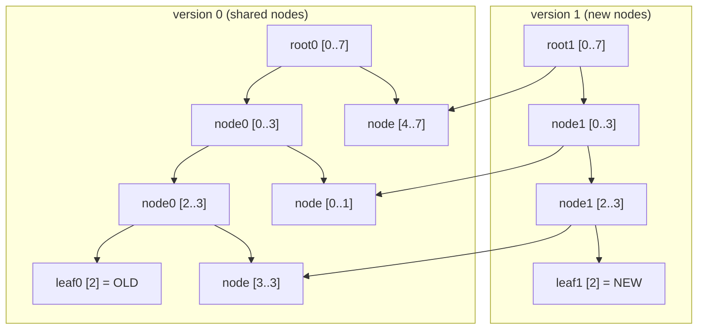
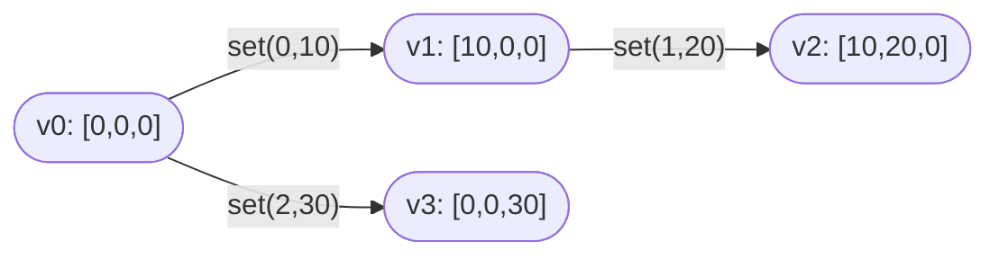
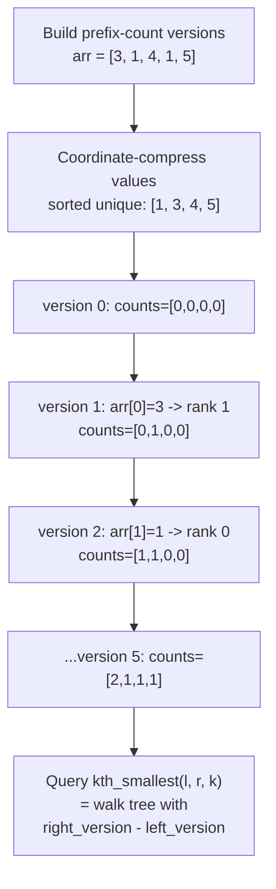

# Persistent Data Structures (Versioned Data)

This package is a **tutorial** package (no exported functions). It explains
how persistent data structures keep **old versions** after updates without
copying everything.

Think of persistence like a time machine for data:

- Every update creates a **new version**.
- Old versions remain readable forever.
- Updates only copy the **path** that changes.

---

## 1. First intuition: versions as a timeline

```
version 0:  [1, 2, 3, 4]
version 1:  [1, 2, 9, 4]   (changed index 2)
version 2:  [1, 8, 9, 4]   (changed index 1)

We can still query version 0 at any time.
We did NOT clone the full array each time.
```

We only copied the pieces affected by the update. Everything else is shared.

---

## 2. Persistent vs immutable vs mutable (beginner table)

```
Mutable:
  - Update overwrites the old value
  - Old versions are lost

Immutable (copy-on-write, naive):
  - Update makes a full copy
  - Old versions kept, but expensive

Persistent (path copying):
  - Update makes a *small* copy
  - Old versions kept, efficient
```

---

## 3. The key trick: path copying

When you update a node in a tree, you only copy the nodes on the path from the
root to that node.

Example (binary tree):

```
Before update (version 0):
        A
       / \
      B   C
     / \
    D   E

Update E -> E'

After update (version 1):
        A'           (new root)
       /  \
      B'   C          (C is shared)
     / \
    D   E'            (D is shared)
```

Only A, B, E were copied. C and D are reused.

This is why each update is O(log n) for balanced trees.

---

## 3b. Path copying in a segment tree (diagram)

Suppose we store an array of length 8 in a segment tree:

```
root [0..7]
  /         \
[0..3]     [4..7]
 /   \      /   \
[0..1][2..3][4..5][6..7]
```

Update index 2:

```
Copied nodes: [0..7], [0..3], [2..3], [2..2]
Shared nodes: everything else
```

So each update only copies **O(log n)** nodes.

---

## 3c. Path copying visualised with Mermaid

The tree below shows version 0 (left, shaded) and the new nodes created when
index 2 is updated.  Shared nodes are referenced by both versions; copied nodes
appear as darker boxes.



Nodes `[4..7]`, `[0..1]`, and `[3..3]` appear in both versions with no
duplication.  Only the four nodes on the path from root to the updated leaf are
copied.

---

## 4. Example: a persistent stack (purely functional)

A linked stack is **naturally persistent**: pushing just adds a new head.

We can show version branching without any mutation.

```mbt check
///|
enum PStack[T] {
  Nil
  Cons(T, PStack[T])
} derive(Debug)

///|
fn[T] PStack::push(self : PStack[T], x : T) -> PStack[T] {
  Cons(x, self)
}

///|
fn[T] PStack::pop(self : PStack[T]) -> PStack[T] {
  match self {
    Cons(_, rest) => rest
    Nil => Nil
  }
}

///|
fn[T] PStack::top(self : PStack[T]) -> T? {
  match self {
    Cons(x, _) => Some(x)
    Nil => None
  }
}

///|
test "persistent stack versions" {
  let v0 : PStack[Int] = Nil
  let v1 = v0.push(5)
  let v2 = v1.push(3)
  let v3 = v1.push(7) // branch from v1
  inspect(v0.top(), content="None")
  inspect(v1.top(), content="Some(5)")
  inspect(v2.top(), content="Some(3)")
  inspect(v3.top(), content="Some(7)")

  // Old versions are still intact:
  inspect(v1.top(), content="Some(5)")
  inspect(v2.pop().top(), content="Some(5)")
}
```

Key idea: each version is just a pointer to a different head node.

The branching structure looks like this:

```
                Nil  (v0)
                 |
               Cons(5)  (v1)
              /        \
         Cons(3)      Cons(7)
           (v2)         (v3)

v2 and v3 share the Cons(5) tail — no copy was made.
```

---

## 5. Example: versioned arrays (conceptual)

Arrays are not naturally persistent, so we usually build them on top of a
tree (segment tree or balanced BST). Updating index `i` replaces the leaf and
copies the path to the root.

```
Update index 2 in version 0:

v0 root
  ├─ left subtree (shared)
  └─ right subtree (copied)
         └─ leaf at index 2 (copied)
```

That gives a new root for version 1, but still shares most nodes.

---

## 6. Example: persistent segment tree (range sums)

Suppose we track sums. Start with:

```
v0: [1, 2, 3, 4, 5]   sum = 15
```

Update position 2 (0-based) from 3 to 10:

```
v1: [1, 2, 10, 4, 5]  sum = 22
```

Both versions exist simultaneously:

```
query(v0, 1..3) -> 2 + 3 + 4 = 9
query(v1, 1..3) -> 2 + 10 + 4 = 16
```

Only the path to index 2 is copied.

---

## 6b. Time-travel query example

```
v0: [1, 2, 3, 4]
v1: [1, 2, 9, 4]   // update index 2

sum(v0, 0..3) = 1+2+3+4 = 10
sum(v1, 0..3) = 1+2+9+4 = 16
```

The two versions answer different queries without interfering.

---

## 6c. Segment tree node layout (ASCII)

For the five-element array `[1, 2, 3, 4, 5]` the internal node pool looks like:

```
 pool index :  0    1    2    3    4    5    6    7    8
 range       [0..4][0..2][3..4][0..1][2..2][3..3][4..4][0..0][1..1]
 sum         : 15    6    9    3    3    4    5    1    2
```

After `update(0, 2, 10)` three new nodes are appended:

```
 pool index :  ... 9       10      11
 range           [2..2]  [0..2] [0..4]
 sum              10       13      22
```

The new root for version 1 is node 11.  Nodes 0-8 are unchanged and still
reachable from the version-0 root (node 0).

---

## 7. Example: branching history

Persistent structures allow **branching**.

```
v0: [0, 0, 0]

v1 from v0: set(0, 10) -> [10, 0, 0]
v2 from v1: set(1, 20) -> [10, 20, 0]
v3 from v0: set(2, 30) -> [0, 0, 30]

v2 and v3 are independent branches.
```

This is exactly how version control works:

```
v0 ---- v1 ---- v2
  \
   \---- v3
```

The Mermaid diagram below shows the same branching at the version-root level:



---

## 8. Example: k-th smallest in a range (conceptual)

Persistent segment trees are often used for:

```
"What is the k-th smallest value in [l, r]?"
```

Trick:

- Build version i as the frequency counts of prefix [0..i-1].
- To answer [l, r], subtract two versions:
  - counts in prefix r+1
  - counts in prefix l

Then walk down the tree using the frequency difference.

### How two-version subtraction works (ASCII)

```
Frequency tree for prefix [0..4] of arr=[3,1,4,1,5]:
  value ranks (sorted unique: 1,3,4,5)

  version 0 (empty):  all counts = 0
  version 5 (full) :  rank[0]=2, rank[1]=1, rank[2]=1, rank[3]=1

To find the 2nd smallest in the full range:
  left subtree count  = count(rank 0..1) = 2+1 = 3  >= k=2
  -> descend left
  left-left count     = count(rank 0)    = 2       >= k=2
  -> descend left-left
  leaf at rank 0 = value 1
```

---

## 8b. K-th smallest end-to-end Mermaid view



---

## 9. Types of persistence

```
Partial persistence:
  - Query any version
  - Update only the newest version

Full persistence:
  - Query any version
  - Update any version (creates branch)

Confluent persistence:
  - Merge two versions into one
  - Hardest to implement
```

Most competitive programming problems use **partial or full persistence**.

---

## 10. Complexity table (rule of thumb)

| Structure | Update | Query | Extra Space / Update |
|-----------|--------|-------|----------------------|
| Persistent stack | O(1) | O(1) | O(1) |
| Persistent array | O(log n) | O(log n) | O(log n) |
| Persistent segment tree | O(log n) | O(log n) | O(log n) |
| Persistent treap | O(log n) | O(log n) | O(log n) |

---

## 11. When should you use persistence?

Use it when you need:

- **Undo/redo** in editors
- **time travel queries** ("what was the value yesterday?")
- **branching histories** (version control, search trees)
- **offline queries** like "k-th smallest in subarray"

Avoid it when:

- data is tiny (simple copy is fine),
- queries are only on the latest version.

---

## 12. Common pitfalls

1. **Accidentally mutating shared nodes**  
   Once you mutate a node, you destroy persistence. Always copy.

2. **Memory blow-up**  
   Each update adds O(log n) nodes. It is efficient, but still grows with
   the number of updates.

3. **Large value domains**  
   For frequency-based trees, compress values first.

---

## 13. Summary

Persistent data structures are a sweet spot:

- They keep every version accessible,
- They share most structure to stay efficient,
- They enable branching histories and historical queries.

Once you understand **path copying**, most persistent structures become
straightforward.
