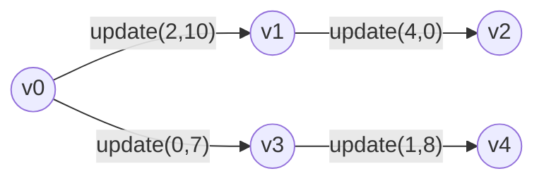
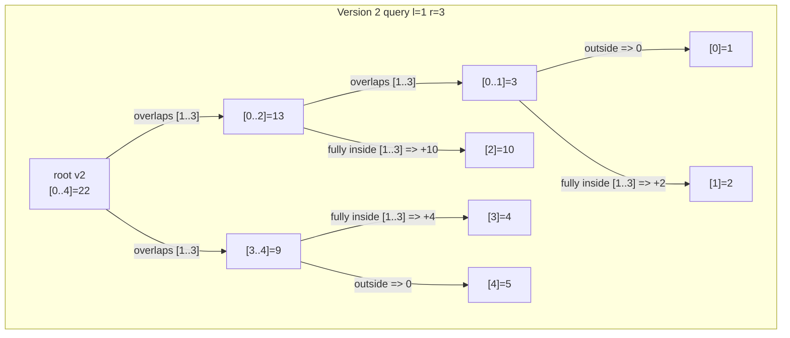
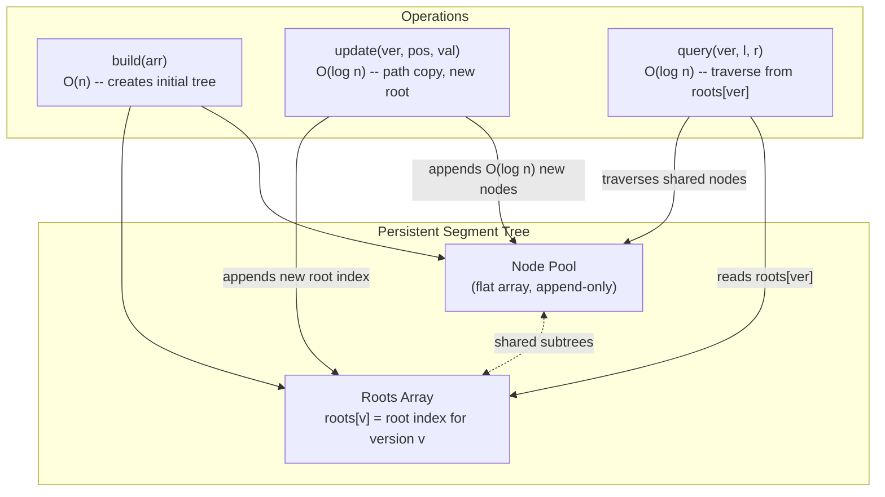

# Persistent Segment Tree (Versioned Range Queries)

This package is a **tutorial** package (no exported functions). It explains
how a persistent segment tree keeps **every historical version** after updates
and shares most of the structure between versions.

If a regular segment tree is a tree of ranges, a **persistent** segment tree is
the same tree, but you keep **all old roots** and only copy the update path.

Two variants are implemented:

- `PersistentSegTree` -- versioned range-sum tree supporting point updates and
  range queries on any past version.
- `KthSmallest` -- prefix-frequency variant that answers k-th smallest queries
  over arbitrary subarrays in O(log n) per query.

---

## 1. Core idea: path copying on update

A regular segment tree **overwrites** nodes in place. A persistent segment tree
instead **copies** only the nodes touched by an update -- the path from the
updated leaf up to the root. Every other node is shared with the previous
version.

Because a balanced segment tree has height O(log n), each update copies exactly
O(log n) nodes and creates a new root. All old roots remain valid entry-points
into the shared node pool.

---

## 2. ASCII art: what changes on an update

Array `[1, 2, 3, 4]`, update index 1 from `2` to `9`.

The numbers in parentheses are node indices in the shared node array.

```
Version 0 (initial)                 Version 1 (after update index 1 -> 9)

      (4)[0..3]=10                         (8)[0..3]=17
         /        \                           /        \
   (2)[0..1]=3   (3)[2..3]=7          (7)[0..1]=10   (3)[2..3]=7   <-- right shared
      /    \        /    \               /    \
  (0)[0]=1 (1)[1]=2 (5)[2]=3 (6)[3]=4 (0)[0]=1 (9)[1]=9    <-- only leaf and its
                                                             --   ancestors are new
```

Nodes `(0)`, `(1)`, `(2)`, `(3)`, `(5)`, `(6)` belong to version 0.
The update creates three new nodes: `(7)` (new internal), `(8)` (new root),
`(9)` (new leaf). Node `(3)` -- the right half -- is reused unchanged.

**Only O(log n) new nodes per update. Everything else is shared.**

---

## 3. Detailed path-copying diagram

Update index 2 in an array of length 8:

```
  Version 0                              Version 1

       [ 0..7 ]                               [ 0..7 ]'  <-- new root
       /       \                              /        \
  [ 0..3 ]   [ 4..7 ]              [ 0..3 ]'   [ 4..7 ]  <-- right half shared
   /    \      /    \               /    \
[0..1][2..3][4..5][6..7]       [0..1][2..3]'   <-- [0..1] shared, [2..3] new
              /    \                    /    \
            [2]    [3]               [2]'   [3]  <-- leaf [2] new, [3] shared

Shared nodes (from v0, unchanged):  [4..7], [4..5], [6..7], [0..1], [3]
New nodes    (created for v1):      [0..7]', [0..3]', [2..3]', [2]'

Height = log2(8) = 3 levels  =>  4 new nodes  (one per level including leaf)
```

General rule for an array of size n: exactly `floor(log2 n) + 1` new nodes.

---

## 4. Memory layout: the shared node pool

All versions share a single flat array of nodes. Version roots are indices into
this array.

```
  Node array (grows to the right with each update):

  index:  0    1    2    3    4    5    6    7    8    9   10   11  ...
         [0]  [1]  [2]  [3] [0..1][2..3][0..3] [4] [0..1]'[2]'[2..3]'[0..3]'
          ^--- initial tree v0 (7 nodes) ---^    ^--- new nodes for v1 ---^

  roots:  v0 -> index 6    v1 -> index 11
```

Querying version 0 starts at `nodes[6]`. Querying version 1 starts at
`nodes[11]`. Both reach shared subtrees through the same array.

---

## 5. Version tree (branching history)

Every update can branch from **any** existing version, not just the latest one.
The result is a tree of versions rather than a linear sequence:

```
  v0  --update(2, 10)-->  v1  --update(4, 0)-->  v2
   |
   +--update(0, 7)-->  v3  --update(1, 8)-->  v4
```

In a mermaid diagram:



Each version is a separate root. Querying v2 and v3 gives independent answers
without either version seeing the other's changes.

---

## 6. Worked example: range sums across versions

Initial array `v0 = [1, 2, 3, 4, 5]`:

```
sum(v0, 0..4) = 15
sum(v0, 1..3) = 9     (2 + 3 + 4)
```

Update index 2 to 10, producing `v1 = [1, 2, 10, 4, 5]`:

```
sum(v1, 0..4) = 22
sum(v1, 1..3) = 16    (2 + 10 + 4)
```

Both versions are live simultaneously:

```
query(v0, 1..3) = 9
query(v1, 1..3) = 16
```

---

## 7. Pseudocode for update (path copying)

```mbt nocheck
///|
struct Node {
  left : Int
  right : Int
  sum : Int
}

// Update one position, return new root index.
// Only nodes on the path from root to the leaf are created.

///|
fn update(node : Int, lo : Int, hi : Int, idx : Int, val : Int) -> Int {
  if lo == hi {
    return new_node(left=-1, right=-1, sum=val)  // new leaf
  }
  let mid = (lo + hi) / 2
  let old = nodes[node]
  if idx <= mid {
    let new_left = update(old.left, lo, mid, idx, val)
    let new_sum = nodes[new_left].sum + nodes[old.right].sum
    return new_node(left=new_left, right=old.right, sum=new_sum)  // share right
  } else {
    let new_right = update(old.right, mid + 1, hi, idx, val)
    let new_sum = nodes[old.left].sum + nodes[new_right].sum
    return new_node(left=old.left, right=new_right, sum=new_sum)  // share left
  }
}
```

Key: the unmodified child (`old.right` or `old.left`) is **reused by index**,
not copied.

---

## 8. Range query on a specific version

Queries work exactly like a normal segment tree query, except the starting root
is `roots[version]` instead of a single fixed root:

```
query(version=v2, l=1, r=3)
  |
  +-- start from roots[v2]
  +-- descend into [l, r] as usual (O(log n) nodes visited)
  +-- return accumulated sum
```

The query never touches nodes exclusive to other versions.



Total: 2 + 10 + 4 = 16.

---

## 9. Application 1: time-travel range sum

```
Process updates over time:
  v0: initial state
  v1: after update #1
  v2: after update #2
  ...

Question: "What was sum([l, r]) after update #k?"
Answer:   query(vk, l, r)
```

No snapshots of the full array are needed -- just the sequence of roots.

---

## 10. Application 2: k-th smallest in subarray

**Problem**: given an array, answer queries of the form "what is the k-th
smallest element in `arr[l..r]`?" in O(log n) per query.

**Trick**: build a persistent **frequency tree** over coordinate-compressed
values. Version `i` holds the frequency counts for the prefix `arr[0..i-1]`.

```
Array:  [3, 1, 4, 1, 5]   (values compressed to ranks 0..3)
  rank:   1  0  2  0  3

  v0 (empty prefix):   all counts = 0
  v1 (prefix [3]):     rank 1 -> count 1
  v2 (prefix [3,1]):   rank 0 -> count 1,  rank 1 -> count 1
  v3 (prefix [3,1,4]): rank 0 -> count 1,  rank 1 -> count 1,  rank 2 -> count 1
  ...
```

To find k-th smallest in `arr[l..r]`, compare versions `l` and `r+1`:

```
count in [l, r] = tree[r+1].count - tree[l].count
```

Walk down the frequency tree guided by counts to find the k-th element.

```
Two-version walk for k=2 in range [1..3] (values [1, 4, 1]):

                left_root (v1)        right_root (v4)
                    [0..3]=1              [0..3]=3
                   /       \            /        \
                [0..1]=1  [2..3]=0   [0..1]=2  [2..3]=1

  left_count in [0..1] = right[0..1].sum - left[0..1].sum = 2 - 1 = 1
  k=2 > left_count=1  =>  go right, k becomes 2-1=1

                [2..3]=0              [2..3]=1
               /       \            /        \
            [2]=0      [3]=0     [2]=1      [3]=0

  left_count in [2] = 1 - 0 = 1
  k=1 <= left_count=1  =>  go left

  lo==hi==2  =>  return sorted_vals[2] = 4
```

---

## 11. Mermaid: overall architecture



---

## 12. Complexity summary

```
Build:   O(n)               -- initial tree construction
Update:  O(log n) time,     -- path copy from root to leaf
         O(log n) new nodes
Query:   O(log n)           -- same traversal as regular segtree
Space:   O(n + q * log n)   -- n initial + q updates * log n nodes each
```

For an array of 10^6 elements with 10^6 updates: roughly 20 * 10^6 extra nodes.

---

## 13. Comparison: regular vs persistent

```
Regular segment tree:
  - Single mutable tree
  - Update overwrites nodes in place
  - Only the latest state is queryable
  - O(n) space total

Persistent segment tree:
  - Shared immutable node pool
  - Update appends new nodes, never overwrites
  - Any historical version is queryable
  - O(n + q log n) space total
```

| Property          | Regular segtree     | Persistent segtree        |
|-------------------|---------------------|---------------------------|
| Space             | O(n)                | O(n + q log n)            |
| Update time       | O(log n)            | O(log n)                  |
| Query time        | O(log n)            | O(log n)                  |
| Historical query  | No                  | Yes                       |
| Branching updates | No                  | Yes                       |
| Node mutation     | Yes (in-place)      | No (append only)          |

Use persistent when you need **historical queries** or **branching updates**.

---

## 14. Common pitfalls

1. **Mutating nodes**: if you modify a shared node, you corrupt all versions
   that reference it. Nodes must be immutable after creation.

2. **Too many versions**: memory grows linearly with the number of updates.
   Plan your version budget accordingly.

3. **Large value domains**: for frequency trees (k-th smallest), compress
   values to a dense rank space before building the tree.

4. **Off-by-one in version indexing**: version 0 is the initial tree.
   After `q` updates there are `q + 1` versions (indices `0` through `q`).

---

## 15. Summary

A persistent segment tree is a segment tree with **versioned roots**:

- Updates copy only the path from root to the updated leaf (O(log n) nodes).
- Queries work exactly as in a regular segment tree, just picking the root for
  the desired version (O(log n)).
- Supports branching history: any version can be the base for a new update.
- The canonical application is k-th smallest in range queries, achieved by
  turning each prefix into a version of a frequency tree.
