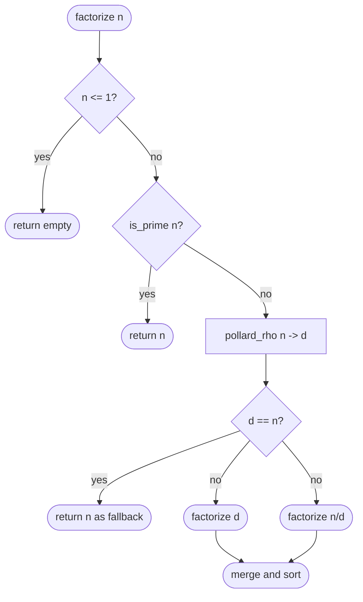
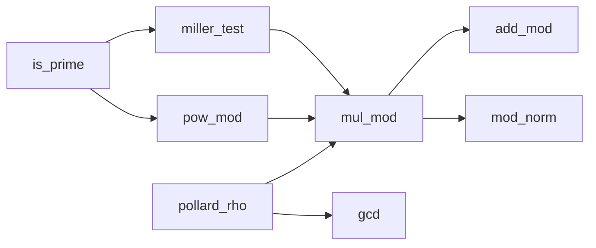

# Pollard's Rho Factorization (with Miller-Rabin)

This package factors 64-bit integers quickly using:

- **Miller-Rabin** for deterministic primality testing on 64-bit inputs,
- **Pollard's Rho** for finding non-trivial factors of composites.

It handles numbers up to about 10^18 in practice.

---

## 1. The problem

Given a number `n`, find its prime factors.

Trial division is the naive approach:

```
trial division up to sqrt(n)  ->  O(sqrt(n))
```

For `n = 10^18`, sqrt(n) is 10^9 — far too many iterations.

---

## 2. The birthday paradox intuition

Pollard's Rho relies on the same probability argument as the birthday paradox.

The birthday paradox says: in a room of ~23 people, there is a better than 50%
chance that two share a birthday. You do not need to check all pairs; collisions
arise much sooner than you might expect.

Applied here:

- Consider a hidden prime factor `p` of `n`.
- Generate a pseudo-random sequence x_0, x_1, x_2, ... reduced modulo `p`.
- The sequence has only `p` possible values mod `p`.
- By the birthday paradox, a collision (x_i == x_j mod p) is expected after
  roughly sqrt(p) steps.
- Because `p <= sqrt(n)`, this takes at most O(n^(1/4)) steps.

```
          n = p * q,   p <= sqrt(n)

          Expected collision steps modulo p:  ~sqrt(p)

          Since p <= sqrt(n):
              sqrt(p) <= n^(1/4)

          => Expected work:  O(n^(1/4))
```

The table below contrasts the three approaches:

| Method         | Expected work   | n = 10^18   |
|----------------|-----------------|-------------|
| Trial division | O(sqrt(n))      | ~10^9 steps |
| Pollard's Rho  | O(n^(1/4))      | ~31,623 steps |
| Miller-Rabin   | O(log^3 n)      | ~60 steps   |

---

## 3. The rho shape: why "rho"?

The algorithm is named after the Greek letter rho (rho) because of the shape
traced by the sequence modulo a prime factor `p`.

The sequence is eventually periodic with a "tail" leading into a cycle:

```
              rho (rho) shape
              ================

  x0 --> x1 --> x2 --> x3
                        |
                        v
               x7 <-- x6 <-- x5 <-- x4
               |
               v
               x8 --> x9 --> x3 (cycle repeats)


  Tail: x0, x1, x2, x3
  Cycle: x3 --> x4 --> x5 --> x6 --> x7 --> x8 --> x3

  The tail + cycle together look like the letter rho.
```

The full sequence modulo `n` may look random and non-repeating for a very long
time. But modulo `p` (a hidden factor), the state space is much smaller, so the
cycle appears quickly.

When the tortoise and hare meet inside the cycle (modulo `p`), taking the gcd
of their difference with `n` reveals `p`.

---

## 4. The pseudo-random function

The sequence is generated by the quadratic map:

```
f(x) = x^2 + c  (mod n)
```

A random starting value `x_0` and random constant `c` are chosen. The
implementation tries a fixed list of small constants and restarts if a constant
leads to a trivial result (gcd equals `n`).

Example trace with n = 91 (= 7 x 13), c = 1, x_0 = 2:

```
  x_0 =   2
  x_1 =   2^2 + 1            =   5
  x_2 =   5^2 + 1            =  26
  x_3 =  26^2 + 1 mod 91     =  586 mod 91  =  53
  x_4 =  53^2 + 1 mod 91     =  37
  ...

  Reduced mod 7:
  x_0 mod 7 =  2
  x_1 mod 7 =  5
  x_2 mod 7 =  5   <-- collision at step 2!

  gcd(|x_1 - x_2|, 91) = gcd(21, 91) = 7   -> found factor 7
```

---

## 5. Floyd's cycle detection (tortoise and hare)

Storing the entire sequence to find a collision would require O(sqrt(p)) memory.
Instead, Floyd's algorithm uses two pointers moving at different speeds.

```
  tortoise:  x  <- advances one step at a time  f(x)
  hare:      y  <- advances two steps at a time  f(f(y))

  Initial state:
      x --> . --> . --> . --> . --> .
      y ---------------------------->

  After a few steps (example with tail length 2, cycle length 4):

  positions (mod p cycle length):

  step 0:  tortoise=0  hare=0
  step 1:  tortoise=1  hare=2
  step 2:  tortoise=2  hare=4
  step 3:  tortoise=3  hare=1   <- positions differ by 2 in cycle
  step 4:  tortoise=4  hare=3
  step 5:  tortoise=5  hare=5   <- MEET (mod cycle length)

  At each step:
      d = gcd(|tortoise - hare|, n)
      if 1 < d < n: factor found!
```

The key loop in the implementation:

```
  x = f(x)          // tortoise advances one step
  y = f(f(y))        // hare advances two steps
  d = gcd(|x - y|, n)
```

---

## 6. Miller-Rabin primality test

Before attempting to factor `n`, the algorithm first checks whether `n` is
already prime using Miller-Rabin.

Miller-Rabin is based on Fermat's little theorem. If `n` is prime and `a` is
any base with gcd(a, n) = 1, then:

```
  a^(n-1) == 1  (mod n)
```

The test strengthens this by writing `n - 1 = d * 2^s` with `d` odd, and
checking the sequence:

```
  a^d,  a^(2d),  a^(4d),  ...,  a^(d * 2^s)  (all mod n)
```

A prime forces this sequence to end in 1 after a specific pattern.

For 64-bit integers, testing against the 12 fixed bases

```
  {2, 3, 5, 7, 11, 13, 17, 19, 23, 29, 31, 37}
```

is provably deterministic (no false positives below 3.3 * 10^24).

```
  factorize(n):

      [ is_prime(n)? ]
           |           \
          yes           no
           |             \
      return [n]      pollard_rho(n)  -> d
                           |
                   factorize(d) + factorize(n/d)
```

---

## 7. Algorithm flow



---

## 8. Internal helper functions



The helper functions form a clean dependency chain:

- `mod_norm` -- normalize a value into [0, m).
- `add_mod` -- addition without overflow using subtraction trick.
- `mul_mod` -- multiplication by repeated doubling (Russian peasant method),
  avoids 128-bit overflow.
- `pow_mod` -- fast exponentiation by squaring.
- `gcd` -- Euclidean algorithm.
- `miller_test` -- single Miller-Rabin witness check.

---

## 9. Overflow-safe multiplication

Multiplying two 64-bit values can overflow `Int64`. The implementation avoids
this with `mul_mod`, which uses the binary method (Russian peasant):

```
  mul_mod(a, b, m):
      result = 0
      while b > 0:
          if b is odd: result = add_mod(result, a, m)
          a = add_mod(a, a, m)   // double a without overflow
          b = b >> 1
      return result
```

`add_mod(a, b, m)` itself avoids overflow:

```
  add_mod(a, b, m):
      if a >= m - b:
          return a - (m - b)    // equivalent to a + b - m, no overflow
      else:
          return a + b
```

---

## 10. Public API

From `pkg.generated.mbti`:

- `is_prime(n : Int64) -> Bool`
- `factorize(n : Int64) -> Array[Int64]`
- `factorize_with_counts(n : Int64) -> Array[(Int64, Int)]`

---

## 11. Quick start examples

```mbt check
///|
test "pollard rho quick start" {
  let factors = @pollard_rho.factorize_with_counts(8051L)
  inspect(factors, content="[(83, 1), (97, 1)]")
}
```

```mbt check
///|
test "pollard rho primes" {
  inspect(@pollard_rho.is_prime(2L), content="true")
  inspect(@pollard_rho.is_prime(97L), content="true")
  inspect(@pollard_rho.is_prime(221L), content="false")
}
```

```mbt check
///|
test "pollard rho large semiprime" {
  let n = 1000003L * 1000033L
  let factors = @pollard_rho.factorize_with_counts(n)
  inspect(factors, content="[(1000003, 1), (1000033, 1)]")
}
```

---

## 12. Example: repeated factors

```
360 = 2^3 x 3^2 x 5
```

```mbt check
///|
test "pollard rho repeated factors" {
  let factors = @pollard_rho.factorize_with_counts(360L)
  inspect(factors, content="[(2, 3), (3, 2), (5, 1)]")
}
```

---

## 13. Algorithm summary (pseudocode)

```
factorize(n):
    if n <= 1: return []
    if is_prime(n): return [n]
    d = pollard_rho(n)
    return sort(factorize(d) + factorize(n / d))

pollard_rho(n):
    if n is even: return 2
    for c in [1, 3, 5, 7, 11, 13, 17]:
        x = y = 2
        loop:
            x = f(x)          // f(x) = x^2 + c mod n
            y = f(f(y))
            d = gcd(|x - y|, n)
        if d != 1 and d != n: return d
    return n  // fallback (should not be reached for valid input)

is_prime(n):
    if n < 2: return false
    write n - 1 = d * 2^s with d odd
    for a in {2, 3, 5, 7, 11, 13, 17, 19, 23, 29, 31, 37}:
        if not miller_test(n, a, d, s): return false
    return true
```

---

## 14. Worked example: factor 8051

```
  n = 8051

  is_prime(8051)?
      8051 - 1 = 8050 = 2 * 4025 = 2 * 5^2 * 7 * 23
      d = 4025,  s = 1
      test base 2:  2^4025 mod 8051 = 4030  (not 1 or 8050)
          2^8050 mod 8051 = 7069  (not 8050)
      -> composite

  pollard_rho(8051):
      c = 1, x = y = 2
      step 1: x = 5,  y = f(f(2)) = f(5) = 26
              d = gcd(|5 - 26|, 8051) = gcd(21, 8051) = 1
      step 2: x = 26, y = f(f(26)) = ...
      ...
      (eventually) d = 83

  factor_rec(83):  is_prime -> [83]
  factor_rec(97):  is_prime -> [97]

  result: [(83, 1), (97, 1)]
```

---

## 15. Complexity

| Step             | Expected time   |
|------------------|-----------------|
| Miller-Rabin     | O(log^3 n)      |
| Single factor    | O(n^(1/4))      |
| Full factorization | O(n^(1/4) * k) |

`k` is the number of prime factors (at most 63 for 64-bit integers since
2^63 > 9.2 * 10^18).

---

## 16. Common applications

1. **Cryptography**: verify RSA key generation; check that moduli have no small
   factors.
2. **Number theory**: compute Euler's totient phi(n), number of divisors, or
   Mobius function values.
3. **Competitive programming**: factor integers up to 10^18 in problems
   involving prime decomposition.

---

## 17. Tips and pitfalls

1. If gcd returns `n`, the constant `c` led to a degenerate cycle; restart with
   a different `c`. The implementation cycles through `[1, 3, 5, 7, 11, 13, 17]`
   automatically.
2. Always test primality before applying the rho step; the rho step assumes the
   input is composite.
3. Use overflow-safe multiplication: naive `a * b mod m` overflows `Int64` when
   `a` and `b` are near 2^62. The `mul_mod` function handles this correctly.
4. The algorithm is randomized in nature, but the deterministic constant list
   makes it behave deterministically for all 64-bit inputs in practice.
5. `factorize` returns factors in sorted ascending order with repetitions;
   `factorize_with_counts` groups them as `(prime, exponent)` pairs.

---

## 18. Summary

- **Miller-Rabin** tests primality deterministically for 64-bit integers using
  12 fixed bases.
- **Pollard's Rho** finds a non-trivial factor in expected O(n^(1/4)) time by
  exploiting the birthday paradox modulo a hidden prime factor.
- The two algorithms together form the standard tool for 64-bit integer
  factorization.
