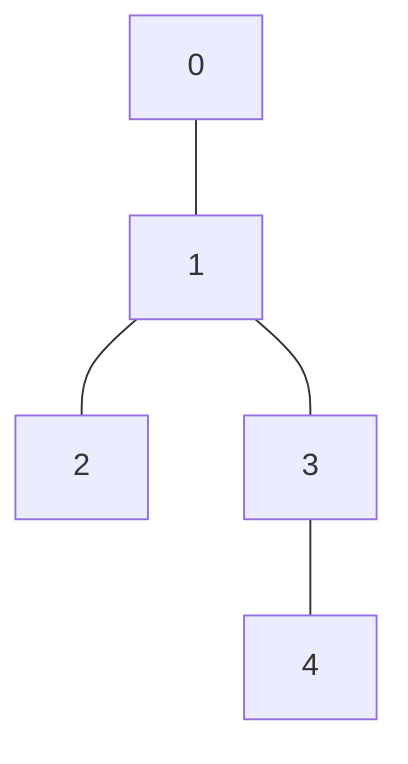
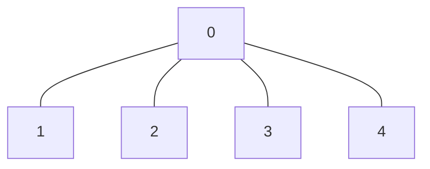
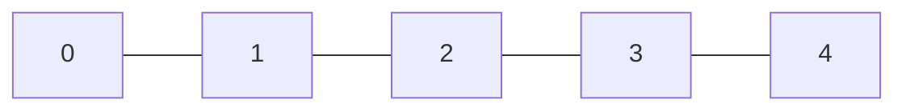

# Prufer Code (Prufer Sequence)

## Overview

A **Prufer code** (also spelled Prufer sequence) is a compact representation of
a labeled tree. Every labeled tree on `n` vertices maps to a unique sequence of
length `n - 2`, and every such sequence maps back to a unique tree. This
bijection is the classical proof of **Cayley's formula**:

```
number of labeled trees on n vertices = n^(n-2)
```

- **Encoding**: O(n log n)  
- **Decoding**: O(n log n)  
- **Space**: O(n)

## Core Idea

**Encoding** -- repeatedly prune the smallest leaf:

```
1. Find the smallest-labeled leaf (degree-1 vertex).
2. Append its neighbor to the code.
3. Remove the leaf.
4. Repeat until exactly two vertices remain.
```

**Decoding** -- reverse the pruning by tracking degrees:

```
1. Compute degree[v] = 1 + count(v in code) for each vertex v.
2. Initialize a min-heap of all leaves (degree == 1).
3. For each code value v:
     pop smallest leaf u, add edge (u, v), update degrees.
4. Connect the last two surviving vertices.
```

## The Tree Used in All Examples

```
    0 --- 1 --- 2
          |
          3
          |
          4
```

Edges: `(0,1), (1,2), (1,3), (3,4)`

Degree table:

```
vertex:  0   1   2   3   4
degree:  1   3   1   2   1
```

Initial leaves (degree 1): {0, 2, 4}

## Encoding Step by Step

```
Initial tree:

    0 --- 1 --- 2
          |
          3
          |
          4

Degrees: [1, 3, 1, 2, 1]
Leaves:  {0, 2, 4}
Code:    []

------------------------------------------------------------
Step 1  smallest leaf = 0   neighbor = 1
        remove 0, decrement deg[1]

    [removed]  1 --- 2
               |
               3
               |
               4

Degrees: [-, 2, 1, 2, 1]
Leaves:  {2, 4}
Code:    [1]

------------------------------------------------------------
Step 2  smallest leaf = 2   neighbor = 1
        remove 2, decrement deg[1]

    [removed]  1  [removed]
               |
               3
               |
               4

Degrees: [-, 1, -, 2, 1]
Leaves:  {1, 4}
Code:    [1, 1]

------------------------------------------------------------
Step 3  smallest leaf = 1   neighbor = 3
        remove 1, decrement deg[3]

    3
    |
    4

Degrees: [-, -, -, 1, 1]
Leaves:  {3, 4}    (two remain -- stop)
Code:    [1, 1, 3]

------------------------------------------------------------
Final Prufer code = [1, 1, 3]
```

## Decoding Step by Step

Reconstruct the tree from code `[1, 1, 3]` with `n = 5`.

**Step 0 -- compute initial degrees:**

```
degree[v] = 1 + count(v in [1, 1, 3])

vertex:  0   1   2   3   4
count:   0   2   0   1   0
degree:  1   3   1   2   1

Leaves (degree 1): {0, 2, 4}
Edges built so far: []
```

**Step 1** -- code value `v = 1`, smallest leaf `u = 0`:

```
add edge (0, 1)
deg[1] -= 1  =>  deg[1] = 2   (not a leaf yet)

Degrees: [0, 2, 1, 2, 1]
Leaves:  {2, 4}
Edges:   [(0,1)]
```

**Step 2** -- code value `v = 1`, smallest leaf `u = 2`:

```
add edge (2, 1)
deg[1] -= 1  =>  deg[1] = 1   (becomes a leaf, push to heap)

Degrees: [0, 1, 0, 2, 1]
Leaves:  {1, 4}
Edges:   [(0,1), (2,1)]
```

**Step 3** -- code value `v = 3`, smallest leaf `u = 1`:

```
add edge (1, 3)
deg[3] -= 1  =>  deg[3] = 1   (becomes a leaf, push to heap)

Degrees: [0, 0, 0, 1, 1]
Leaves:  {3, 4}
Edges:   [(0,1), (2,1), (1,3)]
```

**Final step** -- two vertices remain: `3` and `4`:

```
add edge (3, 4)

Edges:   [(0,1), (2,1), (1,3), (3,4)]
```

Reconstructed tree matches the original.

## Mermaid Diagram

The tree used in all step-by-step examples above:



## Properties and Key Facts

| Property | Description |
|---|---|
| Code length | Always `n - 2` for a tree with `n` vertices |
| Vertex frequency | Vertex `v` appears `deg(v) - 1` times in the code |
| Leaves | Degree-1 vertices never appear in the code |
| Star center | Appears `n - 2` times (the maximum) |
| Path interior | Each interior vertex appears exactly once |
| Bijection | Every tree <-> exactly one code |

## Public API

### `prufer_encode`

```
prufer_encode(n : Int, edges : ArrayView[(Int, Int)]) -> Array[Int]?
```

Converts a labeled tree into its Prufer sequence.

- `n`: number of vertices (labeled `0..n-1`)
- `edges`: the `n - 1` edges of the tree (any order, any orientation)
- Returns `None` if the input is not a valid tree (wrong edge count,
  out-of-range vertices, duplicate edges, self-loops, or disconnected graph)
- Returns `Some([])` for `n <= 2` (the code is empty)

### `prufer_decode`

```
prufer_decode(code : ArrayView[Int]) -> Array[(Int, Int)]?
```

Converts a Prufer sequence back into a labeled tree.

- `code`: sequence of length `m`; the tree has `n = m + 2` vertices
- All code values must be in `[0, n)`
- Returns `None` if any code value is out of range
- The returned edge list has exactly `n - 1` entries

## Usage Examples

### Basic encoding and decoding

```mbt check
///|
test "prufer example" {
  let edges : Array[(Int, Int)] = [(0, 1), (1, 2), (2, 3)]
  let code = @prufer_code.prufer_encode(4, edges).unwrap()
  inspect(code, content="[1, 2]")
  let edges2 = @prufer_code.prufer_decode(code).unwrap()
  inspect(edges2.length(), content="3")
}
```

### Star tree

A star with center `0` and `k` leaves encodes to `k - 1` repetitions of `0`.

```
    1
    |
2 --0-- 3
    |
    4
```



```mbt check
///|
test "prufer star tree" {
  let edges : Array[(Int, Int)] = [(0, 1), (0, 2), (0, 3), (0, 4)]
  let code = @prufer_code.prufer_encode(5, edges).unwrap()
  inspect(code, content="[0, 0, 0]")
}
```

The center `0` has degree 4, so it appears `4 - 1 = 3` times.

### Path tree

A path `0-1-2-3-4` encodes to `[1, 2, 3]` -- the interior nodes in order.

```
0 --- 1 --- 2 --- 3 --- 4
```



```mbt check
///|
test "prufer path tree" {
  let edges : Array[(Int, Int)] = [(0, 1), (1, 2), (2, 3), (3, 4)]
  let code = @prufer_code.prufer_encode(5, edges).unwrap()
  inspect(code, content="[1, 2, 3]")
}
```

Each interior node has degree 2 and appears exactly once. The two endpoints
(degree 1) never appear.

### Round-trip

Encoding and then decoding (or vice versa) always returns the original structure:

```
Original tree  -->  encode  -->  [1, 1, 3]
                                     |
                                   decode
                                     |
                             same edge set
```

```mbt check
///|
test "prufer roundtrip" {
  // Encode the five-vertex tree 0-1-2, 1-3-4
  let edges : Array[(Int, Int)] = [(0, 1), (1, 2), (1, 3), (3, 4)]
  let code = @prufer_code.prufer_encode(5, edges).unwrap()
  inspect(code, content="[1, 1, 3]")
  // Decode back and re-encode; must get the same code
  let edges2 = @prufer_code.prufer_decode(code).unwrap()
  let code2 = @prufer_code.prufer_encode(5, edges2).unwrap()
  inspect(code2, content="[1, 1, 3]")
}
```

## Why It Works

**Encoding** is deterministic: always removing the smallest leaf means there is
exactly one way to process the tree, so every tree maps to exactly one code.

**Decoding** inverts this: given a code, the degree of every vertex is known
before reconstruction begins (`degree[v] = 1 + count(v in code)`). At each
step, exactly one leaf is the smallest, so the reconstruction is also
deterministic.

Together, the two deterministic mappings form a **bijection** between:

- Labeled trees on `n` vertices, and
- Sequences of length `n - 2` over alphabet `{0, ..., n-1}`.

There are `n^(n-2)` such sequences, which is exactly **Cayley's formula**.

## Encoding vs. Decoding at a Glance

```
ENCODING
========
Input:  adjacency list + degrees
        min-heap of leaves

Each step:
  pop smallest leaf u
  neighbor v = u's only active neighbor
  append v to code
  deg[u] = 0 (mark removed)
  deg[v] -= 1
  if deg[v] == 1: push v to heap

Output: code of length n-2

------------------------------------------------------------

DECODING
========
Input:  code of length n-2
        degree[v] = 1 + count(v in code)
        min-heap of leaves (degree == 1)

Each step:
  read next code value v
  pop smallest leaf u from heap
  add edge (u, v)
  deg[u] = 0
  deg[v] -= 1
  if deg[v] == 1: push v to heap

Final step: pop last two leaves, add edge between them

Output: edge list of length n-1
```

## Error Handling

Both functions return `None` for invalid input rather than panicking.

| Situation | `prufer_encode` | `prufer_decode` |
|---|---|---|
| `n <= 0` | `None` | n/a |
| Wrong edge count | `None` | n/a |
| Vertex out of range | `None` | `None` |
| Self-loop | `None` | n/a |
| Duplicate edge | `None` | n/a |
| Disconnected graph | `None` | n/a |
| `n == 1` or `n == 2` | `Some([])` | handled |

```mbt check
///|
test "prufer invalid" {
  // Too few edges for n=4 (need 3, have 2)
  let edges : Array[(Int, Int)] = [(0, 1), (1, 2)]
  debug_inspect(@prufer_code.prufer_encode(4, edges), content="None")
  // Code value 4 is out of range for n=4 (valid range 0..3)
  let code : Array[Int] = [0, 4]
  debug_inspect(@prufer_code.prufer_decode(code), content="None")
}
```

## Complexity

| Operation | Time | Space |
|---|---|---|
| `prufer_encode` | O(n log n) | O(n) |
| `prufer_decode` | O(n log n) | O(n) |

The log factor comes from the min-heap. Linear O(n) variants exist by using a
pointer into sorted vertices, but the heap version is simpler to verify correct.

## Applications

- **Cayley's formula**: Count labeled spanning trees of K_n.
- **Random tree generation**: Sample a uniform random labeled tree by generating
  a random Prufer code and decoding it.
- **Network reliability**: Enumerate spanning trees of complete graphs.
- **Combinatorics**: Bijection proofs and generating functions for labeled trees.

## Beginner Checklist

1. Vertices must be labeled `0..n-1`.
2. A tree with `n` vertices has exactly `n - 1` edges and `n - 2` code values.
3. Always pick the **smallest** leaf at each encoding step.
4. A vertex `v` appears `deg(v) - 1` times in the code; leaves appear 0 times.
5. Decoding connects the **last two** surviving vertices as the final edge.
