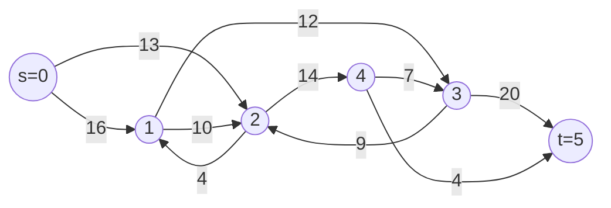

# Push-Relabel Max Flow (Preflow-Push)

This package computes maximum flow using **push-relabel** (also called
preflow-push). It is a fast, local algorithm that often performs very well on
dense graphs.

---

## 1. The problem

Given a directed graph with capacities on edges, find the **maximum total flow**
from source `s` to sink `t` subject to:

- **Capacity constraint**: flow on each edge must not exceed its capacity.
- **Conservation constraint**: for every vertex except `s` and `t`, total
  incoming flow equals total outgoing flow.

---

## 2. Key data structures

| Field        | Type           | Meaning                                         |
|--------------|----------------|-------------------------------------------------|
| `adj`        | adjacency list | forward and reverse edges (for residual graph)  |
| `height[v]`  | `Int`          | label used to direct pushes toward the sink     |
| `excess[v]`  | `Int64`        | flow received by `v` minus flow sent from `v`   |
| `next_edge`  | `Int`          | current-arc pointer for the discharge scan      |
| `in_active`  | `Bool`         | whether `v` is already in the active queue      |

An **active** vertex is any non-source, non-sink vertex with `excess > 0`.

---

## 3. Flow network diagram

The classic six-node benchmark graph used in the example:



Maximum flow from `s` to `t` is **23** (limited by the min-cut
`{s} | {1,2,3,4,t}` with capacity `16 + 13 = 29`, then bottlenecked further
downstream).

---

## 4. Push-relabel idea

Instead of searching for global augmenting paths, push-relabel works **locally**:

```
Each vertex stores:
  excess[v]  = flow_in - flow_out
  height[v]  = non-negative label guiding pushes

Invariant for every residual edge (u -> v):
  height[u] <= height[v] + 1

An edge (u -> v) is admissible when:
  residual(u,v) > 0  AND  height[u] == height[v] + 1
```

Flow is pushed only along admissible edges, which always move it "downhill"
toward the sink. When no admissible edge exists, the vertex is **relabeled**
(its height is raised) to create a new admissible edge.

---

## 5. Preflow vs. flow

Push-relabel temporarily allows **excess** at non-source vertices:

```
Feasible flow:  excess[v] == 0   for all v except s and t
Preflow:        excess[v] >= 0   excess is temporarily permitted
```

The algorithm converts a preflow into a feasible flow by draining all excess to
the sink (or back to the source).

---

## 6. The two core operations

### Push

When vertex `u` has excess and an admissible outgoing edge `(u -> v)`:

```
delta = min(excess[u], residual(u, v))

excess[u] -= delta
excess[v] += delta
flow(u, v) += delta       # also update reverse edge for residual graph
```

### Relabel

When vertex `u` has excess but no admissible outgoing edge:

```
height[u] = 1 + min{ height[v] | residual(u,v) > 0 }
```

This raises `height[u]` just enough to make at least one outgoing residual edge
admissible again.

---

## 7. Step-by-step walkthrough (small example)

### Graph

```
s=0 --(3)--> 1 --(2)--> t=3
  \          |          ^
   \(2)      |(1)       |
    \         v         |
     +-----> 2 --(4)----+
```

Capacities: `0->1: 3`, `0->2: 2`, `1->2: 1`, `1->3: 2`, `2->3: 4`

### Initial state (after saturating source edges)

```
heights:  [4, 0, 0, 0]       h[s] = n = 4
excess:   [-, 3, 2, 0]       source has pushed everything out
active:   [1, 2]
```

```
  s(h=4)                    t(h=0)
   |                          ^
   +-- excess=3 --> 1(h=0)    |
   |                          |
   +-- excess=2 --> 2(h=0)    |
```

### Step 1 -- discharge vertex 1

`h[1]=0`, `h[3]=0`: edge `1->3` is not admissible (`0 != 0+1`).
No admissible edge found. Relabel:

```
h[1] = 1 + min(h[2], h[3]) = 1 + 0 = 1
```

Now `h[1]=1`, `h[3]=0`: edge `1->3` is admissible. Push 2 units:

```
heights:  [4, 1, 0, 0]
excess:   [-, 1, 2, 2]
active:   [2, 3]        (3 enqueued because excess became > 0)
```

### Step 2 -- discharge vertex 2

`h[2]=0`, `h[3]=0`: no admissible edge. Relabel:

```
h[2] = 1 + min(h[3]) = 1
```

Push 2 units on `2->3` (capacity 4):

```
heights:  [4, 1, 1, 0]
excess:   [-, 1, 0, 4]
```

### Step 3 -- discharge vertex 1 again (excess = 1)

Edge `1->2` is admissible (`h[1]=1 == h[2]+1=1`). Push 1 unit:

```
excess:   [-, 0, 1, 4]     vertex 1 fully discharged
```

### Step 4 -- discharge vertex 2 (excess = 1)

Push 1 unit on `2->3`:

```
excess:   [-, 0, 0, 5]     all excess drained to sink
```

**Max flow = 5.**

---

## 8. ASCII art: push and relabel operations

### Before push on admissible edge u -> v

```
        excess=5                 excess=1
  u  [h= 3] ----residual=3----> v  [h= 2]
         ^                      ^
         |                      |
      admissible:  h[u] = h[v] + 1  =>  3 = 2 + 1   (OK)

  delta = min(excess[u], residual) = min(5, 3) = 3
```

### After push

```
        excess=2                 excess=4
  u  [h= 3]                     v  [h= 2]
         (residual on u->v now 0; reverse residual on v->u increased by 3)
```

### Before relabel of u (no admissible outgoing edge)

```
        excess=5
  u  [h= 2]
         |
         +-- residual=4 --> w  [h= 3]   (h[u]=2 < h[w]=3, not admissible)
         |
         +-- residual=2 --> x  [h= 4]   (h[u]=2 < h[x]=4, not admissible)

  h[u] too low: cannot push to any neighbor
```

### After relabel

```
  new_height[u] = 1 + min(h[w], h[x]) = 1 + 3 = 4

        excess=5
  u  [h= 4]
         |
         +-- residual=4 --> w  [h= 3]   NOW admissible: 4 = 3 + 1
```

---

## 9. Example usage (public API)

```mbt check
///|
test "push-relabel example" {
  let pr = @push_relabel_max_flow.PushRelabel::new(6)
  pr.add_edge(0, 1, 16L)
  pr.add_edge(0, 2, 13L)
  pr.add_edge(1, 2, 10L)
  pr.add_edge(2, 1, 4L)
  pr.add_edge(1, 3, 12L)
  pr.add_edge(2, 4, 14L)
  pr.add_edge(3, 2, 9L)
  pr.add_edge(4, 3, 7L)
  pr.add_edge(3, 5, 20L)
  pr.add_edge(4, 5, 4L)
  let flow = pr.max_flow(0, 5)
  inspect(flow, content="23")
}
```

For undirected networks, use `add_undirected_edge`:

```mbt check
///|
test "push-relabel undirected" {
  let pr = @push_relabel_max_flow.PushRelabel::new(4)
  pr.add_undirected_edge(0, 1, 5L)
  pr.add_undirected_edge(1, 3, 3L)
  pr.add_undirected_edge(0, 2, 4L)
  pr.add_undirected_edge(2, 3, 6L)
  let flow = pr.max_flow(0, 3)
  inspect(flow, content="8")
}
```

---

## 10. Why it works (invariants)

The algorithm maintains these invariants throughout:

1. **Capacity**: `0 <= flow(e) <= cap(e)` for every edge.
2. **Preflow**: `excess[v] >= 0` for every non-source vertex.
3. **Height rule**: for every residual edge `(u, v)`, `h[u] <= h[v] + 1`.

When the active queue is empty, all non-source/sink vertices have zero excess,
so the preflow is a feasible flow. The height rule then guarantees there is no
residual path from `s` to `t`, which by the max-flow min-cut theorem means the
flow is maximum.

---

## 11. Complexity

```
Worst case: O(V^2 * E)
```

With the current-arc (next_edge) heuristic, each discharge scans each edge at
most once between relabels, keeping practical performance much closer to
`O(V^3)` for dense graphs and outperforming augmenting-path methods on many
real-world inputs.

---

## 12. Common applications

1. **Max flow / min cut** -- network throughput, project selection
2. **Bipartite matching** -- assignment problems
3. **Image segmentation** -- graph-cut algorithms (e.g. GrabCut)
4. **Network design** -- capacity planning, evacuation routing

---

## 13. Tips

1. Push-relabel is **local**: it never searches for augmenting paths globally.
2. Excess is allowed at intermediate vertices; intermediate states may look
   "invalid" for a standard feasible flow.
3. Heights only ever increase, which is what guarantees termination.
4. Both a forward edge and its reverse edge are always stored together; the
   reverse edge enables cancellation of previously pushed flow.
5. Call `max_flow` multiple times on the same `PushRelabel` object to re-use
   it with different sources and sinks; all flow and height state is reset at
   the start of each call.
