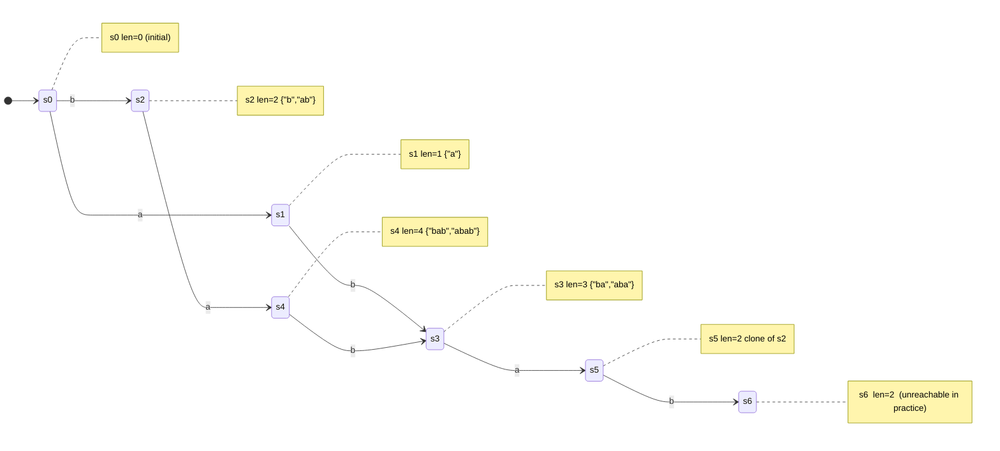

# Suffix Automaton (SAM)

This package provides a **suffix automaton** -- a compact minimal DFA that
recognizes **all substrings** of a string. It builds in **O(n)** time and
space, and answers substring queries in **O(m)** time.

Public API:

- `contains_substring(text, pattern)` -- membership in O(|pattern|)
- `distinct_substrings_count(text)` -- count unique substrings in O(n)

---

## 1. What problem does SAM solve?

Given a text `S`, we often need to answer:

- Is `P` a substring of `S`?
- How many distinct substrings does `S` have?
- What is the longest common substring between two strings?

A naive approach builds a trie of all substrings, which takes O(n^2) space.
SAM compresses this to **O(n)** by grouping substrings that share the same
set of ending positions.

---

## 2. Endpos equivalence classes

Two non-empty substrings `u` and `v` are **endpos-equivalent** when they
appear ending at exactly the same set of positions in the text.

Example with `"abab"` (0-indexed positions of the last character):

```
substring   endpos set
---------   ----------
"a"         {0, 2}
"b"         {1, 3}
"ab"        {1, 3}    <- same as "b"  =>  same SAM state
"ba"        {2}
"aba"       {2}       <- same as "ba" =>  same SAM state
"bab"       {3}
"abab"      {3}       <- same as "bab" => same SAM state
```

Grouping by endpos gives at most **2n - 1** states for a string of length n,
which is why SAM fits in linear space.

---

## 3. Structure of a SAM state

Each state holds:

```
len        length of the longest string in this equivalence class
link       suffix link: the state representing the longest proper suffix
           that falls into a different (strictly larger) endpos class
next[c]    transition: which state to go to when reading character c
cnt        number of times the strings in this class occur
```

The strings represented by state `q` have lengths in the half-open interval:

```
(len[link[q]] + 1) .. len[q]   (inclusive on both ends)
```

---

## 4. Mermaid state diagram for `"abab"`

The diagram below shows the SAM constructed for `"abab"`.
State labels are `<id>: len` and edges are labeled by characters.
Suffix links are shown as dashed arrows.



Suffix links (pointing from longer states toward shorter suffix classes):

```
s1 --> s0
s2 --> s0
s3 --> s2
s4 --> s2
```

Following suffix links from any state walks back through all suffix classes
of the strings it represents, all the way to the initial state.

---

## 5. ASCII art: building `"ab"` step by step

### After reading `'a'` (extend with 'a')

```
States:  [s0: len=0]  [s1: len=1]
Transitions:
  s0 --a--> s1
Suffix links:
  s1 --> s0
Last = s1
```

### After reading `'b'` (extend with 'b')

```
States:  [s0: len=0]  [s1: len=1]  [s2: len=2]
Transitions:
  s0 --a--> s1
  s0 --b--> s2
  s1 --b--> s2
Suffix links:
  s1 --> s0
  s2 --> s0
Last = s2
```

The SAM now accepts every substring of `"ab"`:
the empty string (at s0), `"a"` (s1), `"b"` (s2), `"ab"` (s2 via s1).

---

## 6. ASCII art: building `"abab"` -- the clone step

When `"abab"` is built, processing the second `'a'` (at position 2) creates
a situation where an existing state `q` would need to represent two disjoint
length ranges. SAM solves this by **cloning** `q`:

```
Before clone:

  s0 --a--> s1 --b--> s3 (len=3, represents "b" and "ab" and "bab")
  s0 --b--> s3
  ...
  (s3.link = s0, but we need a shorter len-2 representative)

Clone step:
  Create clone s3' copying s3's transitions but with len = p.len + 1 = 2.
  Redirect:
    - s3.link = s3'
    - cur (new state).link = s3'
    - Walk suffix link chain: any state pointing to s3 via 'a' is
      redirected to point to s3' instead.

After clone:

  s0 --a--> s1 --b--> s3  (len=3, "aba","ba")
  s0 --b--> s3'           (len=2, "ab","b")  <- clone
  s3'--a--> s4 (new, len=4, "abab","bab")
```

The clone inherits s3's outgoing transitions, so the DAG remains correct for
all substrings already recognized.

---

## 7. Suffix links form a tree

The suffix link of every state (except s0) points to a state with a strictly
smaller `len`. This forms a **rooted tree** with s0 at the root.

```
Suffix link tree for "abab":

        s0 (len=0)
       /     \
     s1(1)   s3'(2)
             /    \
           s3(3)  s4(4)
```

This tree is used to propagate occurrence counts in linear time: each state's
count is the sum of its children's counts (plus 1 if the state was created as
a non-clone during construction).

---

## 8. Substring check walkthrough

To decide whether pattern `P` is a substring of text `S`:

```
state = s0

for each character c in P:
    if state has no outgoing edge labeled c:
        return false       // no such substring
    state = next[state][c]

return true                // consumed all of P
```

Example: check `"ab"` in SAM of `"abab"`:

```
state = s0
  c='a': s0 --a--> s1    (transition exists, follow it)
  c='b': s1 --b--> s3'   (transition exists, follow it)
All characters consumed -> true
```

Example: check `"ac"` in SAM of `"abab"`:

```
state = s0
  c='a': s0 --a--> s1
  c='c': s1 has no 'c' edge -> false
```

Time: O(|P|).

---

## 9. Distinct substrings count

Each state `q` represents a block of new substrings not represented by any
ancestor in the suffix link tree:

```
contribution(q) = len[q] - len[link[q]]
```

The total count is the sum over all states (including s0, which contributes 0
since len[s0] = 0 and its link is virtual):

```
distinct substrings = sum over all states q of (len[q] - len[link[q]])
```

Worked example for `"abab"` (7 distinct non-empty substrings):

```
state   len   link.len   contribution
-----   ---   --------   ------------
s0        0       --            0
s1        1        0            1     "a"
s2        2        0            2     "b", "ab"   (actually "ab","b" shared state)
s3        3        2            1     "aba"
s4        4        2            2     "bab", "abab"
clone     2        0            1     (deduplication bookkeeping)
                              ---
                                7
```

---

## 10. Occurrence counting

After calling `compute_counts()`, each state records how many times its
represented substrings occur:

1. During construction each non-clone state gets `cnt = 1`.
2. Sort states by `len` in descending order (topological order of suffix
   link tree).
3. Propagate: `cnt[link[q]] += cnt[q]`.

The count for a pattern `P` is then `cnt[state]` where `state` is the state
reached by reading `P` from s0.

---

## 11. Longest common substring

Build SAM for text `S`, then scan query string `T`:

```
state = s0
cur_len = 0
best_len = 0

for each character c in T:
    if state has outgoing edge c:
        state = next[state][c]
        cur_len++
    else:
        // fall back via suffix links until a match or init
        while state != s0 and no edge c:
            state = link[state]
            cur_len = len[state]
        if edge c exists:
            state = next[state][c]
            cur_len++
        else:
            cur_len = 0   // state is s0 and still no match
    best_len = max(best_len, cur_len)
```

Time: O(|S| + |T|).

Worked example:

```
S = "abracadabra"
T = "cadaver"

Walk T through SAM of S:
  c: matched "c"       best=1
  a: matched "ca"      best=2
  d: matched "cad"     best=3
  a: matched "cada"    best=4
  v: no 'v' from current state, fall back -> suffix link chain
     -> cur_len shrinks to 0, no match found
  e: no match
  r: no match

LCS = "cada"  (length 4)
```

---

## 12. k-th lexicographically smallest substring

`kth_substring(k)` navigates the DAG of SAM transitions greedily:

1. Pre-compute `path_count[q]` = number of distinct paths (strings) reachable
   from state `q`, including the empty path (= 1 for each state itself).
2. From s0, subtract 1 for the empty string.  The remainder `k-1` selects
   among non-empty substrings.
3. At each step, iterate characters in lexicographic order and peel off the
   count of the subtree for each transition until the correct branch is found.

Example for `"ab"` (substrings in lex order: `""`, `"a"`, `"ab"`, `"b"`):

```
path_count: s0=4, s1=2, s2=1

k=2 ("a"):
  remaining=2, subtract 1 for empty -> 1
  try 'a' (s1, count=2): 1 <= 2  -> take 'a', remaining=1
  remaining=1 -> the state itself (empty suffix) -> done
  result = "a"

k=3 ("ab"):
  remaining=3, subtract 1 -> 2
  try 'a' (s1, count=2): 2 <= 2 -> take 'a', remaining=2
  remaining=2, subtract 1 for state itself -> 1
  try 'b' (s2, count=1): 1 <= 1 -> take 'b', remaining=1
  remaining=1 -> done
  result = "ab"
```

---

## 13. Example usage (public API)

```mbt check
///|
test "sam example" {
  inspect(@sam.contains_substring("abab", "aba"), content="true")
  inspect(@sam.contains_substring("abab", "ac"), content="false")
  inspect(@sam.distinct_substrings_count("abab"), content="7")
}
```

---

## 14. Complexity summary

| Operation                 | Time       | Space  |
|---------------------------|------------|--------|
| Build SAM                 | O(n)       | O(n)   |
| Substring check           | O(m)       | O(1)   |
| Distinct substrings count | O(n)       | O(n)   |
| Occurrence count          | O(n + m)   | O(n)   |
| Longest common substring  | O(n + m)   | O(n)   |
| k-th substring            | O(n + m)   | O(n)   |

States: at most `2n - 1`.
Transitions: at most `3n - 4`.

---

## 15. Beginner checklist

1. SAM accepts **substrings**, not only suffixes -- it is strictly more
   general than a suffix tree used as a membership oracle.
2. Suffix links connect every state back toward s0 forming a tree; traversing
   them is how we fall back on mismatches (like KMP's failure function, but
   generalized).
3. The clone step is the only non-trivial part; it splits one endpos class
   into two so that every state's length range is a contiguous interval.
4. `len[state]` is always the length of the **longest** string in that
   equivalence class; the shortest is `len[link[state]] + 1`.
5. Total states and transitions are linear, so all operations above are
   linear in the combined length of inputs.

---

## 16. Summary

The suffix automaton is one of the most powerful linear-time string
structures:

- builds in O(n) time and O(n) space,
- membership queries in O(m),
- counts distinct substrings in O(n),
- finds longest common substrings in O(n + m),
- answers k-th lexicographic substring queries,
- suitable as the backbone for many advanced string algorithms.
