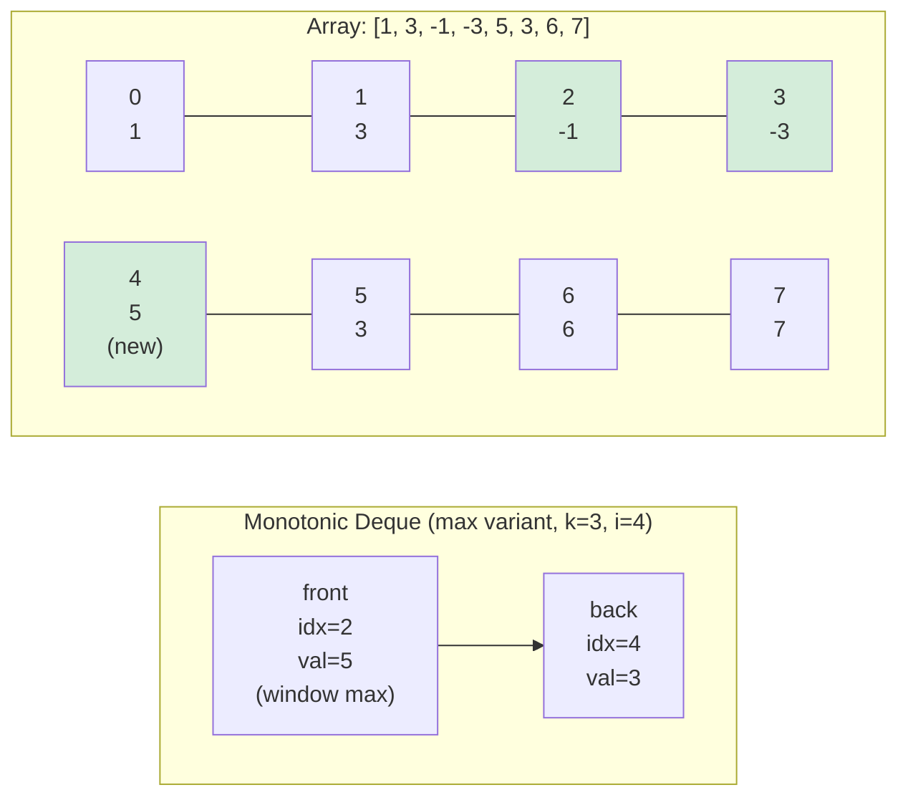

# Sliding Window

Sliding window is a technique for answering queries over **contiguous
subarrays** in O(n) time instead of O(n^2). Rather than recomputing from
scratch, you update an invariant as the window advances.

There are two main styles:

1. **Fixed size** -- window length is always k
2. **Variable size** -- window expands or shrinks to satisfy a predicate

For the special case of sliding window maximum/minimum a **monotonic deque**
lets the front of the deque always answer the query in O(1).

---

## 1. Monotonic deque structure

The deque stores **indices** (not values) in a way that guarantees:

- Indices are in **strictly increasing** order (left-to-right in the array).
- Values at those indices are in **strictly decreasing** order (for max) or
  **strictly increasing** order (for min).
- Every index in the deque belongs to the current window.



**Insertion rule:** before pushing index `i`, pop every back element whose
value is <= `arr[i]` (for max) or >= `arr[i]` (for min). This preserves the
monotone order invariant.

**Expiry rule:** before reading the front, pop it if its index is outside the
window (`front <= i - k`).

Because every index is pushed once and popped at most once, the total work is
O(n).

---

## 2. Step-by-step: sliding window maximum (k = 3)

Array: `[1, 3, -1, -3, 5, 3, 6, 7]`

```
Step  i  arr[i]  Expire front  Pop back (<=arr[i])  Push i  Deque indices  Window max
----  -  ------  ------------  -------------------  ------  -------------  ----------
 0    0     1    -             -                     0       [0]            (not full)
 1    1     3    -             pop 0 (1<=3)           1       [1]            (not full)
 2    2    -1    -             -                     2       [1,2]          3
 3    3    -3    -             -                     3       [1,2,3]        3
 4    4     5    pop 1 (1<=4-3)--> pop 2,3 (<=5)    4       [4]            5
 5    5     3    -             -                     5       [4,5]          5
 6    6     6    pop 4 (4<=6-3)--> pop 5 (3<=6)     6       [6]            6
 7    7     7    -             pop 6 (6<=7)          7       [7]            7

Result: [3, 3, 5, 5, 6, 7]
```

---

## 3. Fixed-size window sum

Update rule: slide one step by subtracting the leaving element and adding the
entering element.

```
new_sum = old_sum - arr[i - k] + arr[i]
```

Example -- sum of every window of size 3 in `[1, 2, 3, 4, 5]`:

```
Window      Sum   Update
[1, 2, 3]    6    initial
[2, 3, 4]    9    6 - 1 + 4
[3, 4, 5]   12    9 - 2 + 5
```

---

## 4. Variable-size window (two-pointer)

```mbt nocheck
left = 0
for right in 0..<n {
  add(arr[right])

  while window_invalid() {
    remove(arr[left])
    left += 1
  }

  update_answer([left, right])
}
```

Each element enters and leaves the window at most once, giving O(n) total.

---

## 5. Common beginner problems

### A. Max sum of size k
```
[2, 1, 5, 1, 3, 2], k=3  ->  max sum = 9  (window [5,1,3])
```

### B. Longest substring without repeating characters
```
"abcabcbb"  ->  3  ("abc")
```

### C. Minimum window substring
```
"ADOBECODEBANC", pattern "ABC"  ->  "BANC"
```

---

## 6. Why O(n)?

Every index:

- enters the window once,
- leaves the window once.

So even if you have nested loops, the total number of push/pop operations is
bounded by 2n.

---

## 7. When to use sliding window

Use sliding window when:

- the data is **contiguous**,
- you can update the answer when the window shifts rather than recomputing it,
- you want O(n) instead of O(n^2).

---

## 8. API summary

| Function | Description | Time | Space |
|---|---|---|---|
| `sliding_window_max(arr, k)` | Maximum in each window of size k | O(n) | O(k) |
| `sliding_window_min(arr, k)` | Minimum in each window of size k | O(n) | O(k) |
| `sliding_window_sum(arr, k)` | Sum of each window of size k | O(n) | O(1) |
| `longest_subarray_with_sum_le(arr, t)` | Longest subarray with sum <= t | O(n) | O(1) |
| `min_subarray_with_sum_ge(arr, t)` | Shortest subarray with sum >= t | O(n) | O(1) |

---

## 9. Examples

### Sliding window maximum

```mbt check
///|
test "readme max" {
  let arr : Array[Int64] = [1L, 3L, -1L, -3L, 5L, 3L, 6L, 7L]
  let maxs = @sliding_window.sliding_window_max(arr, 3)
  inspect(maxs, content="[3, 3, 5, 5, 6, 7]")
}
```

### Sliding window minimum

```mbt check
///|
test "readme min" {
  let arr : Array[Int64] = [1L, 3L, -1L, -3L, 5L, 3L, 6L, 7L]
  let mins = @sliding_window.sliding_window_min(arr, 3)
  inspect(mins, content="[-1, -3, -3, -3, 3, 3]")
}
```

### Sliding window sum

```mbt check
///|
test "readme sum" {
  let arr : Array[Int64] = [1L, 2L, 3L, 4L, 5L]
  let sums = @sliding_window.sliding_window_sum(arr, 3)
  inspect(sums, content="[6, 9, 12]")
}
```

### Longest subarray with bounded sum

```mbt check
///|
test "readme longest" {
  let arr : Array[Int64] = [1L, 2L, 3L, 4L, 5L]
  inspect(@sliding_window.longest_subarray_with_sum_le(arr, 6L), content="3")
}
```

### Shortest subarray meeting a target sum

```mbt check
///|
test "readme min subarray" {
  let arr : Array[Int64] = [2L, 3L, 1L, 2L, 4L, 3L]
  inspect(@sliding_window.min_subarray_with_sum_ge(arr, 7L), content="2")
}
```

---

## 10. Summary

Sliding window is one of the most useful tricks in algorithm practice:

- fixed window: moving sum / average / max via O(1) update,
- variable window: shortest/longest subarray satisfying a condition,
- deque trick: sliding window max/min in O(n) total.

Once you recognize the pattern, many problems that look O(n^2) become linear.
