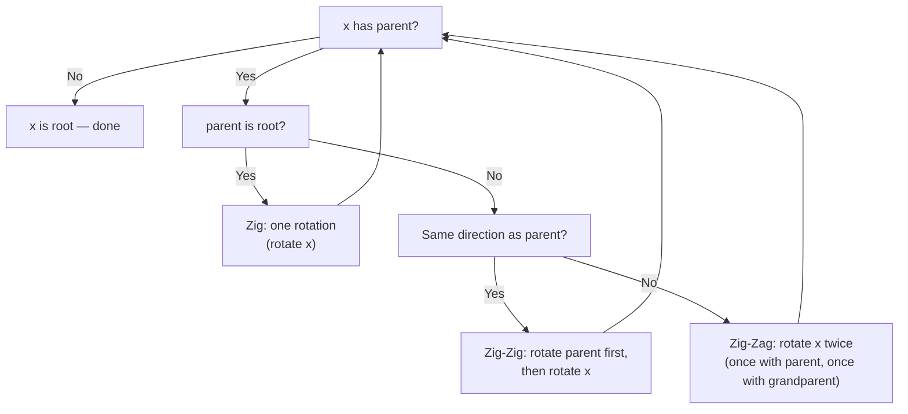
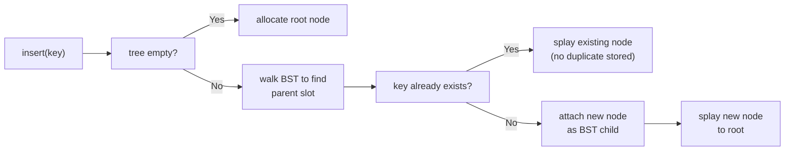
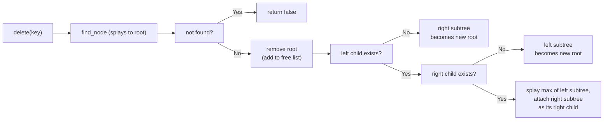

# Splay Tree (Self-Adjusting BST)

A splay tree is a self-adjusting binary search tree. Whenever a node is
accessed (searched, inserted, or deleted), it is rotated to the root using a
procedure called **splaying**. No balance metadata is stored. The amortized
cost per operation is O(log n).

---

## 1. Core idea

If you access the same keys often, you want them near the root so future
accesses are fast. Splaying achieves that automatically:

```
access x  ->  rotate x to root
recent keys  ->  shallow depth
repeated keys  ->  nearly free
```

No explicit rebalancing is needed. The tree adjusts itself with ordinary
rotations.

---

## 2. Internal representation

Nodes are stored in a flat array. Each node holds an index to its left child,
right child, and parent (`-1` means absent). A free list recycles deleted
slots.

```
Array index:  0    1    2    3    4
              ┌────┬────┬────┬────┬────┐
  key         │ 50 │ 25 │ 70 │ 10 │ 30 │
  left        │  1 │  3 │ -1 │ -1 │ -1 │
  right       │  2 │  4 │ -1 │ -1 │ -1 │
  parent      │ -1 │  0 │  0 │  1 │  1 │
  size        │  5 │  3 │  1 │  1 │  1 │
              └────┴────┴────┴────┴────┘
root = 0
```

This corresponds to the tree shape:

```
        50  [size=5]
       /  \
     25    70  [size=1]
    /  \
  10   30  [size=1]
```

---

## 3. Rotations

Rotations are the atomic structural operations. They move a node one level up
while preserving the BST in-order sequence.

### Right rotation

Used when `x` is the **left** child of its parent `p`.

```
Before right rotation at x:       After right rotation at x:

        g                                  g
        |                                  |
        p                                  x
       / \                                / \
      x   C                              A   p
     / \                                    / \
    A   B                                  B   C

In-order: A, x, B, p, C  (unchanged)
```

Step by step:
1. `B` (right child of `x`) becomes left child of `p`.
2. `x` takes `p`'s place as child of `g`.
3. `p` becomes right child of `x`.
4. Update sizes of `p` (now lower) and `x` (now higher).

### Left rotation

Used when `x` is the **right** child of its parent `p`. Mirror of right rotation.

```
Before left rotation at x:        After left rotation at x:

        g                                  g
        |                                  |
        p                                  x
       / \                                / \
      A   x                              p   C
         / \                            / \
        B   C                          A   B

In-order: A, p, B, x, C  (unchanged)
```

---

## 4. The three splay cases

Splaying moves node `x` to the root by repeatedly applying one of three cases.

### Case 1 — Zig (parent is root)

Applied when `p` is the root (no grandparent). One rotation suffices.

**Zig-right** (`x` is left child of root `p`):

```
Before:                     After right rotation at x:

     p  <-- root                 x  <-- new root
    / \                         / \
   x   C                       A   p
  / \                              / \
 A   B                            B   C
```

**Zig-left** (`x` is right child of root `p`):

```
Before:                     After left rotation at x:

  p  <-- root                     x  <-- new root
 / \                             / \
A   x                           p   C
   / \                         / \
  B   C                       A   B
```

---

### Case 2 — Zig-Zig (same direction)

`x` and `p` are children in the **same direction** (both left or both right).
Rotate `p` first, then `x`. This is the critical case that achieves the
amortized O(log n) bound.

**Zig-Zig left** (x is left child of p, p is left child of g):

```
Before:                          After rotate_right(p), rotate_right(x):

        g                                  x
       / \                               /   \
      p   D                             A     p
     / \                                     / \
    x   C                                   B   g
   / \                                         / \
  A   B                                       C   D

In-order: A, x, B, p, C, g, D  (unchanged)
```

Key insight: rotating `p` first "straightens" the path `g -> p -> x`,
which reduces future access depths for the whole subtree.

**Zig-Zig right** (x is right child of p, p is right child of g):

```
Before:                          After rotate_left(p), rotate_left(x):

  g                                          x
 / \                                       /   \
A   p                                     p     C
   / \                                   / \
  B   x                                 g   B
     / \                               / \
    C   D                             A   B  (wait, redrawn below)

Corrected:
Before:            After rotate_left(p):     After rotate_left(x):

  g                      g                         x
 / \                    / \                       /   \
A   p                  A   x                     g     D
   / \                    / \                   / \
  B   x                  p   D                A   p
     / \                / \                      / \
    C   D              B   C                    B   C
```

---

### Case 3 — Zig-Zag (different directions)

`x` and `p` are children in **opposite directions**. Rotate `x` twice (once
with `p`, once with `g`).

**Zig-Zag left-right** (x is right child of p, p is left child of g):

```
Before:                  After rotate_left(x):    After rotate_right(x):

      g                         g                         x
     / \                       / \                       / \
    p   D                     x   D                     p   g
   / \                       / \                       / \ / \
  A   x                     p   C                    A  B C  D
     / \                   / \
    B   C                 A   B

In-order: A, p, B, x, C, g, D  (unchanged throughout)
```

**Zig-Zag right-left** (x is left child of p, p is right child of g):

```
Before:                  After rotate_right(x):   After rotate_left(x):

  g                             g                         x
 / \                           / \                       / \
A   p                         A   x                     g   p
   / \                           / \                   / \ / \
  x   D                         B   p                A  B C  D
 / \                               / \
B   C                             C   D

In-order: A, g, B, x, C, p, D  (unchanged throughout)
```

---

## 5. Full splay example: splay(30) in a five-node tree

Starting tree:

```
          50
         /  \
       25    70
      /  \
     10   30
         /  \
        27   40
```

Node 30 is right child of 25, which is left child of 50.
That is zig-zag left-right: rotate_left(30), then rotate_right(30).

After rotate_left(30):

```
          50
         /  \
       30    70
      /  \
     25   40
    /  \
   10   27
```

After rotate_right(30):

```
        30
       /  \
     25    50
    / \   /  \
   10 27 40   70
```

30 is now the root. BST order is preserved (in-order: 10, 25, 27, 30, 40, 50, 70).

---

## 6. State transitions as a Mermaid diagram

The diagram below shows how node `x` moves toward the root under each splay
case. Each box names the case and the rotation(s) applied.



---

## 7. Insert operation



After every insert the new node (or the pre-existing duplicate) ends up at the
root. The size counters are updated by `update_size` during the rotations.

---

## 8. Delete operation



The join step after removing the root:

```
Left subtree L:        Find max(L),         Attach R:
    L                  splay it to root:
   / \                      max(L)               max(L)
  ...  ...                  /                   /     \
                           ...                 ...     R
                         (no right child)
```

---

## 9. Split and join

**Split** by key `k`:

```
Before:              Splay k (or closest):    After split:

   (root)                    k                left = subtree(<=k)
   /    \                  /   \              right = subtree(>k)
 < k   > k              <=k   >k
```

1. Search for `k` (or the node on its search path closest to it).
2. After splay, root is the element closest to `k`.
3. Cut the right child link (if root <= k) or the left child link (if root > k).

**Join** trees `A` (all keys < all keys in `B`) and `B`:

```
A:                   splay max(A):        join:
    ...                  max(A)              max(A)
   /   \                 /                 /     \
  ...  ...              ...              ...      B
                       (no right child)
```

1. Splay maximum of `A` to root of `A`.
2. Set `max(A).right = B`.
3. Update size of `max(A)`.

---

## 10. Adaptive access pattern example

Start with this tree:

```
          50
         /  \
       25    70
      /  \
     10   30
         /  \
        27   40
```

Access sequence: **30, 27, 30, 30**

- Access 30: depth 3, triggers two rotations — 30 becomes root.
- Access 27: 27 is a child of 30 (now root), one zig rotation — 27 becomes root.
- Access 30: 30 is a child of 27 (current root), one zig rotation — 30 becomes root.
- Access 30 again: 30 is already root — no rotation needed, O(1).

Repeated keys stay shallow after the first splay. The tree self-organizes
around the actual access pattern.

---

## 11. Order statistics

The `size` field on each node stores the subtree size. This enables two
additional operations:

**kth_element(k)** — find the k-th smallest key (1-indexed):

```
At each node, let L = size of left subtree.

  remaining == L+1  ->  current node is the answer
  remaining <= L    ->  recurse into left subtree
  remaining >  L+1  ->  recurse into right subtree
                         with remaining -= L+1
```

**count_less(key)** — count elements strictly less than `key`:

```
At each node:

  key <= node.key  ->  go left (current and right subtree are >= key)
  key >  node.key  ->  count += left_size + 1, go right
```

Both operations run in O(tree height) = O(log n) amortized.

---

## 12. Why zig-zig achieves amortized O(log n)

Splaying uses the **potential function**:

```
Phi = sum over all nodes v of log(size(v))
```

The amortized cost of any splay = actual_rotations + delta_Phi.

The zig-zig case is the key: rotating `p` first (rather than `x` twice, as in
zig-zag) "straightens" the access path. The Sleator-Tarjan analysis shows each
splay costs O(log n) amortized, making all operations O(log n) amortized.

If you used zig-zag for the same-direction case the amortized bound would break.
Zig-zig is not an optimization — it is required for correctness of the bound.

---

## 13. Comparison with other BSTs

| Property             | AVL            | Red-Black      | Splay          |
|----------------------|----------------|----------------|----------------|
| Worst-case per op    | O(log n)       | O(log n)       | O(n)           |
| Amortized per op     | O(log n)       | O(log n)       | O(log n)       |
| Balance metadata     | height per node| color per node | none           |
| Cache locality       | moderate       | moderate       | excellent      |
| Adaptive to pattern  | no             | no             | yes            |
| Split / join         | complex        | complex        | simple         |

Splay trees are best when access patterns are skewed or repetitive. They have
no storage overhead per node beyond the child/parent pointers.

---

## 14. Common applications

1. **Dynamic ordered sequences** — split and join are O(log n) amortized.
2. **Link-cut trees** — the auxiliary trees in an LCT are splay trees.
3. **Adaptive caches** — recently used items stay near the root.
4. **Order-statistic trees** — the `size` field supports rank and selection.

---

## 15. Example usage (conceptual)

This package is tutorial-only and does not export a concrete public API.

```mbt nocheck
///|
let tree = SplayTree()

tree.insert(5)
tree.insert(3)
tree.insert(7)
tree.insert(1)

tree.find(1)        // 1 is splayed to root

tree.delete(3)

let (left, right) = tree.split(4)
tree = left.join(right)
```

---

## 16. Complexity summary

```
Operation           Time (amortized)   Notes
────────────────────────────────────────────────────────
insert(key)         O(log n)           splay new node to root
search(key)         O(log n)           splay result (or miss) to root
delete(key)         O(log n)           splay + join subtrees
kth_element(k)      O(log n)           uses subtree sizes
count_less(key)     O(log n)           uses subtree sizes
min / max           O(log n)           splay extreme node to root
split(key)          O(log n)           splay + cut one link
join(t1, t2)        O(log n)           splay max(t1) + attach t2
────────────────────────────────────────────────────────
Worst single op:    O(n)               deep access before adaptation
Space:              O(n)               one node record per element
```

---

## 17. Beginner checklist

1. Always splay after every access — that is the definition of a splay tree.
2. Zig-zig rotates the **parent** first, not the node. Order matters.
3. Zig-zag rotates the **node** twice.
4. One operation can be O(n) in the worst case; the average over any sequence
   is O(log n).
5. The `size` field is updated from the bottom up after each rotation, so it
   always reflects the current subtree count.

---

## 18. Summary

Splay trees are self-adjusting BSTs that provide:

- simple pointer-only rotations,
- no per-node balance metadata,
- O(log n) amortized time with excellent cache behavior,
- adaptive performance — frequently accessed keys stay near the root,
- straightforward split and join operations useful in advanced data structures.
