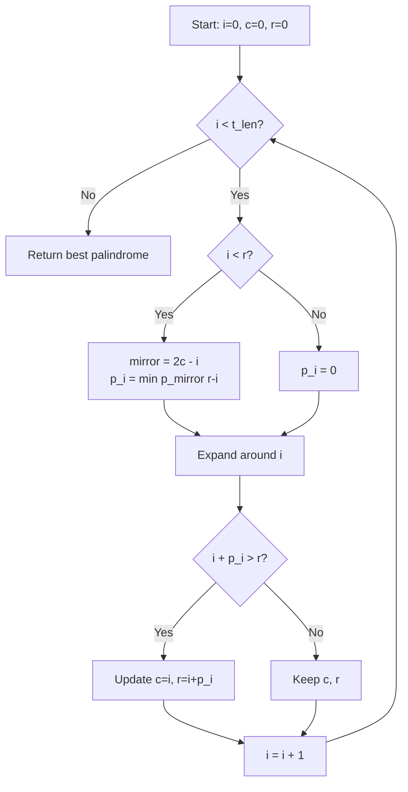
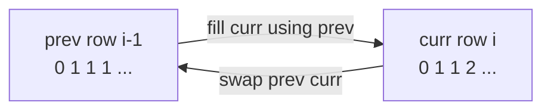
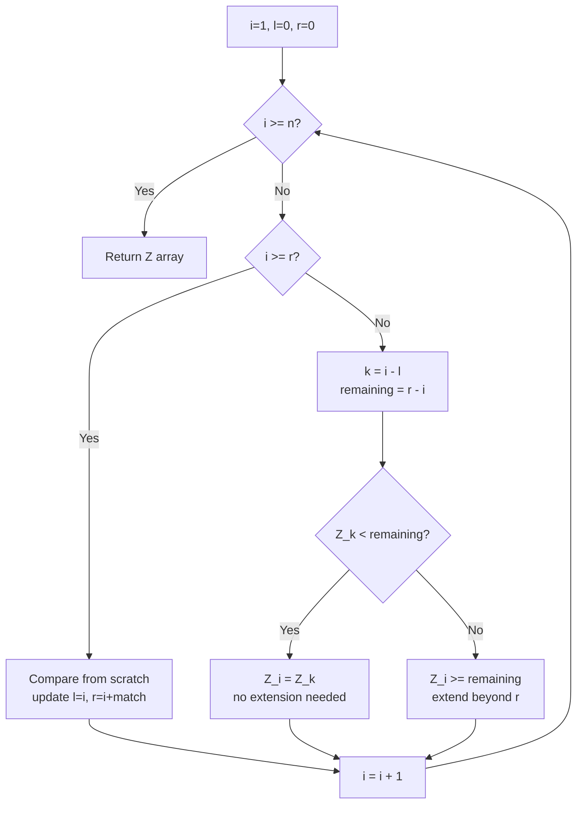
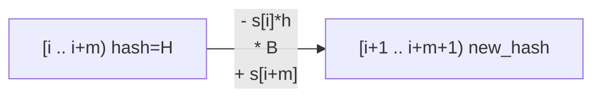
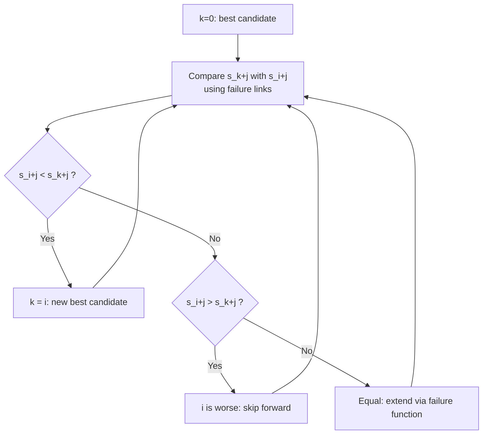
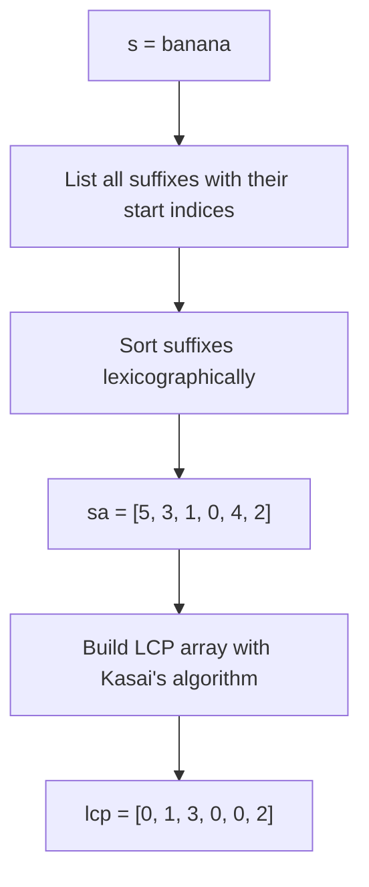
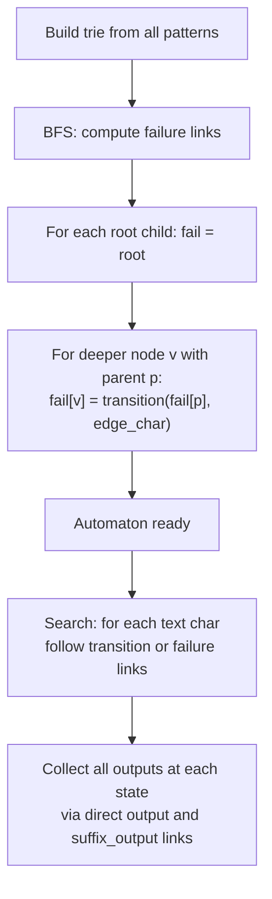

# String Algorithms Package

This package implements a collection of classic and advanced string algorithms,
all written in idiomatic MoonBit with explicit loop invariants.

**Public API:**
- `longest_palindrome_range(s)` — Manacher's algorithm, O(n)
- `lcs_length(s1, s2)` — Longest Common Subsequence length, O(n*m)

**Internal algorithms (with loop invariants and proof reasoning):**
- Z-Algorithm (O(n) Z-array construction)
- Rabin-Karp rolling-hash string matching
- Booth's algorithm (lexicographically smallest rotation)
- Suffix Array + LCP Array construction
- Trie, Aho-Corasick, XOR Trie, Persistent Trie, Radix Tree

---

## 1. Manacher's Algorithm — Longest Palindromic Substring

### What it returns

`longest_palindrome_range(s)` returns `(start, len)`:
- `start` — starting index of the longest palindrome in `s`
- `len` — its length

### Core idea: transformed string

To handle both odd- and even-length palindromes uniformly, Manacher inserts
a sentinel `#` between every character:

```
original: a  b  c  b  d
          0  1  2  3  4

transformed: #  a  #  b  #  c  #  b  #  d  #
             0  1  2  3  4  5  6  7  8  9  10
```

Every palindrome in the original string (odd or even) maps to an odd-length
palindrome centered at some position in the transformed string.

### Algorithm flow

```
State: rightmost palindrome [c-p[c] .. c+p[c]], right boundary r = c+p[c]

For each position i (left to right):
  ┌─────────────────────────────────────┐
  │  i < r ?                            │
  │  YES: mirror = 2*c - i              │
  │       p[i] = min(p[mirror], r - i)  │  (free, no new comparisons)
  │  NO:  p[i] = 0                      │
  └─────────────────────────────────────┘
           │
           v
  Expand: try to extend palindrome at i beyond current p[i]
           │
           v
  If i + p[i] > r: update c = i, r = i + p[i]
```



### Mirror symmetry: why reuse is correct

```
  palindrome centered at c, radius p[c]
  |<-------------- 2*p[c]+1 ------------->|

  [  ....  mirror  ....  c  ....  i  ....  r  ]
               |<--p[m]-->|    |<--p[i]-->|

  Because the region [l..r) is palindromic:
    p[i] >= min(p[mirror], r - i)

  Case A: p[mirror] < r-i  => p[i] = p[mirror]  (palindrome fits inside)
  Case B: p[mirror] >= r-i => p[i] >= r-i        (must verify beyond r)
```

### Step-by-step example: `"abcbd"`

```
Transformed: # a # b # c # b # d #
Index:       0 1 2 3 4 5 6 7 8 9 10

i=1 (a): expand -> p[1]=1,  c=1, r=2
i=2 (#): expand -> p[2]=0
i=3 (b): expand -> p[3]=3,  c=3, r=6   ("aba" in original)
  transformed palindrome: #a#b#a#
i=4 (#): mirror=2, p[2]=0 < r-i=2 -> p[4]=0
i=5 (c): mirror=1, p[1]=1 < r-i=1 -> p[5]=1  (just "c"), but try extend: p[5]=5
  palindrome: #b#c#b# -> "bcb"   -> c=5, r=10
i=6 (#): mirror=4, p[4]=0 < r-i=4 -> p[6]=0
i=7 (b): mirror=3, p[3]=3 >= r-i=3 -> start from 3, expand: p[7]=1
i=8 (#): mirror=2, p[2]=0 < r-i=2 -> p[8]=0
i=9 (d): mirror=1, p[1]=1 < r-i=1 -> p[9]=1
i=10(#): mirror=0, r-i=0 -> expand: p[10]=0

Max radius: p[5]=5 at position 5 in transformed
  start = (5 - 5) / 2 = 0   wait, recalc: (5-5)/2=0, length=5
  But "bcb" starts at 1 with length 3...

Actual max: compare all p values:
  p = [_, 1, 0, 3, 0, 5, 0, 1, 0, 1, 0]
  max is p[5]=5 -> original length=5, start=(5-5)/2=0  ("abcba"?)
  No: "abcbd" has no "abcba". Re-examine p[3]=3:
    center=3 in transformed "#a#b#a#" covers indices 0..6
    original: (3-3)/2=0, length=3 -> "abc" ... hmm

Let's trace carefully for "abcbd":
  p[3]: center=#b# in "#a#b#c#b#d#"
        expand: left=2(#a#), right=4(#c#): # == # yes
                left=1(a), right=5(c): a != c, stop
        p[3]=1 -> original length=1, start=1 -> "b"  (just "b")

  p[5]: center=#c#:
        expand: left=4(#b#), right=6(#b#): # == # yes -> radius=1
                left=3(b), right=7(b): b == b yes -> radius=2
                left=2(#), right=8(#): # == # yes -> radius=3
                left=1(a), right=9(d): a != d, stop
        p[5]=3 -> original length=3, start=(5-3)/2=1 -> "bcb" (indices 1..3)

Result: (start=1, length=3) = "bcb"
```

### Example usage

```mbt check
///|
test "longest palindrome range" {
  let s1 : Array[Char] = ['a', 'b', 'a', 'c', 'a', 'b', 'a']
  inspect(@string.longest_palindrome_range(s1), content="(0, 7)")
  let s2 : Array[Char] = ['a', 'b', 'b', 'a']
  inspect(@string.longest_palindrome_range(s2), content="(0, 4)")
  let s3 : Array[Char] = ['a', 'b', 'c', 'b', 'd']
  inspect(@string.longest_palindrome_range(s3), content="(1, 3)")
}
```

### Complexity

```
Time:  O(n)  — r only increases; each character compared at most twice
Space: O(n)  — transformed string and radius array
```

---

## 2. Longest Common Subsequence (LCS) Length

### What it computes

`lcs_length(s1, s2)` returns the length of the longest sequence of characters
that appears in both `s1` and `s2` in order (not necessarily contiguous).

```
s1 = A B C D E F
s2 = A C B C F

One LCS: A B C F  (length 4)
         A _ C _ _ F matches: s1[0],s1[1],s1[2],s1[5]
                              s2[0],s2[2],s2[3],s2[4]
```

### DP recurrence

Let `L[i][j]` = LCS length of `s1[0..i)` and `s2[0..j)`.

```
L[0][j] = 0  for all j   (empty prefix)
L[i][0] = 0  for all i   (empty prefix)

L[i][j] = L[i-1][j-1] + 1            if s1[i-1] == s2[j-1]
         = max(L[i-1][j], L[i][j-1]) otherwise
```

### Space-optimized DP table fill

The implementation keeps only two rows (`prev` and `curr`), swapping after
each row is complete.



### Step-by-step example: `"ABC"` vs `"AC"`

```
      ""  A  C
  ""   0  0  0
  A    0  1  1    s1[0]='A'==s2[0]='A': L=L[0][0]+1=1
                  s1[0]='A'!=s2[1]='C': L=max(L[0][1],L[1][0])=max(0,1)=1
  B    0  1  1    s1[1]='B'!=s2[0]='A': L=max(L[1][0],L[2][0])=1
                  s1[1]='B'!=s2[1]='C': L=max(L[1][1],L[2][0])=1
  C    0  1  2    s1[2]='C'!=s2[0]='A': L=max(L[2][0],L[3][0])=1
                  s1[2]='C'==s2[1]='C': L=L[2][0]+1=2

LCS length = L[3][2] = 2  (the subsequence "AC")
```

### Traceback (not in this package, shown for reference)

```
start at bottom-right corner, move diagonally on match,
otherwise move toward the larger neighbor (up or left):

      ""  A  C
  ""   0  0  0
  A    0  1  1 <--
  B    0  1  1    |
  C    0  1  2* <-- match: take 'C', move diagonal

      ""  A  C
  ""   0  0  0
  A    0  1* <-- match: take 'A'
  ...
Result: "AC"
```

### Example usage

```mbt check
///|
test "lcs length" {
  let s1 : Array[Char] = ['A', 'B', 'C', 'D', 'E', 'F']
  let s2 : Array[Char] = ['A', 'C', 'B', 'C', 'F']
  inspect(@string.lcs_length(s1, s2), content="4")
  let s3 : Array[Char] = ['A', 'B', 'C']
  let s4 : Array[Char] = ['D', 'E', 'F']
  inspect(@string.lcs_length(s3, s4), content="0")
}
```

### Complexity

```
Time:  O(n * m)  — fill every cell of the DP table once
Space: O(n)      — two rows of length n+1
```

---

## 3. Z-Algorithm

Computes the **Z-array**: `Z[i]` = length of the longest substring starting at
`s[i]` that is also a prefix of `s`.

### Z-box invariant

```
[l, r) = rightmost known matching interval (Z-box)
         s[l..r) == s[0..r-l)

For i inside the Z-box (i < r):
  mirror k = i - l
  Z[i] >= min(Z[k], r - i)    <- reuse from mirror

For i outside (i >= r):
  compare from scratch starting at s[0] vs s[i]
```



### Application: pattern matching in O(n+m)

```
pattern = "ab"
text    = "xababx"
combined = a b $ x a b a b x
Z-array  = 9 1 0 0 2 1 2 1 0

Positions where Z[i] >= len(pattern) = 2: indices 4, 6
These are matches of "ab" in the text (at offsets 4-2=2 and 6-2=4).
```

---

## 4. Rabin-Karp Rolling Hash

Matches a pattern in a text by comparing **hash fingerprints** of each window,
then verifying character-by-character only on hash matches.

### Rolling hash update

```
Window [i .. i+m):
  hash = s[i]*B^(m-1) + s[i+1]*B^(m-2) + ... + s[i+m-1]

Move to [i+1 .. i+m+1):
  Step 1: subtract leading char contribution
    temp = hash - s[i] * B^(m-1)
  Step 2: shift and add new char
    new_hash = temp * B + s[i+m]

Cost: O(1) per slide step
```



### Complexity

```
Expected:   O(n + m)   — few hash collisions
Worst case: O(n * m)   — many collisions (rare with large prime modulus)
```

---

## 5. Booth's Algorithm — Lexicographically Smallest Rotation

Finds the starting index `k` such that `s[k:] + s[:k]` is the
lexicographically smallest rotation of `s`, in **O(n)** time.

### Idea

Instead of comparing all `n` rotations (O(n²)), Booth's algorithm uses a
KMP-style failure function on the doubled string `s+s` to skip impossible
candidates.

```
"bca"  rotations: "bca", "cab", "abc"
                                 ^-- smallest, starts at index 2
```



### Applications

```
- Canonical form for cyclic strings (DNA motifs)
- String equality under rotation
- Burrows-Wheeler Transform preprocessing
```

---

## 6. Suffix Array and LCP Array

### Suffix Array

A **suffix array** `sa` stores the starting indices of all suffixes of a string
sorted in lexicographic order.

```
s = "banana"

Suffix index | Suffix
     5       | "a"
     3       | "ana"
     1       | "anana"
     0       | "banana"
     4       | "na"
     2       | "nana"

sa = [5, 3, 1, 0, 4, 2]
```



### LCP Array (Kasai's Algorithm)

`lcp[i]` = length of the longest common prefix between `sa[i]` and `sa[i-1]`.

```
Sorted suffixes: a  |  ana  |  anana  |  banana  |  na  |  nana
LCP:             0  |   1   |    3    |     0    |   0  |   2
```

**Kasai's key insight:** if `lcp[rank[i]] = k`, then `lcp[rank[i+1]] >= k-1`.
This allows O(n) construction by processing suffixes in text (not sorted) order.

```
Process i=0 (suffix "banana", rank=3): compute lcp[3]=0
Process i=1 (suffix "anana",  rank=2): lcp[2] >= max(lcp[3]-1, 0)=0 -> compute 3
Process i=2 (suffix "nana",   rank=5): lcp[5] >= 3-1=2 -> compute 2
...
```

### Applications built on top

| Function | Description | Complexity |
|---|---|---|
| `count_distinct_substrings` | Total - sum(lcp) | O(n) |
| `longest_repeated_substring` | Max value in LCP array | O(n) |
| `search_pattern` | Binary search on suffix array | O(m log n) |
| `longest_common_substring_sa` | Concatenate + SA + LCP | O(n+m) |
| `burrows_wheeler_transform` | Last column of rotation matrix | O(n) |
| `smallest_rotation` | SA on doubled string | O(n log n) |

### Distinct substrings formula

```
Total substrings    = n*(n+1)/2
Duplicate substrings = sum of all lcp values
Distinct            = Total - Duplicates

"banana": 6*7/2 - (0+1+3+0+0+2) = 21 - 6 = 15
```

---

## 7. Trie Data Structures

### Standard Trie (Prefix Tree)

Each path from root to a marked node spells a word. Each node has up to 26
children (one per lowercase letter) and a `prefix_count` field counting how
many inserted words pass through it.

```
Insert: "app", "apple", "application", "banana"

          root
         /    \
        a      b
        |      |
        p      a
        |      |
        p*     n
       / \     |
      l   (end) a
      |         |
      e*        n
      |         |
      i         a*
      |
      c
      |
      a
      |
      t
      |
      i
      |
      o
      |
      n*

* = is_end node
count_prefix("app") = 3
```

### Aho-Corasick Automaton

Extends the trie with **failure links** (similar to KMP) for multi-pattern
matching in O(n + m_total + occurrences) time.



**Example:** patterns = `["he", "she", "his", "hers"]`, text = `"ushers"`

```
text:    u  s  h  e  r  s
state:   0  0  3  4  8  9
matches at each state:
  state 4 (end of "he"):  -> "she" ends at pos 4, "he" ends at pos 4
  state 9 (end of "hers"): -> "hers" ends at pos 6
```

### XOR Trie (Binary Trie)

A binary trie over the bits of integers, used to find the maximum XOR of a
query number against any number in the set.

```
Insert 3 (011), 10 (1010), 5 (0101) into an 8-bit trie.

Query: max XOR with 6 (0110)
  At each bit, prefer the opposite bit to maximize.
  Bit 7: 6 has 0 -> want 1: no 1 child, take 0
  ...
  6 XOR 10 = 12  (max)
```

### Persistent Trie

A **persistent** (immutable-style) trie that creates a new version on each
insertion by copying only the nodes on the insertion path (path copying).

```
Version 0: empty root
Version 1: insert "hello" — new root + 5 new nodes
Version 2: insert "help"  — new root + 3 new nodes (share "hel" prefix from v1)

All versions remain queryable.
```

### Radix Tree (Compressed Trie)

A trie where chains of single-child nodes are compressed into single edges
with string labels, saving space.

```
Trie:            Radix Tree:
  r                 r
  |                 |
  o                "omane"* / "omanus"* / "omulus"*
  m               ...
  a
  n
  e*
```

---

## 8. Complexity Summary

```
Algorithm                     Time         Space
----------------------------------------------------
Manacher (palindrome)         O(n)         O(n)
LCS length (DP)               O(n*m)       O(n)
Z-Algorithm                   O(n)         O(n)
Rabin-Karp (expected)         O(n+m)       O(1)
Booth's rotation              O(n)         O(n)
Suffix array (simple)         O(n^2 log n) O(n)
LCP array (Kasai)             O(n)         O(n)
Pattern search (SA + BS)      O(m log n)   O(1) query
Distinct substrings           O(n)         O(n)
Aho-Corasick build            O(sum|p|)    O(sum|p|)
Aho-Corasick search           O(n+occ)     O(1) query
XOR Trie insert/query         O(bits)      O(n*bits)
Persistent Trie insert        O(|word|)    O(|word|)
Radix Tree insert/search      O(|word|)    O(n)
```

---

## 9. Typical Applications

1. **Palindrome detection** — DNA motifs, text cleaning, cryptography
2. **Diff tools** — LCS for file comparison (`diff`, `git diff`)
3. **Bioinformatics** — sequence alignment, repeat detection
4. **Search engines** — Aho-Corasick for keyword filtering
5. **Competitive programming** — suffix array + LCP for string problems
6. **Data compression** — BWT for bzip2-style compression
7. **IP routing** — Radix tree for longest prefix match
8. **Bit manipulation** — XOR trie for maximum subarray XOR problems
