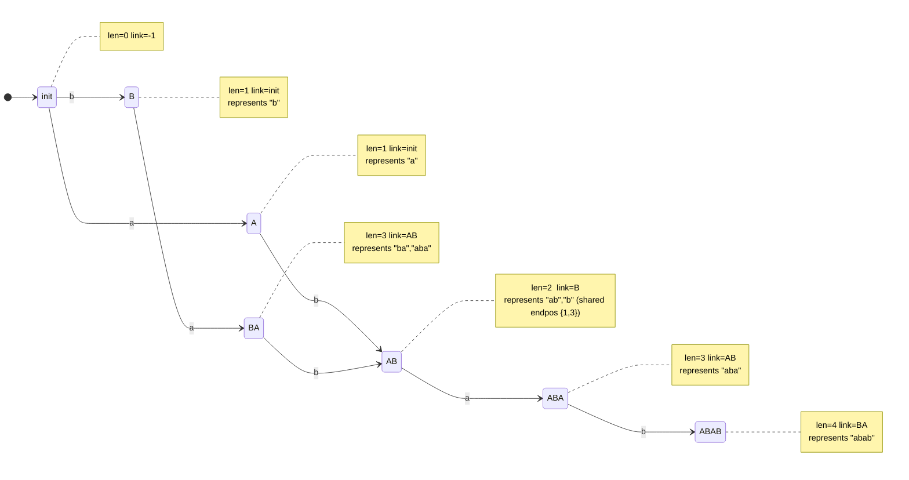

# Suffix Automaton (Extended)

This package implements a **suffix automaton (SAM)** with extra utilities:

- substring checks,
- distinct substring count,
- occurrence counting,
- longest common substring length.

It builds in **O(n)** time and space.

---

## 1. What is a suffix automaton?

A suffix automaton is a minimal DFA that recognizes **all substrings** of a
string.

```
P is a substring of S  <=>  SAM built from S accepts P
```

Unlike a trie of all substrings (which is huge), a SAM is compact:

```
at most 2n - 1 states for a string of length n
```

---

## 2. Core concepts

### 2a. Endpos equivalence

Many substrings end at the **same set of positions** in the text. A SAM groups
all such substrings into one state. This is the key compression.

```
Example: "abab"  (0-indexed ending positions)

  "ab"  ends at {1, 3}
  "b"   ends at {1, 3}
  --> same state

  "a"   ends at {0, 2}
  --> own state

  "aba" ends at {2}
  --> own state
```

### 2b. Length range per state

Each state `q` represents substrings whose lengths fall in a contiguous range:

```
  (len[link[q]] + 1)  ..  len[q]
```

This is why the distinct-substring formula works (see Section 6).

### 2c. Suffix links

Every state has a **suffix link** pointing to the state whose string class
contains the longest proper suffix of any string in the current class.

```
  "abab"  -->  "bab"  -->  "ab"  -->  "b"  -->  ""
```

Suffix links form a tree rooted at the initial state. This tree is used for
topological propagation (e.g., occurrence counts).

---

## 3. State machine diagrams

### 3a. SAM for "ab"

```
States: init(0), A(1), AB(2)

         a           b
  (0) -------> (1) -------> (2)
  init          A            AB
```

Suffix links:

```
  AB(2)  -->  A(1)   [link]
  A(1)   -->  init(0) [link]
  init(0) has no link (-1)
```

### 3b. SAM for "abab" (full Mermaid diagram)



### 3c. Suffix link tree for "abab"

```
                init(0)
               /       \
            A(1)        B(2)
              \           \
              AB(3)       ABA(4)
                \
               ABAB(5)
```

Each child's suffix link points to its parent.

---

## 4. ASCII art: one extension step

When character `c` is added, the algorithm does:

```
  Before adding 'b' to SAM of "a":

    [init] --a--> [A]
       ^
       last = A

  Step 1: allocate new state cur for "ab"
  Step 2: walk suffix links from last=A, set transitions to cur

    [init] --a--> [A] --b--> [cur="ab"]
    [init] --b--> [cur="ab"]   (via suffix link walk)

  Step 3: set suffix link for cur
    cur.link = init  (because init.len+1 == cur.len would need checking)

  After: last = cur
```

If the existing transition target `q` must be split (its length is wrong), a
**clone** state is created:

```
  Clone inherits q's transitions and suffix link,
  then q and cur both point their suffix links at clone.

  ...p --c--> [clone] <-- q.link
                   \
                    +--- q.link = clone
                    +--- cur.link = clone
```

---

## 5. Public API and example usage

```mbt check
///|
test "suffix automaton example" {
  let sam = @suffix_automaton.SuffixAutomaton(10)
  sam.build("abab")
  inspect(sam.contains("aba"), content="true")
  inspect(sam.contains("ac"), content="false")
  inspect(sam.count_distinct_substrings(), content="7")
  inspect(
    @suffix_automaton.longest_common_substring("abcde", "cdefg"),
    content="3",
  )
}
```

---

## 5b. Count occurrences (extra example)

```mbt check
///|
test "suffix automaton occurrences" {
  let sam = @suffix_automaton.SuffixAutomaton(10)
  sam.build("aaaa")
  inspect(sam.count_occurrences("a"), content="4")
  inspect(sam.count_occurrences("aa"), content="3")
  inspect(sam.count_occurrences("aaa"), content="2")
  inspect(sam.count_occurrences("aaaa"), content="1")
}
```

---

## 6. Distinct substrings count

Each state `q` contributes exactly the substrings with lengths in
`(len[link[q]] + 1) .. len[q]`, which is:

```
  len[q] - len[link[q]]  distinct substrings
```

Summing over all non-initial states gives the total distinct count.

Example `"abab"`:

```
  Substrings: a, b, ab, ba, aba, bab, abab  ->  7
```

Breakdown per state (illustrative):

```
  State A    : len=1, link.len=0  ->  1 - 0 = 1   ("a")
  State B    : len=1, link.len=0  ->  1 - 0 = 1   ("b")
  State AB   : len=2, link.len=1  ->  2 - 1 = 1   ("ab")
  State BA   : len=3, link.len=2  ->  3 - 2 = 1   ("ba")
  State ABA  : len=3, link.len=2  ->  3 - 2 = 1   ("aba")
  State ABAB : len=4, link.len=3  ->  4 - 3 = 2   ("bab", "abab")
                                               ---
                                    total =    7
```

---

## 7. Occurrence counting (idea)

1. Walk the SAM with `pattern`; reach state `s`.
2. Sort all states by `len` descending (topological order of suffix link tree).
3. Every state reachable from the "last" suffix-link chain counts as a terminal
   (occurrence). Propagate counts up the suffix link tree.
4. `cnt[s]` is the answer.

```
  Suffix link tree propagation (bottom-up):

  leaf states (long strings) push their counts up to the root.
  Each parent accumulates the sum of its children.
```

---

## 8. Longest common substring (idea)

Build SAM for S, then walk through T character by character:

```
  current state = init
  current match length = 0

  For each character c in T:
    if transition(state, c) exists:
      state = next state
      length += 1
    else:
      while state != init and no transition(state, c):
        state = suffix_link(state)
        length = len[state]
      if transition(state, c) exists:
        state = next state
        length += 1
      else:
        state = init
        length = 0
    max_length = max(max_length, length)
```

Total time: O(|S| + |T|).

### Example

```
  S = "abcde"
  T = "cdefg"

  c -> match "c"   (len=1)
  d -> match "cd"  (len=2)
  e -> match "cde" (len=3)
  f -> no transition, follow suffix links, eventually reset
  g -> no match

  LCS length = 3  ("cde")
```

---

## 9. Complexity

```
  Build SAM              : O(n)
  Substring check        : O(m)
  Distinct substrings    : O(n)
  Occurrence count       : O(n + m)
  Longest common substr  : O(n + m)

  Space                  : O(n * alphabet_size)
  States                 : <= 2n - 1
  Transitions            : <= 3n - 4
```

---

## 10. Beginner checklist

1. SAM accepts all **substrings**, not just suffixes.
2. Suffix links compress endpos-equivalent substrings into single states.
3. Maximum states is 2n - 1; maximum transitions is 3n - 4.
4. For each query, walk transitions from the initial state.
5. The suffix link tree (not the transition graph) drives occurrence counting.

---

## 11. Summary

The suffix automaton is one of the most powerful linear-space string structures:

- compact (O(n) states and transitions),
- O(m) substring checks,
- O(n) distinct substring enumeration,
- O(n + m) longest common substring,
- extensible to many other string tasks.
