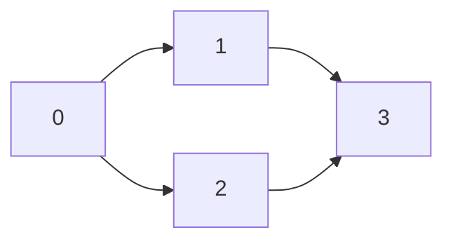
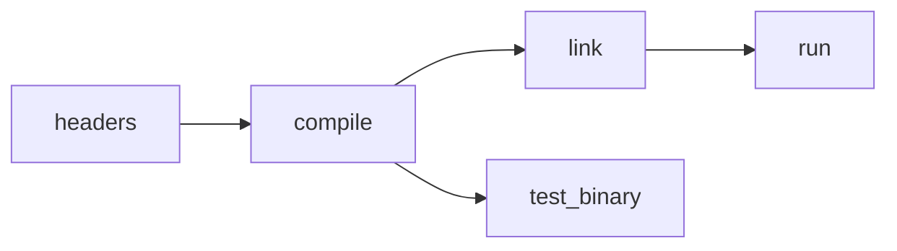
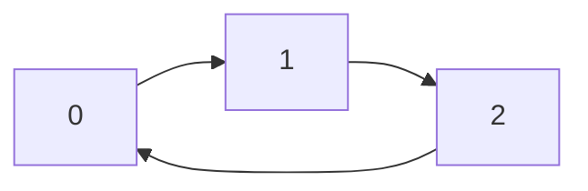
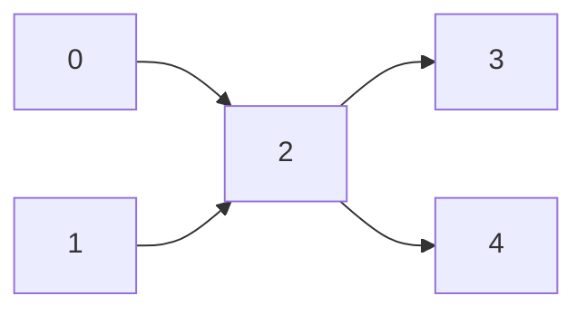
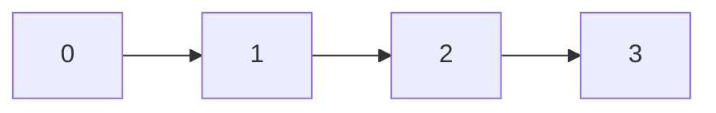
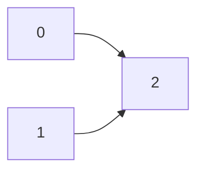
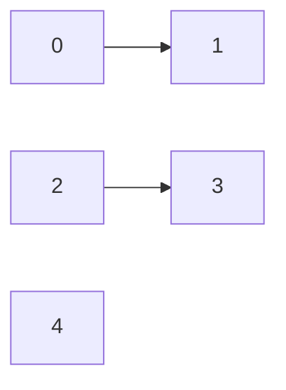

# Topological Sort with DFS (Beginner-Friendly)

Topological sort orders the vertices of a **directed acyclic graph (DAG)** so
that every directed edge goes left-to-right in the order.

If the graph has a **cycle**, no topological order exists.
This package detects that and returns `None`.

---

## Problem in plain words

You have tasks with dependencies:

```
Build -> Test -> Deploy
Lint  -> Test
```

You want a list of tasks where every prerequisite appears **before** the task
that depends on it.

That is exactly what topological sort provides.

---

## API (from this package)

```
@topological_sort_dfs.topological_sort(
  n, edges[:]
) -> Array[Int]?
```

- `n` is the number of vertices (0 to n-1).
- `edges` is a list of directed edges `(u, v)` meaning `u` must come before `v`.
- Returns `Some(order)` for DAGs, `None` for graphs with cycles.
- Edges with out-of-range vertices are ignored by this implementation.

---

## Example graph as a Mermaid DAG

The diamond-shaped graph used throughout this document:

```
0 -> 1 -> 3
0 -> 2 -> 3
```



One valid topological order: `0, 2, 1, 3`  (or `0, 1, 2, 3`).
Both are correct — the sort only guarantees that every prerequisite comes first.

---

## Build system example as a Mermaid DAG

A more realistic dependency graph:

```
headers -> compile -> link -> run
headers -> compile -> test
```



A valid topological order: `headers, compile, link, test_binary, run`.

---

## Key idea (DFS finish order)

DFS has a useful property:

> When DFS finishes a node, **all nodes reachable from it are already finished**.

So if we:
1. run DFS,
2. append each node when it finishes,
3. reverse that list,

we get a valid topological order.

---

## Visual: finish order (ASCII art)

Graph:

```
0 -> 1 -> 3
0 -> 2 -> 3
```

DFS from 0 (one possible traversal):

```
Adjacency list:
  0: [1, 2]
  1: [3]
  2: [3]
  3: []

DFS call tree            Finish list (push on return)
--------------------     ----------------------------
visit(0)
  visit(1)
    visit(3)
    finish(3)         -> [3]
  finish(1)           -> [3, 1]
  visit(2)
    (3 already done, skip)
  finish(2)           -> [3, 1, 2]
finish(0)             -> [3, 1, 2, 0]

Reverse finish list:  [0, 2, 1, 3]
```

Check edges in the result `[0, 2, 1, 3]`:
- `0 -> 1`: position 0 < position 2  (ok)
- `0 -> 2`: position 0 < position 1  (ok)
- `1 -> 3`: position 2 < position 3  (ok)
- `2 -> 3`: position 1 < position 3  (ok)

All good.

---

## Cycle detection (why `None` happens)

During DFS we mark each node with a state:

```
0 = unvisited
1 = visiting  (currently on the DFS call stack)
2 = done      (all descendants are finished)
```

If we ever see an edge to a **visiting** node, that is a **back edge** — it
closes a cycle.

Example cycle:

```
0 -> 1 -> 2 -> 0
```



DFS trace:

```
visit(0) [state: 0->1]
  visit(1) [state: 0->1]
    visit(2) [state: 0->1]
      edge 2->0: state[0] == 1 (visiting!)  =>  CYCLE DETECTED
      return false
    return false
  return false
return false

Result: None
```

---

## State machine diagram

```
                        +-------------------+
   start                |                   |
   -----> [ unvisited ] --enter--> [ visiting ] --finish--> [ done ]
               0                      1                       2
                                       |
                                sees "visiting" neighbor
                                       |
                                   CYCLE => None
```

---

## Full DFS-based topological sort walkthrough

The algorithm on the 5-node graph:

```
0 -> 2
1 -> 2
2 -> 3
2 -> 4
```



Step-by-step trace:

```
Vertices: 0, 1, 2, 3, 4    State array: [0, 0, 0, 0, 0]
Finish list: []

--- Outer loop: v=0 (unvisited) ---
  visit(0) state[0]=1
    edge 0->2: visit(2) state[2]=1
      edge 2->3: visit(3) state[3]=1
        no neighbors
      finish(3) state[3]=2  finish=[3]
      edge 2->4: visit(4) state[4]=1
        no neighbors
      finish(4) state[4]=2  finish=[3,4]
    finish(2) state[2]=2    finish=[3,4,2]
  finish(0) state[0]=2      finish=[3,4,2,0]

--- Outer loop: v=1 (unvisited) ---
  visit(1) state[1]=1
    edge 1->2: state[2]==2, skip
  finish(1) state[1]=2      finish=[3,4,2,0,1]

--- Outer loop: v=2..4 already done ---

Reverse finish list: [1, 0, 2, 4, 3]

Check: 0 before 2 (pos 1 < pos 2): ok
       1 before 2 (pos 0 < pos 2): ok
       2 before 3 (pos 2 < pos 4): ok
       2 before 4 (pos 2 < pos 3): ok
```

---

## Helper: verify a topological order

This is a small utility used in the examples below.

```mbt check
///|
fn is_topological_order(
  n : Int,
  edges : ArrayView[(Int, Int)],
  order : ArrayView[Int],
) -> Bool {
  if order.length() != n {
    return false
  }
  let pos = Array::make(n, -1)
  for i, v in order {
    if v < 0 || v >= n {
      return false
    }
    if pos[v] != -1 {
      return false
    }
    pos[v] = i
  }
  for edge in edges {
    let (u, v) = edge
    if u < 0 || u >= n || v < 0 || v >= n {
      continue
    }
    if pos[u] >= pos[v] {
      return false
    }
  }
  true
}
```

---

## Example 1: simple chain (unique order)

```
0 -> 1 -> 2 -> 3
```



Only one valid order exists: `[0, 1, 2, 3]`.

```mbt check
///|
test "topological sort: chain" {
  let edges : Array[(Int, Int)] = [(0, 1), (1, 2), (2, 3)]
  let result = @topological_sort_dfs.topological_sort(4, edges)
  match result {
    None => fail("expected a valid order")
    Some(order) => {
      inspect(order, content="[0, 1, 2, 3]")
      inspect(is_topological_order(4, edges, order), content="true")
    }
  }
}
```

---

## Example 2: multiple valid orders

```
0 -> 2
1 -> 2
```



Valid orders include:
- `[0, 1, 2]`
- `[1, 0, 2]`

```mbt check
///|
test "topological sort: multiple valid orders" {
  let edges : Array[(Int, Int)] = [(0, 2), (1, 2)]
  let result = @topological_sort_dfs.topological_sort(3, edges)
  match result {
    None => fail("expected a valid order")
    Some(order) =>
      inspect(is_topological_order(3, edges, order), content="true")
  }
}
```

---

## Example 3: disconnected graph

```
0 -> 1    2 -> 3    4 (isolated)
```



Topological sort still works; isolated nodes appear somewhere in the list.

```mbt check
///|
test "topological sort: disconnected graph" {
  let edges : Array[(Int, Int)] = [(0, 1), (2, 3)]
  let result = @topological_sort_dfs.topological_sort(5, edges)
  match result {
    None => fail("expected a valid order")
    Some(order) =>
      inspect(is_topological_order(5, edges, order), content="true")
  }
}
```

---

## Example 4: cycle detection

```
0 -> 1 -> 2 -> 0
```


No topological order exists.

```mbt check
///|
test "topological sort: cycle" {
  let edges : Array[(Int, Int)] = [(0, 1), (1, 2), (2, 0)]
  let result = @topological_sort_dfs.topological_sort(3, edges)
  inspect(result is None, content="true")
}
```

---

## Why the algorithm works (short proof)

Consider any edge `u -> v` in a DAG.

- If DFS visits `u` before `v`, then DFS must finish `v` before it can finish
  `u` (because `v` is reachable from `u`).
- If DFS visits `v` before `u`, then `v` finishes before `u` is even visited.

Either way, `v` finishes before `u`.
So in the **reverse finish order**, `u` appears before `v`.
That is exactly the definition of a topological order.

The "visiting" state prevents cycles:
if `u -> v` and `v` is already on the current DFS stack, then there is a path
`v -> ... -> u`, so `u -> v` closes a loop and the graph is not a DAG.

---

## DFS states at a glance

```
   state[v] = 0          state[v] = 1          state[v] = 2
  +-----------+          +-----------+          +-----------+
  | unvisited |  enter   |  visiting |  finish  |   done    |
  |           | -------> |  (on DFS  | -------> |           |
  |           |          |   stack)  |          |           |
  +-----------+          +-----------+          +-----------+
                              |
                  edge to another "visiting" node
                              |
                         cycle => None
```

---

## Complexity

- Time: `O(V + E)` — each vertex and edge is processed once.
- Space: `O(V + E)` — adjacency lists plus the DFS state and finish list.

---

## Common applications

- Task scheduling with dependencies
- Build systems (compile order)
- DAG dynamic programming (process nodes in topological order)
- Course prerequisites
- Package manager dependency resolution

---

## Algorithm comparison

| Algorithm        | Cycle detection | Extra passes | Notes                        |
|------------------|-----------------|--------------|------------------------------|
| DFS (this pkg)   | Yes (state 1)   | 1 DFS        | Simple, one pass             |
| Kahn (BFS-based) | Yes (leftover)  | 1 BFS        | Gives in-degree count        |

Both run in `O(V + E)`.  Kahn's algorithm is covered in
`challenge_toposort_kahn`.

---

## Common pitfalls

- Using topological sort on graphs with cycles: it will return `None`.
- Forgetting isolated vertices: they still belong in the order.
- Confusing edge direction: `(u, v)` means `u` must come **before** `v`.
