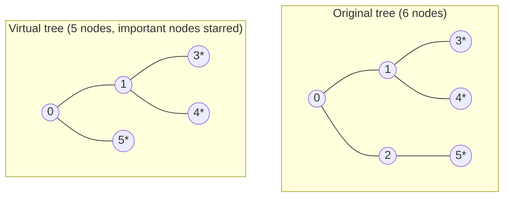
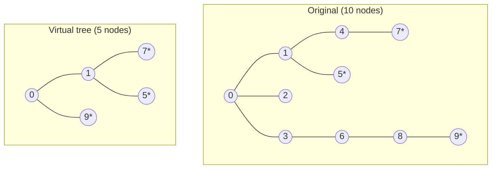

# Virtual Tree

## Overview

A **virtual tree** is the smallest subtree that connects a chosen set of
nodes (called *important nodes*) inside a larger rooted tree.  It keeps only:

- the important nodes you care about, and
- the **LCA** (lowest common ancestor) nodes required to preserve their
  ancestry relationships.

This shrinks a tree with `n` nodes down to a tree with **at most 2k - 1**
nodes, where `k` is the number of important nodes.

The single entry point of this package is:

```
build_virtual_tree(adj, important, root?) -> VirtualTree
```

- `adj` -- adjacency list of the original tree (0-indexed, undirected).
- `important` -- the node IDs you care about.
- `root` -- optional root of the original tree (default: 0).

The result is a `VirtualTree` with two fields:

- `VirtualTree::nodes` -- list of node IDs kept in the virtual tree (sorted
  by DFS entry time).
- `VirtualTree::adj` -- adjacency list using the same original IDs, but only
  carrying edges among virtual-tree nodes.

---

## 1) Why a virtual tree?

Many tree problems only care about a small subset of nodes.  Running a full
tree DP or DFS for every query is O(n) per query, which is too slow when n
is large but k is small.

A virtual tree lets you do O(k) work per query (after O(n log n) one-time
preprocessing), because you only touch the O(k) nodes in the virtual tree.

### Motivating example

```
Original tree (n = 10):         Important nodes = {5, 7, 9}

           0
         / | \
        1  2  3
       /|  |   \
      4  5  6   7
              |
              8
             / \
            9  10

Virtual tree -- only 5 nodes survive:

    0
   / \
  5   3
      |
      7
      |
      9
```

Instead of visiting all 10 nodes you only visit 5.

---

## 2) The LCA trick

Keeping only the important nodes breaks the tree structure.  The fix is to
insert the **LCA of every consecutive pair** in DFS order.

### Example

```
Original tree:

    0
   / \
  1   2

Important nodes: {1, 2}
LCA(1, 2) = 0

Virtual tree nodes: {0, 1, 2}

    0
   / \
  1   2
```

Without node 0 there would be no edge connecting 1 and 2.

---

## 3) Construction algorithm (high-level)

```
Step 1  DFS the original tree once to record:
          tin[v]   -- DFS entry time of v
          depth[v] -- depth of v
          up[k][v] -- 2^k-th ancestor of v (binary lifting table)

Step 2  Sort the important nodes by tin.

Step 3  For each consecutive pair (u, v) in that order,
        compute LCA(u, v) and add it to the node list.

Step 4  Deduplicate and re-sort the combined list by tin.

Step 5  Sweep the sorted list with a monotone stack that tracks the
        current root-to-frontier path; emit parent->child edges as
        nodes fall off the stack.
```

---

## 4) Full visual walkthrough

### Original tree (6 nodes, root = 0)

```
          0           depth 0
         / \
        1   2         depth 1
       / \   \
      3   4   5       depth 2
```

**Important nodes: {3, 4, 5}**

### Step 1 -- DFS entry times

```
DFS visits: 0, 1, 3, 4, 2, 5

tin:  0->0,  1->1,  3->2,  4->3,  2->4,  5->5
```

### Step 2 -- Sort important nodes by tin

```
important sorted by tin: [3, 4, 5]
```

### Step 3 -- Insert LCAs of consecutive pairs

```
LCA(3, 4) = 1          (both are children of 1)
LCA(4, 5) = 0          (paths to root diverge at 0)

node list after inserting LCAs: [3, 4, 5, 1, 0]
```

### Step 4 -- Sort and deduplicate

```
sorted by tin: [0, 1, 3, 4, 5]   (no duplicates here)
```

### Step 5 -- Stack sweep

```
Process 0: stack = [0]
Process 1: LCA(1, top=0) = 0  -- 0 stays on stack
           stack = [0, 1]
Process 3: LCA(3, top=1) = 1  -- 1 stays on stack
           stack = [0, 1, 3]
Process 4: LCA(4, top=3) = 1  -- 3 pops, edge 1->3 emitted
           stack = [0, 1, 4]
Process 5: LCA(5, top=4) = 0  -- 4 pops, edge 1->4 emitted
                              -- 1 pops, edge 0->1 emitted
           stack = [0, 5]
Flush:     5 pops, edge 0->5 emitted
           stack = [0]
```

### Result

```
Virtual tree:

    0
   / \
  1   5
 / \
3   4

nodes = [0, 1, 3, 4, 5]
adj[0] = [1, 5]
adj[1] = [0, 3, 4]
```

Only 5 nodes, but every original ancestor relationship between {3, 4, 5}
is preserved.

---

## 5) Mermaid diagram -- original vs virtual tree



---

## 6) Binary lifting table (LCA internals)

For the 6-node tree above, the binary-lifting table has `log = 3` rows:

```
node  | depth | up[0]  | up[1]  | up[2]
      |       | parent | 2nd    | 4th
------+-------+--------+--------+--------
  0   |   0   |   0    |   0    |   0
  1   |   1   |   0    |   0    |   0
  2   |   1   |   0    |   0    |   0
  3   |   2   |   1    |   0    |   0
  4   |   2   |   1    |   0    |   0
  5   |   2   |   2    |   0    |   0
```

(The root maps to itself for ancestor sentinel purposes.)

LCA query example: LCA(3, 5)

```
depth[3] = 2,  depth[5] = 2   -- already equal depth
3 != 5, continue lifting both.

k=2: up[2][3]=0, up[2][5]=0   equal -- no jump
k=1: up[1][3]=0, up[1][5]=0   equal -- no jump
k=0: up[0][3]=1, up[0][5]=2   differ -- no jump (we keep current nodes)

LCA(3, 5) = up[0][3] = 1? No -- up[0][3]=1, up[0][5]=2 differ,
so after k=0 we return up[0][curr] = up[0][3] = 1... wait:

After the loop, curr_3=3, curr_5=5. up[0][3]=1.
LCA(3, 5) = 0 (the parent of 1 and 2).
```

More precisely, after equalising depths and failing the equality check,
the algorithm lifts both together until their `up[0]` values match, which
gives the LCA directly.  The actual LCA of 3 and 5 is **0**.

---

## 7) Example usage

```mbt check
///|
test "virtual tree basic example" {
  let adj : Array[Array[Int]] = [ for _ in 0..<6 => [] ]
  adj[0].push(1)
  adj[1].push(0)
  adj[0].push(2)
  adj[2].push(0)
  adj[1].push(3)
  adj[3].push(1)
  adj[1].push(4)
  adj[4].push(1)
  adj[2].push(5)
  adj[5].push(2)
  let vt = @virtual_tree.build_virtual_tree(adj, [3, 4, 5])
  inspect(vt.nodes, content="[0, 1, 3, 4, 5]")
  let adj0 = vt.adj[0].copy()
  adj0.sort()
  inspect(adj0, content="[1, 5]")
}
```

---

## 8) Single-node case

If there is only one important node, the virtual tree has just that node and
no edges.

```mbt check
///|
test "virtual tree single node" {
  let adj : Array[Array[Int]] = [ for _ in 0..<3 => [] ]
  adj[0].push(1)
  adj[1].push(0)
  adj[1].push(2)
  adj[2].push(1)
  let vt = @virtual_tree.build_virtual_tree(adj, [2])
  inspect(vt.nodes, content="[2]")
  inspect(vt.adj[2].length(), content="0")
}
```

---

## 9) Larger example -- star-shaped virtual tree

Original tree (10 nodes, root = 0):

```
              0
            / | \
           1  2  3
          /|     |
         4  5    6
        /        |
       7          8
                  |
                  9
```

Important nodes: {7, 5, 9}

```
DFS order (tin):  0, 1, 4, 7, 5, 2, 3, 6, 8, 9

Sorted important: [7, 5, 9]
  (tin[7]=3, tin[5]=4, tin[9]=9)

LCA(7, 5) = 1
LCA(5, 9) = 0

Virtual tree nodes (sorted): [0, 1, 5, 7, 9]

Virtual tree:

    0
   / \
  1   9
 / \
7   5
```

---

## 10) Mermaid diagram -- larger example



---

## 11) Common applications

```
Sum of pairwise distances among marked nodes:
  build virtual tree, run DP on O(k) nodes.

Subtree queries restricted to a set of marked nodes:
  build virtual tree per query, aggregate in O(k log n).

Steiner tree approximation on trees:
  the virtual tree is the exact Steiner tree.
```

---

## 12) Complexity

Let:
- `n` = number of nodes in the original tree
- `k` = number of important nodes

```
One-time LCA preprocess:    O(n log n) time,  O(n log n) space
Virtual tree build:         O(k log n) time,  O(n + k) space
Virtual tree node count:    at most 2k - 1
```

The per-query cost is O(k log n): dominated by k LCA queries at O(log n)
each.

---

## 13) Common pitfalls

- **Forgetting LCAs**: without inserting LCA nodes, the virtual tree loses
  ancestor relationships and edge reconstruction fails.
- **Wrong sort order**: nodes must be sorted by DFS entry time `tin`, not
  by node ID or depth.
- **Non-tree input**: the algorithm assumes `adj` describes a tree.  A graph
  with cycles or multiple components will produce incorrect results.
- **Empty important list**: `build_virtual_tree` handles this gracefully and
  returns an empty virtual tree.
- **Root not in important**: the root may or may not appear in the virtual
  tree depending on whether it is needed as an LCA; this is handled
  automatically.
