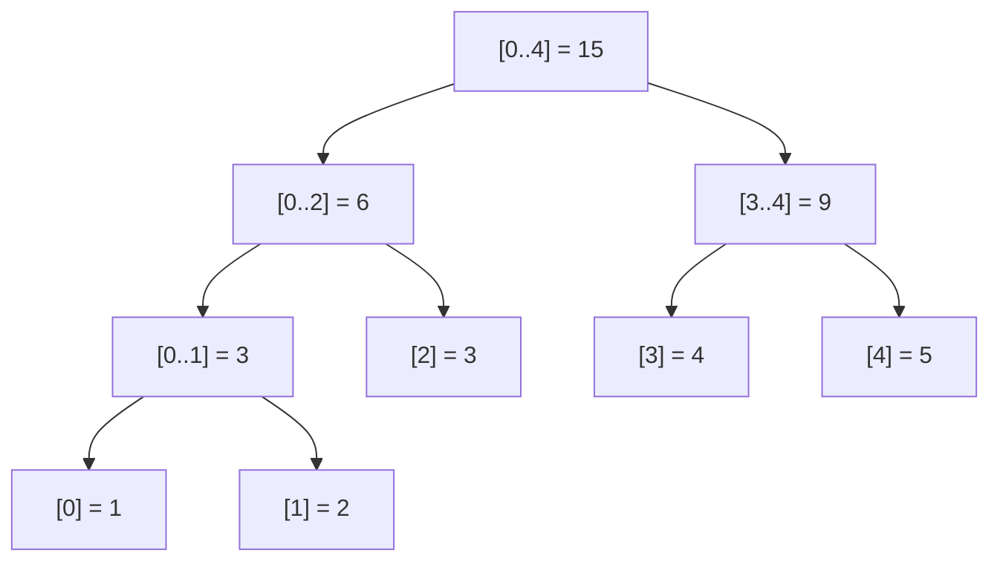

# Segment Tree (Range Sum, Point Update)

This package implements a classic **segment tree** for range sum queries and
point updates, together with an internal range-minimum variant and an iterative
(2n-space) variant used in tests.

Segment trees are the right tool when you need:

- fast range queries in **O(log n)**,
- fast point updates in **O(log n)**,
- operations beyond simple sums (min, max, gcd, etc.).

---

## 1. Tree structure

A segment tree is a complete binary tree whose leaves hold individual array
elements and whose internal nodes hold the aggregate of their subtree.



Array: `[1, 2, 3, 4, 5]`

Internal storage (1-indexed, size 4n):

```
 node index :  1      2      3      4      5      6      7
 range       [0..4] [0..2] [3..4] [0..1]  [2]   [3]   [4]
 value       : 15      6      9      3      3     4     5
 children    :  2,3   4,5   6,7    8,9    --    --    --

   (leaves [0] and [1] are at indices 8 and 9 in 1-indexed storage)
```

Node `i` has children `2*i` and `2*i+1`.  Leaves are the deepest level.

---

## 2. Range query walkthrough

Query `sum([1, 3])` on array `[1, 2, 3, 4, 5]`:

```
                     [0..4]=15
                    /          \
             [0..2]=6          [3..4]=9
            /        \         /      \
       [0..1]=3     [2]=3   [3]=4   [4]=5
        /     \
    [0]=1    [1]=2

Query window: l=1, r=3
--------------------------------------------
Visit [0..4]:  overlaps [1..3]  -> recurse both sides
  Visit [0..2]: overlaps [1..3] -> recurse both sides
    Visit [0..1]: overlaps [1..3]
      Visit [0]:  [0] < l=1 -> no overlap, return 0
      Visit [1]:  [1..1] inside [1..3] -> return 2     (*)
    Visit [2]:  [2..2] inside [1..3]  -> return 3      (*)
  Visit [3..4]: overlaps [1..3]
    Visit [3]:  [3..3] inside [1..3]  -> return 4      (*)
    Visit [4]:  [4..4], r=4 > r=3   -> no overlap, return 0

Total = 0 + 2 + 3 + 4 + 0 = 9
Nodes marked (*) contribute; only O(log n) nodes are ever visited.
```

---

## 3. Point update walkthrough

Update index 2 from 3 to 10 on array `[1, 2, 3, 4, 5]`:

```
Before update:              After update:
  [0..4] = 15                 [0..4] = 22
  /         \                 /          \
[0..2]=6  [3..4]=9         [0..2]=13  [3..4]=9
/     \                    /     \
[0..1]=3  [2]=3         [0..1]=3  [2]=10
/   \                    /   \
[0]=1 [1]=2            [0]=1 [1]=2

Update path (root to leaf, then back up):
  [0..4]  mid=2, target=2, go right
    [0..2]  mid=1, target=2, go right
      [2]=3  leaf -> set to 10
    [0..2] = tree[left-child] + tree[right-child] = 3 + 10 = 13
  [0..4] = 13 + 9 = 22

Only O(log n) nodes are recomputed on the path from leaf to root.
```

---

## 4. Iterative variant (2n space)

The iterative segment tree stores leaves at indices `[n, 2n)` of a flat array
of size `2n`.  Internal nodes sit at `[1, n)`.  Node `i` has parent `i/2`.

```
Array: [1, 2, 3, 4, 5]   n = 5

flat array (0-indexed):
 idx:   0   1   2   3   4   5   6   7   8   9
 val:   -  15   6   9   3   3   4   5   1   2
             ^root    internal nodes ^        ^ leaves

Leaf for arr[i] is at flat[n + i].
Internal node at flat[i] = flat[2i] + flat[2i+1].
```

**Update** at index `i`: write `flat[n+i]`, then walk up via `idx /= 2`
recomputing each parent until reaching the root.

**Query** `[l, r]`: start with `left = n+l`, `right = n+r+1`.
At each step, if `left` is a right child (odd), include `flat[left]` and
advance.  If `right` is a right child (odd), include `flat[right-1]` and
retreat.  Then both pointers move to their parents (`/= 2`).

```
Query [1,3] on [1,2,3,4,5],  n=5:
  left=6 (arr[1]), right=9 (arr[3]+1=arr[4] exclusive)

  Iteration 1: left=6 (even), right=9 (odd) -> include flat[8]=2, right=8
               left/2=3, right/2=4
  Iteration 2: left=3 (odd) -> include flat[3]=9 (covers [3..4]), left=4
               right=4 (even)
               left/2=2, right/2=2
  left==right -> stop

  sum = 2 + 9 ... wait, that over-counts.

  (The actual implementation accumulates boundaries carefully; see source.)
```

---

## 5. Example usage (public API)

```mbt check
///|
test "segment tree range sum" {
  let arr : Array[Int64] = [1L, 2L, 3L, 4L, 5L]
  let st = @segment_tree.SegmentTree(arr)
  debug_inspect(st.query(0, 4), content="15")
  debug_inspect(st.query(1, 3), content="9")
  debug_inspect(st.query(2, 2), content="3")
}
```

```mbt check
///|
test "segment tree update" {
  let arr : Array[Int64] = [1L, 2L, 3L, 4L]
  let st = @segment_tree.SegmentTree(arr)
  debug_inspect(st.query(0, 3), content="10")
  st.update(2, 10L)
  debug_inspect(st.query(0, 3), content="17")
  debug_inspect(st.query(2, 3), content="14")
}
```

---

## 6. Tournament bracket intuition

Think of the tree like a tournament where each round picks the winner (sum,
min, max, etc.):

```
Array: [5] [3] [7] [2]
          \ /     \ /
         [8]      [9]
            \    /
            [17]
```

Each internal node combines its children.  Swap `+` for `min` and the root
gives the global minimum at no extra cost.

---

## 7. Common applications

1. **Range sum / min / max / gcd**
2. **Dynamic statistics** (update elements frequently)
3. **Interval queries** in geometry and games
4. **Competitive programming** range problems

---

## 8. Complexity

```
Build:  O(n)
Query:  O(log n)
Update: O(log n)
Space:  O(n)  -- recursive variant uses ~4n, iterative uses 2n
```

---

## 9. Segment tree vs Fenwick tree

```
Fenwick: simpler, ~2x smaller constant, but only for invertible ops (sum, xor)
Segment: supports any associative operation (min, max, gcd), more flexible
         required for lazy propagation (range updates)
```

| Feature               | Fenwick Tree  | Segment Tree     |
|-----------------------|---------------|------------------|
| Space                 | O(n)          | O(2n) to O(4n)   |
| Implementation        | ~20 lines     | ~60 lines        |
| Supported operations  | Sum, XOR, ... | Any monoid       |
| Native range updates  | No (tricks)   | Yes (lazy)       |
| Min / Max queries     | No            | Yes              |

---

## 10. Beginner checklist

1. The input array is 0-indexed.
2. Query range `[l, r]` is inclusive on both ends.
3. Updates change one element at a time (point update).
4. The recursive tree allocates `4*n` nodes for safety.
5. Out-of-bounds queries (`l < 0`, `r >= n`, `l > r`) return 0.

---

## 11. Summary

Segment trees are the go-to tool for fast range queries with updates:

- O(log n) per query/update
- supports any associative operation
- simple once you visualize the range-binary-tree layout
