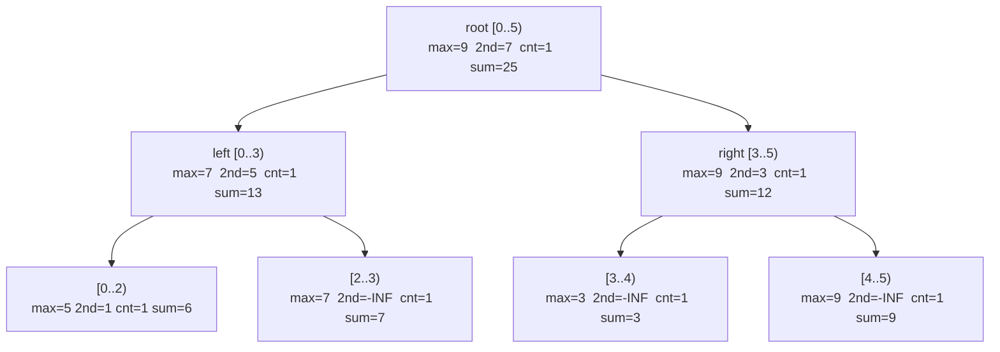
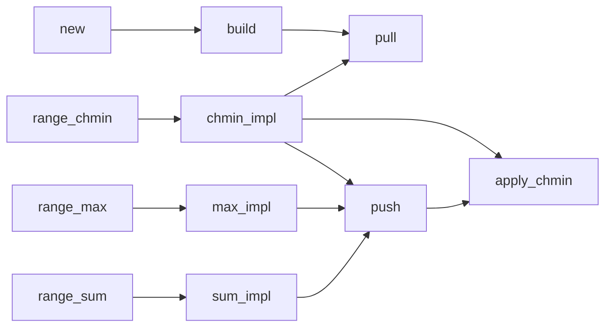

# Segment Tree Beats (Range Chmin + Sum/Max)

Segment Tree Beats is an advanced segment tree that supports **range chmin**
(clamping every value in a range down to a given cap `x`) while still answering
**range sum** and **range max** queries efficiently.

This package provides:

- `SegmentTreeBeats(values)` — build from a slice in O(n)
- `range_chmin(l, r, x)` — set each `a[i] = min(a[i], x)` for `i in [l, r)`
- `range_sum(l, r)` — sum of `a[l..r)`
- `range_max(l, r)` — maximum of `a[l..r)`

All update/query operations run in **amortized O(log n)** time.

---

## 1. Why is this hard?

A plain lazy segment tree handles range-add or range-assign in O(log n) because
those operations compose neatly: applying the same `add x` to every element is
describable by a single constant.

Range chmin is different: `min(a[i], x)` leaves some elements unchanged (those
already below `x`) and lowers others.  The effect on the node aggregate depends
on which elements are actually at the maximum, and that varies across nodes.  A
naive implementation visits every element: O(n) per operation.

Segment Tree Beats (Ji driver segment tree) solves this by tracking enough
statistics per node to decide, in O(1), whether the entire node can be updated
or whether we must recurse into children.

---

## 2. Node structure (the secret sauce)

Each tree node covers a contiguous segment `[l, r)` and stores four fields:

```
+--------------------------------------------+
|  Node [l, r)                               |
|                                            |
|  max        = largest value in [l, r)      |
|  second_max = second largest (< max),      |
|               or -INF if all equal         |
|  count_max  = number of elements == max    |
|  sum        = total sum of [l, r)          |
+--------------------------------------------+
```

Example segment `[5, 3, 5, 2, 5]`:

```
+--------------------------------------------+
|  Node [0, 5)                               |
|                                            |
|  max        =  5                           |
|  second_max =  3                           |
|  count_max  =  3                           |
|  sum        = 20                           |
+--------------------------------------------+
```

---

## 3. Tree layout

For array `[5, 1, 7, 3, 9]` the tree uses 1-indexed nodes stored in arrays of
size 4n.  Node `k` has children `2k` (left) and `2k+1` (right).

```
                  node 1  [0..5)
                  max=9  2nd=7  cnt=1  sum=25
                 /                         \
         node 2  [0..3)              node 3  [3..5)
         max=7  2nd=5  cnt=1  sum=13  max=9  2nd=3  cnt=1  sum=12
        /              \              /              \
  node 4  [0..2)   node 5  [2..3)  node 6  [3..4)  node 7  [4..5)
  max=5 2nd=1 c=1  max=7 2nd=-INF  max=3 2nd=-INF  max=9 2nd=-INF
  sum=6  cnt=1     c=1  sum=7      c=1   sum=3      c=1   sum=9
  /         \
node8 [0..1) node9 [1..2)
max=5  2nd=-INF    max=1  2nd=-INF
c=1    sum=5       c=1    sum=1
```

Leaves hold a single element, so `second_max = -INF` and `count_max = 1`.

---

## 4. How chmin works — three cases

When `range_chmin(x)` descends to a node, it encounters one of three situations:

```
                    chmin(x) on node with [max, second_max]
                              |
           +------------------+------------------+
           |                  |                  |
      x >= max          second_max           x <= second_max
           |            < x < max                |
           v                  v                  v
      BREAK (Case A)    TAG   (Case B)    RECURSE (Case C)
      Nothing changes.  Only the max     Cannot update
                        elements change.  safely here;
                        Apply in O(1).   go to children.
```

**Case A** — `x >= max`: the cap is already above every element; nothing changes.

**Case B** — `second_max < x < max`: only the `count_max` elements currently at
`max` will be clamped.  No other element is affected.  Update in O(1):

```
sum        -= count_max * (max - x)
max         = x
second_max  unchanged
count_max   unchanged
```

**Case C** — `x <= second_max`: there are at least two distinct values at or
above `x`.  We cannot know from the node statistics alone which elements to
lower, so we push the pending lazy tag downward and recurse into both children.

---

## 5. Tag propagation (push)

A "tag" is an implicit chmin that has been applied to a parent but not yet
pushed to its children.  The tag value is simply the parent's current `max`.

When we must descend into children (Case C or a query on a partial range), we
first push:

```
push(node):
  if max[left]  > max[node]: apply_chmin(left,  max[node])
  if max[right] > max[node]: apply_chmin(right, max[node])
```

Because `apply_chmin` only fires when `max[child] > max[node]`, and at that
moment we always have `max[node] > second_max[child]` (guaranteed by the
invariant), it is always a Case-B application — O(1).

```
Before push (parent clamped to 4, children not yet updated):

  parent  max=4  2nd=3  cnt=2  sum=14
  /                              \
left  max=5  2nd=3  cnt=1  sum=8  right max=5  2nd=1  cnt=1  sum=6

After push:

  parent  max=4  2nd=3  cnt=2  sum=14
  /                              \
left  max=4  2nd=3  cnt=1  sum=7  right max=4  2nd=1  cnt=1  sum=5
```

---

## 6. Pull (bottom-up aggregation)

After visiting children, the parent recomputes its four fields:

```
pull(node):
  sum[node] = sum[left] + sum[right]

  if max[left] > max[right]:
    max[node]        = max[left]
    count_max[node]  = count_max[left]
    second_max[node] = max(second_max[left], max[right])

  elif max[right] > max[left]:
    max[node]        = max[right]
    count_max[node]  = count_max[right]
    second_max[node] = max(second_max[right], max[left])

  else:   // tie
    max[node]        = max[left]
    count_max[node]  = count_max[left] + count_max[right]
    second_max[node] = max(second_max[left], second_max[right])
```

---

## 7. Visual example — applying chmin(4) then chmin(2)

Array: `[5, 3, 5, 2, 5]`

```
Initial node:
  max=5  2nd=3  cnt=3  sum=20
```

**chmin(4):**  `second_max (3) < 4 < max (5)` — Case B.

```
sum -= 3 * (5 - 4) = 3  =>  sum = 17
max  = 4

Result node:
  max=4  2nd=3  cnt=3  sum=17

Array is now: [4, 3, 4, 2, 4]
```

**chmin(2):**  `2 <= second_max (3)` — Case C.  Must recurse.

```
Push tag, go to children, recurse on each,
then pull to recompute parent.

Array after: [2, 2, 2, 2, 2]
```

---

## 8. Step-by-step walkthrough

Array: `[5, 1, 7, 3, 9]`



Operation: `range_chmin(1, 4, 4)` — clamp indices [1, 4) to at most 4.

```
Step 1: Visit root [0..5)
        max=9,  2nd=7,  x=4 <= 2nd -> Case C, push + recurse

Step 2: Visit left [0..3)
        max=7,  2nd=5,  x=4 <= 5  -> Case C, push + recurse
          Step 2a: Visit [0..2)
                  outside or partial; max=5, 2nd=1, x=4 > 1 -> Case B
                  sum -= 1*(5-4)=1, max=4    [segment: [5->4, 1]]
          Step 2b: Visit [2..3)
                  max=7, 2nd=-INF, x=4 > -INF -> Case B
                  sum -= 1*(7-4)=3, max=4    [7->4]
        pull [0..3): sum=5+4=9, max=4, 2nd=1, cnt=2

Step 3: Visit right [3..5)
        max=9, 2nd=3, x=4 > 3 -> Case B
        sum -= 1*(9-4)=5, max=4   [9->4]

Step 4: pull root: sum=9+7=16... (9 unchanged, 3 unchanged)
```

After `range_chmin(1, 4, 4)`: array = `[5, 1, 4, 4, 9]`, sum=23... wait,
index 0 (value 5) is outside [1,4) so it stays.  Let us recount:

```
a[0]=5, a[1]=min(1,4)=1, a[2]=min(7,4)=4, a[3]=min(3,4)=3, a[4]=9
sum = 5+1+4+3+9 = 22
```

(See the usage example below which confirms sum=22.)

---

## 9. Amortized complexity argument

The key insight is that a Case-B application (the "tag") strictly reduces the
number of distinct values in a segment without increasing it elsewhere.  Each
element can be lowered at most O(log n) times before it coincides with its
segment's second-max (at which point it can no longer be tagged efficiently).

A potential function argument shows that across all operations:

```
Total recursive descents (Case C) = O((n + Q) * log^2(n))
```

giving amortized **O(log^2 n)** per operation in the worst case, though in
practice and for most inputs the bound is closer to O(log n).

```
n = array length
Q = number of operations

Total work = O((n + Q) * log^2 n)
Per operation amortized = O(log^2 n)  [tight bound]
                        = O(log n)    [practical / common bound cited]
```

---

## 10. Example usage (public API)

```mbt check
///|
test "segment tree beats example" {
  let st = @segment_tree_beats.SegmentTreeBeats([5L, 1L, 7L, 3L, 9L])
  debug_inspect(st.range_sum(0, 5), content="25")
  debug_inspect(st.range_max(0, 5), content="9")
  st.range_chmin(1, 4, 4L)
  debug_inspect(st.range_sum(0, 5), content="22")
  debug_inspect(st.range_max(0, 5), content="9")
  st.range_chmin(0, 5, 4L)
  debug_inspect(st.range_sum(0, 5), content="16")
  debug_inspect(st.range_max(0, 5), content="4")
}
```

---

## 11. Another example (clamp all values)

```mbt check
///|
test "segment tree beats clamp" {
  let st = @segment_tree_beats.SegmentTreeBeats([10L, 20L, 30L, 40L, 50L])
  st.range_chmin(0, 5, 25L)
  debug_inspect(st.range_sum(0, 5), content="105")
  debug_inspect(st.range_max(0, 5), content="25")
}
```

---

## 12. Internal function map



- `new` / `build` — construct the tree bottom-up.
- `pull` — recompute a node from its two children (bottom-up merge).
- `push` — propagate a pending chmin tag from a parent to its children.
- `apply_chmin` — O(1) Case-B update: lower `max` and adjust `sum`.
- `chmin_impl` — recursive driver for `range_chmin`.
- `max_impl` / `sum_impl` — recursive drivers for the two query operations.

---

## 13. Indexing convention

All ranges are **half-open**: `[l, r)` means indices `l, l+1, ..., r-1`.

```
Array:  a[0]  a[1]  a[2]  a[3]  a[4]
              |_________________|
              l=1              r=4   -> indices 1, 2, 3
```

---

## 14. Common applications

1. **Range clamping** — cap values to an upper bound across a subarray.
2. **Resource allocation** — enforce upper limits on batches of resources.
3. **Stock price simulation** — apply trading halts or price caps.
4. **Image processing** — clamp brightness or colour channels in a region.
5. **Game mechanics** — reduce HP of multiple units to at most some value.

---

## 15. Complexity summary

| Operation    | Time             | Space |
|--------------|------------------|-------|
| Build        | O(n)             | O(n)  |
| range_chmin  | O(log^2 n) amortized | O(n) |
| range_sum    | O(log n)         | O(n)  |
| range_max    | O(log n)         | O(n)  |

---

## 16. Comparison with related structures

```
Plain lazy segtree   range-add / range-assign in O(log n)
                     range-chmin requires O(n) per op

Segment Tree Beats   range-chmin + sum/max in O(log^2 n) amortized
                     cannot do arbitrary range-add efficiently

Li Chao tree         range minimum over a set of linear functions
                     different problem domain
```

---

## 17. Beginner checklist

1. All ranges are **half-open** `[l, r)`.
2. Only Case B (tag) updates a node directly; Case A is a no-op; Case C recurses.
3. `push` must be called before descending into children.
4. `pull` must be called after returning from children.
5. The algorithm relies on tracking `max`, `second_max`, and `count_max`.
6. `NEG_INF` acts as a sentinel for "no second maximum" at leaf nodes.

---

## 18. Summary

Segment Tree Beats is a powerful segment tree extension:

- Supports range chmin with simultaneous sum and max queries.
- Avoids O(n) descent by using the `second_max` gate to identify Case B.
- Achieves amortized O(log^2 n) time per operation with O(n) space.
- The "beats" refers to the key condition `second_max < x < max` that
  "beats" the need to recurse deeper.
