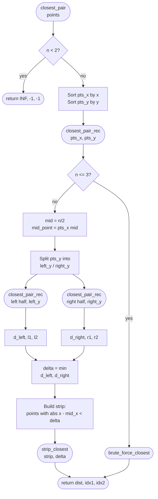
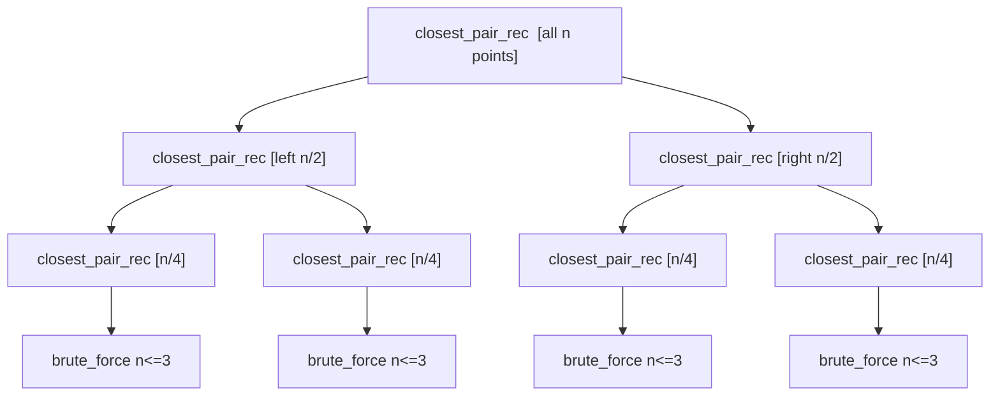

# Closest Pair of Points (Divide and Conquer)

The **closest pair** problem asks: given `n` points in the plane, find the two
points with minimum Euclidean distance.

A brute-force solution checks all pairs in `O(n^2)`. The divide-and-conquer
algorithm solves it in **`O(n log n)`**.

This package provides:

- `closest_pair(points)` returning `(distance, index1, index2)`

---

## The problem

Given a list of 2D points, find the closest two:

```
Points: (0,0), (3,4), (1,1), (4,4), (5,2)

   y
   5 |            *
   4 |      *     *
   3 |
   2 |               *
   1 |   *
   0 *-------------------- x
     0  1  2  3  4  5
```

Brute force: check all pairs -> `O(n^2)`.

---

## Core idea

1. Sort points by x-coordinate.
2. Split into left and right halves.
3. Recursively solve both halves.
4. Let `delta = min(left_best, right_best)`.
5. Build a **strip** of points within distance `delta` of the mid line.
6. Check only the strip, sorted by y-coordinate.

Key geometry insight: in the strip, **each point only needs to compare with the
next ~7 points** in y-sorted order.

---

## Algorithm flow



---

## Walkthrough example

Points (already x-sorted):

```
(0,0), (1,1), (3,0), (4,1), (6,0), (7,1)
```

Split at `x = 3.5`:

```
Left:  (0,0), (1,1), (3,0)
Right: (4,1), (6,0), (7,1)
```

- Left best = sqrt(2) between (0,0) and (1,1)
- Right best = sqrt(2) between (6,0) and (7,1)
- `delta = sqrt(2)`

Strip: points with `|x - 3.5| < delta` are `(3,0)` and `(4,1)`.
Their distance is also `sqrt(2)`, so the answer stays the same.

---

## Visual: the strip and the merge step

After both halves are solved recursively, `delta` bounds how wide the strip
must be around the dividing line. Only points inside this band can possibly
improve the current best distance.

```
                    mid
                     |
    *   (L)          |          (R)   *
                     |
        *   (L)      |    (R)   *
                     |
    *   (L)          |          (R)       *
                     |
          +----------+----------+
          |  strip   |  strip   |
          | (left)   |  (right) |
          +----------+----------+
          <--delta--><--delta-->

  Points within |x - mid_x| < delta enter the strip.
  The strip is then sorted by y-coordinate.
  Each point in the strip only needs to compare with
  points whose y-coordinate is within delta above it.
```

### Why at most 6 comparisons per strip point?

Consider the `delta x 2*delta` rectangle around point `p` in the strip:

```
   y+delta  +----+----+
            |    |    |
            | L  | R  |
            |    |    |
         p  +----p----+    <- p sits on the mid-line boundary
            |    |    |
            | L  | R  |
            |    |    |
   y-delta  +----+----+
           mid-d  mid  mid+d
```

Each `delta x delta` quadrant can hold at most 2 points that are still
`>= delta` apart from each other (by the invariant that all pairs within
each half are already `>= delta` apart). So the full `delta x 2*delta`
rectangle holds at most 8 points total, and excluding `p` itself, at most 7
neighbors need to be examined.

---

## Pseudocode sketch

```text
closest(points):
  if n <= 3: return brute_force(points)
  split points by x into left/right
  d_left = closest(left)
  d_right = closest(right)
  d = min(d_left, d_right)

  strip = points with |x - mid_x| < d
  sort strip by y
  for i in strip:
    for j in next few points while y-distance < d:
      d = min(d, dist(i, j))
  return d
```

---

## Recursion tree

The recursion splits the point set in half at each level, producing a balanced
binary tree of depth `O(log n)`. Each level processes all `n` points in the
strip in `O(n)` total, giving `O(n log n)` overall.



---

## Example 1: Simple line

```mbt check
///|
test "closest pair line" {
  let points : Array[(Double, Double)] = [(0.0, 0.0), (1.0, 0.0), (4.0, 0.0)]
  let (dist, p1, p2) = @closest_pair.closest_pair(points)
  debug_inspect(dist, content="1")
  debug_inspect((p1, p2), content="(0, 1)")
}
```

---

## Example 2: Triangle

```mbt check
///|
test "closest pair triangle" {
  let points : Array[(Double, Double)] = [(0.0, 0.0), (3.0, 0.0), (1.5, 0.5)]
  let (dist, _, _) = @closest_pair.closest_pair(points)
  // Closest distance is about 1.58
  debug_inspect(dist < 1.6 && dist > 1.5, content="true")
}
```

---

## Example 3: Two clusters

```mbt check
///|
test "closest pair cluster" {
  let points : Array[(Double, Double)] = [
    (0.0, 0.0),
    (10.0, 10.0),
    (0.1, 0.0),
    (10.1, 10.0),
  ]
  let (dist, _, _) = @closest_pair.closest_pair(points)
  debug_inspect(dist < 0.15 && dist > 0.05, content="true")
}
```

---

## Applications

- Collision detection
- Clustering (single-link)
- Geographic proximity queries
- Preprocessing for nearest-neighbor search

---

## Detailed step-by-step (worked example)

Points:

```
(0,0), (2,2), (3,0), (5,2), (6,0), (8,2)
```

1) Sort by x:

```
(0,0), (2,2), (3,0) | (5,2), (6,0), (8,2)
```

2) Solve left half by brute force:

- distances: d(0,0)-(2,2) = sqrt(8)
- d(0,0)-(3,0) = 3
- d(2,2)-(3,0) = sqrt(5)

Left best is `sqrt(5)`.

3) Solve right half:

- d(5,2)-(6,0) = sqrt(5)
- d(5,2)-(8,2) = 3
- d(6,0)-(8,2) = sqrt(8)

Right best is also `sqrt(5)`.

4) `delta = sqrt(5)`. Build strip around the midline:

- Midline is between x=3 and x=5.
- Points within delta of the midline are candidates for cross pairs.

5) Sort strip by y and compare neighbors. In this case, no cross pair beats
`sqrt(5)`, so the answer stays the same.

This example shows how the algorithm relies on the strip step to safely combine
the two halves.

---

## Strip merging: full visual

The diagram below shows the same six-point example, highlighting the midline,
the strip, and how the y-sorted neighbors are compared.

```
  y
  2 |  * (0,2)      * (5,2)       * (8,2)
    |
  0 |* (0,0)   *(3,0)       *(6,0)
    +--0----2---3---5----6---8----> x
                |
              midline x=4
              <-- delta=sqrt(5) ~2.24 -->

  Strip (|x - 4| < 2.24):  (3,0), (5,2)

  After sorting strip by y:
    [0]: (3,0)
    [1]: (5,2)   <- y-diff = 2.0 < delta, so compare with [0]

  dist((3,0),(5,2)) = sqrt(4+4) = sqrt(8) > sqrt(5)  -> no improvement
  Final answer: sqrt(5)
```

---

## Closest pair vs other techniques

| Method | Time | Notes |
|--------|------|------|
| Divide & conquer | `O(n log n)` | Deterministic, clean proof |
| Sweep line | `O(n log n)` | Similar complexity, more event handling |
| Grid hashing | `O(n)` expected | Randomized, good in practice |

If you need deterministic performance and a classic proof, divide & conquer is
the usual choice.

---

## Extension: k closest pairs (conceptual)

To find the k closest pairs instead of just one:

1. Enumerate candidate pairs (often via a heap).
2. Keep only the k smallest distances.
3. The merge step can contribute many pairs, so a max-heap of size k is common.

This is more complex and usually `O(n log n + n log k)` or worse, depending on
the approach.

---

## Implementation notes

- Pre-sorting by x is essential for `O(n log n)`
- Strip check is linear because of the constant bound
- For integer coordinates, comparing squared distances avoids floating-point

---

## Complexity

- Time: `O(n log n)`
- Space: `O(n)`

---

## Reference implementation

```mbt nocheck
///| pub fn closest_pair(Array[(Double, Double)]) -> (Double, Int, Int)
```
