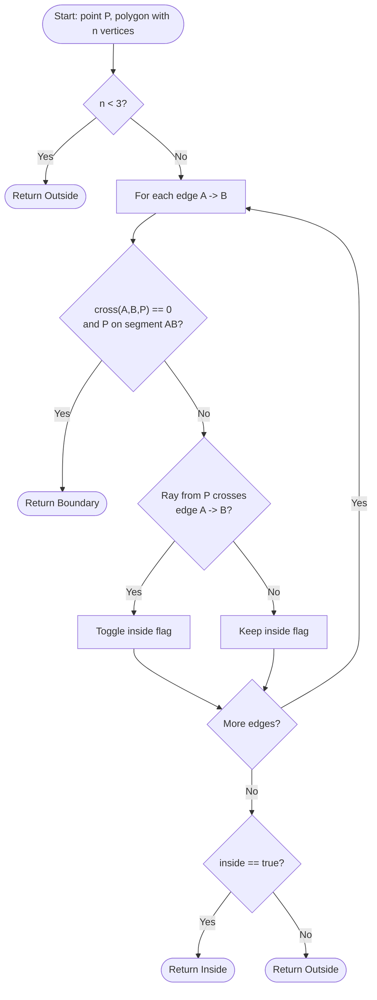
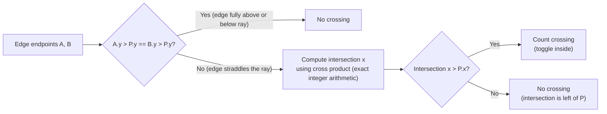
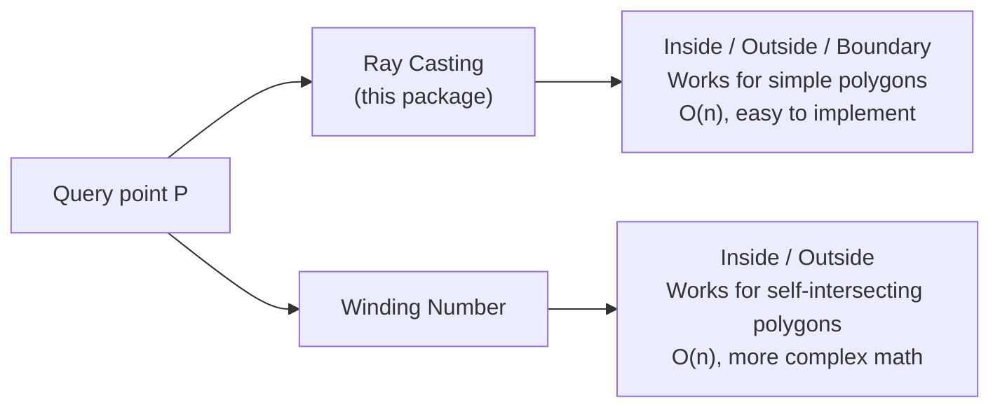

# Point in Polygon (Ray Casting)

This package provides a classic **point-in-polygon** test:

- **Inside**
- **Outside**
- **Boundary** (exactly on an edge or vertex)

It uses the **ray casting** method, which is simple, fast, and robust for
simple polygons.

---

## 1. Problem statement (beginner friendly)

Given a polygon and a point **P**, decide:

```
Is P inside the polygon?
Is P outside?
Or exactly on its boundary?
```

This shows up in:

- map/geofencing checks,
- hit testing in graphics,
- collision detection in games.

---

## 2. The ray casting idea

Cast a horizontal ray to the right from point P.

Every time the ray crosses an edge, we **toggle** inside/outside:

```
0 crossings  -> Outside
1 crossing   -> Inside
2 crossings  -> Outside
3 crossings  -> Inside
...
```

So: **odd crossings = inside**, **even crossings = outside**.

---

## 3. ASCII picture

The diagrams below show a convex pentagon, a point inside, and a point outside.

```
                     Polygon (a simple pentagon)
                            +-------+
                           /         \
                          /           \
                         /             \
                        /               \
                       +                 +
                        \               /
                         +-----------+

  Case 1 -- point P is inside:

              ray hits 1 edge (odd = inside)
                    |
                    v
     +---------+-------+
    /    P(*)---+-------+----------->   1 crossing -> Inside
   /           /       \
  +           /         +
   \         /         /
    +-------+---------+

  Case 2 -- point Q is outside (left of polygon):

     Q(*)------------------------->   0 crossings -> Outside
            +-----------+
           /             \
          /               \
         +                 +
          \               /
           +-------------+

  Case 3 -- point R is outside (right of polygon):

            +-----------+
           /             \
          /               \
         +                 +    R(*)------------------------->
          \               /          0 crossings -> Outside
           +-------------+
```

### Annotated square example

```
    y
    4  E(0,4)------F(4,4)
       |                |
    2  |    P(2,2)------+---> ray hits EF once -> Inside
       |                |
    0  A(0,0)------B(4,0)
       0    2    4           x
```

---

## 4. Handling boundary cases

If the point lies on an edge, return **Boundary** immediately.

Example:

```
Edge: (0,0) ---- (4,0)
Point: (2,0)  -> Boundary
```

If the ray passes exactly through a vertex, we must avoid double counting.
The standard fix is to treat each edge with a **half-open** rule:

```
Count an intersection if:
  y is in [y1, y2)  (include lower endpoint, exclude upper)
```

This way a vertex is counted only once.

---

## 5. Algorithm in words

For each edge (A -> B):

1. If P lies on segment AB, return Boundary.
2. Check if the horizontal ray from P crosses AB.
3. Count crossings.

After all edges:

- odd crossings -> Inside
- even crossings -> Outside

---

## 6. Decision flow (Mermaid diagram)



---

## 7. Ray-crossing rule detail (Mermaid diagram)



---

## 8. Step-by-step walkthrough

Square:

```
(0,0) ---- (4,0)
  |          |
  |          |
(0,4) ---- (4,4)
```

Query point `P = (2,2)`.

Ray from (2,2) to the right crosses:

- edge (4,0)-(4,4) once
- edge (0,4)-(0,0) does NOT count (intersection is left of P)

Crossings = 1 -> Inside.

---

## 9. Example usage (real API)

```mbt check
///|
test "point in polygon square" {
  let poly : Array[@point_in_polygon.Point] = [
    { x: 0L, y: 0L },
    { x: 4L, y: 0L },
    { x: 4L, y: 4L },
    { x: 0L, y: 4L },
  ]
  debug_inspect(
    @point_in_polygon.point_in_polygon(poly, { x: 2L, y: 2L }),
    content="Inside",
  )
  debug_inspect(
    @point_in_polygon.point_in_polygon(poly, { x: 5L, y: 2L }),
    content="Outside",
  )
  debug_inspect(
    @point_in_polygon.point_in_polygon(poly, { x: 4L, y: 2L }),
    content="Boundary",
  )
}
```

---

## 10. Example: concave polygon

Concave shapes are where ray casting really matters.

Here is a concave "dent" polygon (note the inward point at (2,2)):

```
    y
    4  E(0,4)----+----C(4,4)
       |   \    / \      |
       |    \  /   \     |
    2  |   D(2,2)   \    |
       |              \  |
    0  A(0,0)---B(4,0)-+-+
       0    1    2    3    4   x
```

Vertices in order:

```
A(0,0) -> B(4,0) -> C(4,4) -> D(2,2) -> E(0,4)
```

Points:

```
P = (1,1)  -> Inside
Q = (3,3)  -> Boundary (on the diagonal edge C-D)
R = (3,4)  -> Outside (above the dent, outside the polygon)
```

```mbt check
///|
test "point in concave polygon" {
  let poly : Array[@point_in_polygon.Point] = [
    { x: 0L, y: 0L },
    { x: 4L, y: 0L },
    { x: 4L, y: 4L },
    { x: 2L, y: 2L },
    { x: 0L, y: 4L },
  ]
  debug_inspect(
    @point_in_polygon.point_in_polygon(poly, { x: 1L, y: 1L }),
    content="Inside",
  )
  debug_inspect(
    @point_in_polygon.point_in_polygon(poly, { x: 3L, y: 3L }),
    content="Boundary",
  )
  debug_inspect(
    @point_in_polygon.point_in_polygon(poly, { x: 3L, y: 4L }),
    content="Outside",
  )
}
```

---

## 11. Example: point on a vertex

Points exactly equal to a polygon vertex are on the boundary.

```
Triangle:          Ray from vertex (0,0):
  (0,3)
   /|              vertex (0,0) is collinear with
  / |              both adjacent edges -> Boundary
 /  |
(0,0)---(4,0)
```

```mbt check
///|
test "point on vertex" {
  let tri : Array[@point_in_polygon.Point] = [
    { x: 0L, y: 0L },
    { x: 4L, y: 0L },
    { x: 0L, y: 3L },
  ]
  debug_inspect(
    @point_in_polygon.point_in_polygon(tri, { x: 0L, y: 0L }),
    content="Boundary",
  )
}
```

---

## 12. Winding number vs ray casting

Ray casting is simple and fast. Another option is the **winding number**:

```
winding number != 0 -> Inside
winding number == 0 -> Outside
```



Winding number handles self-intersecting polygons more naturally, but is more
math-heavy. This package uses ray casting (ideal for simple polygons).

---

## 13. Complexity

```
Time:  O(n)  (check each edge once)
Space: O(1)
```

---

## 14. Common pitfalls (beginner checklist)

1. **Double-counting vertices**  
   Use a half-open y-interval to count a vertex only once.

2. **Horizontal edges**  
   They do not affect crossings, but still must be tested for Boundary.

3. **Integer overflow**  
   Use 64-bit arithmetic (the API uses Int64).

4. **Polygon must be simple**  
   Ray casting assumes no self-intersections.

---

## 15. Summary

```
                   +------ simple polygon ------+
                   |                            |
    for each edge: |  collinear & on segment?   |
                   |         yes -> Boundary    |
                   |                            |
                   |  ray crosses edge?         |
                   |         yes -> toggle flag |
                   |                            |
                   +----------------------------+

    after all edges:

        flag == true  ->  Inside
        flag == false ->  Outside
```

- Ray casting toggles inside/outside on each edge crossing.
- Boundary checks come first.
- Odd crossings -> Inside, even -> Outside.

This makes point-in-polygon tests fast and reliable for many real problems.
