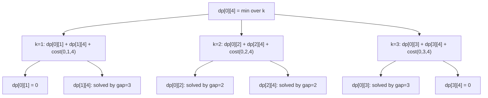
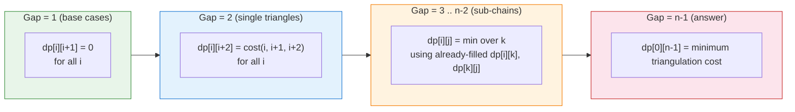

# Polygon Triangulation (Minimum Weight, Convex)

This package computes the **minimum-weight triangulation** of a **convex**
polygon. The weight of a triangulation is the sum of each triangle's perimeter
cost, measured with **squared distances** so that all arithmetic stays in
integers.

---

## 1. Problem statement

You are given a convex polygon with `n` vertices listed in order (clockwise or
counter-clockwise). You must partition it into `n - 2` non-overlapping
triangles by drawing non-crossing diagonals. The **cost** of a triangle is the
sum of the squared lengths of its three sides. The **total cost** of a
triangulation is the sum of all triangle costs. Find the triangulation with
minimum total cost.

---

## 2. Polygon and triangulation visualised

### Pentagon: the polygon

```
        3(1,3)
       /       \
    4(-1,1)   2(3,1)
       \       /
    0(0,0)---1(2,0)
```

### Two valid triangulations of the pentagon

```
Triangulation A                 Triangulation B
(fan from vertex 0)             (fan from vertex 1)

        3                               3
       /|\                             /|\
      / | \                           / | \
     4  |  2                         4  |  2
      \ | /                           \ | /
       \|/                             \|/
        0---1                       0---1
   diagonals: (0,2),(0,3)      diagonals: (1,3),(1,4)
```

The DP automatically picks whichever triangulation has smaller total squared
perimeter.

---

## 3. Key insight: interval DP

Fix an edge (i, j). Every triangulation of the polygon chain from vertex i to
vertex j must include exactly one triangle that uses both i and j as vertices.
That triangle's third vertex is some k with i < k < j.

```
dp[i][j] = min over k in (i+1 .. j-1):
               dp[i][k] + dp[k][j] + cost(i, k, j)
```

The two sub-polygons (i..k) and (k..j) are solved independently, which gives
the classic interval DP recurrence (identical in structure to matrix-chain
multiplication).

Base case:

```
dp[i][i]   = 0   (a single vertex: no area)
dp[i][i+1] = 0   (an edge: no triangle yet)
```

---

## 4. Triangle cost (squared perimeter)

```
cost(i, j, k) = dist2(i, j) + dist2(j, k) + dist2(k, i)

dist2(a, b)   = (a.x - b.x)^2 + (a.y - b.y)^2
```

Using squared distances avoids floating-point arithmetic and keeps every value
in `Int64`. The ordering of triangulations is preserved in practice.

---

## 5. Step-by-step example: unit square

### Geometry

```
3(0,1) ---- 2(1,1)
  |              |
  |              |
0(0,0) ---- 1(1,0)
```

Edge lengths (squared):
- Adjacent sides: dist2 = 1
- Diagonal: dist2 = 2

### Two possible triangulations

```
Option A: triangles (0,1,2) and (0,2,3)     Option B: triangles (0,1,3) and (1,2,3)

 3----2        3----2                         3----2        3----2
 |   /|        |\   |                         |  / |        | \  |
 |  / |        | \  |                         | /  |        |  \ |
 | /  |        |  \ |                         |/   |        |   \|
 0----1        0----1                         0----1        0----1
```

### Cost calculation

```
dist2(0,1) = 1,   dist2(1,2) = 1,   dist2(0,2) = 2
dist2(2,3) = 1,   dist2(0,3) = 1

Triangle (0,1,2): 1 + 1 + 2 = 4
Triangle (0,2,3): 2 + 1 + 1 = 4   => Option A total = 8

Triangle (0,1,3): 1 + 2 + 1 = 4
Triangle (1,2,3): 1 + 1 + 2 = 4   => Option B total = 8
```

Both options tie at 8, so `min_weight_triangulation` returns `8`.

---

## 6. DP table for the square (n = 4)

Intervals are filled by increasing length (gap = j - i):

```
gap = 1 (base, all zero):

      j  0   1   2   3
  i
  0      0   0   .   .
  1          0   0   .
  2              0   0
  3                  0

gap = 2 (single triangle):

  dp[0][2] = cost(0,1,2) = 4
  dp[1][3] = cost(1,2,3) = 4

      j  0   1   2   3
  i
  0      0   0   4   .
  1          0   0   4
  2              0   0
  3                  0

gap = 3 (full polygon):

  dp[0][3] = min(
    dp[0][1] + dp[1][3] + cost(0,1,3),   k=1: 0 + 4 + 4 = 8
    dp[0][2] + dp[2][3] + cost(0,2,3)    k=2: 4 + 0 + 4 = 8
  ) = 8

      j  0   1   2   3
  i
  0      0   0   4   8   <- answer is dp[0][n-1] = dp[0][3] = 8
  1          0   0   4
  2              0   0
  3                  0
```

Only the upper triangle of the matrix is used. Cells below the diagonal are
never written.

---

## 7. DP table for a pentagon (n = 5)

Pentagon vertices: 0(0,0), 1(2,0), 2(3,1), 3(1,3), 4(-1,1)

```
gap = 1 (base, zero):

      j  0   1   2   3   4
  i
  0      0   0   .   .   .
  1          0   0   .   .
  2              0   0   .
  3                  0   0
  4                      0

gap = 2 (each is a single triangle - filled with cost(i, i+1, i+2)):

      j  0   1   2   3   4
  i
  0      0   0   c02 .   .
  1          0   0   c13 .
  2              0   0   c24
  3                  0   0
  4                      0

  where c02 = dist2(0,1)+dist2(1,2)+dist2(0,2), etc.

gap = 3 (two-triangle chains):

  dp[i][i+3] = min over k in {i+1, i+2} of:
               dp[i][k] + dp[k][i+3] + cost(i,k,i+3)

gap = 4 (full polygon - the answer):

  dp[0][4] = min(
    dp[0][1] + dp[1][4] + cost(0,1,4),   k=1
    dp[0][2] + dp[2][4] + cost(0,2,4),   k=2
    dp[0][3] + dp[3][4] + cost(0,3,4)    k=3
  )
```

The final answer is `dp[0][n-1]`.

---

## 8. Mermaid: recurrence tree for dp[0][4]



---

## 9. Mermaid: fill order (bottom-up by gap length)



---

## 10. Public API usage

### Basic example: unit square

```mbt check
///|
test "triangulation square" {
  let points : Array[@polygon_triangulation.Point] = [
    { x: 0L, y: 0L },
    { x: 1L, y: 0L },
    { x: 1L, y: 1L },
    { x: 0L, y: 1L },
  ]
  debug_inspect(
    @polygon_triangulation.min_weight_triangulation(points).unwrap(),
    content="8",
  )
}
```

### Triangle (minimum polygon)

A triangle has exactly one triangulation: itself.

```mbt check
///|
test "triangulation triangle" {
  // Right triangle with legs of squared length 1 and hypotenuse squared 2.
  // cost = 1 + 1 + 2 = 4
  let points : Array[@polygon_triangulation.Point] = [
    { x: 0L, y: 0L },
    { x: 1L, y: 0L },
    { x: 0L, y: 1L },
  ]
  debug_inspect(
    @polygon_triangulation.min_weight_triangulation(points).unwrap(),
    content="4",
  )
}
```

### Degenerate input: fewer than 3 vertices

```mbt check
///|
test "triangulation too few points" {
  let two_pts : Array[@polygon_triangulation.Point] = [
    { x: 0L, y: 0L },
    { x: 1L, y: 0L },
  ]
  // A line segment cannot be triangulated.
  debug_inspect(
    @polygon_triangulation.min_weight_triangulation(two_pts) is None,
    content="true",
  )
}
```

---

## 11. Pentagon example

```mbt check
///|
test "triangulation pentagon" {
  let points : Array[@polygon_triangulation.Point] = [
    { x: 0L, y: 0L },
    { x: 2L, y: 0L },
    { x: 3L, y: 1L },
    { x: 1L, y: 3L },
    { x: -1L, y: 1L },
  ]
  // We just check it returns Some(...) and is deterministic.
  let ans = @polygon_triangulation.min_weight_triangulation(points)
  debug_inspect(ans is Some(_), content="true")
}
```

---

## 12. Complexity

```
States:              O(n^2)    -- one dp[i][j] per pair
Transitions/state:   O(n)      -- scan all split points k
Total time:          O(n^3)
Space:               O(n^2)    -- the dp table
```

The algorithm is identical in structure to matrix-chain multiplication, and the
same O(n^3) bound applies.

---

## 13. Constraints and notes

- The polygon must be **convex** with vertices listed in order (CW or CCW).
  The algorithm gives incorrect results for self-intersecting or concave input.
- Minimum-weight triangulation of a **non-convex** polygon is NP-hard in general.
- Costs use **squared distances**, so the numeric result is not the true
  Euclidean perimeter sum. The ordering of triangulations is preserved in
  nearly all practical cases.
- Coordinates are `Int64`; intermediate products (dx * dx + dy * dy summed
  over three edges for each of n-2 triangles) can reach roughly
  `3 * (n-2) * max_coord^2`. Keep coordinates well within `Int64` range.

---

## 14. Common applications

1. **Graphics / rendering** - GPU pipelines draw polygons as triangle fans or
   strips. A good triangulation reduces the number of skinny triangles.
2. **Finite element mesh generation** - well-shaped triangles improve
   numerical stability in PDE solvers.
3. **Computational geometry preprocessing** - many geometric queries are
   easier after a polygon has been triangulated.
4. **Teaching** - the problem is a canonical example of interval DP and is
   often used alongside matrix-chain multiplication in algorithms courses.

---

## 15. Summary

```
dp[i][j] = min_{i < k < j}  dp[i][k] + dp[k][j] + cost(i, k, j)

cost(i, k, j) = dist2(i,k) + dist2(k,j) + dist2(j,i)
dist2(a, b)   = (a.x - b.x)^2 + (a.y - b.y)^2

Answer: dp[0][n-1]
```

Fill order: increasing gap length (gap = 2, 3, ..., n-1), so every subproblem
is solved before it is needed.
