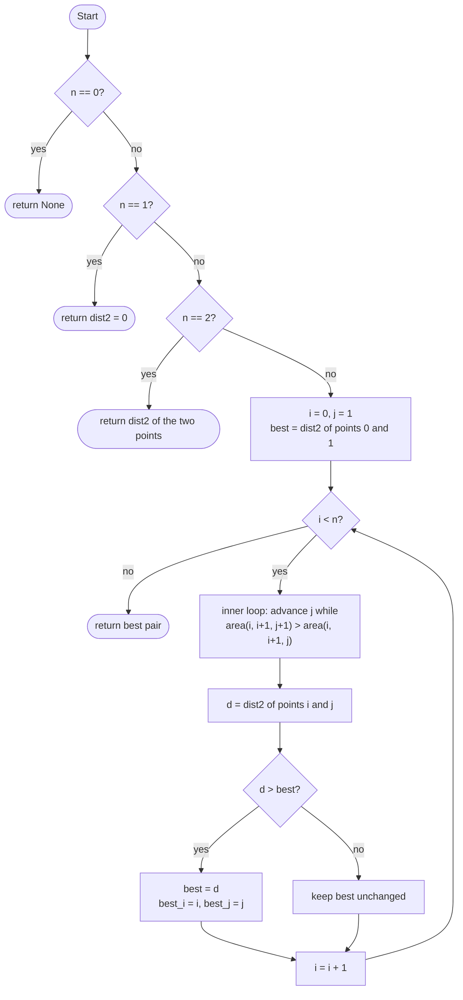
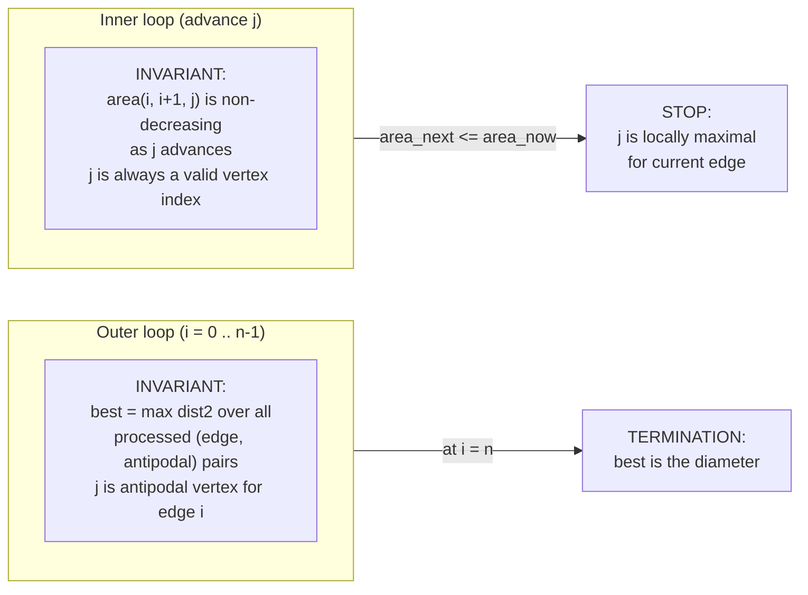

# Rotating Calipers Diameter (Convex Polygon)

This package finds the **diameter** of a convex polygon: the farthest pair of
vertices. It returns the two vertex indices and the squared distance.

The algorithm is **rotating calipers**, which runs in **O(n)** time on a convex
polygon whose vertices are given in counter-clockwise order.

---

## 1. What is the diameter?

Given a convex polygon, the **diameter** is the maximum Euclidean distance
between any two of its vertices. Squared distance is returned to keep all
arithmetic in integers and avoid floating-point error.

```
Square with side 2:
  farthest pair = opposite corners
  distance^2 = 2^2 + 2^2 = 8
```

---

## 2. Why we need something faster than O(n^2)

Brute force checks every pair of vertices:

```
n vertices -> n*(n-1)/2 pairs -> O(n^2)
```

For large polygons this is slow. Rotating calipers reduces it to **O(n)** by
exploiting the convexity of the polygon.

---

## 3. Key idea: antipodal pairs

For each directed edge of a convex polygon there is a unique **antipodal**
vertex — the one farthest from that edge as measured by triangle area (cross
product). As you walk around the polygon edge by edge, the antipodal vertex
never moves backward. A single pointer therefore suffices.

---

## 4. Visual intuition: rotating calipers on a convex hull

The name comes from a pair of parallel lines (calipers) pressed against opposite
sides of the polygon. Rotating those lines all the way around visits every
antipodal pair.

```
        3(0,4)
       / \
      /   \
  4(-2,2)   2(3,3)
      \   /
       \ /
  5(-3,0)   1(4,1)
         \ /
          0(2,-1)

  Top caliper ---> presses on vertex 3
  Bottom caliper -> presses on vertex 0
  |
  | rotate calipers counter-clockwise
  v
  Top caliper ---> presses on vertex 4
  Bottom caliper -> presses on vertex 1
  ...and so on until a full revolution is complete.
```

Each step we advance whichever caliper gives a larger triangle area, so the
pointer moves at most n steps in total.

---

## 5. Detailed ASCII diagram: one outer iteration

```
Convex polygon vertices (CCW):

    q3 *---------* q2
       |          \
       |     P     \
       |            \
    q0 *             * q1
            edge i -> i+1

  Cross product test:
    area(i, i+1, j)   = cross product of vectors (i->i+1) x (i->j)
    area(i, i+1, j+1) = cross product of vectors (i->i+1) x (i->j+1)

  If area(i, i+1, j+1) > area(i, i+1, j):
    vertex j+1 is farther from edge -> advance j

  Once area stops increasing, j is the antipodal vertex for edge i.
  Record dist2(i, j) if it exceeds the current best.
  Then advance i to the next edge.
```

---

## 6. Algorithm flow



---

## 7. Loop invariants



---

## 8. API overview

From `pkg.generated.mbti`:

```
convex_diameter(points : Array[Point]) -> DiameterResult?

struct Point {
  x : Int64
  y : Int64
}

struct DiameterResult {
  i : Int      // index of first endpoint
  j : Int      // index of second endpoint
  dist2 : Int64  // squared Euclidean distance between points[i] and points[j]
}
```

`dist2` is the **squared** distance, keeping all computation in exact integers.

---

## 9. Example usage: square

```
3(0,2) ---- 2(2,2)
  |           |
  |           |
0(0,0) ---- 1(2,0)
```

Start with edge 0->1, antipodal vertex is 2. Rotate:

```
edge 0->1, j=2, dist2 = 8
edge 1->2, j=3, dist2 = 8
edge 2->3, j=0, dist2 = 8
edge 3->0, j=1, dist2 = 8
```

Diameter^2 = 8, achieved by the diagonal (corner 0 to corner 2, or 1 to 3).

```mbt check
///|
test "diameter square" {
  let points : Array[@rotating_calipers_diameter.Point] = [
    { x: 0L, y: 0L },
    { x: 2L, y: 0L },
    { x: 2L, y: 2L },
    { x: 0L, y: 2L },
  ]
  let result = @rotating_calipers_diameter.convex_diameter(points).unwrap()
  debug_inspect(result.dist2, content="8")
}
```

---

## 10. Example: triangle

```
    2(2,3)
   /     \
  /       \
0(0,0)---1(4,0)

Longest pair: 0 <-> 1, dist2 = 4^2 + 0^2 = 16
```

```mbt check
///|
test "diameter triangle" {
  let points : Array[@rotating_calipers_diameter.Point] = [
    { x: 0L, y: 0L },
    { x: 4L, y: 0L },
    { x: 2L, y: 3L },
  ]
  let result = @rotating_calipers_diameter.convex_diameter(points).unwrap()
  debug_inspect(result.dist2, content="16")
}
```

---

## 11. Example: rectangle

```
3(0,1) ---- 2(3,1)
  |               |
0(0,0) ---- 1(3,0)

Diagonal: dist2 = 3^2 + 1^2 = 10
```

```mbt check
///|
test "diameter rectangle" {
  let points : Array[@rotating_calipers_diameter.Point] = [
    { x: 0L, y: 0L },
    { x: 3L, y: 0L },
    { x: 3L, y: 1L },
    { x: 0L, y: 1L },
  ]
  let result = @rotating_calipers_diameter.convex_diameter(points).unwrap()
  debug_inspect(result.dist2, content="10")
}
```

---

## 12. Complexity

```
Time:  O(n)       on a convex polygon with n vertices
Space: O(1)       only a constant number of variables beyond the input
```

If the polygon must first be computed from an arbitrary point set:

```
O(n log n)  for the convex hull step (dominates)
O(n)        for the diameter step
```

---

## 13. Data-type choice: Int64

All coordinates and distances use `Int64`. The squared distance of two points
whose coordinates fit in 32-bit integers fits comfortably in 64 bits
(max ~2^62 for 32-bit inputs), so no overflow occurs for typical inputs.

---

## 14. Common applications

1. **Farthest pair of points** in a point set (compute hull, then diameter).
2. **Minimum enclosing circle** — the diameter gives a lower bound on the radius.
3. **Width of a convex polygon** — the rotating-calipers family covers this too.
4. **Bounding-box computation** — a related sweep over antipodal pairs.

---

## 15. Beginner checklist

1. Input polygon must be **convex**.
2. Vertices must be in **counter-clockwise (CCW) order**.
3. No duplicate consecutive vertices.
4. Coordinates must fit in `Int64`; squared distances must not overflow `Int64`.
5. The function returns `None` only for an empty array.

---

## 16. Summary

Rotating calipers exploits the convexity guarantee that the antipodal vertex
never moves backward:

- The outer loop visits each of the n edges once.
- The inner loop advances the antipodal pointer; total advances across all outer
  iterations are at most n.
- Overall work is therefore O(n), deterministic, and branch-free in the hot path.
