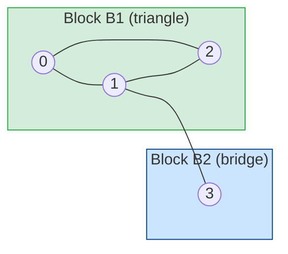
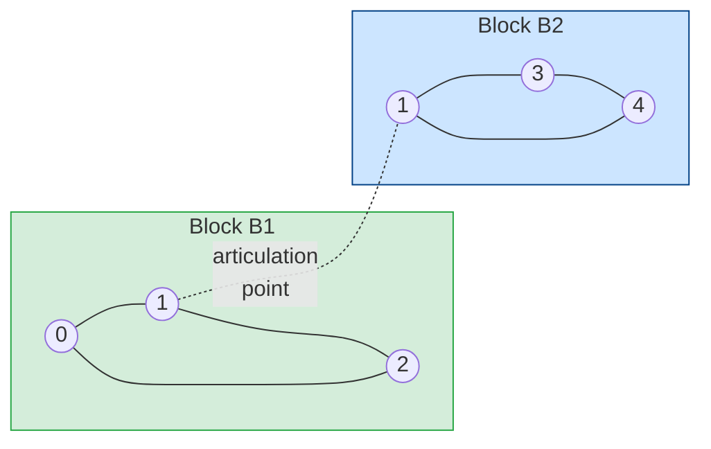
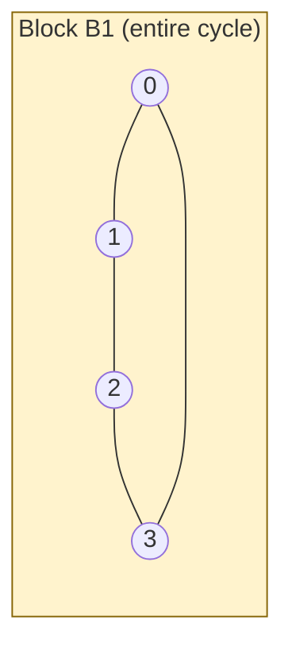

# Biconnected Components (and Articulation Points)

This package finds **biconnected components** and **articulation points** in an
undirected graph. These concepts are about *robust connectivity*:

- A **biconnected component** (also called a block) is a maximal subgraph where
  removing any single vertex does **not** disconnect the subgraph.
- An **articulation point** (cut vertex) is a vertex whose removal **does**
  disconnect the graph (increases the number of connected components).
- A **bridge** is an edge whose removal disconnects the graph; equivalently, it
  is a biconnected component containing exactly one edge.

These are fundamental tools for network reliability, dependency analysis, and
graph decomposition.

## Problem statement

Given an undirected graph with vertices `0..n-1` and edges `(u, v)`, find:

1. All biconnected components (each reported as a list of edges).
2. All articulation points.

## Graph structure: block-cut tree intuition

Every undirected graph decomposes into biconnected components that meet at
articulation points. This structure is called the **block-cut tree**:

```
  Blocks (biconnected components) are the "islands of resilience".
  Articulation points are the "bridges between islands".
  Removing an articulation point splits the graph across multiple blocks.
```

### Visualisation: triangle with a tail

```
  0 ---- 1 ---- 3
   \    /
    \  /
     2
```

Block decomposition:

```
  Block B1 (triangle): vertices {0, 1, 2}, edges {(0,1), (1,2), (2,0)}
  Block B2 (bridge):   vertices {1, 3},   edges {(1,3)}

  Articulation point:  vertex 1  (shared by B1 and B2)
```

Mermaid diagram — biconnected components highlighted:



The shared vertex `1` is the articulation point. It belongs to both blocks but
sits on the boundary.

### Visualisation: two triangles sharing a vertex

```
    2
   / \
  0---1---3
       \ /
        4
```

Block decomposition:

```
  Block B1: vertices {0, 1, 2}, edges {(0,1), (1,2), (2,0)}
  Block B2: vertices {1, 3, 4}, edges {(1,3), (3,4), (4,1)}

  Articulation point: vertex 1
```

Mermaid diagram:



### Visualisation: pure cycle (no articulation points)

```
  0 ---- 1
  |      |
  3 ---- 2
```

The whole cycle is a single biconnected component. Removing any one vertex
leaves the remaining three vertices still connected.



## Key ideas: DFS + low-link

We run a single DFS and assign each vertex:

- `disc[u]`: the timestamp when `u` is first visited (starts at 0, increments
  by 1 with each new vertex)
- `low[u]`: the minimum `disc` value reachable from `u`'s DFS subtree using
  any number of tree edges plus **at most one back edge**

`low[u]` is updated as:

```
low[u] = min(
    disc[u],
    min { disc[w] : (u, w) is a back edge },
    min { low[v] : (u, v) is a tree edge }
)
```

### Why low-link detects articulation points

For a tree edge `(u, v)` where `u` is the DFS parent of `v`:

- If `low[v] >= disc[u]`, then no vertex in `v`'s subtree has a back edge
  that reaches above `u`.
- Removing `u` would therefore disconnect `v`'s subtree from `u`'s ancestors.
- So `u` is an articulation point (with a special root rule, see below).

For the bridge case: `low[v] > disc[u]` (strict inequality) means the edge
`(u, v)` itself is a bridge.

### Root rule

The DFS root is an articulation point **only if it has 2 or more DFS children**
(because the root has no ancestor, so back edges from its subtrees cannot
reconnect them through the root).

## DFS stack-based algorithm: ASCII walkthrough

The algorithm uses a stack of edges. When `low[v] >= disc[u]`, all edges pushed
since `(u, v)` form a biconnected component.

Consider the graph `0-1-2-0, 1-3` (triangle with a tail):

```
  Adjacency: 0:[1,2]  1:[0,2,3]  2:[1,0]  3:[1]

  STEP 1 — visit 0 (root, p_edge=-1)
  ┌────────────────────────────────────────────────┐
  │  disc[0]=0  low[0]=0   stack=[]                │
  └────────────────────────────────────────────────┘

  STEP 2 — tree edge 0->1
  ┌────────────────────────────────────────────────┐
  │  Push (0,1)   stack=[(0,1)]                    │
  │  Recurse into 1                                │
  │    disc[1]=1  low[1]=1                         │
  └────────────────────────────────────────────────┘

  STEP 3 — tree edge 1->2
  ┌────────────────────────────────────────────────┐
  │  Push (1,2)   stack=[(0,1),(1,2)]              │
  │  Recurse into 2                                │
  │    disc[2]=2  low[2]=2                         │
  └────────────────────────────────────────────────┘

  STEP 4 — back edge 2->0  (disc[0]=0 < disc[2]=2)
  ┌────────────────────────────────────────────────┐
  │  Push (2,0)   stack=[(0,1),(1,2),(2,0)]        │
  │  low[2] = min(low[2], disc[0]) = min(2,0) = 0  │
  └────────────────────────────────────────────────┘

  STEP 5 — return from 2 to 1
  ┌────────────────────────────────────────────────┐
  │  low[1] = min(low[1], low[2]) = min(1,0) = 0   │
  │  low[2]=0 >= disc[1]=1?  NO -> no split yet    │
  └────────────────────────────────────────────────┘

  STEP 6 — tree edge 1->3
  ┌────────────────────────────────────────────────┐
  │  Push (1,3)   stack=[(0,1),(1,2),(2,0),(1,3)]  │
  │  Recurse into 3                                │
  │    disc[3]=3  low[3]=3                         │
  └────────────────────────────────────────────────┘

  STEP 7 — return from 3 to 1
  ┌────────────────────────────────────────────────┐
  │  low[1] = min(low[1], low[3]) = min(0,3) = 0   │
  │  low[3]=3 >= disc[1]=1?  YES -> extract block  │
  │  Pop until (1,3): pop (1,3)                    │
  │  Component = {(1,3)}   (bridge!)               │
  │  Mark 1 as articulation point (non-root check) │
  │  stack=[(0,1),(1,2),(2,0)]                     │
  └────────────────────────────────────────────────┘

  STEP 8 — return from 1 to 0
  ┌────────────────────────────────────────────────┐
  │  low[0] = min(low[0], low[1]) = min(0,0) = 0   │
  │  low[1]=0 >= disc[0]=0?  YES -> extract block  │
  │  Pop until (0,1): pop (2,0),(1,2),(0,1)        │
  │  Component = {(0,1),(1,2),(2,0)}   (triangle!) │
  │  Root rule: 0 has 1 child -> NOT articulation  │
  │  stack=[]                                      │
  └────────────────────────────────────────────────┘

  Final result:
    components: [{(1,3)}, {(0,1),(1,2),(2,0)}]
    articulation_points: [1]
```

### disc / low table after DFS

```
  vertex  disc  low   role
    0      0     0    DFS root (one child -> not AP)
    1      1     0    articulation point
    2      2     0    normal
    3      3     3    leaf (bridge endpoint)
```

## What the function returns

```
@biconnected_components.biconnected_components(n, edges)
```

returns a `BiconnectedResult` with:

- `components : Array[Array[(Int, Int)]]` — each component is a list of edges
- `articulation_points : Array[Int]` — vertex IDs of articulation points

Edges within each component appear in DFS-pop order. Component order is not
guaranteed. Sort outputs when you need deterministic results.

## Examples

### Example 1: triangle with a tail

```
0---1---3
 \ /
  2
```

Vertex `1` is an articulation point. The triangle `(0,1,2)` is one biconnected
component, and the bridge `(1,3)` is another.

```mbt check
///|
test "triangle with a tail" {
  let edges : Array[(Int, Int)] = [(0, 1), (1, 2), (2, 0), (1, 3)]
  let res = @biconnected_components.biconnected_components(4, edges)
  let sizes = res.components.map(c => c.length())
  sizes.sort_by((a, b) => a - b)
  debug_inspect(sizes, content="[1, 3]")
  res.articulation_points.sort_by((a, b) => a - b)
  debug_inspect(res.articulation_points, content="[1]")
}
```

### Example 2: a simple cycle (no articulation points)

```
0---1
|   |
3---2
```

The whole cycle is one biconnected component, and there are no articulation
points.

```mbt check
///|
test "cycle has one component" {
  let edges : Array[(Int, Int)] = [(0, 1), (1, 2), (2, 3), (3, 0)]
  let res = @biconnected_components.biconnected_components(4, edges)
  let sizes = res.components.map(c => c.length())
  debug_inspect(sizes, content="[4]")
  debug_inspect(res.articulation_points, content="[]")
}
```

### Example 3: two triangles sharing a vertex

```
  2
 / \
0---1---3
     \ /
      4
```

Vertex `1` is the only articulation point. There are two biconnected
components, each a triangle.

```mbt check
///|
test "two triangles share a vertex" {
  let edges : Array[(Int, Int)] = [
    (0, 1),
    (1, 2),
    (2, 0),
    (1, 3),
    (3, 4),
    (4, 1),
  ]
  let res = @biconnected_components.biconnected_components(5, edges)
  let sizes = res.components.map(c => c.length())
  sizes.sort_by((a, b) => a - b)
  debug_inspect(sizes, content="[3, 3]")
  res.articulation_points.sort_by((a, b) => a - b)
  debug_inspect(res.articulation_points, content="[1]")
}
```

### Example 4: disconnected graph

Disconnected components are handled independently; isolated vertices do not
appear in any biconnected component.

```mbt check
///|
test "disconnected graph" {
  let edges : Array[(Int, Int)] = [(0, 1), (1, 2), (3, 4)]
  let res = @biconnected_components.biconnected_components(6, edges)
  let sizes = res.components.map(c => c.length())
  sizes.sort_by((a, b) => a - b)
  debug_inspect(sizes, content="[1, 1, 1]")
  res.articulation_points.sort_by((a, b) => a - b)
  debug_inspect(res.articulation_points, content="[1]")
}
```

## Practical notes and pitfalls

- This algorithm is for **undirected** graphs. For directed graphs, use SCCs.
- Components are returned as **edges**. If you need vertex sets, collect the
  endpoints of those edges.
- Articulation points are defined by **vertex removal**, not edge removal.
- Bridges are exactly the components of size 1 (a single edge).
- A leaf vertex (degree 1) is never an articulation point.
- An isolated vertex (degree 0) does not appear in any component.
- Multi-edges are handled safely because the algorithm skips the parent edge by
  ID, not by endpoint, so a true parallel edge will not be falsely treated as a
  back edge.

## Complexity

- Time: O(V + E)
- Space: O(V + E)

## When to use it

Use biconnected components when you need:

- Critical nodes in a network (single points of failure)
- Robust subgraphs that survive one vertex removal
- Decomposition for graph algorithms that require articulation handling
- Block-cut tree construction for advanced graph problems
