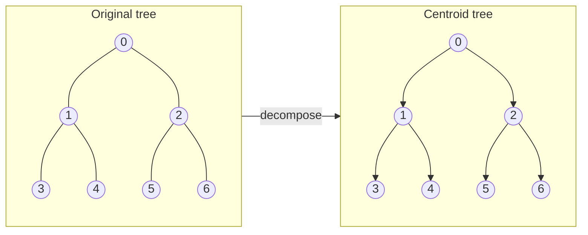

# Centroid Decomposition (Tree Divide and Conquer)

Centroid decomposition breaks a tree into smaller pieces by repeatedly removing
**centroid** nodes. The removed centroids form a new tree (the *centroid tree*)
with height O(log n). This structure is powerful for distance and path queries
that are difficult to answer with standard subtree techniques.

## What is a centroid?

For a tree with `n` nodes, a **centroid** is a node whose removal splits the
tree into components of size at most `n/2`.

Facts:

- Every tree has at least one centroid.
- Some trees have two centroids (adjacent). Either choice is valid.

## How decomposition works

1. Find a centroid `c` of the current tree.
2. Remove `c` (conceptually). The tree splits into smaller subtrees.
3. Recursively decompose each subtree.
4. Connect each subtree centroid to `c` in the centroid tree.

Because each subtree has size at most half, the centroid tree height is
O(log n).

## Mermaid diagram: original tree vs centroid tree

The diagram below shows a 7-node binary tree on the left and its resulting
centroid tree on the right. Node 0 is the centroid of the full tree. After
removing 0, the two subtrees {1,3,4} and {2,5,6} are decomposed independently.
Node 1 is the centroid of the left subtree; node 2 is the centroid of the
right subtree.



For this balanced binary tree the centroid tree mirrors the original tree.
For unbalanced trees the centroid tree is always shallower than the original.

## ASCII art: step-by-step decomposition

The example below uses a path of 7 nodes to show how the algorithm recurses.
After finding each centroid the remaining connected components are shown.

```
Original path: 0 - 1 - 2 - 3 - 4 - 5 - 6

Step 1 – whole tree (size 7, centroid = 3)
  0 - 1 - 2 -[3]- 4 - 5 - 6
                ^
         centroid (depth 0)
  Remove 3. Remaining components:
    Left:  0 - 1 - 2      (size 3)
    Right: 4 - 5 - 6      (size 3)

Step 2a – left component (size 3, centroid = 1)
  0 -[1]- 2
       ^
  centroid (depth 1, parent = 3)
  Remove 1. Remaining components:
    Left:  0               (size 1)
    Right: 2               (size 1)

Step 2b – right component (size 3, centroid = 5)
  4 -[5]- 6
       ^
  centroid (depth 1, parent = 3)
  Remove 5. Remaining components:
    Left:  4               (size 1)
    Right: 6               (size 1)

Step 3 – singletons (each is its own centroid, depth 2)
  [0]  [2]  [4]  [6]

Resulting centroid tree (edges show centroid-parent relation):
          3
         / \
        1   5
       / \ / \
      0  2 4  6
```

## Why it helps

A node has only O(log n) centroid ancestors. Many query problems can be solved
by aggregating data along these ancestors, giving O(log n) query time.

Common uses:

- Nearest marked node queries
- Path counting by distance
- Tree distance aggregation

## Public API

```
@centroid.build_centroid(n, edges)
```

Returns a `CentroidDecomp` with:

- `parent(v)`: centroid parent of `v` (or `-1` if `v` is the centroid root)
- `depth(v)`: depth of `v` in the centroid tree

## Examples

### Example 1: a path

```
0 - 1 - 2 - 3 - 4
```

The unique centroid is node 2.

```mbt check
///|
test "path centroid" {
  let edges : Array[(Int, Int)] = [(0, 1), (1, 2), (2, 3), (3, 4)]
  let cd = @centroid.build_centroid(5, edges)
  debug_inspect(cd.depth(2), content="0")
  debug_inspect(cd.parent(2), content="-1")
}
```

### Example 2: a star

```
    1
    |
2 - 0 - 3
    |
    4
```

The center is the centroid and becomes the root of the centroid tree.

```mbt check
///|
test "star centroid" {
  let edges : Array[(Int, Int)] = [(0, 1), (0, 2), (0, 3), (0, 4)]
  let cd = @centroid.build_centroid(5, edges)
  debug_inspect(cd.depth(0), content="0")
  debug_inspect(cd.parent(0), content="-1")
  debug_inspect(cd.parent(1), content="0")
}
```

### Example 3: invalid index

```mbt check
///|
test "invalid index" {
  let edges : Array[(Int, Int)] = [(0, 1)]
  let cd = @centroid.build_centroid(2, edges)
  debug_inspect(cd.parent(-1), content="-1")
  debug_inspect(cd.depth(10), content="-1")
}
```

## How to use the centroid tree in queries

A typical pattern is:

1. Precompute distances from every node to each of its centroid ancestors.
2. Maintain a data structure at each centroid (for example, the nearest marked
   node distance).
3. For a query at node `u`, walk up the centroid parents and combine answers.

The walk is only O(log n) steps.

## Complexity

- Build time: O(n log n)
- Centroid tree depth: O(log n)
- Typical query using centroid ancestors: O(log n)

## Practical notes and pitfalls

- The decomposition assumes a **static** tree (no edge updates).
- If there are two centroids, the algorithm may choose either; both are valid.
- Always skip "removed" nodes when recursing into subtrees.

## When to use it

Use centroid decomposition when you need fast path or distance queries on a
static tree. If you only need subtree queries, simpler techniques (Euler tour,
Fenwick/segment tree) are often enough.
