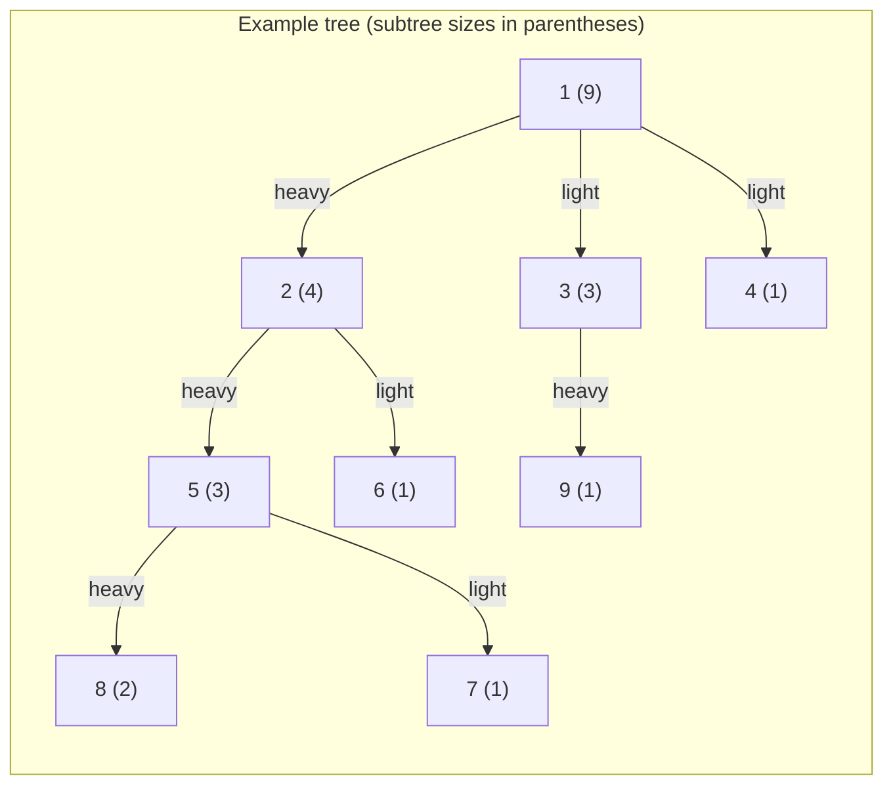

# DSU on Tree (Small-to-Large / Sack)

**DSU on Tree** answers subtree queries in O(n log n) by exploiting heavy-light
decomposition: the heavy child's accumulated data structure is *kept*, while
light children's data structures are rebuilt and discarded. This avoids the
O(n^2) cost of recomputing each subtree from scratch.

Typical tasks solved by this technique:

- For each subtree, find the most frequent color (the **mode**).
- For each subtree, count distinct values.
- For each subtree, find the k-th smallest element.

This package provides a concrete instantiation: **subtree color-mode sum** —
for each node, the sum of all color identifiers that achieve the maximum
frequency in its subtree.

## The core insight

```
Naive approach: for every node u, traverse its whole subtree.
  Worst case (path graph): O(n^2).

DSU on tree: split children into one heavy child and zero or more light
  children. Reuse the heavy child's data, rebuild only for light children.
  Every node crosses a light edge at most O(log n) times, so total work is
  O(n log n).
```

## Heavy-light decomposition

The **heavy child** of a node is the child whose subtree is largest. All other
children are **light children**. This single definition is all DSU on tree needs
from the decomposition.



Key property: a node is a **light child** at most O(log n) times on any path
from the root downward. Every time you cross a light edge, the subtree size at
least doubles — it can only double O(log n) times before reaching n.

## The "keep heavy child" technique

Processing is done in post-order (leaves first). The `keep` flag controls
whether the accumulated data structure is cleared after finishing a subtree.

```
For each node u processed in post-order:

  Step 1 — light children (keep = false)
  ┌──────────────────────────────────────────────────────┐
  │  for each light child v of u:                        │
  │    recurse into v, keep = false                      │
  │    [data structure is cleared when v finishes]       │
  └──────────────────────────────────────────────────────┘

  Step 2 — heavy child (keep = true)
  ┌──────────────────────────────────────────────────────┐
  │  if u has a heavy child h:                           │
  │    recurse into h, keep = true                       │
  │    [data structure for subtree(h) remains in place!] │
  └──────────────────────────────────────────────────────┘

  Step 3 — add light subtrees and u itself
  ┌──────────────────────────────────────────────────────┐
  │  for each light child v of u:                        │
  │    walk subtree(v) and insert each node's color      │
  │  insert color of u itself                            │
  └──────────────────────────────────────────────────────┘
  [data structure now represents exactly subtree(u)]

  Step 4 — record answer for u
  ┌──────────────────────────────────────────────────────┐
  │  result[u] = current answer from data structure      │
  └──────────────────────────────────────────────────────┘

  Step 5 — cleanup if not keeping
  ┌──────────────────────────────────────────────────────┐
  │  if keep = false: clear the entire data structure    │
  └──────────────────────────────────────────────────────┘
```

## Mermaid diagram: processing order on a small tree

The tree below has 6 nodes. Subtree sizes and heavy children are shown, followed
by the order in which DSU on tree visits each node.

```mermaid
flowchart TB
  subgraph Input["Input tree (node: size, heavy child marked ==>)"]
    direction TB
    R["0  size=6"]
    C1["1  size=3"]
    C2["2  size=1"]
    C3["3  size=1"]
    L1["4  size=2"]
    L2["5  size=1"]

    R  ==>|heavy|  C1
    R  -->|light|  C2
    C1 ==>|heavy|  L1
    C1 -->|light|  C3
    L1 -->|light|  L2
  end
```

```
Processing order:

  1. Node 2 (light leaf of 0):  recurse, keep=false  → discard
  2. Node 3 (light leaf of 1):  recurse, keep=false  → discard
  3. Node 5 (light leaf of 4):  recurse, keep=false  → discard
  4. Node 4 (heavy child of 1): recurse, keep=true
       add node 5 (light subtree), add node 4
       record answer[4], KEEP data in place
  5. Node 1 (heavy child of 0): recurse, keep=true
       data from subtree(4) already present
       add node 3 (light subtree), add node 1
       record answer[1], KEEP data in place
  6. Node 0 (root, keep=false):
       data from subtree(1) already present
       add node 2 (light subtree), add node 0
       record answer[0], CLEAR data
```

## Worked example: color-mode sum

```
Tree (root = 0):          Colors:   0 -> red (1)
                                    1 -> blue (2)
      0                             2 -> red (1)
     /|\                            3 -> blue (2)
    1 2 3                           4 -> green (3)
   / \
  4   5

Subtree sizes:
  Node:  0   1   2   3   4   5
  Size:  6   3   1   1   1   1

Heavy children:
  0 -> 1   (size 3, largest)
  1 -> 4   (tie broken arbitrarily, say 4)

Step 1 — Process node 5 (leaf, light child of 1, keep=false)
  freq = {blue:1}  max_freq=1  sum=blue(2)
  answer[5] = 2  →  CLEAR

Step 2 — Process node 4 (heavy child of 1, keep=true)
  freq = {green:1}  max_freq=1  sum=green(3)
  answer[4] = 3  →  KEEP

Step 3 — Process node 1 (heavy child of 0, keep=true)
  data from subtree(4) still present: freq={green:1}
  Add light subtree of 5: add blue
    freq={green:1, blue:1}  max_freq=1  sum=green+blue=5
  Add node 1 itself: add blue
    freq={green:1, blue:2}  max_freq=2  sum=blue(2)
  answer[1] = 2  →  KEEP

Step 4 — Process node 2 (light leaf of 0, keep=false)
  freq = {red:1}  max_freq=1  sum=red(1)
  answer[2] = 1  →  CLEAR

Step 5 — Process node 3 (light leaf of 0, keep=false)
  freq = {blue:1}  max_freq=1  sum=blue(2)
  answer[3] = 2  →  CLEAR

Step 6 — Process node 0 (root, keep=false)
  data from subtree(1) still present: freq={green:1, blue:2}  max_freq=2
  Add light subtree of 2: add red
    freq={green:1, blue:2, red:1}  max_freq=2  sum=blue(2)
  Add light subtree of 3: add blue
    freq={green:1, blue:3, red:1}  max_freq=3  sum=blue(2)
  Add node 0 itself: add red
    freq={green:1, blue:3, red:2}  max_freq=3  sum=blue(2)
  answer[0] = 2  →  CLEAR

Final answers: [2, 2, 1, 2, 3, 2]
```

## Why O(n log n)?

Each node is inserted into the data structure once per ancestor that has it in a
*light* subtree, plus once when it is in the heavy subtree being kept.

```
On any root-to-leaf path, light edges alternate with heavy chains.
Each light edge crosses into a subtree of strictly greater than half the size.

  subtree size after k light edges >= 2^k

  => after log2(n) light edges the subtree size exceeds n: impossible.
  => every node participates in at most O(log n) light-subtree insertions.

Total insertions: n * O(log n) = O(n log n).
```

## Example usage

```mbt check
///|
test "dsu on tree example" {
  let adj : Array[Array[Int]] = [ for _ in 0..<5 => [] ]
  adj[0].push(1)
  adj[1].push(0)
  adj[0].push(2)
  adj[2].push(0)
  adj[1].push(3)
  adj[3].push(1)
  adj[1].push(4)
  adj[4].push(1)
  let colors : Array[Int] = [1, 2, 1, 2, 3]
  let result = @dsu_on_tree.subtree_color_mode_sum(adj, colors)
  debug_inspect(result, content="[3, 2, 1, 2, 3]")
}
```

```mbt check
///|
test "dsu on tree tie" {
  let adj : Array[Array[Int]] = [ for _ in 0..<3 => [] ]
  adj[0].push(1)
  adj[1].push(0)
  adj[1].push(2)
  adj[2].push(1)
  let colors : Array[Int] = [5, 5, 7]
  let result = @dsu_on_tree.subtree_color_mode_sum(adj, colors)
  // Node 1's subtree has colors {5,7} so max frequency is 1, sum = 12
  // Node 0's subtree includes all nodes, max frequency is 2 for color 5
  debug_inspect(result, content="[5, 12, 7]")
}
```

## Complexity

| Phase | Time | Space |
|---|---|---|
| Compute subtree sizes and Euler tour | O(n) | O(n) |
| DSU on tree traversal | O(n log n) | O(n) |
| Per-node answer | O(1) | — |

## Comparison with related techniques

| Technique | Time | Supports updates | Notes |
|---|---|---|---|
| **DSU on Tree** | O(n log n) | No | Subtree queries, offline |
| Euler Tour + Segment Tree | O(n log n) | Yes | Subtree range queries |
| Heavy-Light Decomposition | O(n log^2 n) | Yes | Path and subtree queries |
| Centroid Decomposition | O(n log n) | No | Path and distance queries |
| Mo on Trees | O(n sqrt(n)) | No | General path queries |

Choose DSU on tree when:
- You need subtree queries that are hard to reduce to range queries.
- The data structure used per subtree supports efficient merging or rebuilding.
- The tree is static.

## The "small-to-large" perspective

The same complexity argument applies to explicit set merging: always merge the
smaller set into the larger one. Each element moves at most O(log n) times
because every move at least doubles the set it belongs to. DSU on tree is the
implicit tree-shaped version of this idea.

```
Merge sizes:
  small set (size s) merged into large set (size >= s)
  element's new set size >= 2s

  After k merges involving one element: set size >= 2^k
  => at most log2(n) merges per element
  => O(n log n) total merge work
```

## Implementation notes

- Subtree sizes and Euler tour entry/exit times are computed in a single DFS
  (`dfs_sizes`).  The Euler tour converts "add all nodes in subtree(v)" into a
  simple index range scan, avoiding a second recursive DFS.
- The global `Map[Int, Int]` (`counts`) together with `max_freq` and `sum_ref`
  form the data structure. Clearing it (Step 5) is O(subtree size) amortized
  across the O(n log n) bound.
- The `keep` flag is threaded through `dfs_dsu` so that the caller (the parent
  node) controls cleanup, not the callee.
- The root is processed with `keep = false` so that the global state is clean
  after the call returns.
