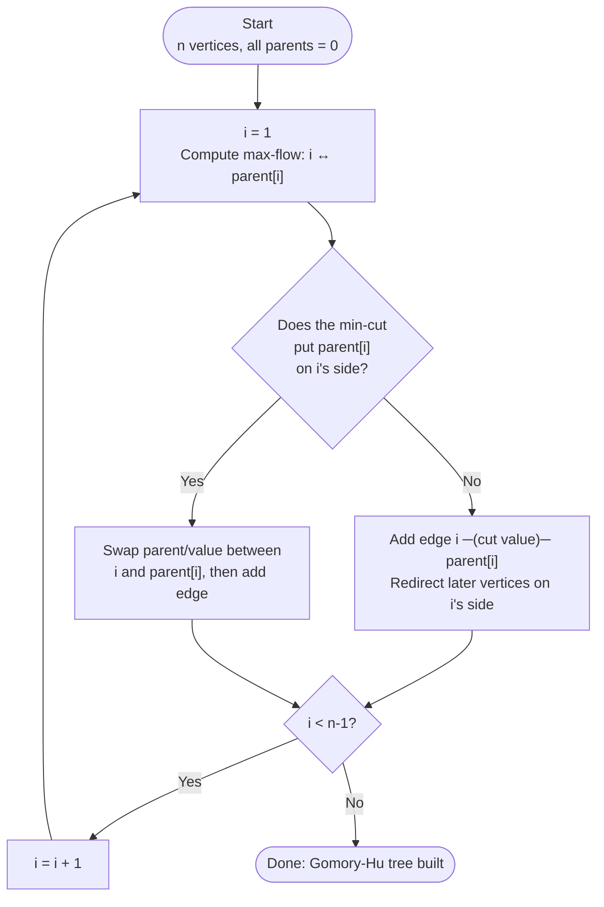
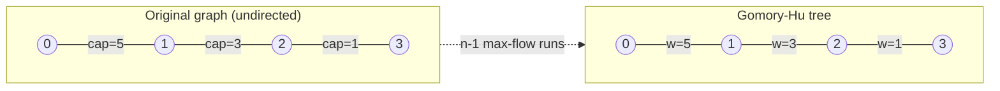
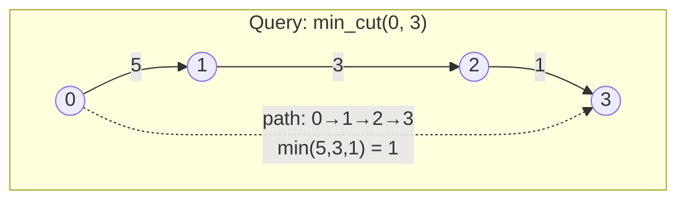
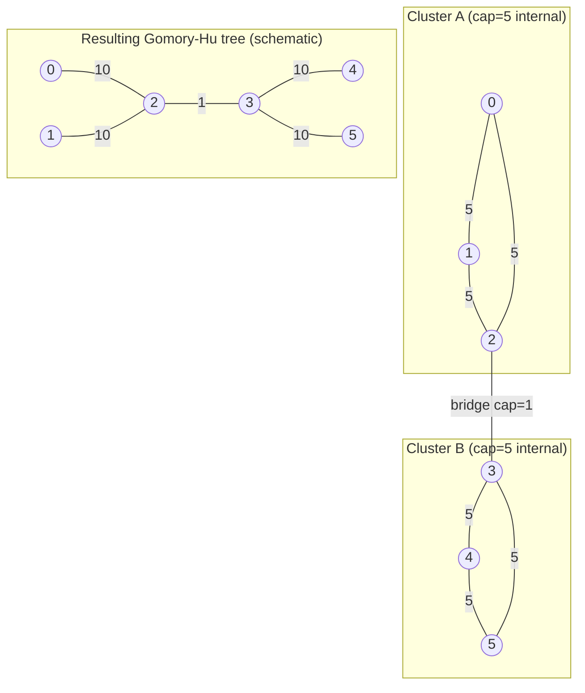

# Gomory-Hu Tree

## Overview

A **Gomory-Hu tree** is a weighted tree that encodes all-pairs minimum cut values
for an undirected graph. Instead of computing O(n²) max-flows, we build a single
tree with n-1 edges that answers any min-cut query in O(n) time.

- **Construction**: O(n · maxflow)
- **Query**: O(n) per pair
- **Space**: O(n + m)

## The Key Insight

```
Problem: Answer min-cut queries for all pairs of vertices

Naive: Run max-flow for each of the O(n²) pairs → too slow

Gomory-Hu insight:
  - There are only n-1 "essential" min-cuts
  - Build a tree where each edge represents a min-cut
  - Min-cut(u, v) = minimum edge weight on path u → v in tree

Just n-1 max-flow computations to answer ALL queries!
```

## Understanding Min-Cuts and Trees

```
Original graph:                 Gomory-Hu tree:

    5                                5
  0───1                           0───1
  │ ╲ │                              │
 3│  ╲│1                             │3
  │   ╲│                             │
  3───2                              2───3
    2                                 1

In the tree:
  - Edge 0-1 has weight 5 (min-cut between 0 and 1)
  - Edge 1-2 has weight 3 (min-cut between 1 and 2)
  - Edge 2-3 has weight 1 (min-cut between 2 and 3)

Query min_cut(0, 3):
  Path: 0 → 1 → 2 → 3
  Edge weights: 5, 3, 1
  Min-cut(0, 3) = min(5, 3, 1) = 1
```

## Cut View: What a Tree Edge Means

```
Suppose the min-cut between s and t separates:
  Left side (S)  = {0, 2}
  Right side (T) = {1, 3}

Then the Gomory-Hu tree contains an edge e with weight = cut(S, T)
Removing e splits the tree into the same two sides.

Tree cut picture:
  0 --(w)---- 1
  |           |
  2           3

Cut(S, T) = w = min-cut(0, 1) = min-cut(2, 3)
```

This is why the minimum edge on the path between any two nodes equals their
min-cut value in the original graph.

## Why the Tree Works

```
Key theorem (Gomory-Hu):
  For any undirected graph, there exists a tree T such that:
  1. T has the same vertex set as G
  2. For any u, v: min_cut_G(u, v) = min edge weight on path T(u, v)
  3. The min-cut achieving this separates vertices exactly as
     removing that tree edge would

This is remarkable! The tree compactly represents O(n²) cut values.
```

## Algorithm Walkthrough

```
Build Gomory-Hu tree for 4 vertices:

Initial: All vertices in one "super-node"
         {0, 1, 2, 3}

Step 1: Pick s=0, compute max-flow from 0 to any other vertex (say 1)
        Min-cut found: value = 5, separates {0} from {1, 2, 3}
        Add tree edge: 0 ─(5)─ 1

        Tree so far:
          0 ─(5)─ 1
                  │
                 {1,2,3}

Step 2: Pick s=2 (from group {1,2,3}), compute flow to parent 1
        Contract {0} to single node for this flow
        Min-cut found: value = 3, separates {2} from {1, 3}
        Add tree edge: 1 ─(3)─ 2

        Tree so far:
          0 ─(5)─ 1 ─(3)─ 2
                  │
                 {1,3}

Step 3: Pick s=3, compute flow to parent 1
        Min-cut found: value = 1, separates {3} from {0, 1, 2}
        But cut is on 2's side → attach 3 to 2
        Add tree edge: 2 ─(1)─ 3

Final tree:
  0 ─(5)─ 1 ─(3)─ 2 ─(1)─ 3
```

## Mermaid Diagram: Algorithm Step by Step

The following diagram shows how the Gomory-Hu construction processes each
vertex in order, growing the tree one edge at a time.



## Mermaid Diagram: Tree Construction for a Line Graph

This diagram shows the final Gomory-Hu tree built from the line graph
`0 --5-- 1 --3-- 2 --1-- 3`.  Each tree edge weight equals the bottleneck
capacity on that segment of the original graph.



## Mermaid Diagram: Min-Cut Query Path

To answer `min_cut(u, v)`, walk the unique path from `u` to `v` in the tree
and return the minimum edge weight encountered.



## Mermaid Diagram: Two-Cluster Structure

A graph with two dense clusters connected by a thin bridge demonstrates how
the Gomory-Hu tree naturally captures the weak cross-cluster cut.



Cuts within Cluster A or B return 10 (two internal edges must be severed).
Any cross-cluster cut returns 1 (only the bridge matters).

## Visual: Querying the Tree

```
Gomory-Hu tree:
  0 ─(5)─ 1 ─(3)─ 2 ─(1)─ 3

Query: min_cut(0, 2)
  Path: 0 → 1 → 2
  Weights: 5, 3
  Answer: min(5, 3) = 3

Query: min_cut(1, 3)
  Path: 1 → 2 → 3
  Weights: 3, 1
  Answer: min(3, 1) = 1

Query: min_cut(0, 3)
  Path: 0 → 1 → 2 → 3
  Weights: 5, 3, 1
  Answer: min(5, 3, 1) = 1
```

## Quick Start

```mbt check
///|
test "gomory-hu tree example" {
  let edges : Array[(Int, Int, Int64)] = [(0, 1, 5L), (1, 2, 3L), (1, 3, 1L)]
  let tree = @gomory_hu_tree.gomory_hu_tree(4, edges)
  debug_inspect(tree.min_cut(0, 2), content="3")
  debug_inspect(tree.min_cut(2, 3), content="1")
}
```

## Example Usage: Line Graph with Known Cuts

```mbt check
///|
test "gomory-hu tree on a line" {
  // 0 --5-- 1 --3-- 2 --1-- 3
  let edges : Array[(Int, Int, Int64)] = [(0, 1, 5L), (1, 2, 3L), (2, 3, 1L)]
  let tree = @gomory_hu_tree.gomory_hu_tree(4, edges)
  debug_inspect(tree.min_cut(0, 3), content="1")
  debug_inspect(tree.min_cut(0, 2), content="3")
  debug_inspect(tree.min_cut(1, 2), content="3")
}
```

## More Examples

```mbt check
///|
test "gomory-hu tree triangle" {
  // Triangle graph: each edge has capacity 1
  let edges : Array[(Int, Int, Int64)] = [(0, 1, 1L), (1, 2, 1L), (0, 2, 1L)]
  let tree = @gomory_hu_tree.gomory_hu_tree(3, edges)
  // Min-cut between any pair is 2 (need to cut 2 edges)
  debug_inspect(tree.min_cut(0, 1), content="2")
  debug_inspect(tree.min_cut(0, 2), content="2")
  debug_inspect(tree.min_cut(1, 2), content="2")
}
```

```mbt check
///|
test "gomory-hu tree two clusters" {
  // Two dense clusters connected by a thin bridge.
  // Cluster A: 0,1,2 (edges weight 5)
  // Cluster B: 3,4,5 (edges weight 5)
  // Bridge: 2 --1-- 3
  let edges : Array[(Int, Int, Int64)] = [
    (0, 1, 5L),
    (1, 2, 5L),
    (0, 2, 5L),
    (3, 4, 5L),
    (4, 5, 5L),
    (3, 5, 5L),
    (2, 3, 1L),
  ]
  let tree = @gomory_hu_tree.gomory_hu_tree(6, edges)
  // Any cut separating the clusters must cut the bridge edge.
  debug_inspect(tree.min_cut(0, 4), content="1")
  // Within a cluster, the minimum cut is larger.
  debug_inspect(tree.min_cut(0, 2), content="10")
  debug_inspect(tree.min_cut(3, 5), content="10")
}
```

## Common Applications

### 1. Network Reliability
```
Find the most vulnerable connection in a network.
The smallest edge in the Gomory-Hu tree represents the
minimum global cut (weakest link).
```

### 2. Clustering
```
Cut the smallest edges in the Gomory-Hu tree to partition
vertices into well-connected clusters.
```

### 3. All-Pairs Min-Cut
```
Precompute the tree once, then answer any min-cut query
in O(n) time by walking the tree path.
```

### 4. Network Design
```
Given min-cut requirements between terminal pairs,
the Gomory-Hu tree helps verify if they're satisfied.
```

## Why It Works (Sketch)

The algorithm runs `n-1` max-flow computations. After each flow between
`s` and its current parent `t`, the resulting min-cut partitions the vertices.
We attach `s` to `t` with the cut value, and redirect other vertices to keep
the parent structure consistent. Repeating this builds a tree where the
minimum edge on the path between any two vertices equals their min-cut.

## Answering Queries from the Tree

```
Given u, v:
1) Walk the path from u to v in the tree
2) Return the smallest edge weight on that path

Simple O(n) method:
  - BFS/DFS from u, store parent and edge weight
  - Walk back from v to u, tracking the minimum weight

Faster method:
  - Precompute LCA and minimum-edge-to-ancestor
  - Answer each query in O(log n)
```

## Complexity Analysis

| Operation | Time |
|-----------|------|
| Build tree | O(n · maxflow) |
| Query min_cut(u, v) | O(n) |
| Find global min-cut | O(n) |

With efficient max-flow (e.g., push-relabel), building is O(n · V · E) or better.

## Gomory-Hu Tree vs Other Approaches

| Method | Preprocessing | Query | Use Case |
|--------|--------------|-------|----------|
| **Gomory-Hu Tree** | O(n · maxflow) | O(n) | All-pairs min-cut |
| Direct Max-Flow | O(1) | O(maxflow) | Few queries |
| Global Min-Cut | O(V · E) | - | Just global cut |

**Choose Gomory-Hu when**: You need many min-cut queries between different pairs.

## Properties of the Tree

```
Important properties:
1. The tree has exactly n vertices and n-1 edges
2. Each edge weight equals a min-cut in the original graph
3. Removing any tree edge corresponds to a valid min-cut
4. The minimum edge weight in the entire tree = global min-cut

The tree is NOT unique; different construction orders
may produce different (but equally valid) trees.
```

## When to Use

- You need **all-pairs** min-cut values (not just a single source)
- The graph is undirected and capacities are non-negative
- You'll make many queries on the same graph

## Implementation Notes

- Building the tree requires `n-1` max-flow computations
- The tree has `n` vertices and `n-1` edges
- Each max-flow is on a contracted graph (merged super-nodes)
- Path queries can be optimized with LCA for O(log n) time

## Pitfalls and Edge Cases

- The graph must be **undirected**; capacities are assumed non-negative.
- Parallel edges are fine; they just add capacity.
- Self-loops and non-positive edges are ignored in this implementation.
- If the graph is disconnected, min-cut between components is `0`.
- The tree is not unique; different root orders can produce different trees
  and still preserve all min-cut values.
