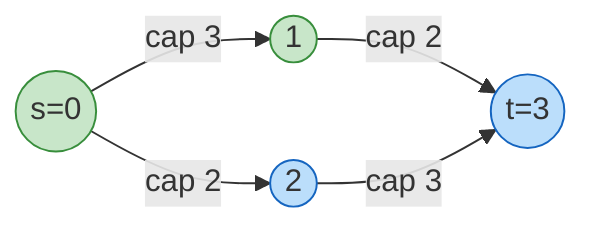
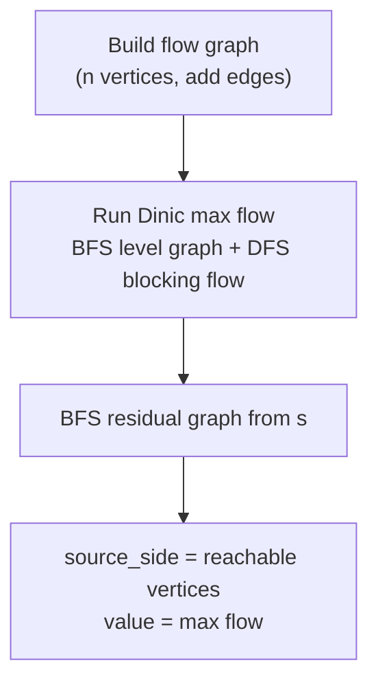
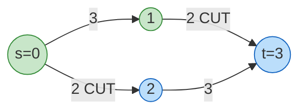
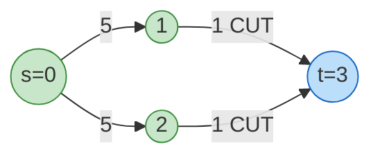

# Minimum s-t Cut (via Max Flow)

This package computes the **minimum s-t cut** of a directed graph by running
max flow (Dinic's algorithm) and reading the residual graph.

If you are new to flows, think of each edge as a pipe with capacity. The min
cut is the cheapest set of pipes you must cut to stop all flow from `s` to `t`.

## 1. What is an s-t cut?

An **s-t cut** is a partition of vertices into two groups `(S, T)` such that:

- `s` is in `S`
- `t` is in `T`
- the cut capacity is the sum of capacities of edges from `S` to `T`

Tiny warm-up example:

```
0 --3--> 1 --2--> 2
 \--1---------------->

s = 0, t = 2
```

Two possible cuts:

- `S = {0}`, `T = {1, 2}`:
  cut edges = `0->1 (3)` and `0->2 (1)` => capacity `4`
- `S = {0, 1}`, `T = {2}`:
  cut edges = `1->2 (2)` and `0->2 (1)` => capacity `3`

So the minimum s-t cut here has capacity `3`.

## 2. Why max flow gives the min cut

The **max-flow min-cut theorem** says:

```
max_flow(s, t) = min_cut_capacity(s, t)
```

Intuition: if you push as much flow as possible, every remaining path from `s`
to `t` must be blocked by a fully saturated edge. Those saturated edges form
the bottleneck that is exactly the min cut.

## 3. Mermaid diagram: s-t cut concept

The diagram below shows a 4-vertex network. Vertices `0` and `1` (green) form
the source side S; vertices `2` and `3` (blue) form the sink side T. The two
dashed arrows crossing the cut boundary are the cut edges.



Cut edges crossing from S={0,1} to T={2,3}:

- `0 -> 2` (capacity 2)
- `1 -> 3` (capacity 2)

Total cut capacity = 4 = max flow.

## 4. Residual graph refresher

For each edge `u -> v` with capacity `c` and current flow `f`:

```
Residual forward  capacity = c - f
Residual backward capacity = f
```

You can traverse an edge in the residual graph only if its residual capacity is
positive.

After pushing max flow, the saturated cut edges have zero residual forward
capacity, so no path from `s` to `t` remains in the residual graph.

## 5. ASCII art: max flow run and residual state

Consider the 4-vertex graph from section 3.

### Step 1: initial network

```
         cap 3          cap 2
    0 ──────────► 1 ──────────► 3
    │                            ▲
    │ cap 2          cap 3       │
    └────────────► 2 ────────────┘

flow on every edge = 0
```

### Step 2: augment path 0 -> 1 -> 3, push 2 units

```
     flow 2/cap 3       flow 2/cap 2
    0 ──────────► 1 ──────────► 3
    │                            ▲
    │ flow 0/cap 2   flow 0/cap 3│
    └────────────► 2 ────────────┘
```

### Step 3: augment path 0 -> 2 -> 3, push 2 units

```
     flow 2/cap 3       flow 2/cap 2
    0 ──────────► 1 ──────────► 3
    │                            ▲
    │ flow 2/cap 2   flow 2/cap 3│
    └────────────► 2 ────────────┘

Total flow = 4.  No more augmenting paths exist.
```

### Step 4: residual graph after max flow

```
Forward residual capacities:
  0->1: 3-2=1    1->3: 2-2=0 (saturated)
  0->2: 2-2=0 (saturated)    2->3: 3-2=1

Backward residual capacities (cancellation arcs):
  1->0: 2    3->1: 2
  2->0: 2    3->2: 2

BFS from 0 in the residual graph:
  0 -> 1  (residual 0->1 = 1, reachable)
  0 -> 2  (residual 0->2 = 0, BLOCKED)
  1 -> 3  (residual 1->3 = 0, BLOCKED)

Reachable from 0: {0, 1}  =>  S = {0, 1}
Unreachable:      {2, 3}  =>  T = {2, 3}
```

### Step 5: identify cut edges

```
Cut = all original edges (u in S) -> (v in T):

  0 -> 2  (cap 2, saturated)    <- cut edge
  1 -> 3  (cap 2, saturated)    <- cut edge

Sum of cut capacities = 2 + 2 = 4 = max flow.  (confirms min-cut theorem)
```

## 6. The algorithm (step by step)

1. Build the flow network from `n` and `edges`.
2. Run max flow (Dinic).
3. Do a BFS/DFS from `s` in the residual graph.
4. Let `S` be all reachable vertices; let `T` be the rest.
5. Return:
   - `value = max_flow`
   - `source_side = S`

The cut edges are **all original edges from `S` to `T`**.

## 7. Mermaid diagram: algorithm phases



## 8. Example A: balanced branches

Edges:

```
0 -> 1 (cap 3)
0 -> 2 (cap 2)
1 -> 3 (cap 2)
2 -> 3 (cap 3)
```

Diagram:

```
    0
   / \
 3/   \2
 /     \
1       2
 \     /
  \2  /3
    3
```

Max flow from 0 to 3:

- Path `0->1->3` sends 2
- Path `0->2->3` sends 2

Total flow = 4, so the min cut must also be 4.

Residual reachability from 0:

- `0->1` still has capacity 1, so 1 is reachable
- `0->2` is saturated, so 2 is not reachable
- `1->3` is saturated, so 3 is not reachable

Therefore:

```
S = {0, 1}
T = {2, 3}
```

Cut edges are `0->2 (2)` and `1->3 (2)`, total capacity 4.



```mbt check
///|
test "min cut st balanced branches" {
  let edges : Array[(Int, Int, Int64)] = [
    (0, 1, 3L),
    (0, 2, 2L),
    (1, 3, 2L),
    (2, 3, 3L),
  ]
  let result = @min_cut_st.min_cut_st(4, edges, 0, 3).unwrap()
  debug_inspect(result.value, content="4")
}
```

## 9. Example B: a narrow bottleneck into the sink

Here the bottleneck is obvious: only two unit edges enter the sink.

```
0 --5--> 1 --1--> 3
 \--5--> 2 --1--> 3
```

The min cut is the two edges into `3`, so capacity `2`.



The source side is `{0, 1, 2}` because even after max flow the edges
`0->1` and `0->2` still have residual capacity (5 was never the
bottleneck). Only the two unit edges into `3` are saturated.

```
ASCII: flow after max flow

  0 --flow 1/cap 5--> 1 --flow 1/cap 1--> 3
   \--flow 1/cap 5--> 2 --flow 1/cap 1--> 3

Saturated edges (residual = 0): 1->3, 2->3  (the bottleneck)
S = {0, 1, 2},  T = {3}
Cut capacity = 1 + 1 = 2
```

```mbt check
///|
test "min cut st bottleneck into sink" {
  let edges : Array[(Int, Int, Int64)] = [
    (0, 1, 5L),
    (0, 2, 5L),
    (1, 3, 1L),
    (2, 3, 1L),
  ]
  let result = @min_cut_st.min_cut_st(4, edges, 0, 3).unwrap()
  debug_inspect(result.value, content="2")
}
```

## 10. Input format and return value

Signature (from `pkg.generated.mbti`):

- `min_cut_st(n, edges, source, sink) -> MinCutSTResult?`

Parameters:

- `n`: number of vertices, labeled `0 .. n-1`
- `edges`: `ArrayView[(Int, Int, Int64)]` of `(from, to, capacity)`
- `source`, `sink`: vertex indices

Returns `None` if:

- `n <= 0`
- any vertex index is out of range
- `source == sink`

On success, you get:

- `value`: min cut capacity (equals max flow)
- `source_side`: vertices in `S` (reachable from `source` in residual graph)

## 11. Listing the actual cut edges

The package does not list cut edges directly, but it gives you `source_side`,
which is enough to compute them.

The fast method builds a boolean lookup table so membership is O(1). This uses
mutation for performance, which is appropriate when you have many edges.

```mbt check
///|
fn cut_edges_fast(
  n : Int,
  edges : ArrayView[(Int, Int, Int64)],
  source_side : Array[Int],
) -> Array[(Int, Int, Int64)] {
  let in_source = Array::make(n, false)
  for v in source_side {
    if v >= 0 && v < n {
      in_source[v] = true
    }
  }
  let cut : Array[(Int, Int, Int64)] = []
  for edge in edges {
    let (u, v, cap) = edge
    if in_source[u] && !in_source[v] {
      cut.push((u, v, cap))
    }
  }
  cut
}

///|
fn sum_cap(acc : Int64, edge : (Int, Int, Int64)) -> Int64 {
  let (_, _, cap) = edge
  acc + cap
}

///|
test "cut edges sum to min cut value" {
  let edges : Array[(Int, Int, Int64)] = [
    (0, 1, 3L),
    (0, 2, 2L),
    (1, 3, 2L),
    (2, 3, 3L),
  ]
  let result = @min_cut_st.min_cut_st(4, edges, 0, 3).unwrap()
  let cut = cut_edges_fast(4, edges, result.source_side)
  let sum = cut.fold(init=0L, sum_cap)
  debug_inspect(sum, content="4")
}
```

For very small graphs, a simpler (but slower) check is also fine:

```
edge (u -> v) is in the cut if
  source_side.contains(u) && !(source_side.contains(v))
```

## 12. Example C: no path from s to t

If `t` is unreachable, the max flow (and min cut) is `0`.

```mbt check
///|
test "min cut st no path" {
  let edges : Array[(Int, Int, Int64)] = []
  let result = @min_cut_st.min_cut_st(3, edges, 0, 2).unwrap()
  debug_inspect(result.value, content="0")
}
```

## 13. ASCII art: Dinic level graph

Dinic's algorithm builds a **level graph** (BFS layering) and then finds a
**blocking flow** by DFS. Here is an example of what the level graph looks
like for Example A:

```
BFS from 0 (using residual capacities):
  Level 0: {0}
  Level 1: {1, 2}    (0->1 cap 3, 0->2 cap 2)
  Level 2: {3}       (1->3 cap 2, 2->3 cap 3)

Level graph (only forward edges kept):

  Level 0    Level 1    Level 2
     0 ──(3)──► 1 ──(2)──► 3
     └──(2)──► 2 ──(3)──► 3

DFS blocking flow (phase 1):
  Path 0->1->3: push min(3,2) = 2    1->3 now saturated
  Path 0->2->3: push min(2,3) = 2    0->2 now saturated
  Blocking flow = 4

BFS phase 2 (residual):
  0->1 has residual 1, but 1->3 has residual 0 (saturated)
  0->2 has residual 0 (saturated)
  Sink 3 unreachable.  Algorithm stops.

Max flow = 4
```

## 14. Complexity

The heavy part is Dinic's algorithm:

```
Time:  O(V^2 * E)   (worst case for general graphs)
Space: O(V + E)
```

The final residual BFS is just `O(V + E)`.

## 15. s-t min cut vs global min cut

| Property | s-t Min Cut (this package) | Global Min Cut (Stoer-Wagner) |
|----------|---------------------------|-------------------------------|
| Source/sink required | Yes | No |
| Finds | One specific s-t cut | Best cut over all vertex pairs |
| Algorithm | Dinic | Stoer-Wagner |
| Time | O(V^2 E) | O(V^3) |
| Use case | Flow bottleneck, routing | Network reliability, clustering |

## 16. Summary

This package gives you:

- the min cut value (equal to max flow),
- and the source-side set that defines the cut.

With those two pieces, you can easily list cut edges, visualize the cut, or
confirm the bottleneck in your network.

```
Quick reference:

  min_cut_st(n, edges[:], source, sink)
    -> Some({ value, source_side })   on success
    -> None                           on invalid input

  Cut edges: all (u, v, cap) where source_side.contains(u)
                                 && !source_side.contains(v)

  Cut capacity: sum of cap over cut edges  ==  value
```
