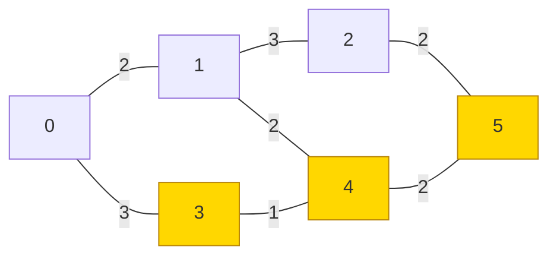
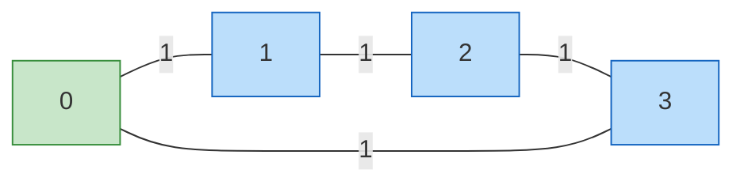
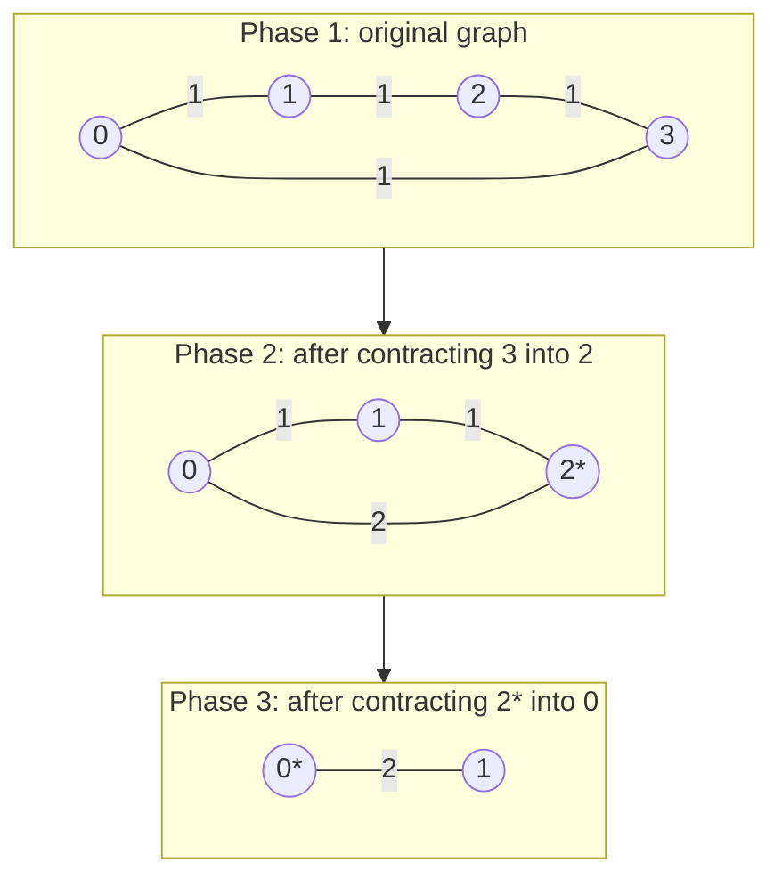
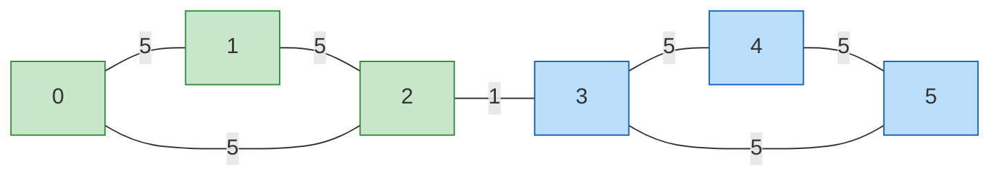

# Stoer-Wagner Global Minimum Cut (Undirected)

This package finds the **global minimum cut** of an undirected weighted graph.
Unlike s-t min cut, it does **not** require a source or sink vertex.

## 1. What is a global minimum cut?

Given an undirected graph, a **cut** is a partition of all vertices into two
non-empty sets S and T. The **cut weight** is the total weight of edges that
cross between S and T.

The **global minimum cut** is the cut with the smallest possible weight.

```
Example graph (weights on edges):

    2       3
  0 --- 1 --- 2
  |           |
  3           2
  |           |
  3 --- 4 --- 5
      1       

One possible cut: S = {0, 3}, T = {1, 2, 4, 5}
Cut edges: 0-1 (weight 2), 3-4 (weight 1)
Cut weight = 2 + 1 = 3

Better cut: S = {3, 4, 5}, T = {0, 1, 2}
Cut edges: 0-3 (weight 3), 4-1 (weight ?), ...
```

The algorithm finds the best possible cut without trying all partitions.

## 2. Mermaid diagram: example graph and its minimum cut



The highlighted vertices {3, 4, 5} form one side of the minimum cut.
The dashed edges crossing the cut (0-3, 1-4, 2-5) have total weight 3+2+2=7.

A simpler worked example used throughout this document:



Four-cycle with unit weights. Minimum cut = 2 (cut any single vertex away).

## 3. Big idea: maximum adjacency search + contraction

Stoer-Wagner runs n-1 phases. Each phase does two things:

1. **Maximum adjacency search**: build a growing set A, always adding the
   vertex most tightly connected to A (highest total edge weight to A).
   Record the last vertex `t` and the second-to-last vertex `s`.

2. **Phase cut**: the weight of isolating `t` from everything else equals
   `w[t]` (total edge weight from `t` to the rest of A). Record this as a
   candidate for the global minimum.

3. **Contract**: merge `t` into `s` (combine into a supernode). Continue
   with n-1 vertices.

The smallest candidate across all phases is the global minimum cut.

## 4. Visual: maximum adjacency search step by step

Consider a weighted graph on four vertices A, B, C, D:

```
    2       1
  A --- B --- C
  |               |
  2               1
  |               |
  D ──────────────+
```

Edges: A-B=2, B-C=1, A-D=2, C-D=1

```
Start: A = {A}
w[] = [A:-, B:0, C:0, D:0]

Iteration 1:
  w[B] = 0, w[C] = 0, w[D] = 0  (tie, pick B by index)
  Add B to A.  A = {A, B}
  Update w: w[C] += adj[B][C] = 1,  w[D] += adj[B][D] = 0
  w[] = [C:1, D:0]

Iteration 2:
  w[C] = 1, w[D] = 0  → pick C
  Add C to A.  A = {A, B, C}
  Update w: w[D] += adj[C][D] = 1
  w[] = [D:1]

Iteration 3 (last):
  Only D left.  s = C (previous), t = D
  Phase cut weight = w[D] = 1

  Cut candidate: {D} vs {A, B, C}  weight = 1
```

After this phase, contract D into C (merge into supernode).

```
ASCII: contraction

Before:              After contracting D into C:
  A --- B --- C         A --- B --- C*
  |           |         |           |
  A-D:2      D         A-C*:2    (D absorbed)
  B-D:0                B-C*:1 (unchanged)
              |
             C-D:1     (* C* now carries D's edges)
```

## 5. Full worked example: four-cycle

Graph:
```
  0 ---1--- 1
  |         |
  1         1
  |         |
  3 ---1--- 2
```

### Phase 1: maximum adjacency search from vertex 0

```
A = {0}
w = [0:-, 1:0, 2:0, 3:0]

Step 1: pick 1  (w[1]=0, tied; smallest index picked first)
  A = {0,1}
  w[2] += adj[1][2] = 1  →  w[2] = 1
  w[3] += adj[1][3] = 0  →  w[3] = 0

Step 2: pick 2  (w[2]=1 > w[3]=0)
  A = {0,1,2}
  w[3] += adj[2][3] = 1  →  w[3] = 1

Step 3 (last): t = 3, s = 2
  Phase cut weight = w[3] = 1 + 1 = 2
  Cut candidate: {3} vs {0,1,2}  weight = 2
```

### Phase 1: contraction

Contract 3 into 2. The supernode 2* represents {2, 3}.

```
Before:              After contraction:
  0 ---1--- 1          0 ---1--- 1
  |         |          |         |
  1         1          1         1
  |         |          |         |
  3 ---1--- 2          2* ──────+
                       (2* has edges: to 0 with w=1, to 1 with w=1)
```

### Phases 2 and 3

Each phase finds a cut of weight 2. The algorithm confirms that 2 is the
global minimum cut.

### Result

```
Minimum cut weight = 2

One side of the cut: {3}  (or equivalently {0}, {1}, {2})
Crossing edges: 3-0 (weight 1) and 3-2 (weight 1)
```

## 6. Mermaid: contraction sequence



## 7. Why it works (intuition)

The key theorem (Stoer-Wagner 1997):

```
Theorem:
  At the end of a maximum adjacency search phase with ordering
  v1, v2, ..., vk where s = v_{k-1} and t = vk:

  The cut value isolating t (= w[t]) is a minimum s-t cut.

Corollary:
  Either the global min cut separates s from t (→ we find it in this phase),
  or it does not (→ contracting s and t does not change it, found later).
```

By running n-1 phases and tracking the minimum, we find the global min cut.

## 8. ASCII art: adjacency weights progression

```
Phase 1 of a 5-vertex graph:
Vertices: 0,1,2,3,4  A starts empty (anchored at vertex 0)

w[] tracks "connection strength to current set A"

          A={0}    A={0,3}   A={0,3,1}  A={0,3,1,2}   last
vertex 1:   0        0           -            -           -
vertex 2:   0        0           2            -           -
vertex 3:   2        -           -            -           -
vertex 4:   1        1           1            3           ← t

w[4] at end = 3 → cut candidate weight is 3
```

## 9. API

```
stoer_wagner_min_cut(n, edges) -> MinCutResult?

Parameters:
  n     : Int                          number of vertices (0-indexed)
  edges : ArrayView[(Int, Int, Int64)] undirected edges (u, v, weight)

Returns:
  None          if n <= 1 (no cut possible)
  Some(result)  otherwise

MinCutResult:
  weight : Int64      total weight of cut edges
  cut    : Array[Int] one side of the cut (original vertex IDs)
```

The other side of the cut is all vertices NOT in `result.cut`.

## 10. Quick start

```mbt check
///|
test "stoer wagner cycle" {
  let edges : Array[(Int, Int, Int64)] = [
    (0, 1, 1L),
    (1, 2, 1L),
    (2, 3, 1L),
    (3, 0, 1L),
  ]
  let result = @stoer_wagner_min_cut.stoer_wagner_min_cut(4, edges).unwrap()
  debug_inspect(result.weight, content="2")
}
```

```mbt check
///|
test "stoer wagner weighted" {
  let edges : Array[(Int, Int, Int64)] = [(0, 1, 5L), (1, 2, 3L), (0, 2, 2L)]
  let result = @stoer_wagner_min_cut.stoer_wagner_min_cut(3, edges).unwrap()
  debug_inspect(result.weight, content="5")
}
```

## 11. Disconnected graphs

If the graph is disconnected, one component can be isolated with zero crossing
edges, so the global min cut is 0.

```mbt check
///|
test "stoer wagner disconnected" {
  let edges : Array[(Int, Int, Int64)] = []
  let result = @stoer_wagner_min_cut.stoer_wagner_min_cut(3, edges).unwrap()
  debug_inspect(result.weight, content="0")
}
```

## 12. Example: two clusters with a thin bridge



The bridge edge 2-3 (weight 1) is the bottleneck.
Min cut = 1: cut the bridge, separating {0,1,2} from {3,4,5}.

```
Cluster A: 0,1,2 (fully connected, weights 5)
Cluster B: 3,4,5 (fully connected, weights 5)
Bridge:    2 --1-- 3

Global min cut = 1  (cut the bridge)
```

## 13. Comparison with s-t min cut

| Property | s-t Min Cut | Global Min Cut (Stoer-Wagner) |
|----------|-------------|-------------------------------|
| Source/sink required | Yes | No |
| Finds | One specific s-t cut | The best cut over all pairs |
| Algorithm | Dinic / push-relabel | Stoer-Wagner |
| Time | O(V^2 E) | O(V^3) or O(VE + V^2 log V) |
| Use case | Flow bottleneck | Network reliability, clustering |

## 14. Complexity

```
Dense implementation (adjacency matrix):  O(V^3)
Heap-based implementation:               O(VE + V^2 log V)
Space:                                   O(V^2)
```

This implementation uses the dense O(V^3) approach, which is practical for
graphs up to a few hundred vertices.

## 15. Beginner checklist

1. Graph is **undirected** (each edge is listed once, used both ways).
2. Edge weights must be **non-negative**.
3. Vertices are **0-indexed** from 0 to n-1.
4. Parallel edges are **summed** (treated as one heavier edge).
5. The result gives **one side** of the cut; the other side is the complement.
6. For n <= 1, the function returns `None`.

## 16. Applications

```
Network reliability:
  The global min cut is the minimum number (or weight) of edges
  that, if removed, disconnects the network.

Image segmentation:
  Model pixels as vertices, similarity as edge weights.
  The min cut separates foreground from background.

Clustering:
  A small min cut means two clusters are weakly connected.
  Cut the cheapest edges to separate them.

VLSI design:
  Partition circuit components to minimize wire crossings between chips.
```

## 17. Summary

Stoer-Wagner gives a deterministic global min cut:

- Run n-1 phases of maximum adjacency search.
- Each phase yields a cut candidate (weight of isolating the last vertex).
- Contract the last two vertices of each phase.
- The smallest candidate is the global minimum cut.
