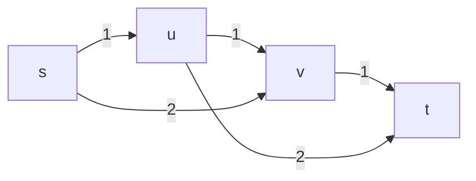
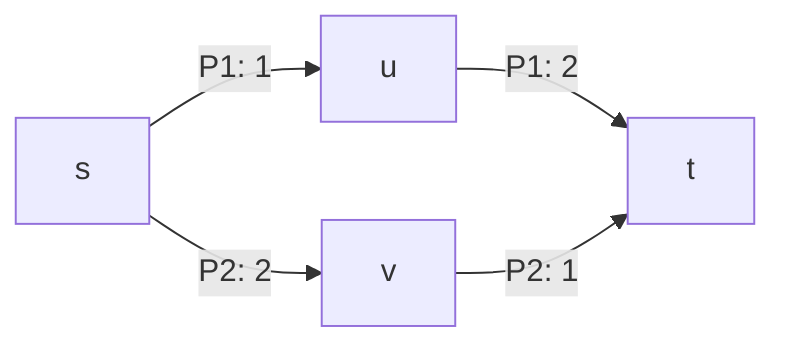
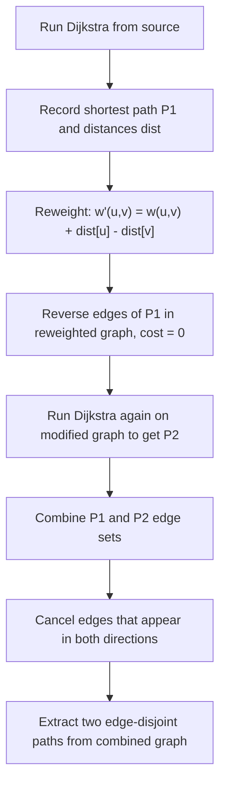
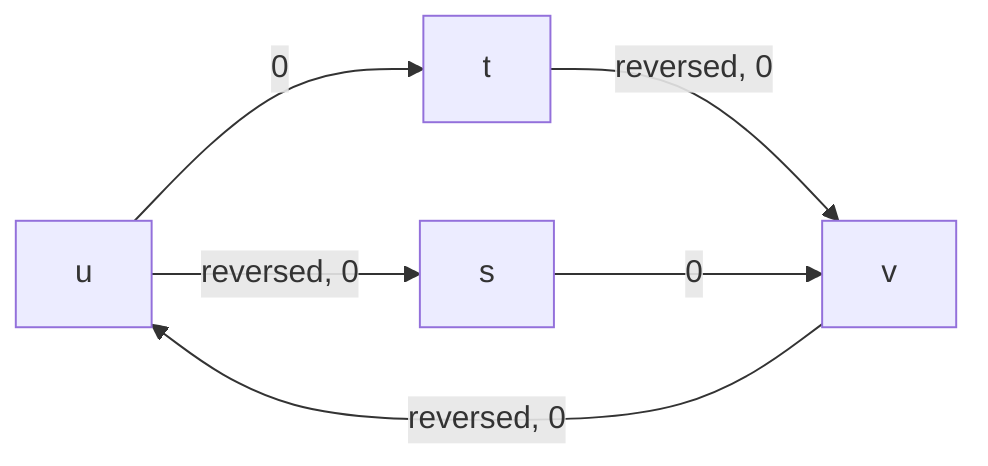
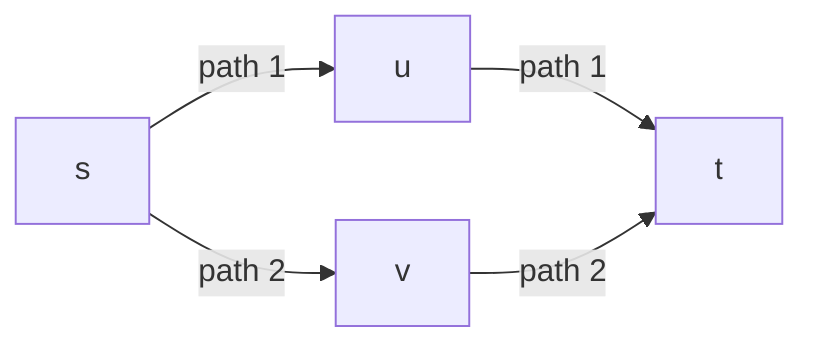

# Suurballe's Algorithm (Two Edge-Disjoint Shortest Paths)

## Problem in plain words

You have a directed, weighted graph with non-negative weights. You want two
paths from a source to a sink that do not share any directed edge, and you want
the total cost of both paths to be as small as possible.

This package provides:

- `@suurballe_disjoint_paths.suurballe_disjoint_paths(
    n, edges[:], source, sink
  ) -> (Array[Int], Array[Int])?`

It returns `None` when:
- there is no pair of edge-disjoint paths, or
- the input is invalid (out-of-range vertices, negative weights, `source == sink`).

Each returned path is a list of vertices from `source` to `sink`.

## Model and terminology

- **Directed graph**: an edge `(u, v, w)` goes only from `u` to `v`.
- **Edge-disjoint**: the two paths may share vertices, but they must not share
  any directed edge.
- **Non-negative weights**: the algorithm uses Dijkstra, so weights must be
  `>= 0`.

If you want undirected edges, add them in both directions:
`(u, v, w)` and `(v, u, w)`.

## Why "shortest path + delete edges" fails

It is tempting to:
1) find a shortest path `P1`,
2) delete its edges,
3) find a shortest path `P2` in the remaining graph.

That can fail even when two disjoint paths exist.

Example graph:

```
  s --1--> u --1--> v --1--> t
  s --2--> v
  u --2--> t
```



The shortest path is `s -> u -> v -> t` with cost 3.
If you delete its edges, there is no remaining path from `s` to `t`.

But two edge-disjoint paths do exist:



- `s -> u -> t` (cost 3)
- `s -> v -> t` (cost 3)

So we need a smarter approach that can "swap" edges between the two paths.

## Suurballe's key idea (intuitive)

1) Find a shortest path `P1` from `s` to `t`.
2) Reweight edges using shortest path distances so all new weights are
   non-negative.
3) Reverse the edges of `P1` in the reweighted graph.
4) Run Dijkstra again to get a second shortest path `P2`.
5) Combine edges of `P1` and `P2`, cancel opposite directions, and extract two
   disjoint paths.

The reversal trick lets the second run "undo" parts of `P1` where a different
split would create a better pair of disjoint paths.



## The reweighting step (Johnson potentials)

Let `dist[v]` be the shortest distance from `s` to `v`.
Define a new weight:

```
w'(u, v) = w(u, v) + dist[u] - dist[v]
```

Properties:
- `w'(u, v) >= 0` for all edges, so Dijkstra still works.
- Any shortest path in original weights is also shortest in reduced weights.
- For edges on a shortest path, `w'(u, v) = 0`.

This is why reversing edges on `P1` creates zero-cost reversed edges.

## A worked example (with cancellation)

Graph:

```
  s --1--> u --1--> v --1--> t
  s --2--> v
  u --2--> t
```

Step 1: First Dijkstra gives the shortest path:
`P1 = s -> u -> v -> t`.

Step 2: Reweight. Edges on `P1` now have cost 0.

Step 3: Reverse edges of `P1` in the reweighted graph:

```
  s <--0-- u <--0-- v <--0-- t
  s --0--> v
  u --0--> t
```



Step 4: Second Dijkstra finds a path that may use reversed edges, for example:
`P2 = s -> v -> u -> t` (note the reversed edge `v -> u`).

Step 5: Cancel opposite directions:

```
P1 edges: s->u, u->v, v->t
P2 edges: s->v, v->u, u->t

Cancel u->v with v->u.
Remaining edges:
  s->u, u->t
  s->v, v->t
```



So the final pair is:
- `s -> u -> t`
- `s -> v -> t`

This is exactly the pair we wanted, even though `P1` was not part of it.

## API usage (basic example)

```mbt check
///|
test "suurballe basic example" {
  let edges : Array[(Int, Int, Int64)] = [
    (0, 1, 1L),
    (1, 4, 1L),
    (0, 2, 1L),
    (2, 4, 1L),
    (0, 3, 2L),
    (3, 4, 0L),
  ]
  let result = @suurballe_disjoint_paths.suurballe_disjoint_paths(
    5, edges, 0, 4,
  )
  match result {
    None => fail("expected two disjoint paths")
    Some((p1, p2)) => {
      @debug.assert_eq(p1[0], 0)
      @debug.assert_eq(p1[p1.length() - 1], 4)
      @debug.assert_eq(p2[0], 0)
      @debug.assert_eq(p2[p2.length() - 1], 4)
      assert_true(p1.length() >= 2)
      assert_true(p2.length() >= 2)
    }
  }
}
```

## API usage (no solution)

```mbt check
///|
test "suurballe returns None when no pair exists" {
  let edges : Array[(Int, Int, Int64)] = [(0, 1, 1L), (1, 2, 1L), (2, 3, 1L)]
  let result = @suurballe_disjoint_paths.suurballe_disjoint_paths(
    4, edges, 0, 3,
  )
  debug_inspect(result is None, content="true")
}
```

## How to think about the output

- Each path is a vertex list `s = v0, v1, ..., vk = t`.
- Paths are edge-disjoint by construction.
- The sum of weights along both paths is minimal among all edge-disjoint pairs.

If multiple optimal pairs exist, any one of them may be returned.

## Complexity

Suurballe runs Dijkstra twice and does linear post-processing.

- Time: `O(E log V)`
- Space: `O(V + E)`

## Common use cases

- Network routing with backup paths.
- Transportation planning with alternative routes.
- Any system that needs two independent connections between the same endpoints.

## Tips and gotchas

- Weights must be non-negative. If you have negative weights, use a different
  algorithm (or rework the model).
- For undirected graphs, add both directed edges.
- For vertex-disjoint paths, split each vertex into `vin -> vout` with capacity
  1 and transform the problem into an edge-disjoint one.
