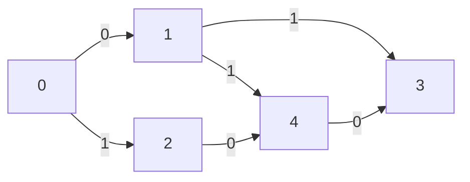

# 0-1 BFS

0-1 BFS computes **single-source shortest paths** on graphs where every edge
weight is either **0 or 1**. It replaces Dijkstra's priority queue with a
**deque**, achieving linear time.

- **Time**: O(V + E)
- **Space**: O(V + E)

## API

```
@zero_one_bfs.Graph(n)               -> Graph
@zero_one_bfs.Graph::add_edge(u, v, w)   -> Unit
@zero_one_bfs.Graph::add_undirected_edge(u, v, w) -> Unit
@zero_one_bfs.zero_one_bfs(graph, source) -> Array[Int]
```

Unreachable vertices keep distance `ZERO_ONE_INF` (1,000,000,000).

---

## 1) Why 0-1 BFS works

Dijkstra picks the minimum-distance unvisited vertex using a priority queue.
When weights are restricted to {0, 1} we can simulate that priority queue with
a **deque** and two rules:

```
Cross a weight-0 edge  ->  push_front  (distance unchanged)
Cross a weight-1 edge  ->  push_back   (distance increases by 1)
```

The deque is always sorted in non-decreasing order of distance, so the front
is always the next vertex with the smallest tentative distance — exactly the
same guarantee Dijkstra provides, but without a heap.

---

## 2) The graph



Vertices: 0 1 2 3 4
Source  : 0

Edge list (directed):

```
0 --0--> 1
0 --1--> 2
1 --1--> 3
1 --1--> 4
2 --0--> 4
4 --0--> 3
```

Expected shortest distances from 0: `[0, 0, 1, 1, 1]`

---

## 3) Deque invariant

At every iteration the deque looks like:

```
FRONT [  dist=d  |  dist=d  |  dist=d+1  |  dist=d+1  |  ...  ] BACK

       same-dist group         next-dist group
       (0-edges landed here)   (1-edges landed here)
```

- Popping from the front gives the current minimum distance `d`.
- A 0-edge keeps the distance at `d`  -> new node goes to the **front** (stays
  in the current group).
- A 1-edge raises the distance to `d+1` -> new node goes to the **back** (joins
  the next group).

The two-group structure mirrors a two-bucket implementation and is the key
insight of the algorithm.

---

## 4) Step-by-step walkthrough

Using the graph from section 2 above, starting at vertex 0.

**Initial state**

```
dist   = [0, INF, INF, INF, INF]
deque  = [0]
         ^front
```

**Step 1 — pop 0 (dist=0)**

```
Relax 0->1 (w=0): dist[1] = 0  push_front(1)
Relax 0->2 (w=1): dist[2] = 1  push_back(2)

deque  = [1, 2]
dist   = [0, 0, 1, INF, INF]
```

**Step 2 — pop 1 (dist=0)**

```
Relax 1->3 (w=1): dist[3] = 1  push_back(3)
Relax 1->4 (w=1): dist[4] = 1  push_back(4)

deque  = [2, 3, 4]
dist   = [0, 0, 1, 1, 1]
```

**Step 3 — pop 2 (dist=1)**

```
Relax 2->4 (w=0): candidate = 1, dist[4]=1 already -> no improvement

deque  = [3, 4]
dist   = [0, 0, 1, 1, 1]
```

**Step 4 — pop 3 (dist=1)**

```
No outgoing edges.

deque  = [4]
```

**Step 5 — pop 4 (dist=1)**

```
Relax 4->3 (w=0): candidate = 1, dist[3]=1 already -> no improvement

deque  = []   (empty, done)
```

**Result**: `dist = [0, 0, 1, 1, 1]`

---

## 5) Example usage (directed)

```mbt check
///|
test "0-1 bfs example" {
  let g = @zero_one_bfs.Graph(5)
  g.add_edge(0, 1, 0)
  g.add_edge(1, 2, 1)
  g.add_edge(0, 2, 1)
  g.add_edge(2, 3, 0)
  g.add_edge(1, 3, 1)
  g.add_edge(3, 4, 1)
  let dist = @zero_one_bfs.zero_one_bfs(g, 0)
  debug_inspect(dist, content="[0, 0, 1, 1, 2]")
}
```

---

## 6) Example usage (undirected)

```mbt check
///|
test "0-1 bfs undirected" {
  let g = @zero_one_bfs.Graph(4)
  g.add_undirected_edge(0, 1, 0)
  g.add_undirected_edge(1, 2, 1)
  g.add_undirected_edge(2, 3, 0)
  let dist = @zero_one_bfs.zero_one_bfs(g, 0)
  debug_inspect(dist, content="[0, 0, 1, 1]")
}
```

---

## 7) Unreachable nodes

Vertices that cannot be reached from the source keep their initial distance of
`ZERO_ONE_INF` (1,000,000,000).

```mbt check
///|
test "0-1 bfs unreachable" {
  let g = @zero_one_bfs.Graph(3)
  g.add_edge(0, 1, 1)
  let dist = @zero_one_bfs.zero_one_bfs(g, 0)
  debug_inspect(dist[0], content="0")
  debug_inspect(dist[1], content="1")
  // dist[2] is a large constant (unreachable)
  debug_inspect(dist[2] > 1000000, content="true")
}
```

---

## 8) Common applications

| Problem | 0-cost edge | 1-cost edge |
|---------|-------------|-------------|
| Grid movement | walk on free cell | step onto obstacle |
| Obstacle removal | empty cell | wall to demolish |
| Teleport networks | use teleport | normal road |
| String transformation | free substitution | paid substitution |

---

## 9) Algorithm comparison

| Algorithm | Weights | Time | Space |
|-----------|---------|------|-------|
| BFS | uniform (1) | O(V + E) | O(V) |
| **0-1 BFS** | **{0, 1}** | **O(V + E)** | **O(V + E)** |
| Dijkstra | non-negative | O((V+E) log V) | O(V + E) |
| Bellman-Ford | any | O(V * E) | O(V) |

Use 0-1 BFS whenever all edge weights are 0 or 1; it gives Dijkstra-quality
answers at BFS-level cost.

---

## 10) Common pitfalls

- Using it when edge weights are not in {0, 1}.
- Forgetting that `add_edge` is directed — use `add_undirected_edge` for
  undirected graphs.
- 0-indexed vertices: nodes are numbered 0 to n-1.
- Nodes that are pushed multiple times are harmless: when they are re-popped,
  the relaxation guard (`nd < dist[e.to]`) rejects stale improvements.
